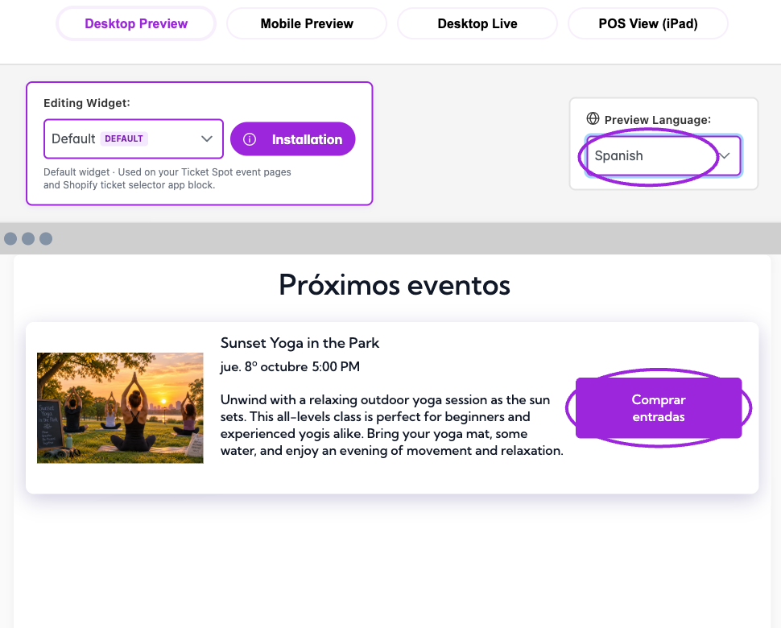
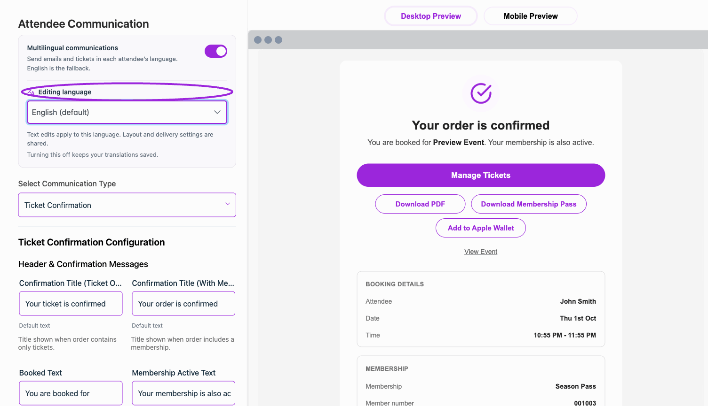
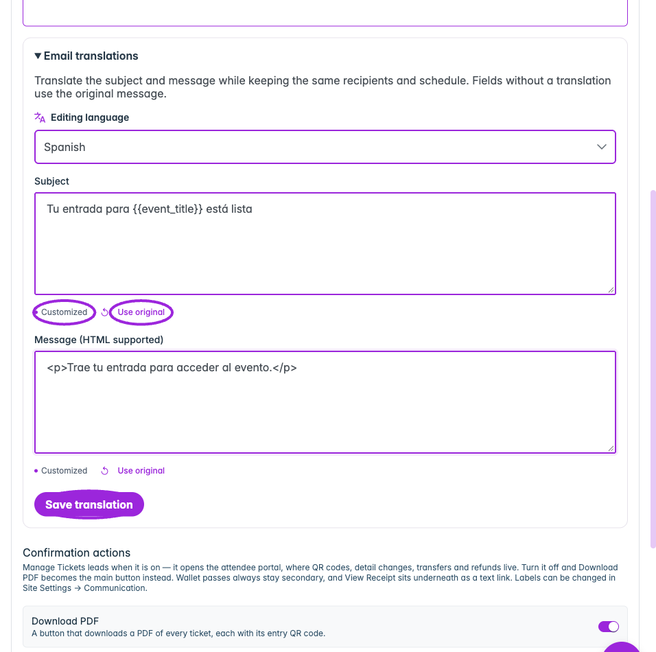

Configure the widget language and attendee communications separately. **Automatic translation** controls supported widget wording; **Multilingual communications** controls the language of emails and tickets. The language selectors let you preview the widget or edit one communication language without changing every attendee's language.

## Choose the right setting

| What you want to change | Where to go |
|---|---|
| Translate built-in widget and checkout labels | **Design → Widget → Quick Settings → Automatic translation** |
| See the widget in another language | **Preview Language** above the preview, on the right |
| Translate search/filter labels | **All Settings → Text → Event details → Automatic search filter translation** |
| Change shared widget wording | **All Settings → Text**, then the relevant section |
| Send emails and tickets in the attendee's language | **Design → Attendee Communication → Multilingual communications** |
| Review defaults or override a template's translated labels | Select the template, then **Editing language** |
| Translate one event email's subject and message | The event's **Email Communication → Email translations** |
| Set shared attendee date/time formats | **Settings → General → Regional Settings → Date & Time Format** |
| Change widget date/time formatting or timezone display | **All Settings → Display → Date & time**; set the event's timezone in its event details |

## Turn on automatic widget translation

1. Open **Design → Widget** and check **Editing Widget** so you configure the correct widget.
2. In **Quick Settings**, turn on **Automatic translation** and wait for the update to finish.
3. In the top-right preview controls, open **Preview Language** and choose the language you want to check.
4. Review the listing, date selection, ticket choices, and checkout wording. Use **Mobile Preview** to check longer labels on a smaller screen.
5. Open the installed widget to verify the visitor experience too.

<Frame caption="In Design → Widget → Quick Settings, Automatic translation enables supported translated labels in the widget and checkout.">
  
</Frame>

The same translation control is available under **All Settings → Text → Event details**. **Automatic search filter translation** covers search/filter wording; the main automatic-translation switch also enables supported filter translations.

Automatic translation uses Ticket Spot's supplied translations for supported default labels. It does not rewrite your event title, description, or custom instructions. A widget label you have changed from its default keeps your wording. If one label stays in English, check its value under **All Settings → Text** before assuming that the language selector is not working.

## Preview language versus visitor language

**Preview Language** changes the editor preview. Choosing Spanish here does not force every visitor or every email into Spanish.

The installed widget uses the language supplied by its integration or embed, or the visitor's browser language when no language is supplied. Supported regional preferences use their base language for translated widget labels; an unsupported language falls back to English. Check your actual storefront or website as well as the dashboard preview.

<Frame caption="Preview Language is set to Spanish. The supplied heading, date wording, and Buy Tickets button are translated; the event’s authored title and description remain unchanged.">
  
</Frame>

The current language choices are English, Bulgarian, Czech, Danish, Dutch, Finnish, French, German, Hungarian, Indonesian, Italian, Japanese, Korean, Norwegian, Polish, Portuguese, Spanish, and Swedish.

## Enable multilingual emails and tickets

1. Open **Design → Attendee Communication**.
2. Turn on **Multilingual communications**. This enables attendee-language emails and tickets, with English as the fallback.
3. Choose a template in **Select Communication Type**.
4. Choose **Editing language**. Use **Find a language** to locate a language quickly.
5. Review the text and its status, then change the labels or message text you want to override.
6. Wait for saving to finish and inspect the preview in that language.

<Accordion title="Watch: preview a communication language (7 seconds)">
  <picture>
    <source media="(prefers-reduced-motion: reduce)" srcSet="../assets/refresh/branding-and-design/communication-language-poster.png" />
    
  </picture>

  [View the static example](../assets/refresh/branding-and-design/communication-language-poster.png).
</Accordion>

The multilingual controls also appear in **Design → Tickets & Passes** for supported ticket, receipt, and pass wording. The switch is shared: it is not a separate delivery setting for each template.

| Field status or action | Meaning |
|---|---|
| **Default text** | The default English wording is in use. |
| **Default translation** | Ticket Spot's supplied translation is in use for the selected language. |
| **Customized** | This field has an override. |
| **Using original message. Add a translation for this language.** | The original authored message is retained; supply a translation if you want different wording. |
| **Reset to default** | Remove that field's customization and return to the applicable default. |

<Frame caption="A Spanish title override is marked Customized. Reset to default restores the supplied translation for this field; other languages keep their own wording.">
  
</Frame>

Text edits apply to **Editing language**. Layout, visibility, recipients, and scheduling remain shared. Turning multilingual communications off keeps your saved translations and sends the existing text to everyone.

## Translate your own event email

<Frame caption="Enter a language-specific subject and message, preserving the original template variables. Customized marks the edited field; Save translation is required to persist it. This example is an unsaved draft.">
  
</Frame>

Custom campaign content has its own translations. Save the event email, expand **Email translations**, choose a language, enter its **Subject** and **Message (HTML supported)** or **Email HTML**, then select **Save translation**.

Use **Use original** for an individual field or **Reset language** to remove that campaign's saved language variant. Untranslated custom content retains the original wording. These translations use the existing recipients and schedule; they do not create another campaign.

Keep personalization placeholders, such as `{{event_title}}`, in the translated text. Follow the [multilingual email and ticket walkthrough](./multilingual-communications) for editing and delivery checks.

## Dates, times, and other regional settings

<Frame caption="Regional Settings contains SMS Country and the shared Date Display and Time Display formats. Date and time format changes update automatically; save other General fields with Save.">
  
</Frame>

Open **Settings → General → Regional Settings** for the shared **Date Display** and **Time Display** formats used across emails, event pages, tickets, and other attendee-facing surfaces. These two controls update automatically. **SMS Country** selects the supported delivery region and is saved with the other General settings. See [General site settings](/site-settings/site-settings).

Language and timezone are separate choices. A translated month or weekday does not move the event to another timezone. Use **Date format**, **Time format**, **Show the timezone**, and **Convert times to the visitor's timezone** in [Date & time display settings](./widget-display-reference#date-%26-time). Review the event's own [timezone and schedule](../event-management/datetime) too.

Choosing a language does not change the ticket's price or select a new payment currency. Configure pricing in the event's ticket settings.

For common questions and troubleshooting, see the [language and locale FAQ](../getting-started/language-and-locale-faq).
