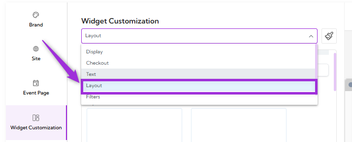
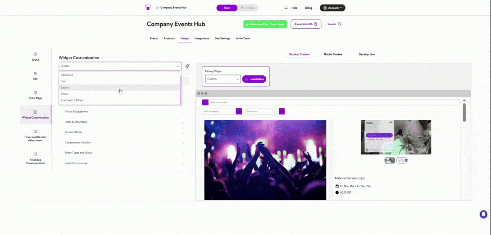
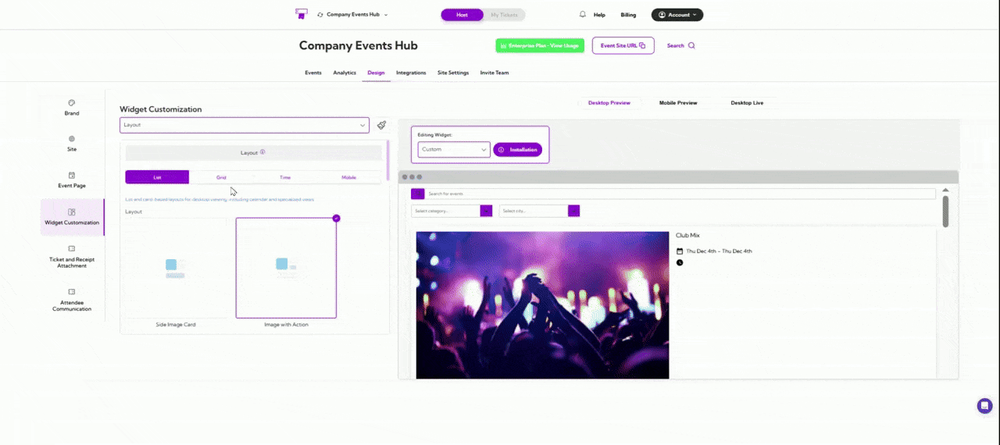
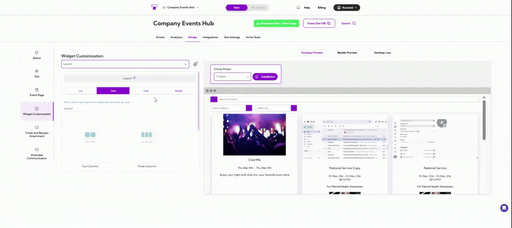
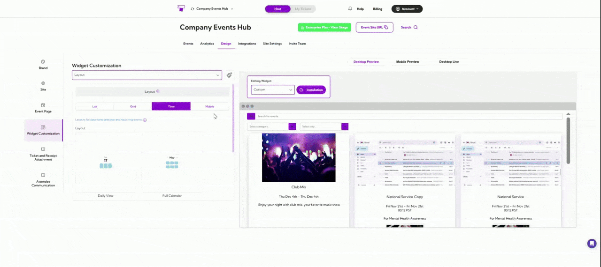

Layout section allows you to define how your event listings appear across desktop and mobile
screens. Each layout option changes the structure and visual presentation of events, helping
you create a browsing experience that matches your design goals and content style.

Let’s get started 🚀

Click on the **dropdown menu** and select **Layout**. You will be navigated to the Layout settings
screen, where you can choose how events are displayed across desktop and mobile views.

Below is an overview of each layout category you can choose from under the **Layout** section:

## List and Card Layouts

List and Card layout show events in a clean vertical style, making them easy to scroll through.
You can choose simple text-based lists, card-style layouts with images, or calendar-style
designs that help users browse events based on dates. This layout works well when you want
visitors to quickly read through event details.

## Grid Layouts

Grid layouts place events in multiple side-by-side columns. This helps users see several events
at once and compare them easily. It’s useful when you have a larger number of events and want
to display them in a compact, organized way.

## Time-Based Layouts

Time-Based layouts focus on the event schedule. They arrange events by dates, times, or
sessions so visitors can quickly find options that fit their availability. This is ideal for recurring
events, multi-session events, or any schedule-focused experience.

## Mobile Layouts

Mobile layouts are designed specifically for phones and small screens. They ensure your events
are easy to read, scroll, and tap through on mobile devices. This gives users a smooth and clear
browsing experience when they’re on the go.

A live preview of each layout appears in the right panel, allowing you to confirm the design
before applying it.
