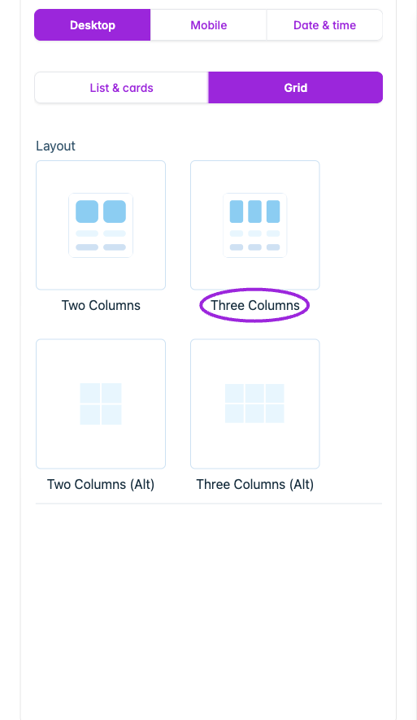
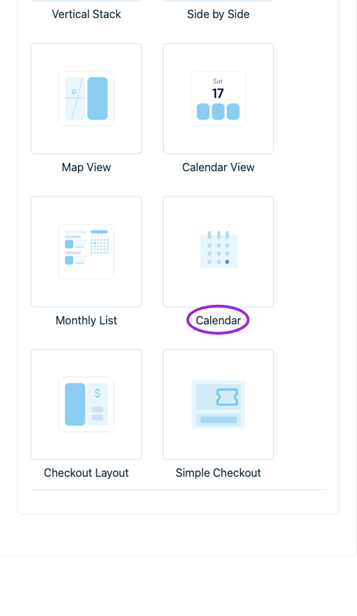
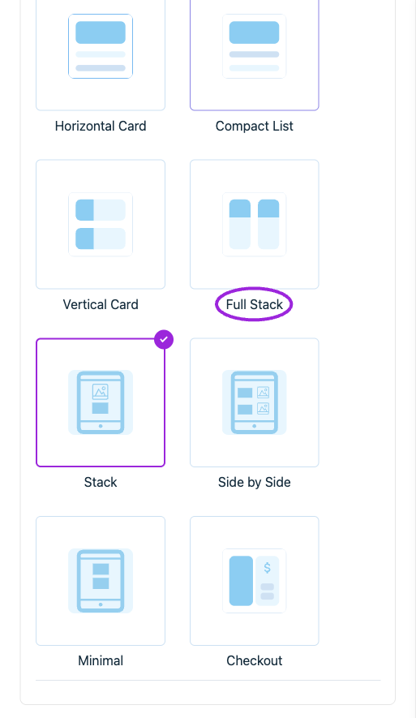
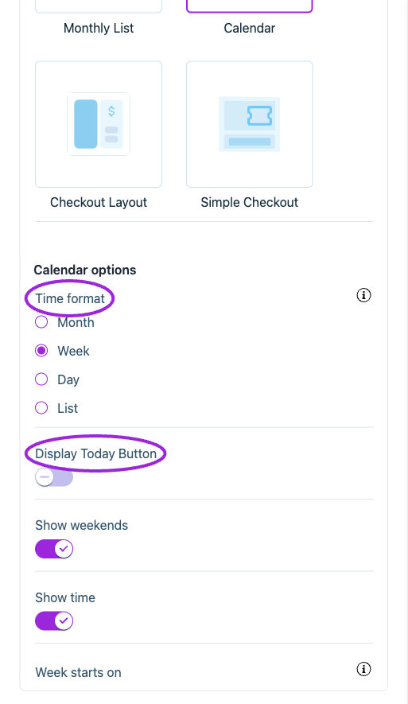
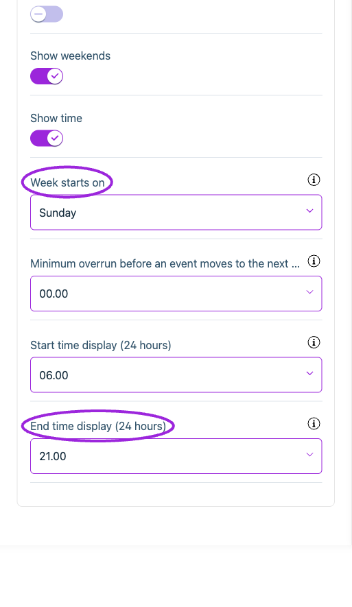

Open **Design → Widget → All Settings → Layout**. Select **Desktop**, **Mobile**, or **Date & time** first.

1. Under Desktop, choose **List & cards** or **Grid**, then choose a layout thumbnail.
2. Under Mobile, choose a layout for phones independently of desktop.
3. Under Date & time, choose **Daily View**, **Full Calendar**, or **Time Slot Picker** for time-based event browsing.
4. For the **Calendar** desktop layout, configure its initial view, week start, visible hours, next-day threshold, Today button, weekends, and time visibility.
5. Wait for saving and preview all applicable screen sizes and event types.

The [layout reference](./widget-layout-reference) names every available layout and calendar control. **Calendar**, **Calendar View**, and **Full Calendar** are distinct choices. The calendar control labeled **Time format** selects Month, Week, Day, or List; it is not the listing's 12/24-hour time format.

Test long titles, portrait and landscape images, several dates, empty results, and a phone-sized checkout. Calendar display hours do not change an event's actual date/time or ticket sales window.

## Layout gallery

<Accordion title="Desktop layouts">

<Frame caption="Desktop has List &amp; cards and Grid families. Choose a thumbnail independently from the Mobile and Date &amp; time layouts.">
  
</Frame>

<Frame caption="Grid offers two-column and three-column designs, including alternative styles.">
  
</Frame>

<Frame caption="More desktop layouts include map, calendar, monthly, and checkout views. Calendar, Calendar View, and Date &amp; time’s Full Calendar are distinct choices.">
  
</Frame>

</Accordion>

<Accordion title="Mobile layouts">

<Frame caption="The Mobile tab selects the phone layout independently from the desktop listing. The thumbnails preview the available arrangements.">
  
</Frame>

<Frame caption="Choose the phone layout independently from desktop. Use Mobile Preview to inspect the result before checking your installed widget.">
  
</Frame>

</Accordion>

<Accordion title="Date and time selection">

<Frame caption="Date &amp; time offers Daily View, Full Calendar, and Time Slot Picker as an independent layout choice.">
  
</Frame>

</Accordion>

<Accordion title="Calendar display controls">

<Frame caption="The Calendar layout adds calendar-specific controls. Time format selects the initial Month, Week, Day, or List view; it does not set a 12/24-hour clock.">
  
</Frame>

<Frame caption="Choose the first weekday, next-day overrun threshold, and visible start/end hours. These affect the calendar display, not event times or ticket sales windows.">
  
</Frame>

</Accordion>

