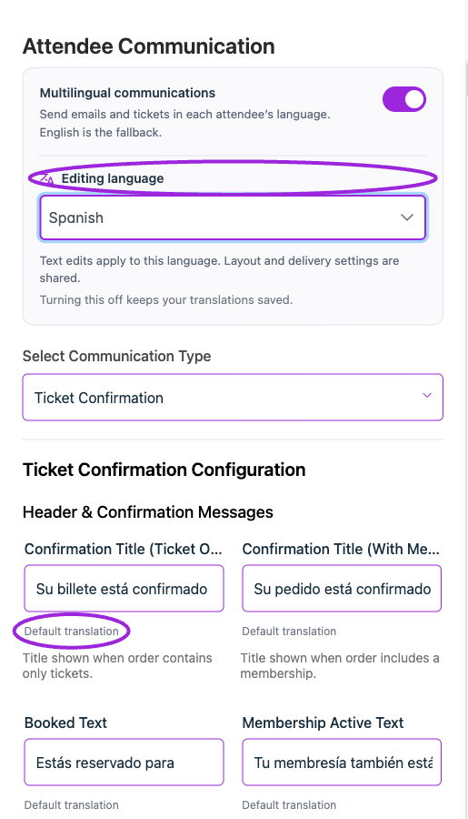
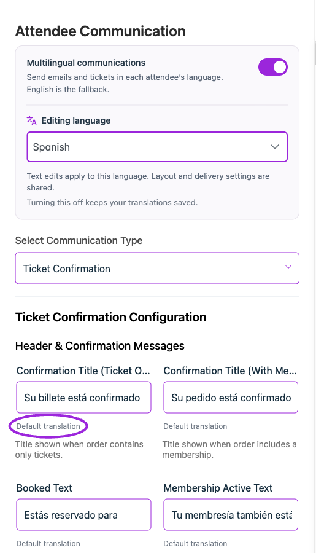
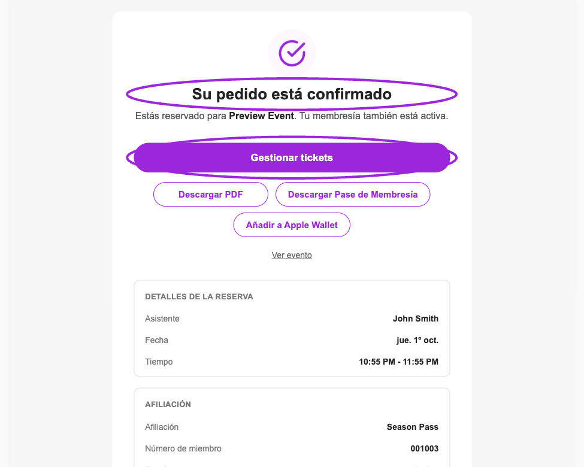

Use **Design → Attendee Communication** to configure outgoing message text. **Multilingual communications** uses each attendee's checkout language, with English as the fallback. Automatic widget-label translation is a separate setting.

## Enable and edit a language

1. Open the communication template you want to customize.
2. Turn on **Multilingual communications**.
3. Choose **Editing language**; use **Find a language** to search.
4. Edit the text for that language and wait for saving to finish. **Customized** identifies an overridden field; **Reset to default** removes that customization.
5. Preview the selected language, including subject text, long translated labels, ticket links, and any personalization tokens.

<Accordion title="Watch: preview a communication language (7 seconds)">
  <picture>
    <source media="(prefers-reduced-motion: reduce)" srcSet="../assets/refresh/branding-and-design/communication-language-poster.png" />
    
  </picture>

  [View the static example](../assets/refresh/branding-and-design/communication-language-poster.png).
</Accordion>

<Frame caption="Enable Multilingual communications, choose Spanish under Editing language, and review the supplied Default translation for each field.">
  
</Frame>

Text edits apply to the selected language. Layout and delivery controls are shared across languages. Turning multilingual communications off keeps saved translations and sends the existing text to everyone.

<Frame caption="A Spanish title override is marked Customized. Reset to default restores the supplied translation for this field; other languages keep their own wording.">
  
</Frame>

<Accordion title="See the field after Reset to default">

<Frame caption="After Reset to default, the Spanish confirmation title uses its supplied Default translation again.">
  
</Frame>

</Accordion>

## Translate an event email

<Frame caption="Enter a language-specific subject and message, preserving the original template variables. Customized marks the edited field; Save translation is required to persist it. This example is an unsaved draft.">
  
</Frame>

<Frame caption="Event Email translations uses the original subject and message until you supply a variant for the selected language.">
  
</Frame>

For an event-specific email, open its **Email Communication** editor after saving the email.

1. Expand **Email translations**.
2. Choose the language.
3. Enter **Subject** and **Message (HTML supported)**, or **Email HTML** when using the advanced email editor.
4. Select **Save translation**.
5. Use **Use original** on a field or **Reset language** when you want to remove that translation. Save changes where requested.

In this editor, **Customized** can appear while a field is still being edited. Select **Save translation** and confirm the save succeeds before leaving. Fields without a translation use the original message. Translations keep the email's recipients and schedule; they do not create another scheduled email.

<Accordion title="See the Spanish sample email">
<Frame caption="Built-in Spanish confirmation preview showing translated ticket actions and booking labels. This sample includes a membership; it is not a delivered customer email.">
  
</Frame>

</Accordion>

## Verify delivery

Use a test checkout in each language you intend to support. Inspect the actual confirmation and ticket, as well as a language with no custom translation to check the fallback. Preserve personalization placeholders and working links in translated content. A translated field can use only template variables that already exist in its original field; adding a new variable causes a validation error. Keep translated subjects on one line.

See [email timing and recipients](/event-management/email-communication), [attendee communication design](./attendee-communication-design), and [widget wording](./widget-text-reference).

See the [language and locale setup guide](/branding-and-design/language-and-locale) and [language FAQ](/getting-started/language-and-locale-faq) for automatic widget translation, preview language, communication defaults, and per-language overrides.
