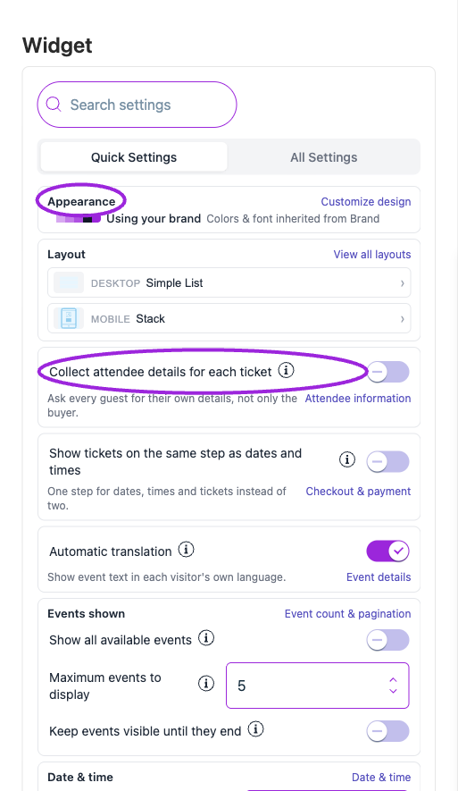
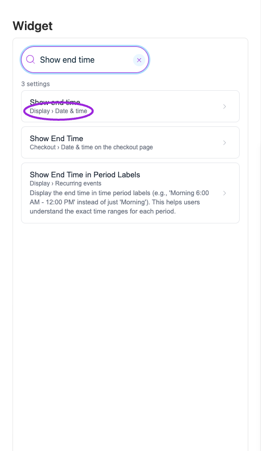
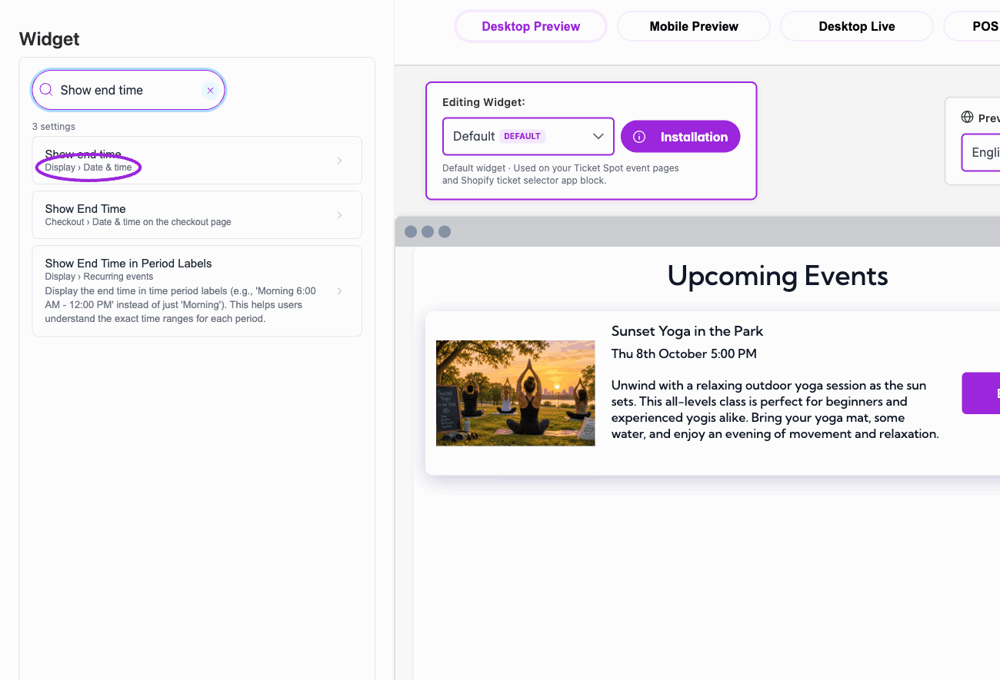
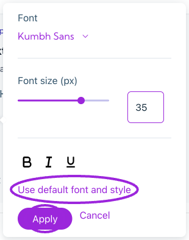
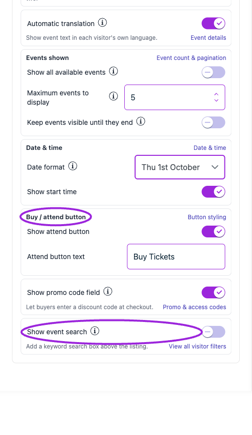

Open **Design → Widget**, then choose the widget in **Editing Widget**. **Quick Settings** provides the most frequently used controls. Changes here update the same settings found under **All Settings**.

<Frame caption="Design → Widget starts with Quick Settings beside the live event preview.">
  
</Frame>

## Quick Settings controls

<Frame caption="Quick Settings groups common layout, checkout, language, event-count, date, and button controls. Use each card’s link to open its full settings section.">
  
</Frame>

| Card or control | What to do |
|---|---|
| **Appearance** | Read the current theme, palette, and custom-change count. **Customize design** opens Design. This card is a summary, not a theme picker. It is hidden for Wix sites. |
| **Layout — Desktop / Mobile** | Inspect the current layout and select the row or **View all layouts** to change it. Date/time layouts are in the full Layout area. |
| **Collect attendee details for each ticket** | Ask each guest for details. Turn off to collect the buyer's details only. **Attendee information** opens the related checkout settings. |
| **Show tickets on the same step as dates and times** | Display the tickets below the chosen date/time. Applies to events with date/time selection and is unavailable while ticket-first selection is on. |
| **Automatic translation** | Show supported event text in the visitor's language. Open **Event details** for the search-filter translation option. |
| **Events shown** | Review the plan limit, **Show all available events**, **Maximum events to display**, and **Keep events visible until they end**. Show all overrides the maximum field, but not the plan limit or filters. |
| **Date & time** | Change **Date format** and **Show start time**. Open **Date & time** for time format, timezone, and end-date/time controls. |
| **Buy / attend button** | Show or hide the attend button and edit its text. **Button styling** opens the design controls on supported sites. An event-specific button override can replace this text. |
| **Show promo code field** | Let buyers enter a discount code. **Promo & access codes** includes placement, auto-open, and the separate hidden-ticket access code field. |
| **Show event search** | Add keyword search above the listing. **View all visitor filters** opens location, date, category, and language filters. |

## Find any setting

<Frame caption="Search results include the category and section, so similarly named widget and checkout controls can be distinguished.">
  
</Frame>

1. Enter a term in **Search settings**, such as “attendee”, “seating”, “font”, “required ticket”, or “time”.
2. Select the result. Its category and section identify where the control belongs.
3. Follow any prerequisite shown for the setting. Some controls depend on another toggle, a specific layout, site type, or plan.
4. Use the breadcrumb to move to the parent section, **All Settings**, or **Back to results**.
5. Clear the search to return to the settings navigation.

Search finds controls; it does not enable their prerequisites or change their values.

<Frame caption="Search for a setting, identify its category, and open the result to jump to the control. This demonstration does not change the setting.">
  <picture>
    <source media="(prefers-reduced-motion: reduce)" srcSet="../assets/refresh/branding-and-design/quick-settings-search-poster.png" />
    
  </picture>
</Frame>

## Appearance and saving

<Frame caption="Font changes are drafts until you choose Apply. Cancel closes the editor without applying the draft; Use default font and style resets the draft to its default values.">
  
</Frame>

**Using your brand** means the widget follows later Brand changes. A custom-change count identifies local overrides. A named preset with **Pre-designed theme** uses that theme instead. Choose **Your Brand** in Design to use the shared brand again.

Most widget settings save and publish when changed. Color-picker drafts need confirmation; font edits have an explicit **Apply** action. Wait for updates to finish, check the preview, then open the installed widget on desktop and mobile.

Continue with [widget setup](./widget-customization-overview), [display options](./widget-display-reference), and [colors and fonts](./widget-design-reference).

See the [language and locale setup guide](/branding-and-design/language-and-locale) and [language FAQ](/getting-started/language-and-locale-faq) for automatic widget translation, preview language, communication defaults, and per-language overrides.

<Accordion title="More Quick Settings cards">

<Frame caption="Lower Quick Settings cards include date/time, the attend button, promo-code entry, and event search. Their links open the related full settings.">
  
</Frame>

</Accordion>
