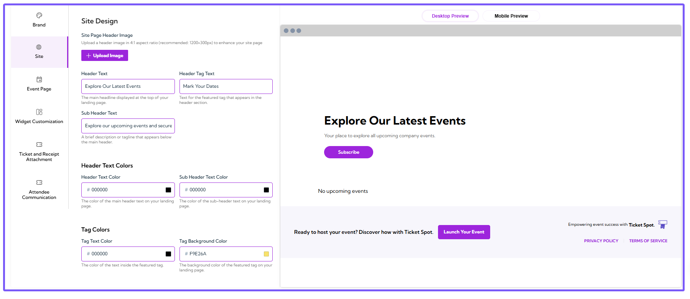
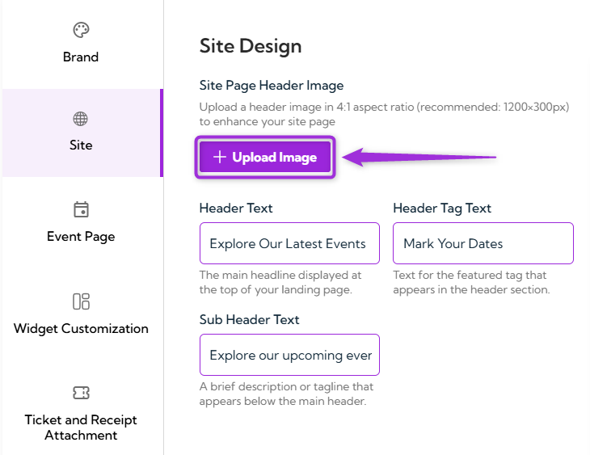
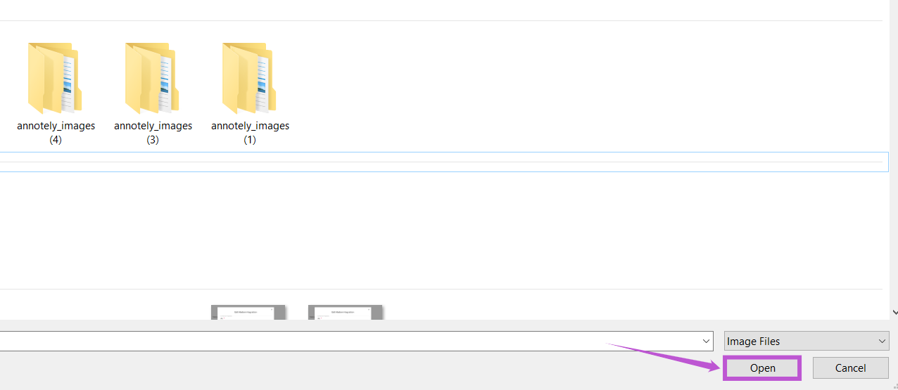
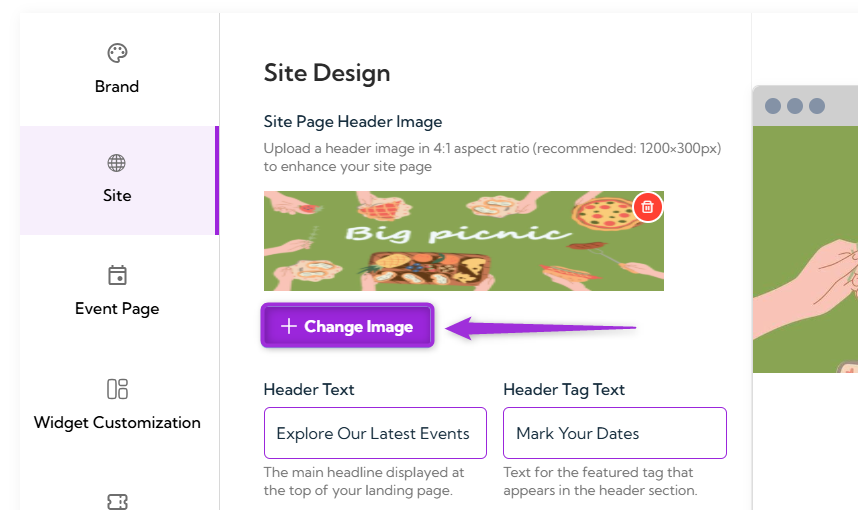
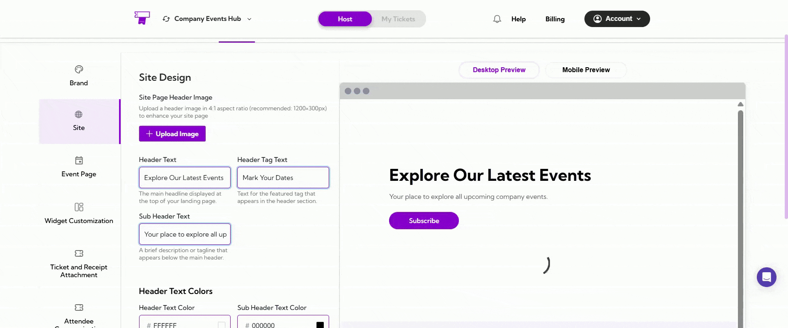
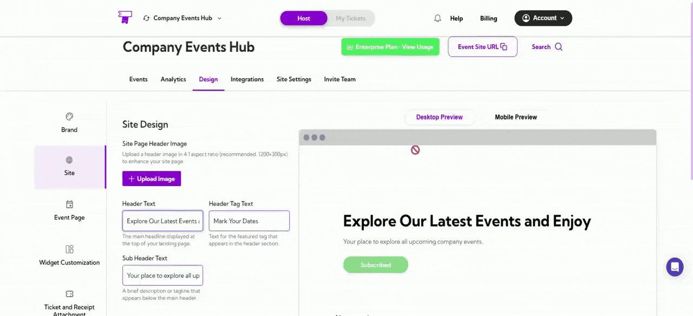

In the **Site Design** section, you can customize the appearance of your landing page, including the header image, text, and colors, to match your brand’s identity. This allows you to create a personalized, engaging look for your event page.  

Let’s get started 🚀

## Navigation

**Step 1:** Log in to your **Ticket Spot** account and click on the **Design** tab.  

You will be navigated to the **Site Design** page, where you can customize your brand's design.

## Site Page Header Image

The **Site Page Header Image** allows you to upload a customized image that will appear at the top of your landing page, enhancing the visual appeal of your event page. This image helps set the tone for your event and grab visitors' attention.

**Step 1:** Click on the **Upload Image** button.  

**Step 2:** A **file selection dialog box** will appear. This is the pop-up window where you can browse through your files and folders. Select the image you want to upload, and click **Open**. 

Once the image is uploaded, it will automatically appear in the **Site Logo** field.  

**Step 3:** Click on the **Change Image** button to update your logo.

> **Note:** Upload a header image in a **4:1 aspect ratio** (recommended size: **1200×300px**) to enhance your site page and ensure it fits well on the landing page.

## Header Text

The **Header Text** section allows you to set the main headline, subheading, and featured tag text that will be displayed on the top of your event landing page. These elements help guide your visitors and communicate key information about your event.

- **Header Text:** The main headline displayed at the top of your landing page. This text should be eye-catching and clearly communicate the main theme of your event.  
  _Example:_ “Explore Our Latest Events”

- **Sub Header Text:** A brief description or tagline that appears below the main header. Use this text to provide additional context or to encourage action, such as ticket purchases.  
  _Example:_ “Your place to explore all upcoming company events.”

- **Header Tag Text:** Text for the featured tag that appears in the header section. This can be used to highlight a specific call to action or important detail, such as event dates.  
  _Example:_ “Mark Your Dates”

## Header Text Colors

The **Header Text Colors** section allows you to customize the colors of your header and sub-header text to match your brand’s visual identity and ensure readability on your landing page.

- **Header Text Color:** The color of the main header text on your landing page. Select a color that contrasts well with the background to ensure visibility.
- **Sub Header Text Color:** The color of the sub-header text on your landing page. Choose a color that complements the header text while maintaining good contrast for readability.

## Tag Colors

In this **Tag Colors** section, you can customize the colors of the featured tag text and background to match your event’s branding.

- **Tag Text Color:** The color of the text inside the featured tag on your landing page. Choose a color that stands out and complements the overall design.
- **Tag Background Color:** The background color of the featured tag on your landing page. Select a color that makes the tag visually prominent and aligns with your brand’s color palette.

## Preview Your Customizations

After making changes to your site page design, you can preview how it will look on various devices to ensure it displays well on both desktops and mobiles.

- **Desktop Preview:** Click the **Desktop Preview** tab to view how your site page will appear on desktop devices.
- **Mobile Preview:** Click the **Mobile Preview** tab to see how your site page will look on mobile devices.

> **Tip:** Use the **Desktop Preview** and **Mobile Preview** to ensure your design looks good on all screen sizes before going live.
