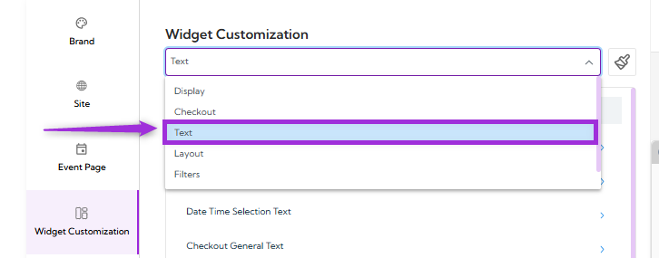
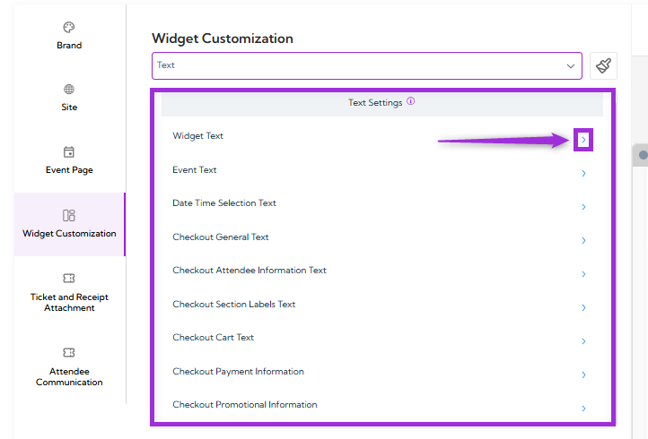
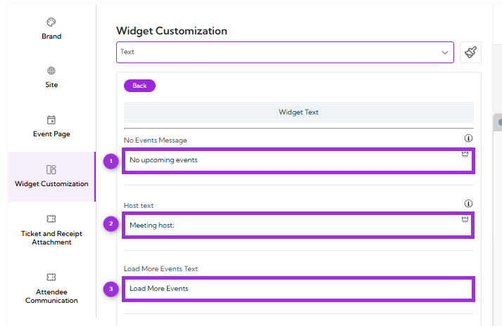
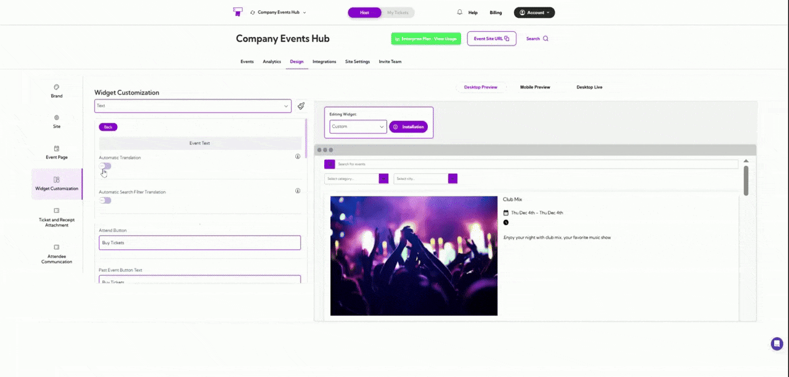
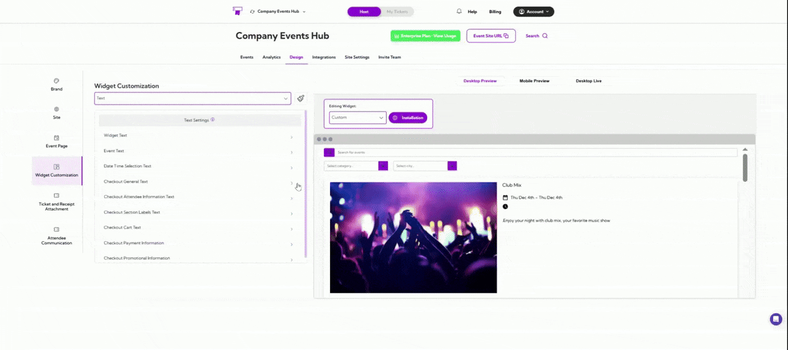
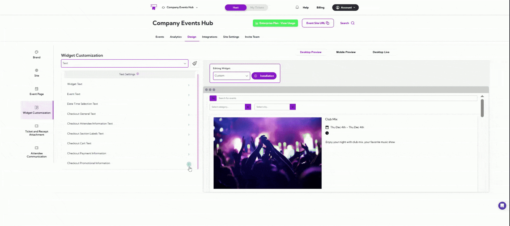

**Text Settings** allow you to customize all the written content that appears across your event
widget and checkout flow. This includes labels, descriptions, button text, section titles, and
system messages shown to attendees.

Use this section to match the language, tone, and clarity of your event experience so everything
feels consistent and easy for users to understand.

Let’s get started 🚀

Click on the **dropdown menu** and select **Text**. You will be navigated to the Text Settings.

You’ll see a list of available settings you can customize:

- Widget Text
- Event Text
- Date Time Selection Text
- Checkout General Text
- Checkout Attendee Information Text
- Checkout Section Labels Text
- Checkout Cart Text
- Checkout Payment Information
- Checkout Promotional Information

Click the **arrow** icon next to the setting you want to customize to open its configuration options.

## Widget Text

**Widget Text** allows you to update the default messages that appear in your event widget.
These messages help guide users when there are no events, when a host is shown, or when
more events can be loaded. Use this setting to adjust the wording so it fits your tone and
matches the rest of your event experience.

### Fields

| Ref. | Field                | Description                                                                   |
| ---- | -------------------- | ----------------------------------------------------------------------------- |
| 1.   | No Events Message    | The message is shown when there are currently no upcoming events to display. |
| 2.   | Host Text            | The label is displayed before the host name on event cards.                  |
| 3.   | Load More Events Text | The button text for loading more events when additional listings are available. |

## Event Text

The **Event Text** section lets you customize all the labels and text that appear on your event
cards and event pages. This includes button text, status messages, and other event-related
labels. You can adjust these fields to match your tone, audience, or branding needs.

| Field                        | Clear Explanation                                                                 |
| ---------------------------- | --------------------------------------------------------------------------------- |
| Automatic Translation        | When this is turned on, the text in your event widget will automatically translate to match the visitor’s language (based on their browser settings). |
| Automatic Search Filter Translation | Automatically translates search filter terms like months, days, and weeks so users see them in their language. |
| Attend Button                | The text shown on the main button that users click to join, buy, or register for an event. |
| Past Event Button Text       | The button text that appears for events that have already ended (for example, “View Details”). |
| Next Event Text              | The label that appears when showing the next upcoming event in a series.         |
| Add to Calendar              | The text shown on the button allows users to add the event to their personal calendar. |
| On Sale Text                 | The message is shown when tickets are currently available for purchase.         |
| Not on Sale Text             | The message is shown when ticket sales haven’t started yet.                      |
| Sales Ended Text             | The message is displayed when ticket sales have closed for an event.             |
| Sales Not Started Text       | The message shown before sales open (e.g., “Coming Soon”).                       |
| Postponed Text               | The label is shown when the event date has been delayed or pushed to a later time. |
| Sold Out Text                | The message is shown when all available tickets have been sold.                  |
| Canceled Text                | The label is shown when an event has been canceled.                              |
| Show Details Text            | The text shown on the button reveals additional event information.               |
| Close Details Text           | The text is shown when users hide the extra event information again.             |
| Online Event Text            | The label displayed for virtual or online events.                                |

## Date Time Selection Text

**Date Time Selection Text** settings allow you to customize the labels shown to users when they
choose a date or time slot during checkout. These fields help make availability and time options
easy to understand. You can edit each label to match your event’s format, language, or tone.

Use this setting when your event has **multiple time slots, recurring sessions,** or **different
availability statuses**.

| Field                     | Description                                                                 |
| ------------------------- | --------------------------------------------------------------------------- |
| Availability Text         | Text shown when tickets for a selected date or time are available for purchase. |
| Unavailable Text          | Text shown when tickets for the selected slot are sold out or unavailable.   |
| Morning Time Slot Label   | Label used for events happening in the morning (e.g., “AM Session”).         |
| Afternoon Time Slot Label | Label for mid-day sessions. Useful for events with multiple daily schedules. |
| Evening Time Slot Label   | Label for evening sessions (e.g., “Evening Show”).                           |
| Night Time Slot Label     | Label used for late-night sessions.                                         |

## Checkout General Text

**Checkout General Text** settings allow you to customize the basic messages and button labels
shown during the checkout process. These fields help guide attendees through each step,
making the process clear and easy to follow.

| Field                | Description                                                                 |
| -------------------- | --------------------------------------------------------------------------- |
| Form Pre Text        | Message is shown at the top of the checkout form to guide users before they fill in their details. |
| Next Button Text     | Text displayed on the button used to move to the next step in checkout.     |
| Back Button Text     | Text displayed on the button that takes the user to the previous step.      |
| No Tickets Selected Text | Message shown when the user tries to continue without selecting any tickets. |

## Checkout Attendee Information Text

**Checkout Attendee Information Text** setting controls the labels shown during checkout when
collecting attendee details. These labels tell users exactly what information they need to enter.

| Field                      | Description                                                             |
| -------------------------- | ----------------------------------------------------------------------- |
| Attendee First Name Label  | Label displayed for the attendee’s first-name input field.              |
| Attendee Last Name Label   | Label displayed for the attendee’s last-name input field.               |
| Attendee Email Label       | Label displayed for the attendee’s email input field.                   |
| Attendee Count Label       | Text shown next to the ticket count when collecting details for each ticket. |

## Checkout Section Labels Text

**Checkout Section Labels Text** settings allow you to customize the labels shown at different
checkout steps. These labels help attendees understand what each section is for while completing their order.

Below is a clear explanation of each label:

| Field                    | Description                                                                 |
| ------------------------ | --------------------------------------------------------------------------- |
| Tickets Section Label    | Text shown above the section where attendees select their tickets.          |
| Date/Time Section Label  | Label displayed for the section where attendees choose available dates and times. |
| Times Section Label      | Text shown above the list of available time slots.                          |
| Dates Section Label      | Label for the section where attendees pick the event date.                  |
| Details Section Label    | Text shown above the event or ticket details section.                       |
| Waitlist Details Section Label | Label for the section used when an attendee joins the waitlist.       |
| Payment Section Label    | Text displayed above the payment section during checkout.                   |

## Checkout Cart Text

**Checkout Cart Text** setting controls the labels and messages shown in the cart during checkout. These fields help attendees understand the ticket breakdown, fees, taxes, and available quantity. Adjust the text to match your event tone and make the checkout steps easier to follow.

| Field                     | Description                                                               |
| ------------------------- | ------------------------------------------------------------------------- |
| Checkout Cart Title       | Title displayed at the top of the checkout cart where ticket details appear. |
| Ticket Total Label        | Label shown next to the total ticket cost.                                |
| Booking Fees Label        | Label for any extra service or booking fees.                              |
| Sales Tax Label           | Label for the tax amount included in the order.                           |
| RSVP/Checkout Button Text | Text displayed on the button attendees click to continue or confirm the checkout. |
| Ticket Availability Message | Message showing how many tickets remain available for purchase.         |
| Pay What You Want Text    | Label used when events allow custom pricing or donation-based payments.   |

## Checkout Payment Information

**Checkout Payment Information** settings manage the text labels displayed during the payment step of the checkout process. These labels guide attendees on the details required to complete a card payment. Each label can be customized to match your event’s preferred wording or local language.

| Field                | Description                                                        |
| -------------------- | ------------------------------------------------------------------ |
| Card Number Text     | Label shown above the field where attendees enter their card number. |
| Card Expiry Date Text | Label for the field where attendees enter the card’s expiration date. |
| Card Security Code Text | Label for the field where attendees enter the card’s security code (CVV). |

## Checkout Promotional Information

**Checkout Promotional Information** settings allow you to customize the text shown for promo code fields during checkout. These labels help attendees identify where to enter a discount code and understand the purpose of the field.

| Field                  | Description                                                           |
| ---------------------- | --------------------------------------------------------------------- |
| Promo Code Label       | The text displayed above the promo code input field (example: “Promo Code”). |
| Promo Code Placeholder | The hint text inside the promo code field (example: “Enter code”).     |

