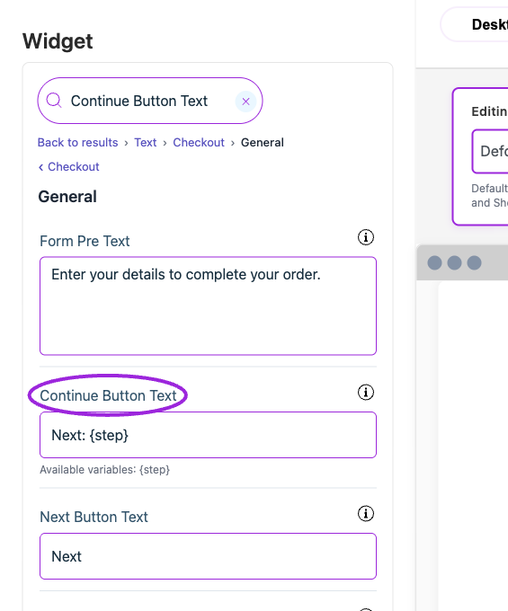
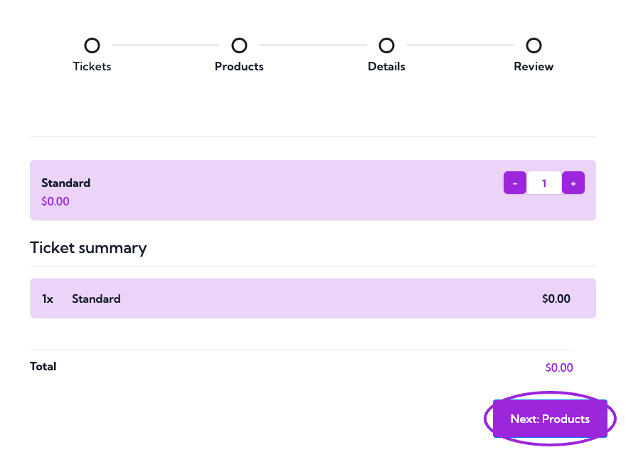

Open **Design → Widget → All Settings → Text**, then select the relevant section or find a field with **Search settings**.

| Section | Examples |
|---|---|
| **Widget** | Header, no-events message, host text, and Load more. |
| **Event details** | Attend button, status, dates, map, description actions, and automatic translation. |
| **Search filters** | Search and filter placeholders. |
| **Shopify product page** | Ticket, date, and timeslot variant labels. |
| **Checkout → General / Section labels** | Step names, continue/back buttons, and session choices. |
| **Checkout → Attendee information** | Names/email fields, per-attendee progress, next/save actions, copying details, and waitlist heading. |
| **Checkout → Cart** | Order/ticket summaries, quantities, fees, free-order button, errors, multi-event cart, and required-ticket guidance. |
| **Checkout → Date & time selection** | Availability, sold out, waitlist, and morning/afternoon/evening/night labels. |
| **Checkout → Payment information / Promotional messages** | Payment and installment wording, promo codes, and access codes. |
| **Checkout → Add-ons / Memberships / Seating** | Selection constraints, membership verification/pricing, and seat-limit or unavailable-map messages. |
| **Checkout → Fast checkout** | Returning-buyer session, saved-details, and verification text. |

## Example: rename the Continue button

1. Search for **Continue Button Text** in the widget editor, or open **Text → Checkout → General**.
2. Enter wording such as `Next: {step}`. Keep `{step}` so the button names the next available checkout step.
3. Wait for the update, then reload the checkout preview for the same widget and language.
4. Check the buyer-facing button. If the next step is Products, the example becomes **Next: Products**. Which steps appear depends on the event's checkout configuration.

<Frame caption="Change Continue Button Text while preserving {step}, which is replaced by the next checkout step name.">
  
</Frame>

<Frame caption="The buyer sees Next: Products: the {step} placeholder is replaced with the next available step.">
  
</Frame>

The [complete text reference](./widget-text-reference) lists every field. Preserve its placeholders and use the preview to check long labels. Button labels can have length limits.

**Automatic translation** uses supported translated event text; it can affect which custom event labels are editable. Outgoing emails/tickets use [Multilingual communications](./multilingual-communications) separately.

Wait for saving, then test normal, empty, unavailable, and error states. Changing wording does not change ticket eligibility, pricing, capacity, or the number of required add-ons.

See the [language and locale setup guide](/branding-and-design/language-and-locale) and [language FAQ](/getting-started/language-and-locale-faq) for automatic widget translation, preview language, communication defaults, and per-language overrides.

{/* CURRENT CAPTURES */}

## Current controls

<AccordionGroup>

<Accordion title="Text: Event details">

<Frame caption="All Settings → Text — Event details. The circles identify Automatic translation and Automatic search filter translation.">
  
</Frame>

</Accordion>

<Accordion title="Text: Checkout: Attendee information">

<Frame caption="All Settings → Text — Checkout: Attendee information. The circles identify Attendee First Name Label and Attendee Last Name Label.">
  
</Frame>

</Accordion>

</AccordionGroup>
