**Ticket and Receipt Attachment Design** allows you to configure how your event tickets, receipts, and Apple Pass files appear when they are sent to attendees. These attachments are important touchpoints that provide essential event information, access details, and confirmation of purchase.

With these settings, you can customize labels, colors, and layout elements for each attachment type—ensuring your tickets and receipts match your branding and deliver a clear, professional experience to attendees.

Let’s get started 🚀

## Navigation

**Step 1:** Log in to your **Ticket Spot** account and click on the **Design** tab.

**Step 2:** Click on the **Ticket and Receipt Attachment** tab to open the design settings.

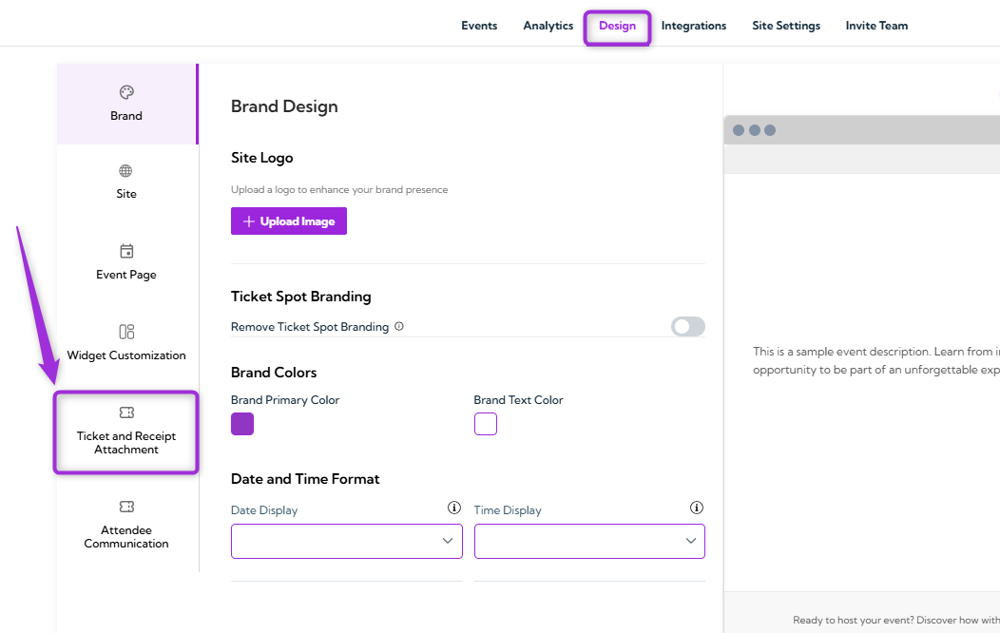

**Step 3:** Select the **ticket type** you want to customize from the dropdown menu:

- **Ticket PDF**  
- **Ticket Receipt PDF**
- **Apple Pass** 

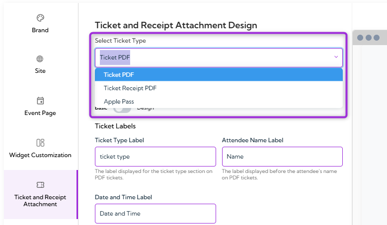

You will be navigated to the design settings for the selected type.

## Ticket PDF

**Ticket PDF** customization allows you to control how the digital ticket appears when attendees download or receive it after registration or purchase. You can modify labels, colors, and visual elements so the ticket aligns with your branding and clearly presents the event information attendees need.

**Ticket PDF Modes (Basic / Design)**

Ticket PDF editor provides two modes that help you to choose how you want to customize your ticket layout:

**Basic mode** provides simple label and color fields for quick edits, while **Design mode** unlocks the full drag-and-drop canvas for creating a completely custom ticket layout.

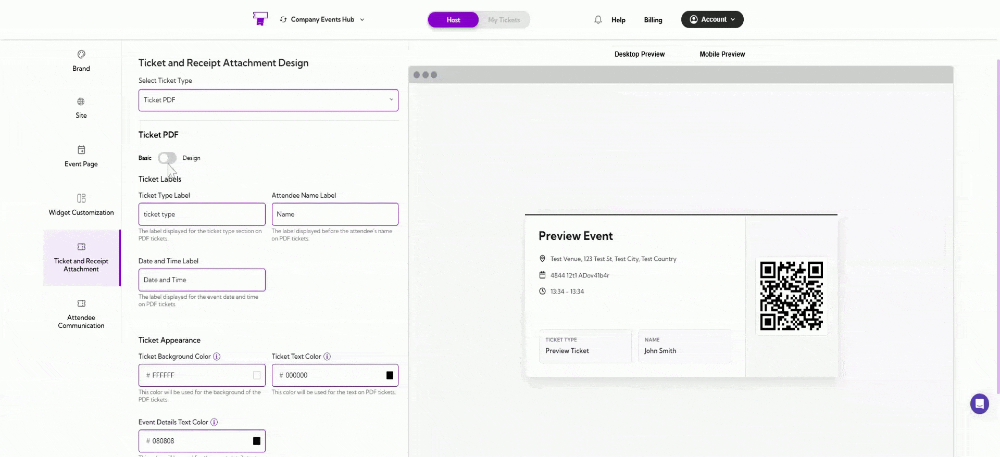

### Basic Mode

#### Ticket Labels

**Ticket Labels** allow you to customize the text headings that appear on the Ticket PDF. These fields help you rename or localize the default labels so they match your event’s branding and terminology.

| Field | Description | Example |
|-------|-------------|---------|
| **Ticket Type Label** | The heading displayed above the ticket type shown on the PDF ticket. | Ticket Type, Pass Type, Registration Type |
| **Attendee Name Label** | The heading that appears before the attendee’s name on the ticket. | Name, Attendee, Guest Name |
| **Date and Time Label** | The heading displayed before the event’s date and time information. | Date and Time, Event Schedule, When |

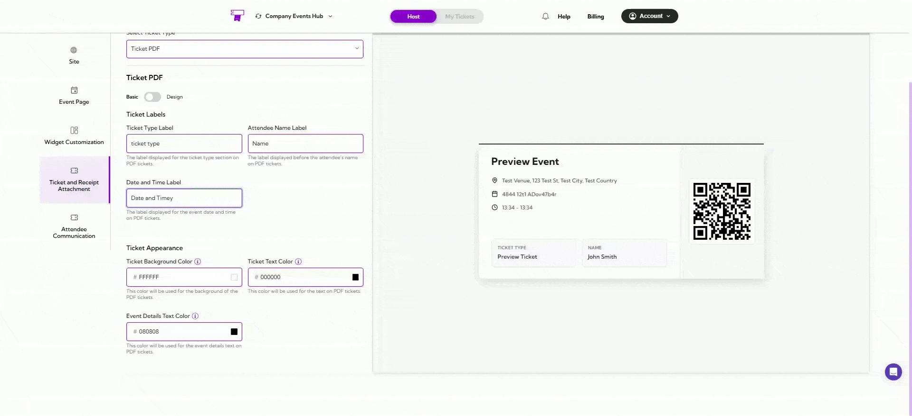

#### Ticket Appearance

**Ticket Appearance** settings allow you to control the colors used on the Ticket PDF. These options help your ticket match your event branding and maintain a clean, readable layout.

| Field | Description | Example |
|-------|-------------|---------|
| **Ticket Background Color** | Sets the background color of the PDF ticket. Choose a color that complements your branding and keeps the ticket readable. | #FFFFFF |
| **Ticket Text Color** | Sets the color of all text displayed on the ticket. Select a color that contrasts well with the background. | #000000 |
| **Event Details Text Color** | Controls the text color specifically for event details such as date, time, and venue. | #444444 |

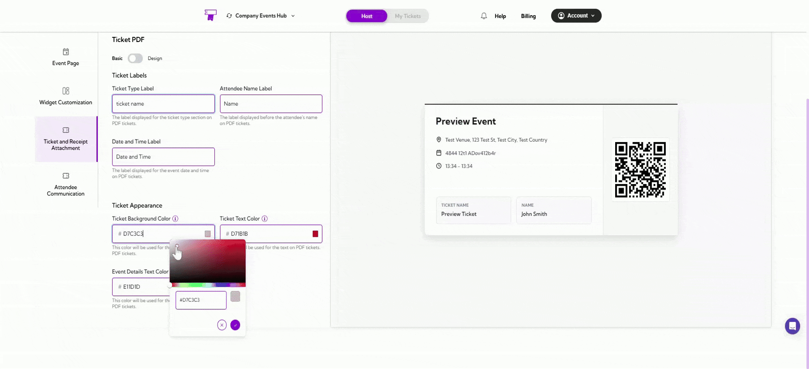

### Design Mode

If Design Mode is **enabled**, it gives you full control over the layout and visual structure of your Ticket PDF. Instead of basic text fields, you can use a drag-and-drop designer to place elements exactly where you want them on the ticket.

#### Layout Type

- **A4** – A standard full-page ticket layout suitable for printing.  
- **Badge Layout** – A compact layout designed for badges and passes used during check-in or on-site events.

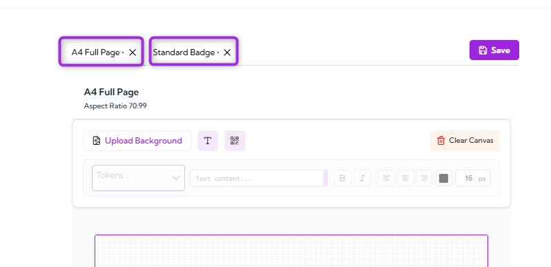

#### Design Tools

| Tool | Description |
|------|-------------|
| **Text** | Add custom text anywhere on the ticket (e.g., section titles, instructions, notes). |
| **Tokens** | Insert dynamic fields such as attendee name, ticket type, event name, date, venue, and more. These automatically fill with attendee-specific data. |
| **QR Code** | Add a QR code that attendees will scan at the venue for check-in. You can adjust placement and size. |
| **Image** | Upload and place images such as logos, background banners, or decorative elements. |
| **Shapes** | Add design elements like boxes or dividers to structure the layout. |
| **Move / Resize Controls** | Drag, resize, and position each element to create your own layout. |

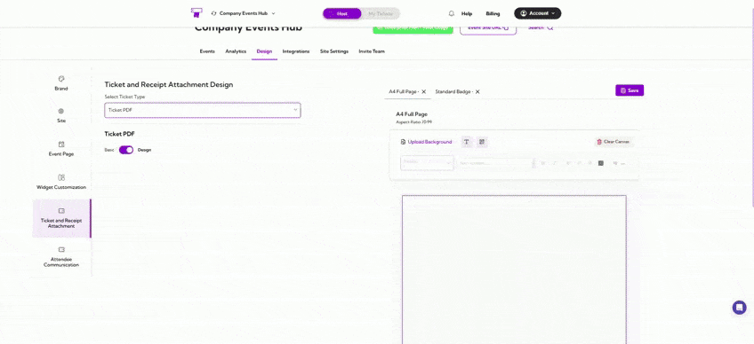

## Ticket Receipt PDF

**Ticket Receipt PDF** customization allows you to edit the labels and visual elements shown on the receipt that attendees receive after purchasing tickets. These settings help you tailor the receipt to match your event terminology, branding, and formatting preferences.

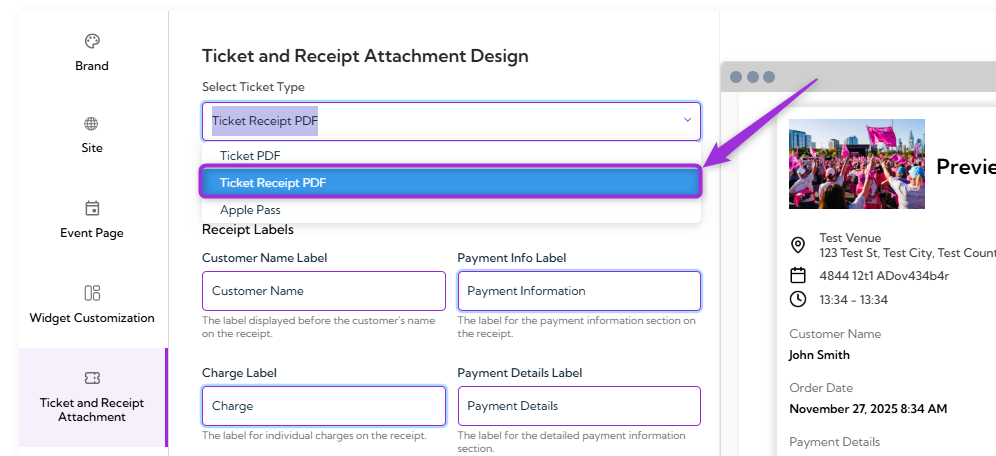

### Receipt Labels

**Receipt Labels** allow you to rename the headings shown on the ticket receipt. This helps you match the wording to your event style.

| Ref. | Field | Description | Example |
|------|-------|-------------|---------|
| 1. | **Customer Name Label** | The heading is shown before the purchaser’s name on the receipt. | Customer Name, Buyer, Registered By |
|2.  | **Payment Info Label** | The heading that appears above the payment method information. | Payment Info, Payment Method, Billing Details |
| 3. | **Charge Label** | The heading for the amount charged to the customer. | Charge, Amount, Total Due |
| 4. | **Payment Details Label** | The heading that appears above transaction details, such as transaction ID. | Payment Details, Transaction Info |
| 5. | **Tax Label** | The heading used for tax information on the receipt. | Tax, GST, VAT |
| 6. | **Total Label** | The heading for the final total amount. | Total, Grand Total |
| 7. | **Order Date Label** | The heading displayed before the receipt’s order date. | Order Date, Purchase Date |

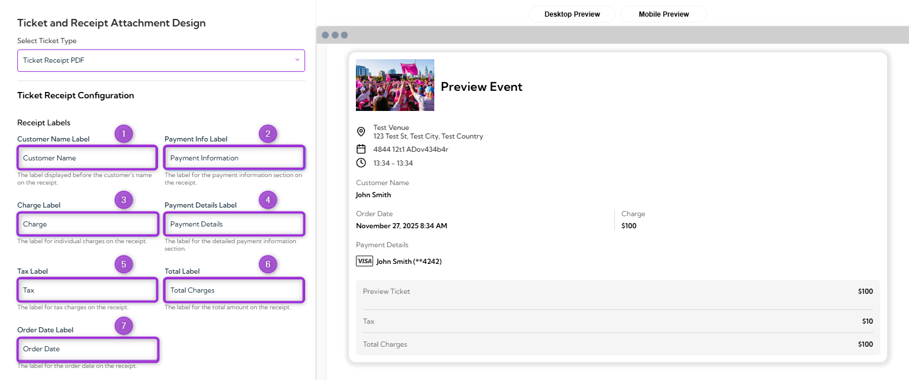

## Apple Pass

**Apple Pass** allows attendees to save their event ticket directly to Apple Wallet on iOS devices, giving them a convenient and secure way to access their ticket during check-in. This section lets you configure basic settings for the Apple Pass and preview how it will appear to attendees.

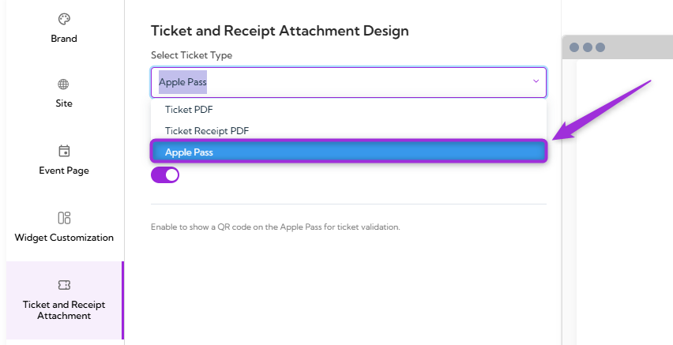

### Show QR Code

Use this toggle to enable the **QR code** on the **Apple Pass**, allowing attendees to scan it for ticket validation.

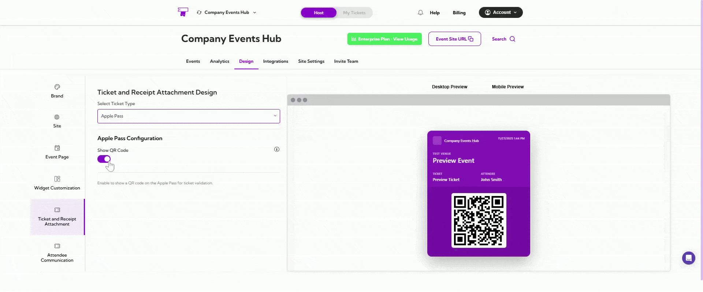

## Preview Your Customizations

After making changes to your ticket, receipt, or Apple Pass design, you can preview how each attachment will appear on different devices. This helps ensure your layout, colors, labels, and elements display correctly across both desktop and mobile views.

**Desktop Preview:** Click the **Desktop Preview** tab to see how the attachment will appear on larger screens or when downloaded as a PDF.

**Mobile Preview:** Click the **Mobile Preview** tab to check how the attachment will look on mobile devices, including Apple Wallet Pass.

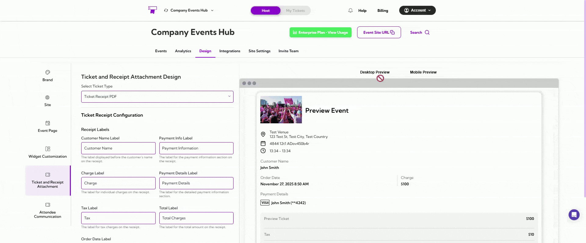

> **Tip:** Use both previews to confirm that your ticket, receipt, or Apple Pass design is clear, readable, and correctly formatted before finalizing your layout.
