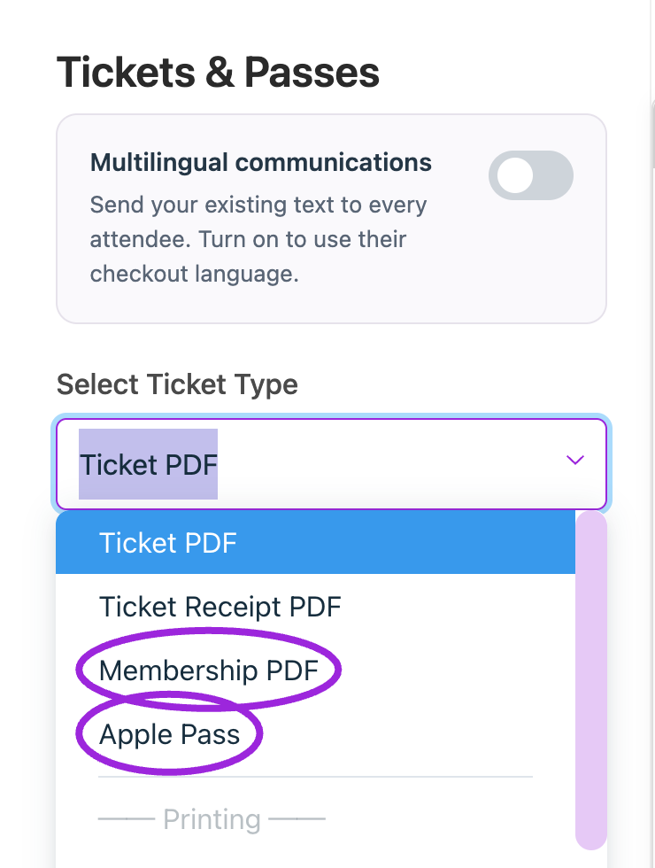
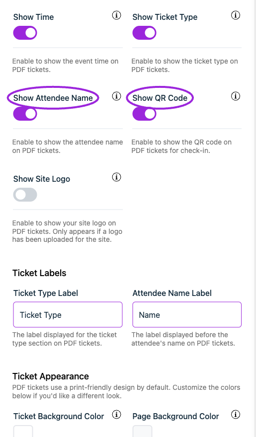
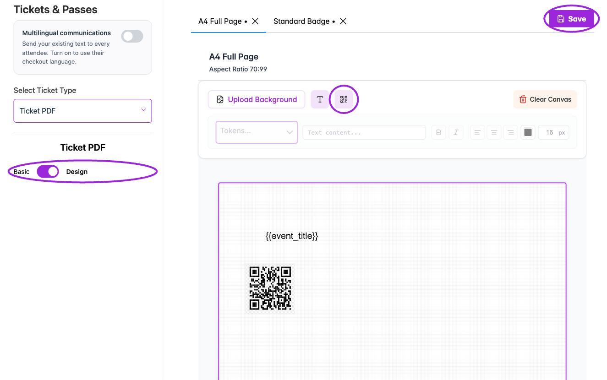
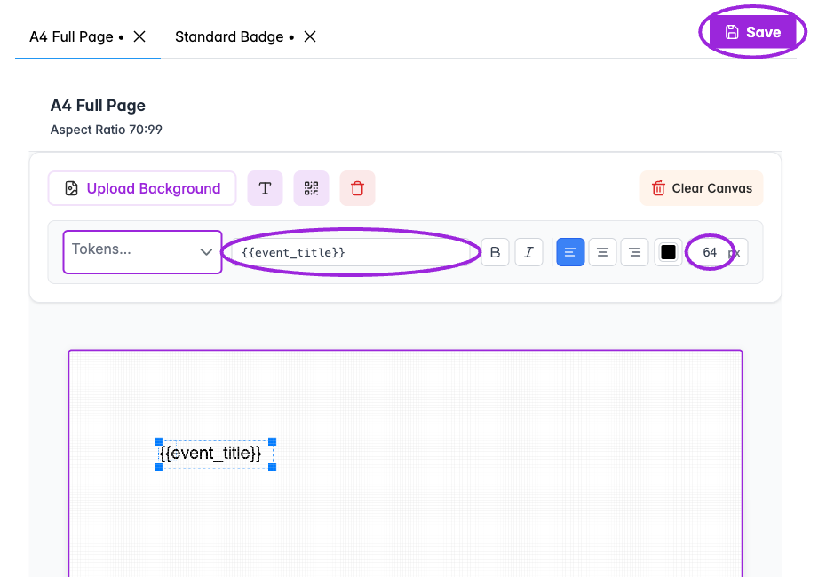
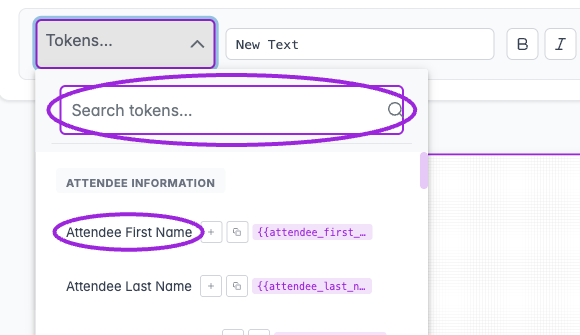
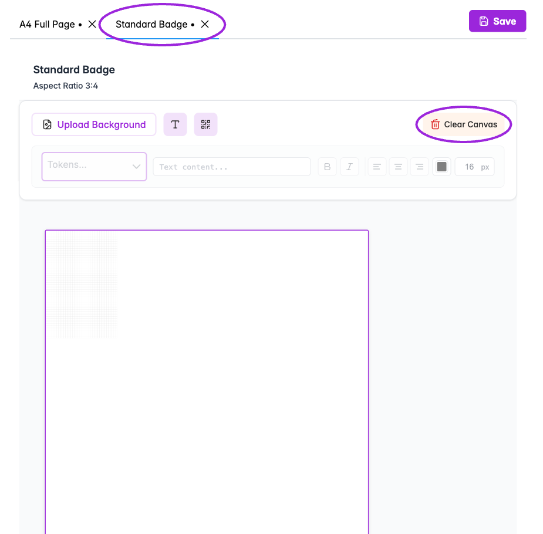
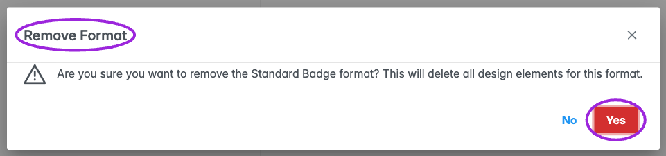
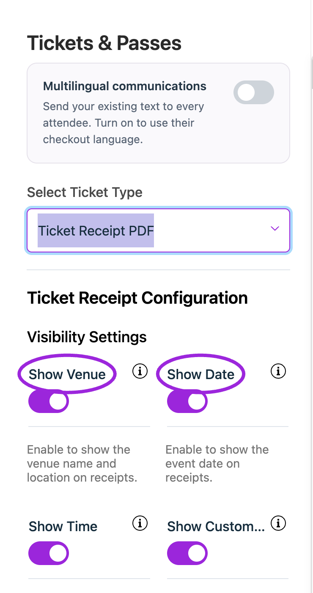
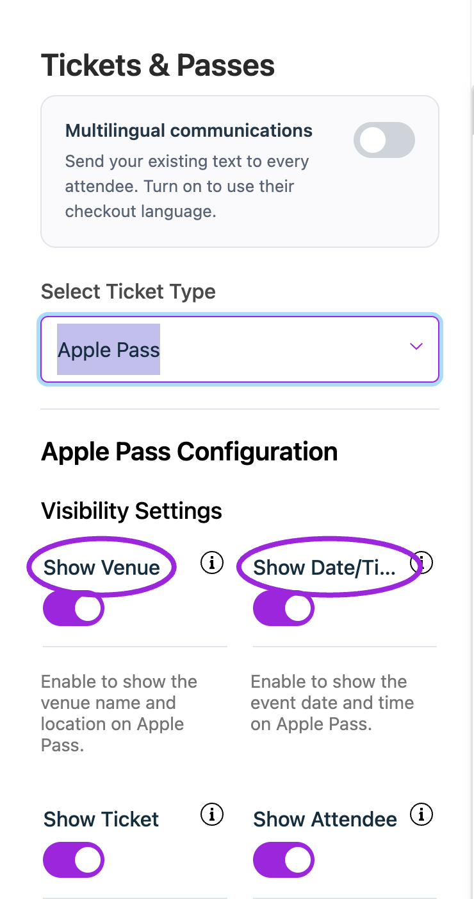
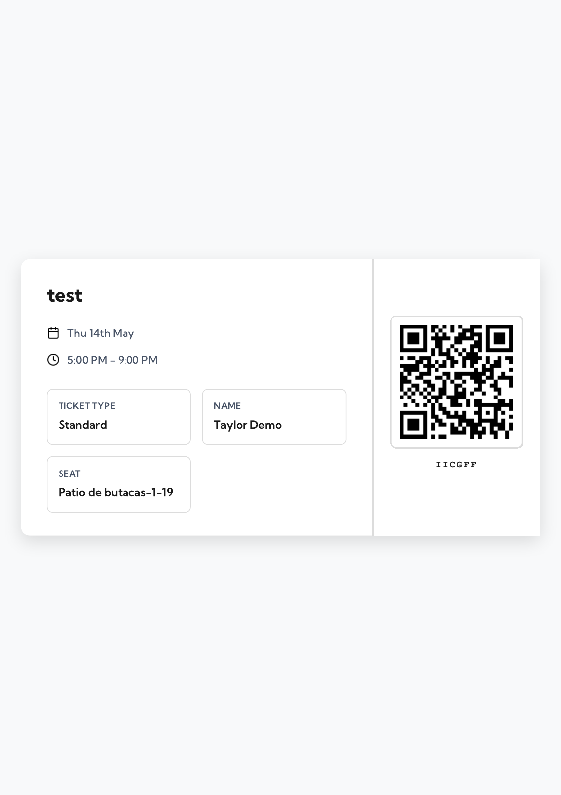

Open **Design → Tickets & Passes** and choose **Select Ticket Type**. Ticket PDF, Ticket Receipt PDF, Membership PDF, Apple Pass, Star MC Print3, and Boca Printer have separate settings. See [Tickets and passes](./tickets-and-passes) for membership and printer formats.

<Frame caption="Choose the document or pass to customize.">
  
</Frame>

## Basic ticket PDF

Choose **Ticket PDF → Basic** to change visibility, labels, and colors. The basic settings update automatically; wait for the update before downloading a sample.

<Frame caption="Basic ticket settings control the details shown on the PDF.">
  
</Frame>

| Controls | Effect |
|---|---|
| Show Venue, Show Date, Show Time | Display the event's location and schedule. |
| Show Ticket Type, Show Attendee Name, Show QR Code, Show Site Logo | Include ticket identity, admission code, and branding. |
| Ticket Type Label, Attendee Name Label | Rename the headings without changing the underlying ticket or attendee. |
| Ticket Background Color, Page Background Color | Set the ticket and surrounding page backgrounds. |
| Event Name Color, Ticket Text Color, Event Details Text Color | Set the corresponding text colors. |
| Ticket Shadow | Show or hide the ticket shadow. |

## Custom ticket designer

<Frame caption="Design mode provides format tabs, text and QR placement, and a separate Save action. This demonstration layout has not been saved.">
  
</Frame>

The **Basic / Design** switch enables custom ticket design on **Business Plus**. The switch saves immediately. Canvas changes use the designer's separate **Save** button.

1. Switch to **Design** and select a print-format tab.
2. Use **Add Format** (the plus button) to choose another available paper or badge format. Each tab has its own canvas and dimensions supplied by that format.
3. Add text and QR elements, place them on the canvas, and drag or resize them.
4. Select a text element to edit its content, insert personalization tokens, and change its formatting.
5. Click **Save** to save the format designs. A dot beside the tab name indicates unsaved changes.
6. Download a ticket in the corresponding format to check actual attendee data and the QR code.

<Frame caption="Select a text element to edit its wording, tokens, formatting, color, and size. Save stores the format designs.">
  
</Frame>

| Tool | How to use it |
|---|---|
| Upload Background | Choose an image as the format's background. It is a background, rather than a freely positioned image element. |
| Add Text | Select the tool, then click the canvas to place text. |
| Add QR Code | Select the tool, then click the canvas to place an admission QR element. Keep enough clear space around it. |
| Tokens… | Search attendee and event fields. Use **Insert** to add the selected token to the text or **Copy** to copy it. Keep the token intact so each ticket receives its own data. |
| Text content… | Edit the selected text element's wording and tokens. |
| Bold, Italic, alignment | Format the selected text, with left, center, or right alignment. |
| Text Color, Font Size | Set the selected text's color and size. The size field accepts 8–72. |
| Delete Selected Element | Remove the selected text or QR element. |
| Clear Canvas | Clear the current canvas; inspect it before saving. |

<Frame caption="Search the token menu, then use the insert or copy icon beside an attendee or event field.">
  
</Frame>

To remove a format, close its tab and confirm **Remove Format**. This removes its design elements. The last format cannot be removed. Save after changing the set of formats.

<Frame caption="Each print format has its own canvas. Standard Badge is designed separately from the A4 ticket.">
  
</Frame>

<Frame caption="Closing a format asks for confirmation before removing its design. This example was cancelled.">
  
</Frame>

## Ticket receipt PDF

Choose **Ticket Receipt PDF** to set receipt visibility and labels. Hiding a payment or tax label does not change the order calculation.

<Frame caption="Receipt settings control the customer, order, payment, and total labels.">
  
</Frame>

| Controls | Effect |
|---|---|
| Show Venue, Show Date, Show Time | Include event details. |
| Show Customer Name, Show Order Date, Show Charge, Show Payment Details | Include the corresponding order details. |
| Customer Name Label, Payment Info Label, Charge Label, Payment Details Label | Rename customer and payment headings. |
| Tax Label, Total Label, Order Date Label | Rename the tax, total, and order-date headings. |

## Apple Pass

Choose **Apple Pass** to show or hide venue, date/time, ticket, attendee, QR code, logo, and site name. Keep **Show QR Code** enabled when the pass is used for admission.

<Frame caption="Apple Pass has its own visibility settings.">
  
</Frame>

## Verify the finished output

The design preview helps check presentation. Download a PDF from a synthetic attendee's order to verify actual names, event details, seat assignments, and QR codes. Use **Print ticket → Print A4** in attendee management for the full-page ticket; custom badge output requires an enabled design. Check wallet passes on a compatible device and printer formats on the actual printer.

<Frame caption="Actual A4 ticket PDF from a synthetic Demo order, showing the attendee, assigned seat, and admission QR code.">
  
</Frame>

See the [complete design option reference](./design-options-reference) and [attendee details guide](../attendee-management/viewing-attendee-details).
