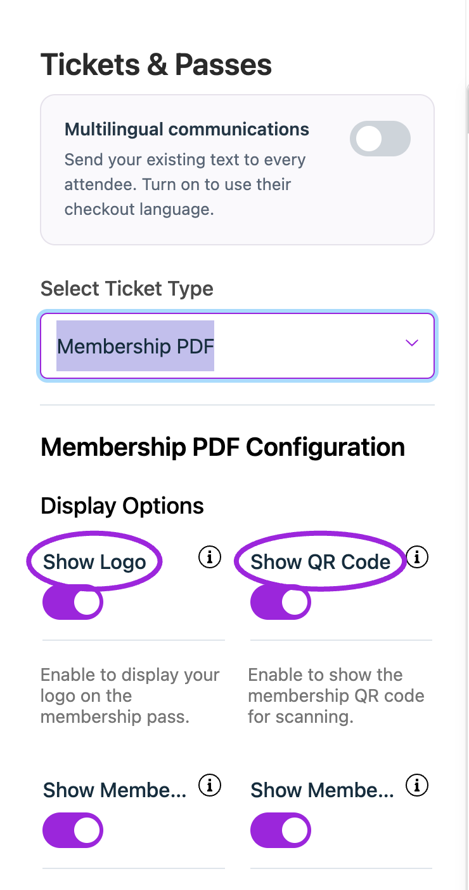
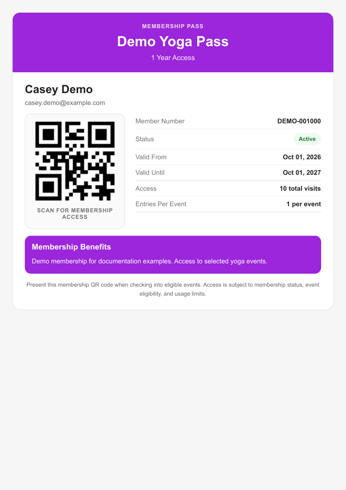

Open **Design → Tickets & Passes**, then choose **Select Ticket Type**. Each option controls a different document or pass; changing one does not mean every other format changes with it.

## Choose a format

<Frame caption="Open Select Ticket Type to choose a PDF or Apple Pass. Scroll farther down the menu for the printing formats.">
  
</Frame>

| Select Ticket Type | What it controls |
|---|---|
| **Ticket PDF** | The attendee ticket PDF, with basic display settings and the custom ticket designer where enabled. |
| **Ticket Receipt PDF** | Receipt details and labels, including customer, order date, payment, tax, and total. |
| **Membership PDF** | Membership identification, validity, QR code, benefits, and related labels. |
| **Apple Pass** | Visibility of venue, date/time, ticket, attendee, QR code, logo, and site name on the pass. |
| **Star MC Print3** | The Star thermal ticket layout. |
| **Boca Printer** | The Boca ticket layout. |

Selecting a print design does not connect a printer. Match the format to the printer used at your venue and test a physical print before event day.

## Ticket PDF

<Frame caption="Ticket PDF → Basic visibility settings include attendee name, QR code, and site logo. Review the ticket labels and colors below.">
  
</Frame>

Use the basic controls to show or hide venue, date, time, ticket type, attendee name, QR code, and site logo. Customize the ticket-type and attendee-name labels, ticket/page backgrounds, event-name and detail text colors, and shadow.

For a custom design on Business Plus, switch to **Design**, choose a print-format tab, and arrange text, QR codes, and a background on its canvas. The selected format supplies the dimensions. Personalization tokens insert event and attendee details; retain them rather than replacing them with one test attendee's name. Click the designer's **Save** button and verify an actual PDF. See the [custom designer walkthrough](./ticket-and-receipt-attachment-design#custom-ticket-designer).

<Frame caption="Design mode provides format tabs, text and QR placement, and a separate Save action. This demonstration layout has not been saved.">
  
</Frame>

<Frame caption="Actual A4 ticket PDF from a synthetic Demo order, showing the attendee, assigned seat, and admission QR code.">
  
</Frame>

## Membership PDF

<Frame caption="In Design → Tickets &amp; Passes, choose Membership PDF to configure its labels, visibility, and appearance. This is the current configuration panel.">
  
</Frame>

1. Choose **Membership PDF**.
2. Set visibility for logo, QR code, member email, member number, valid-from date, benefits, and footer note.
3. Set the header, QR, member-number, status, valid-from/until, access, entries-per-event, benefits, and footer labels.
4. Wait for the settings update and inspect a test member's PDF.

<Frame caption="A downloaded pass uses the real holder’s identity, dates, and visit allowances. This example uses a synthetic Demo member.">
  
</Frame>

The design labels do not change membership duration or visit allowances. Configure those in [Memberships](../memberships/create-membership).

## Save and test delivery

Wait for the settings update to finish and inspect the selected preview. Download a real test ticket, receipt, or membership PDF to verify actual data and legibility. Keep QR codes large and clear enough to scan. Check the pass on a device and printed tickets on the actual printer.

See [Ticket and receipt attachment design](./ticket-and-receipt-attachment-design) for the existing field walkthrough and [Design option reference](./design-options-reference) for the complete template option list.
