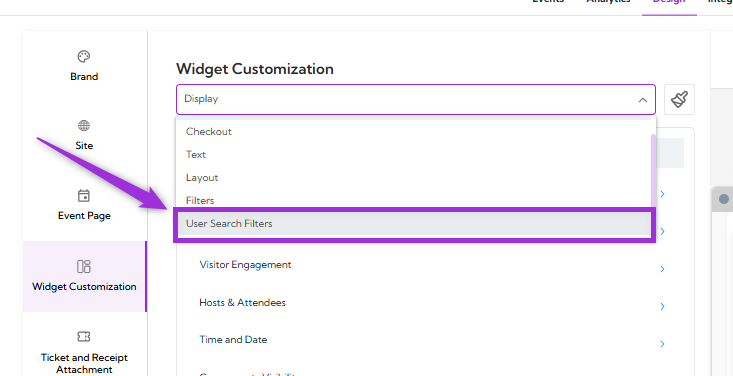
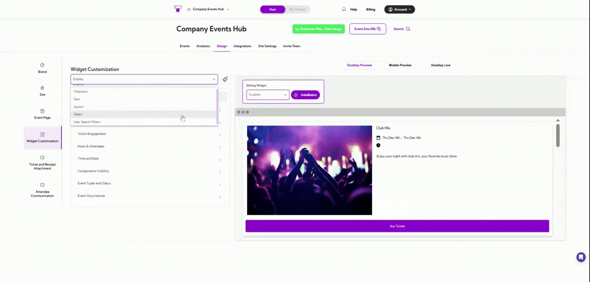

**User Search Filters** enable visitors to quickly filter event listings using criteria such as venue,
city, category, date, and more. These filters streamline the browsing experience by displaying
only the events that align with the visitor’s selected preferences, helping them find relevant
options with minimal effort.

Let’s get started 🚀

Click on the dropdown menu and select **User Search Filters**. You will be navigated to the **User
Search Filter Design** settings.

The table below displays each filter field along with its description.

| Field               | Description                                                                 |
| ------------------- | --------------------------------------------------------------------------- |
| Show Event Search   | Enables a search bar for users to search events by title or keyword.        |
| Show Venue Filter   | Adds a filter allowing users to narrow events by venue.                     |
| Show City Filter    | Allows users to filter events based on city.                                |
| Show Region Filter  | Let's users filter events by region.                                        |
| Show Country Filter | Displays a filter for selecting events by country.                          |
| Show Language Filter | Enables filtering events based on language preferences.                    |
| Show Month Filter   | Allows users to refine events by month.                                     |
| Show Week Filter    | Adds a filter to browse events by week of the year.                         |
| Show Category Filter | Let's users filter events by event category or type.                       |

A live preview of each setting appears in the right panel, allowing you to confirm the design
before applying it.
