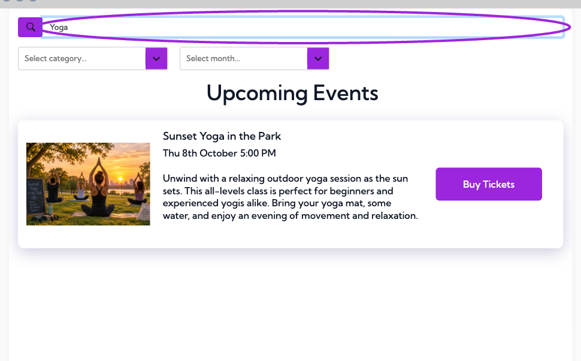

Open **Design → Widget → All Settings → Visitor search & filters**.

Enable **Show event search** for a keyword box. Choose the venue, city, region, country, category, language, month, and week filters appropriate to your event data. See [every visitor-filter option](./widget-visitor-filters-reference).

Edit placeholders under **Text → Search filters**. Edit their appearance under **Design → Customize components → Visitor search & filters**. Automatic search-filter translation is under **Text → Event details**.

Wait for saving, then test selecting and clearing each filter on desktop and mobile. Visitors only search the events already included by the widget's [Event Filters](./filters), publication status, and applicable limits.

## Filter controls

<Frame caption="Visitor search and filters narrow the events already included in the widget. Turn on keyword search and the category, date, or location filters your visitors need.">
  
</Frame>

<Accordion title="Location and language controls">

<Frame caption="Location and language filters use the event’s venue/city/region/country and language data. Their labels and styling are configured separately under Text and Design.">
  
</Frame>

</Accordion>

## Visitor example

<Frame caption="Visitors can combine keyword search with enabled category and month filters. This search narrows the Demo widget to its matching yoga event.">
  
</Frame>
