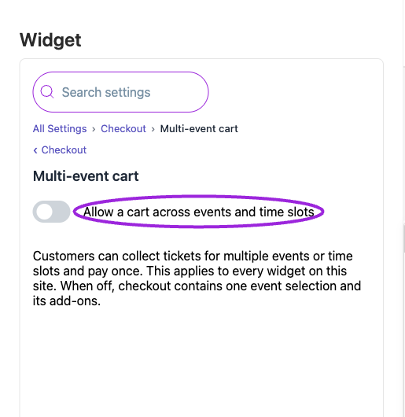

Open **Design → Widget → All Settings → Checkout**. Set up your [event tickets](/event-management/ticket-setup) before adjusting checkout presentation.

**Collect attendee details for each ticket** asks for each guest's information; off collects the buyer's details. **Ask buyers to re-enter their email** requires matching email entries. Configure the actual questions and their checkout/check-in requirements under [Additional Info](/event-management/additional-information).

An **access code** unlocks a hidden ticket; a **promo code** applies a discount. Enable the appropriate field and use the auto-open option if it should be visible immediately. Showing either field does not create a code. Promo code placement offers **Top of Checkout** or **Next to Checkout Summary**.

Date formatting here is separate from the listing's date formatting. **Hide the cart summary** and **Hide the price on free tickets** change presentation, not the order total or ticket price. Date-first/ticket-first and combined-step controls are under [Display → Checkout & payment](./widget-display-reference#checkout-%26-payment).

Test a multi-ticket order, a valid/invalid code, nonmatching confirmation emails, and a free order. See [checkout setup](./checkout-settings).

{/* BEGIN WIDGET OPTIONS */}

## Attendee information

<Accordion title="View current controls">

<Frame caption="All Settings → Attendee information — Attendee details and email confirmation. The circles identify Collect attendee details for each ticket and Ask buyers to re-enter their email.">
  
</Frame>

</Accordion>

{/* widget-option: showAttendeeInputsPerTicket */}
{/* widget-option: showConfirmEmail */}

| Option | Control | What it changes |
|---|---|---|
| **Ask buyers to re-enter their email** | Setting | Adds a second email field to the checkout form. The order cannot be completed unless the two entries match, which catches typos before tickets are sent. |
| **Collect attendee details for each ticket** | Setting | Enable this to collect information from each attendee. When enabled, for each ticket quantity selected, a corresponding attendee input field will be displayed for individual attendee details. When disabled, only the buyer's information will be collected. |

## Cart &amp; pricing

<Accordion title="View current controls">

<Frame caption="All Settings → Cart &amp; pricing — Checkout dates, availability and price summary. The circles identify Show how many tickets are left and Hide the cart summary.">
  
</Frame>

</Accordion>

{/* widget-option: hideCartSummary */}
{/* widget-option: hideFreePriceLabel */}
{/* widget-option: showTicketAvailability */}

| Option | Control | What it changes |
|---|---|---|
| **Hide the cart summary** | Setting | Hides the cart summary during checkout. The summary is the order breakdown and total cost. |
| **Hide the price on free tickets** | Setting | Hides the 'Free' or '$0.00' label on free tickets. The tickets stay free; only the price indicator is hidden. |
| **Show how many tickets are left** | Setting | Shows the number of tickets still available next to each ticket in the cart. Change the wording under Text › Checkout › Cart. |

## Date &amp; time on the checkout page

<Accordion title="View current controls">

<Frame caption="All Settings → Date &amp; time — Checkout dates, availability and price summary. The circles identify Date Display and Time Display.">
  
</Frame>

<Frame caption="All Settings → Date &amp; time — Checkout dates, availability and price summary. Continued controls. The circles identify Show Start Date and Show Start Time.">
  
</Frame>

</Accordion>

{/* widget-option: checkoutDateFormat */}
{/* widget-option: checkoutIncludeTimezone */}
{/* widget-option: checkoutShowEndDate */}
{/* widget-option: checkoutShowEndTime */}
{/* widget-option: checkoutShowStartDate */}
{/* widget-option: checkoutShowStartTime */}
{/* widget-option: checkoutTimeFormat */}

| Option | Control | What it changes |
|---|---|---|
| **Date Display** | Setting | Choose the format in which you'd like the date to appear on the checkout page. |
| **Include Timezone** | Setting | Include the event timezone beside dates and times on the checkout page. |
| **Show End Date** | Setting | Show the event's end date on the checkout page. |
| **Show End Time** | Setting | Show the event's end time on the checkout page. |
| **Show Start Date** | Setting | Show the event's start date on the checkout page. |
| **Show Start Time** | Setting | Show the event's start time on the checkout page. |
| **Time Display** | Setting | Choose the time format for display on the checkout page. |

## Promo &amp; access codes

<Accordion title="View current controls">

<Frame caption="All Settings → Promo &amp; access codes — Promo and access-code fields. The circles identify Show promo code field and Open the promo code field automatically.">
  
</Frame>

</Accordion>

{/* widget-option: keepAccessCodeOpen */}
{/* widget-option: keepPromoCodeOpen */}
{/* widget-option: promoCodePosition */}
{/* widget-option: showAccessCode */}
{/* widget-option: showPromoCode */}

| Option | Control | What it changes |
|---|---|---|
| **Open the access code field automatically** | Setting | Shows the access code input straight away instead of behind a link visitors have to click first. |
| **Open the promo code field automatically** | Setting | Shows the promo code input straight away instead of behind a link visitors have to click first. |
| **Promo code placement** | Setting | Where the promo code field sits in the checkout — at the top for immediate visibility, or beside the summary. |
| **Show access code field** | Setting | Shows the access code input, which visitors use to unlock and buy hidden tickets. |
| **Show promo code field** | Setting | Enable this option to show the promo code component, allowing users to view the promo code button and enter promo codes. |

{/* END WIDGET OPTIONS */}

## Multi-event cart

Open **Checkout → Multi-event cart** and enable **Allow a cart across events and time slots** to let buyers collect tickets across events or time slots and pay once. This setting applies to every widget on the site. With it off, checkout contains one event selection and its add-ons.

<Frame caption="Multi-event cart is a site-wide checkout setting.">
  
</Frame>

## Save and verify

Wait for the setting update to finish, check the preview, and open the installed widget to confirm the result. If a control is unavailable, review its prerequisite, site type, and plan. [Return to widget setup](./widget-customization-overview).
