**Widget Customization** provides full control over how your event widgets appear and behave across your website or embedded pages. This area allows you to adjust display settings, layout, text, filters, and user-interaction options so each widget fits your branding and delivers the right information to your audience.

By configuring these settings, event organizers can create a consistent visual experience, highlight essential details, and ensure widgets function smoothly across different devices and placements.

Let’s get started 🚀

## Navigation

**Step 1:** Log in to your **Ticket Spot** account and click on the **Design** tab.

**Step 2:** Click on the **Widget Customization** tab to open the design settings.

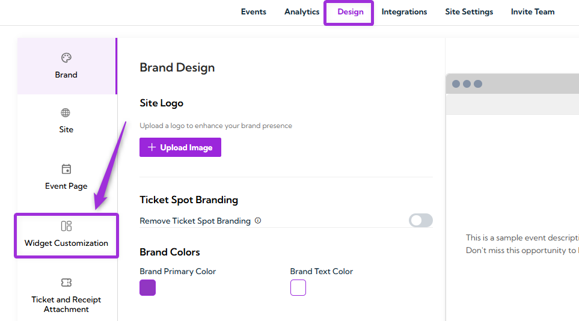

**Step 3:** Use the **Widget Type** dropdown to select the widget you want to customize, such as:

- Display  
- Checkout  
- Text  
- Layout  
- Filters  
- User Search Filters  

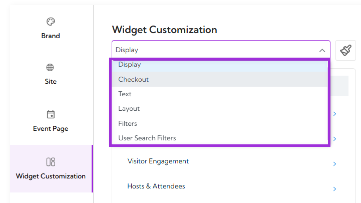

You will be navigated to the design settings for the selected type.

## Create & Install Widget

**Widgets** allow you to display your events anywhere—your website, Shopify store, WordPress site, or Wix pages. By creating different widgets, you can customize layouts, apply filters, and show specific event groups using tags. This helps you control exactly how your events appear across different pages and platforms.

**Create a Widget**

**Step 1:** Click on the **Editing Widget dropdown** at the top of the page to view all your existing widgets.

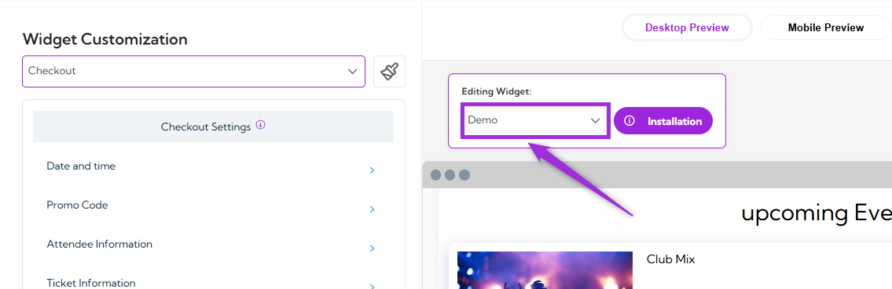

**Step 2:** Click on the **Add Widget** button to create a new widget.

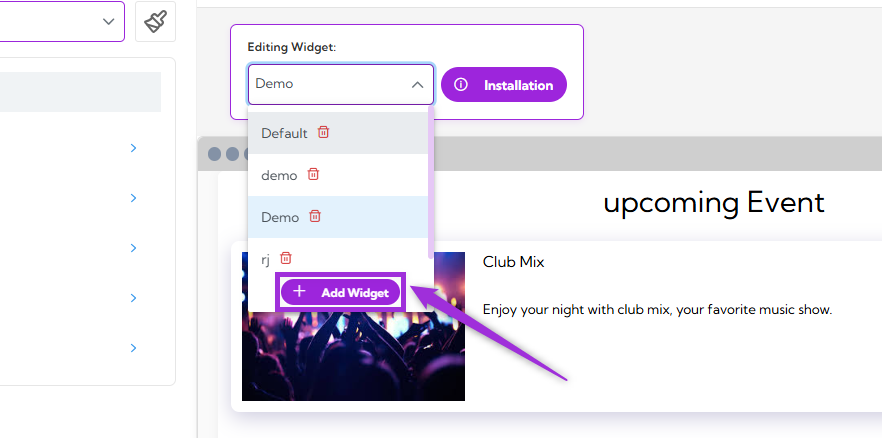

A modal window will appear asking for your widget name. Enter a widget name (e.g., “Custom”, “Music Events Widget”) and click on the **Create** button.

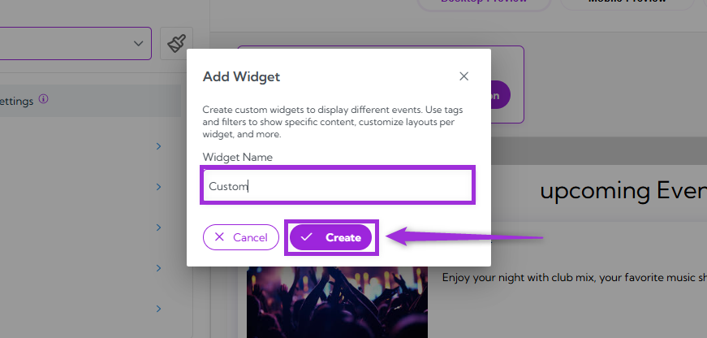

Your new widget will be added to the list, ready for customization.

**Install Widget**

Installing a widget allows you to display your customized event view on any website or platform. Each widget you create comes with its own unique code or ID, so you can embed it wherever you need—whether it’s your homepage, a landing page, or a partner site.

To install the widget, click the **Installation** button, choose your platform (**Any Website**, **[Shopify](../plugins/connect-shopify)**, **WordPress**, **[Wix](../plugins/connect-wix)** or **Lovable"**), and **copy** the code shown on the screen. Paste it into your website or follow the steps provided in each tab to complete the setup.

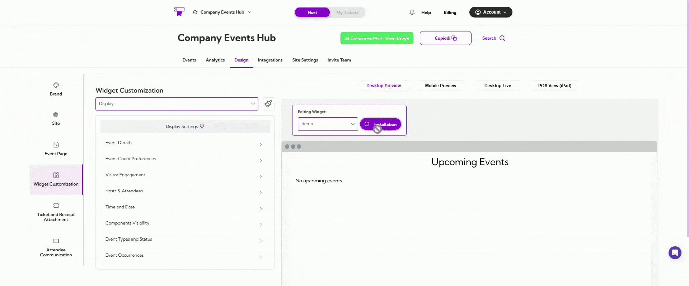

## Design Settings

**Design Settings** control the visual style of your widget. Use this section to change colors, fonts, and how different parts of your widget look.

1. Click on the **paintbrush icon** at the top-right corner of the Widget Customization page.

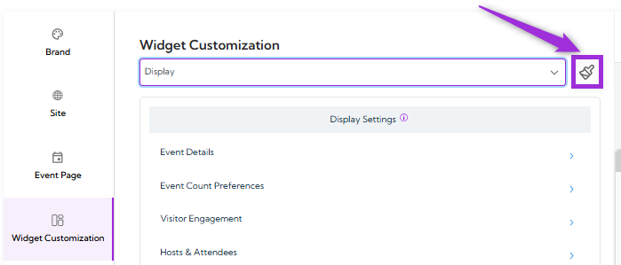

2. You can choose a theme such as **Ticket Spot** or **Your Brand**. These themes apply preset color palettes and styles to your widget.

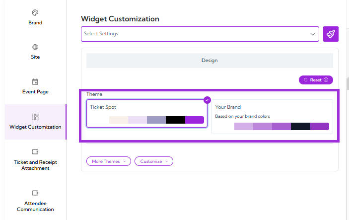

3. You can click **More Themes** to select from several pre-built theme options. Each theme gives your widget a different visual style.

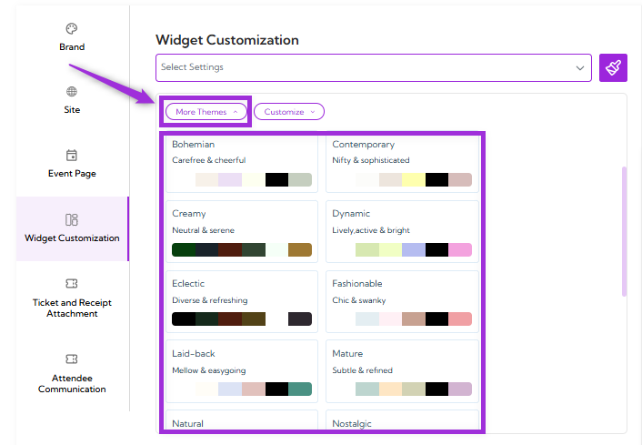

4. You can also use the **Customize** option to adjust individual design elements. Here you can change opacity, desktop text colors, mobile text colors, button styles, calendar appearance, attendee form styling, checkout appearance, multi-day selection, and more.

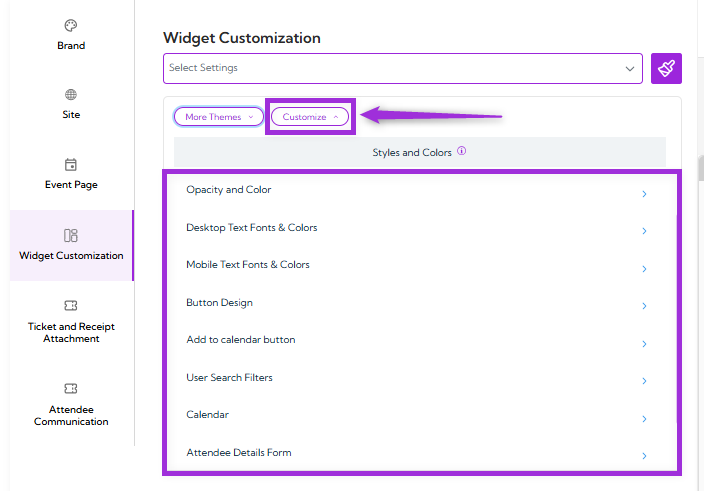

5. Click on the **arrow icon** next to the setting you want to customize, and make your changes based on what fits your design.

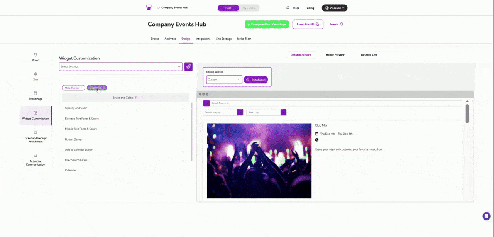

You can now customize each widget exactly the way you want—from layout to settings—and use them anywhere you need.
