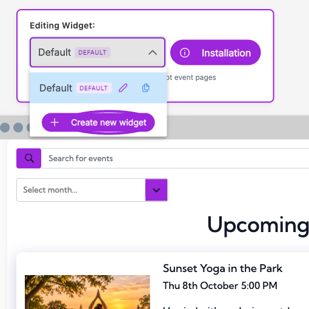
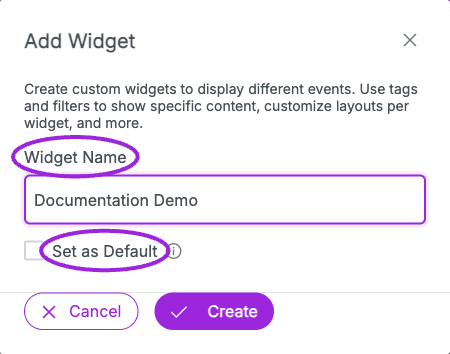
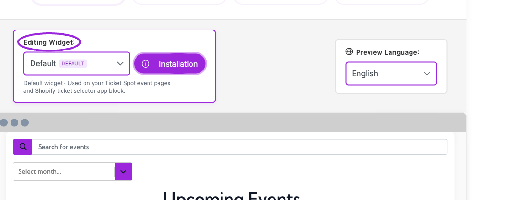

A widget is a configurable event listing and checkout experience. Create separate widgets when different pages need different layouts, filters, or wording.

## Open the widget editor

1. Select the correct site, then open **Design → Widget**.
2. Choose the widget in **Editing Widget**. To create one, open that dropdown and select **Create new widget**, enter a **Widget Name**, and select **Create**. Leave **Set as Default** off for a separate embed configuration.
3. Start with **Quick Settings**, use **Search settings**, or choose **All Settings**.
4. Open a category and subsection. Use the breadcrumb to return to its parent or search results.

The dropdown also provides edit and duplicate actions. The **Default** widget is used on Ticket Spot event pages and the Shopify Ticket Selector app block; choosing a different widget for editing does not change which widget is the default.

<Frame caption="Open Editing Widget to switch widgets or choose Create new widget. Each widget has its own layout, text, and filters.">
  
</Frame>

<Accordion title="Create a separate widget">
<Frame caption="Give the widget a name and choose whether it should become the Default widget. Leave Set as Default off to create a separate configuration for another embed.">
  
</Frame>
</Accordion>

## Settings categories

| Category | Configure | Full option reference |
|---|---|---|
| **Design** | Theme, colors, fonts, and component overrides. Hidden for Wix sites. | [Colors and fonts](./widget-design-reference) |
| **Display** | Event details, images, date display, buttons, descriptions, recurring behavior, counts, and checkout-step choices. | [Display options](./widget-display-reference) |
| **Layout** | Separate desktop, mobile, and date/time layouts. | [All layouts](./widget-layout-reference) |
| **Event Filters** | Which live, past, private, or sold-out events appear; draft preview; advanced matching rules. | [Event filters](./widget-event-filters-reference) |
| **Visitor search & filters** | The search and filter controls customers can use. | [Visitor filters](./widget-visitor-filters-reference) |
| **Checkout** | Attendee details, date formatting, promo/access-code inputs, availability, and cart display. | [Checkout options](./widget-checkout-reference) |
| **Text** | Buttons, labels, empty/error states, required-ticket messages, memberships, add-ons, seating, and Shopify wording. | [Text options](./widget-text-reference) |

[Quick Settings](./quick-settings) changes the same values as the full categories. It is not a separate configuration.

## Brand and component styling

Set [Brand](./brand-design) first. Choose **All Settings → Design → Your Brand** to follow later shared color/font changes. Local component overrides apply only to this widget. A preset theme uses its own palette.

**More Themes** opens the theme gallery. **Customize components** opens individual color/font controls. Choosing a theme replaces existing overrides. **Reset** removes component customizations and returns to the currently selected theme; it does not switch a preset to Your Brand.

For Wix, right-click the app in the Wix Editor and open **Settings → Design** for colors and fonts. The dashboard's widget preview is unstyled for Wix.

## Save and install

Widget controls generally save and publish automatically after a change. Font edits require **Apply**. Wait for the update to finish and verify the preview; do not assume a separate event Publish button is required for widget settings.

Select **Installation**, choose the target platform, and copy the provided embed code or widget ID. Use [Any Website](../plugins/embed-on-your-website), [Shopify](../plugins/connect-shopify), [WordPress](../plugins/connect-wordpress), [Wix](../plugins/connect-wix), or [Lovable](../plugins/connect-lovable) instructions.

The Shopify **Event Widget** lists events; the [Ticket Selector](../plugins/shopify-ticket-selector) belongs on the event product template. They are different blocks.

<Frame caption="Choose the widget in Editing Widget, then open Installation. The Default widget is also used on Ticket Spot event pages and the Shopify Ticket Selector app block.">
  
</Frame>

## Verify the installed widget

Open its actual website page on desktop and mobile. Check event inclusion, dates and timezones, images, button behavior, checkout, and confirmation. Test a no-results state and any waitlist, seating, membership, or add-on flow you use. Preview-only drafts do not appear on the live widget.

{/* CURRENT CAPTURES */}

## Current controls

<Frame caption="Open Design → Widget, then All Settings to browse Design, Display, Layout, Event Filters, Visitor search &amp; filters, Checkout, and Text.">
  
</Frame>
