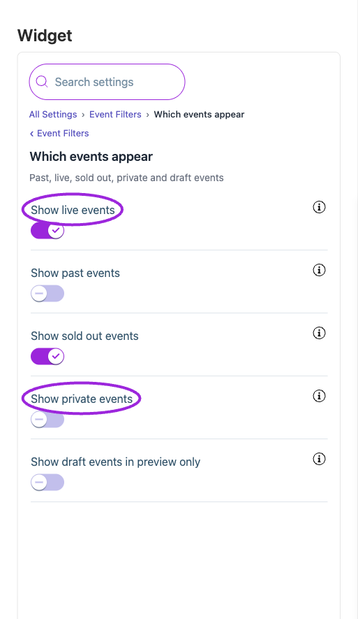
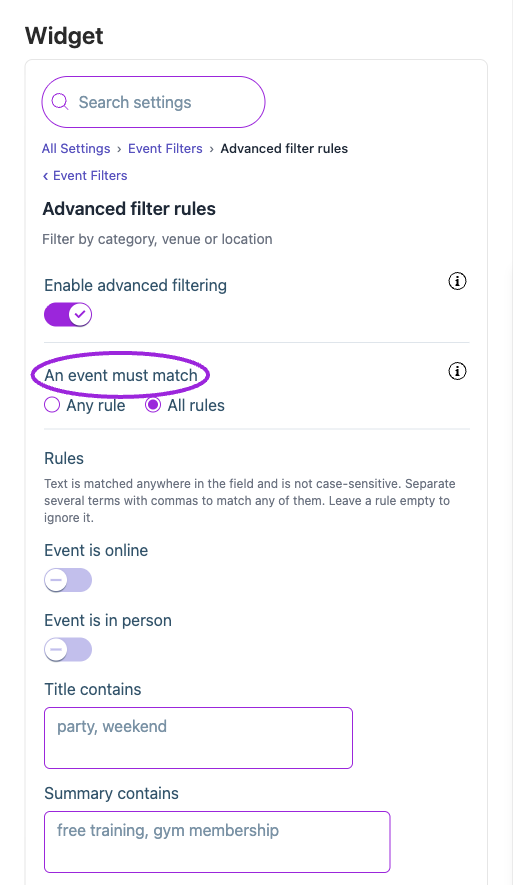

Open **Design → Widget → All Settings → Event Filters**. First choose **Which events appear**, then use **Advanced filter rules** to narrow those events. These organizer rules are separate from [visitor search controls](./widget-visitor-filters-reference).

**Show draft events in preview only** never publishes drafts to your live website. **Show private events** controls listing visibility; it does not remove an event's access restriction.

With **Enable advanced filtering** off, the advanced rules are ignored. With it on, choose **All rules** (every completed rule must match) or **Any rule** (at least one). Rules cover Online Event, In-Person Event, Name, Summary, Tags, Description, Venue Name, Address, City, Region, and Language. For example, use All rules with a tag and city to list only matching tagged events in that city.

Confirm that an expected event appears and a deliberately excluded event does not. If the live list is shorter than the preview, check draft status, the plan limit, and maximum event count.

<Accordion title="Find these controls in the editor">

<Frame caption="Which events appear controls the statuses included by this widget. Draft preview visibility does not publish drafts, and private-event visibility does not remove access restrictions.">
  
</Frame>

<Frame caption="Enable advanced filtering and choose Any rule or All rules. Text matches are case-insensitive; separate several terms with commas and leave unused rules blank.">
  
</Frame>

</Accordion>

{/* BEGIN WIDGET OPTIONS */}

## Advanced filter rules

{/* widget-option: enableFilters */}
{/* widget-option: filterOperator */}
{/* widget-option: filterQueries */}

| Option | Control | What it changes |
|---|---|---|
| **An event must match** | Setting | With 'All rules', an event has to satisfy every rule you fill in below. With 'Any rule', matching one is enough. |
| **Enable advanced filtering** | Setting | With this off, every event allowed by 'Which events appear' is shown and the rules below are ignored. |
| **Rules** | Setting | Add, edit, or remove event inclusion rules. Combine them using All rules or Any rule. |

## Which events appear

{/* widget-option: includePrivateEvents */}
{/* widget-option: showActiveEvents */}
{/* widget-option: showDraftEvents */}
{/* widget-option: showPreviousEvents */}
{/* widget-option: showSoldOutEvents */}

| Option | Control | What it changes |
|---|---|---|
| **Show draft events in preview only** | Setting | Include draft events while you design and preview your widget, so you can lay it out before publishing. Draft events are never shown to visitors on your live site, on any plan. |
| **Show live events** | Setting | Enable this option to display events that are currently Live. Users will see events that are happening now or in the near future. |
| **Show past events** | Setting | Display your past events on your site. |
| **Show private events** | Setting | Enable this option to display your private events on your site. |
| **Show sold out events** | Setting | Display events that have reached their maximum ticket capacity. |

{/* END WIDGET OPTIONS */}

## Save and verify

Wait for the setting update to finish, check the preview, and open the installed widget to confirm the result. If a control is unavailable, review its prerequisite, site type, and plan. [Return to widget setup](./widget-customization-overview).
