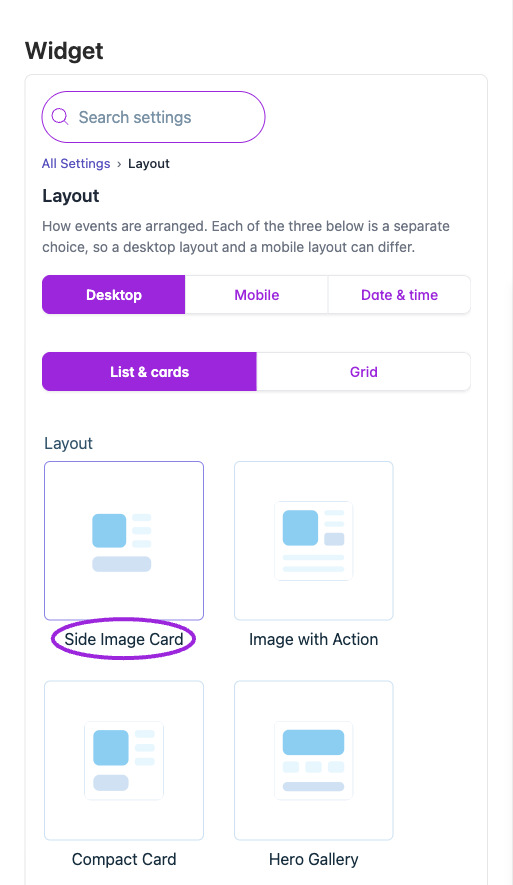
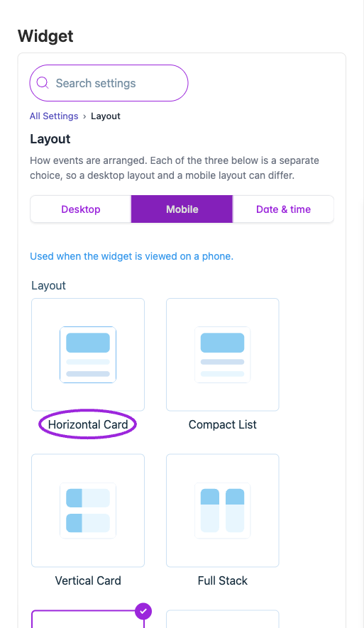
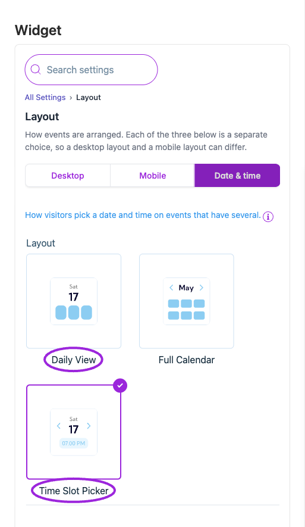

Open **Design → Widget → All Settings → Layout**. Choose **Desktop**, **Mobile**, or **Date & time** before choosing a layout. These are independent settings.

| Area | Available choices |
|---|---|
| Desktop — List & cards | Side Image Card, Image with Action, Compact Card, Hero Gallery, Simple List, Compact List, Vertical Stack, Side by Side, Map View, Calendar View, Monthly List, Calendar, Checkout Layout, Simple Checkout. |
| Desktop — Grid | Two Columns, Three Columns, Two Columns (Alt), Three Columns (Alt). |
| Mobile | Horizontal Card, Compact List, Vertical Card, Full Stack, Stack, Side by Side, Minimal, Checkout. |
| Date & time | Daily View, Full Calendar, Time Slot Picker. |

The calendar controls below appear for the **Calendar** desktop layout. The similarly named **Calendar View** and **Full Calendar** are different layout choices. Calendar display hours change the visible grid, not the event's actual opening hours or sales windows.

Preview a long title, multiple images, an empty result, a recurring event, and a sold-out date on desktop and mobile. See [layout setup](./layout) for the workflow.

<Accordion title="See the desktop, mobile and date selection controls">

<Frame caption="Desktop has List &amp; cards and Grid families. Choose a thumbnail independently from the Mobile and Date &amp; time layouts.">
  
</Frame>

<Frame caption="The Mobile tab selects the phone layout independently from the desktop listing. The thumbnails preview the available arrangements.">
  
</Frame>

<Frame caption="Date &amp; time offers Daily View, Full Calendar, and Time Slot Picker as an independent layout choice.">
  
</Frame>

</Accordion>

{/* BEGIN WIDGET OPTIONS */}

## Options

{/* widget-option: calendarEndTime */}
{/* widget-option: calendarFirstDay */}
{/* widget-option: calendarNextDayThreshold */}
{/* widget-option: calendarStartTime */}
{/* widget-option: calendarView */}
{/* widget-option: layoutDesign */}
{/* widget-option: mobileLayoutDesign */}
{/* widget-option: showCalendarTime */}
{/* widget-option: showCalendarToday */}
{/* widget-option: showCalendarWeekends */}
{/* widget-option: timeBasedEventLayout */}

| Option | Control | What it changes |
|---|---|---|
| **Display Today Button** | Setting | Show a Today button that returns the calendar to the current date. |
| **End time display (24 hours)** | Setting | Determines the end time slot that will be displayed for each day. |
| **Layout** | Setting | Choose the desktop event-listing layout from the Desktop choices above. |
| **Layout** | Setting | Choose the mobile event-listing layout independently of the desktop layout. |
| **Layout** | Setting | Choose Daily View, Full Calendar, or Time Slot Picker for date and time selection. |
| **Minimum overrun before an event moves to the next day** | Setting | When an event’s end time spans into another day, the minimum time it must be in order for it to render as if it were on that day. |
| **Show time** | Setting | Show event times in the Calendar layout. |
| **Show weekends** | Setting | Include Saturday and Sunday in the calendar display. |
| **Start time display (24 hours)** | Setting | Determines the first time slot that will be displayed for each day. |
| **Time format** | Setting | Choose the initial calendar view: Month, Week, Day, or List. |
| **Week starts on** | Setting | The day that each week begins. |

{/* END WIDGET OPTIONS */}

## Save and verify

Wait for the setting update to finish, check the preview, and open the installed widget to confirm the result. If a control is unavailable, review its prerequisite, site type, and plan. [Return to widget setup](./widget-customization-overview).
