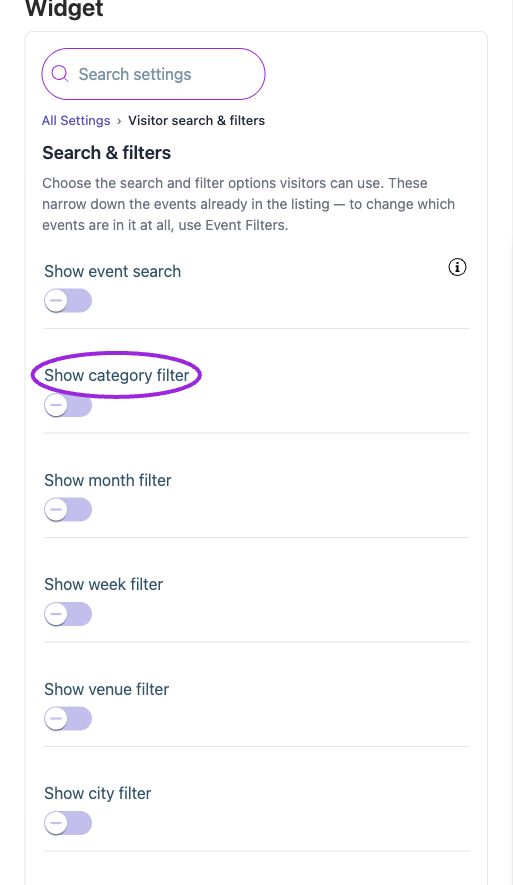
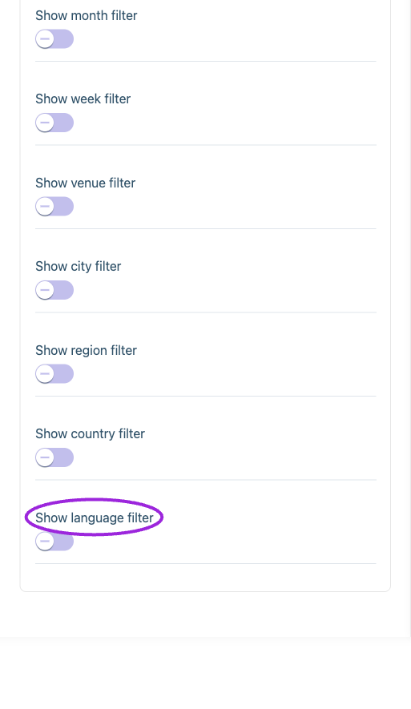

Open **Design → Widget → All Settings → Visitor search & filters**. Enable the controls visitors need. They narrow the events already allowed by [Event Filters](./widget-event-filters-reference); they do not make excluded or unpublished events available.

Edit their placeholders in **Text → Search filters**, and colors/fonts in **Design → Customize components → Visitor search & filters**. Test a matching value, no results, and clearing the selection on a phone.

<Accordion title="Find these controls in the editor">

<Frame caption="Visitor search and filters narrow the events already included in the widget. Turn on keyword search and the category, date, or location filters your visitors need.">
  
</Frame>

<Frame caption="Location and language filters use the event’s venue/city/region/country and language data. Their labels and styling are configured separately under Text and Design.">
  
</Frame>

</Accordion>

{/* BEGIN WIDGET OPTIONS */}

## Options

{/* widget-option: showCategorySearchFilter */}
{/* widget-option: showCountrySearchFilter */}
{/* widget-option: showLanguageSearchFilter */}
{/* widget-option: showMonthSearchFilter */}
{/* widget-option: showUserSearch */}
{/* widget-option: showVenueCitySearchFilter */}
{/* widget-option: showVenueRegionSearchFilter */}
{/* widget-option: showVenueSearchFilter */}
{/* widget-option: showWeekSearchFilter */}

| Option | Control | What it changes |
|---|---|---|
| **Show category filter** | Setting | Let visitors narrow the listing by event category. |
| **Show city filter** | Setting | Let visitors narrow the listing by venue city. |
| **Show country filter** | Setting | Let visitors narrow the listing by country. |
| **Show event search** | Setting | Adds a search box above the listing so visitors can search events by keyword. |
| **Show language filter** | Setting | Let visitors narrow the listing by event language; this does not translate the widget. |
| **Show month filter** | Setting | Let visitors narrow the listing to a selected month. |
| **Show region filter** | Setting | Let visitors narrow the listing by venue region. |
| **Show venue filter** | Setting | Let visitors narrow the listing by venue. |
| **Show week filter** | Setting | Let visitors narrow the listing to a selected week. |

{/* END WIDGET OPTIONS */}

## Save and verify

Wait for the setting update to finish, check the preview, and open the installed widget to confirm the result. If a control is unavailable, review its prerequisite, site type, and plan. [Return to widget setup](./widget-customization-overview).
