The **Additional Information** step allows you to collect extra details from attendees during registration. You can add custom RSVP (Response Status) questions to gather any information needed for planning or organizing your event.  

Use **Quick Add** to insert common questions instantly, or choose A**dd Custom Question** to create your own. This helps you control exactly what information you collect from attendees.

Let’s get started 🚀

## Adding Your First Question

You can start collecting attendee information by adding your first question to the form. You can either choose a pre-built question using **Quick Add** or create your own using **Add Custom Question**.

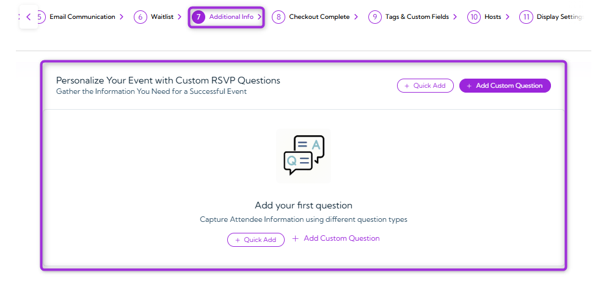

### Quick Add

Use **Quick Add** to insert commonly used RSVP questions instantly—no setup required. This is the fastest way to collect essential attendee details without creating each question manually.  

1. Click on the **Quick Add** button to instantly open a list of questions you can add to your event.

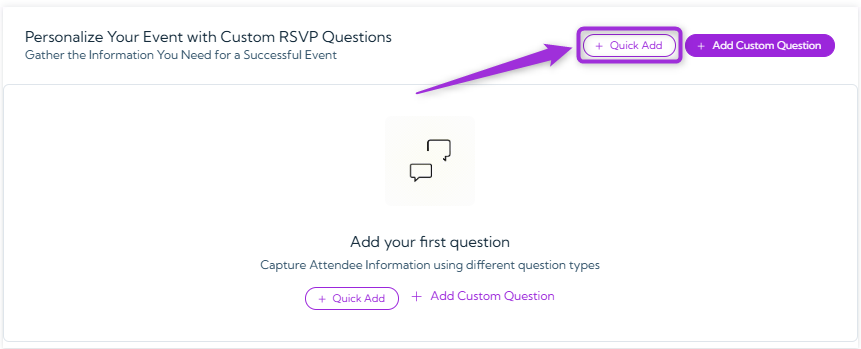

2. A pop-up will appear showing preset questions you can choose from. Select any question you want to add to your event (e.g., **Phone Number**, **Company Name**, **Meal Preference**, **Number of Guests**, etc.).

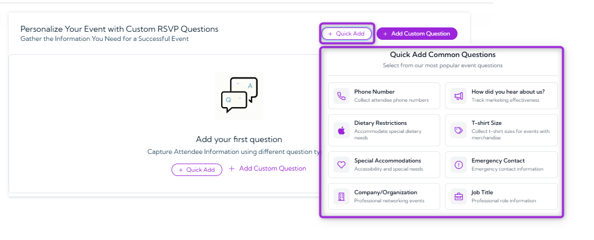

3. Click any question (e.g., Phone Number) to instantly add it to your list of RSVP questions. You can edit these questions anytime based on your event needs.

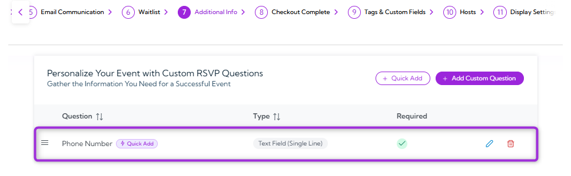

### Add Custom Question

Use **Add Custom Question** when you need full control over the question text, answer type, or how the response is stored. This option lets you create completely customized fields so you can collect any additional attendee information that isn’t covered by the quick-add options. 

1. Click on the **Add Custom Questions** button to create your own RSVP question.

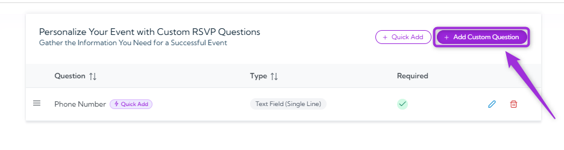

2. A modal window will appear, allowing you to add and customize the question.

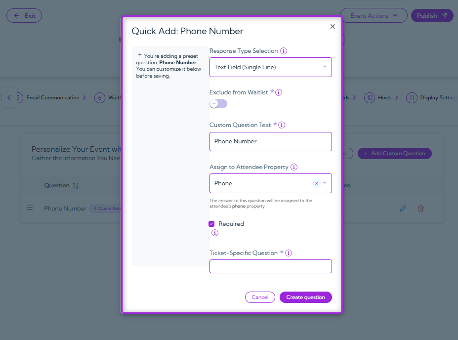

3. Fill out the fields to control how the question appears and how attendee responses are collected. The table below explains each option.

| Ref. | Field                     | Description                                                                | Example                                   |
|------|---------------------------|----------------------------------------------------------------------------|-------------------------------------------|
|   1.   | **Response Type Selection** | Choose the type of input you want attendees to provide.                   | Text Field, Dropdown, Checkbox, Multiple Choice |
| 2.     | **Exclude from Waitlist**  | Toggle ON if this question should not appear when someone joins the waitlist. | Disabled for standard RSVP questions      |
|   3.   | **Custom Question Text**   | The question label attendees will see.                                     | Phone Number, Your Shirt Size, etc.       |
|   4.   | **Assign to Attendee Property** | Map the answer to an existing attendee property for reporting.          | Phone, Job Title, Company                 |
|   5.   | **Required**               | Marks the question as mandatory for attendees.                             | ON for Phone Number                       |
|    6.  | **Ticket-Specific Question** | Apply the question only to selected ticket types.                        | Only for “VIP Pass”                       |

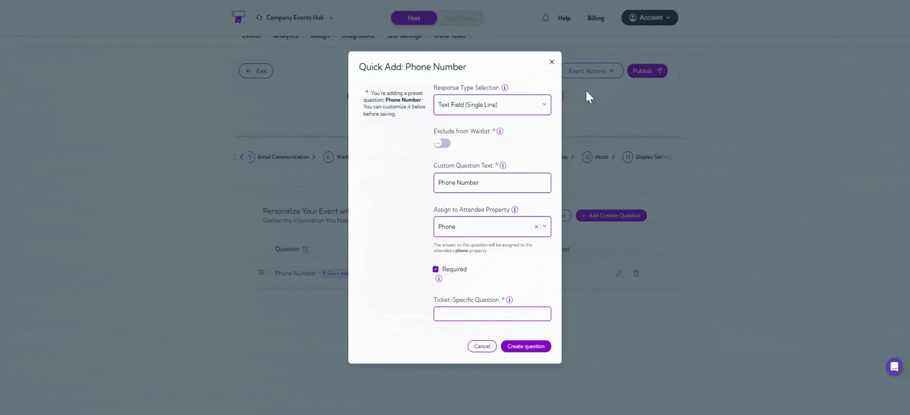

> **Note:** Some fields may change depending on the Response Type Selection. For example, choosing multiple choice, checkbox, or dropdown will display additional options for adding answer choices.

4. Click on the **Create Question** button to save and add it to your event.

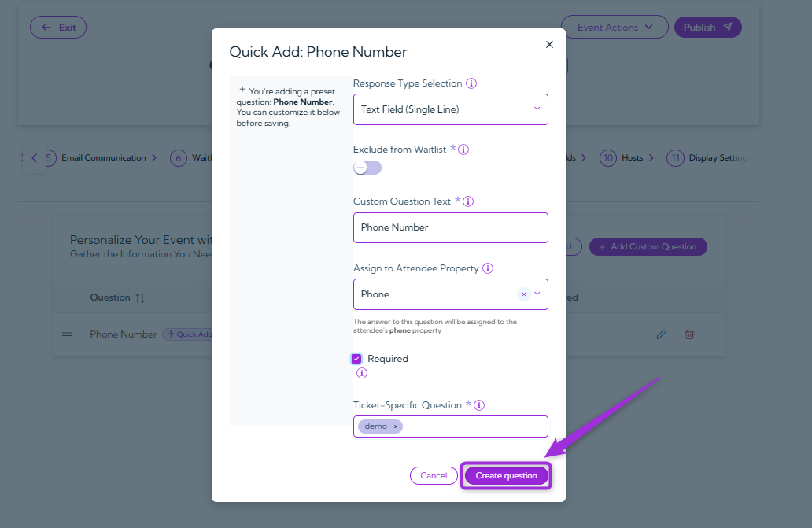

> **Tip:** You can add as many questions as you need to collect all the required information from your attendees.
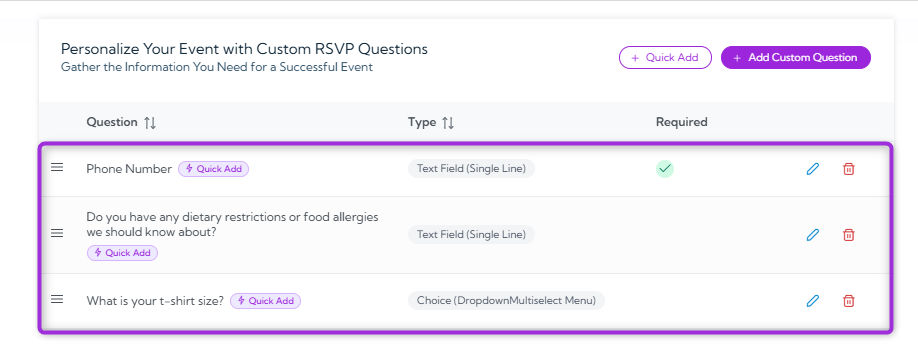

## Manage Questions

After adding your RSVP questions, you can manage them anytime. You can edit an existing question or delete one if it’s no longer needed.

### Edit Question

1. Click on the **Edit** icon next to the question you want to update.  

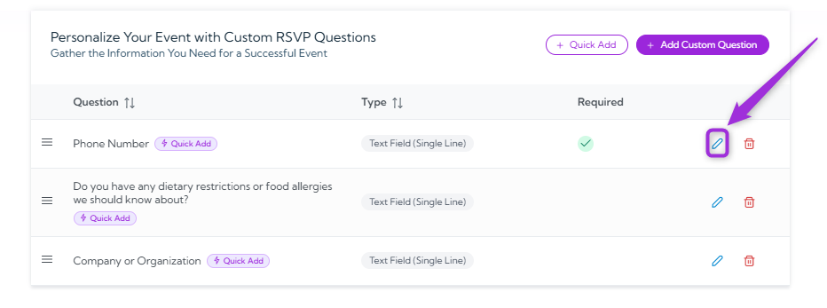

2. Update the question text, response type, or any other details in the form. 

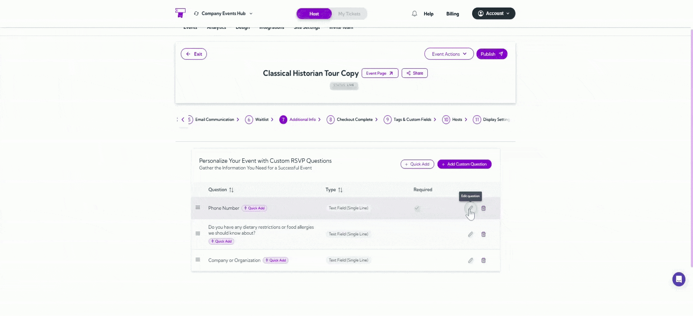

3. Click **Update Question** to save your changes.

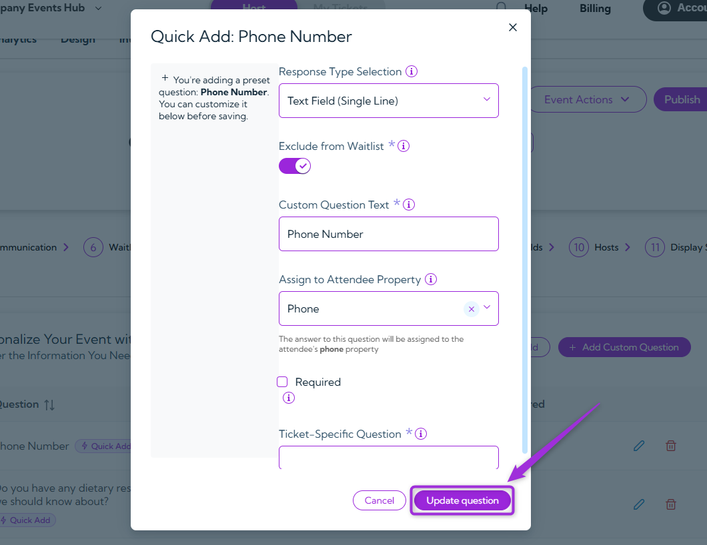

### Delete Question

1. Click the **Delete** icon next to the question you want to remove.

2. A confirmation pop-up will appear asking if you want to delete the question – Click **Yes** to confirm.

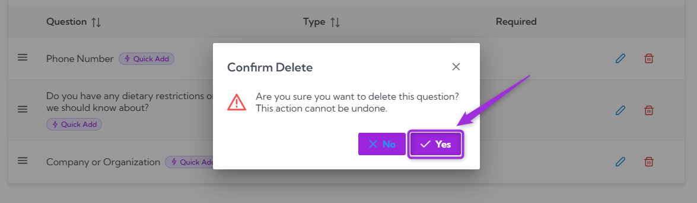

After you confirm, the host is removed right away and will no longer have access to the event. This action cannot be undone.
