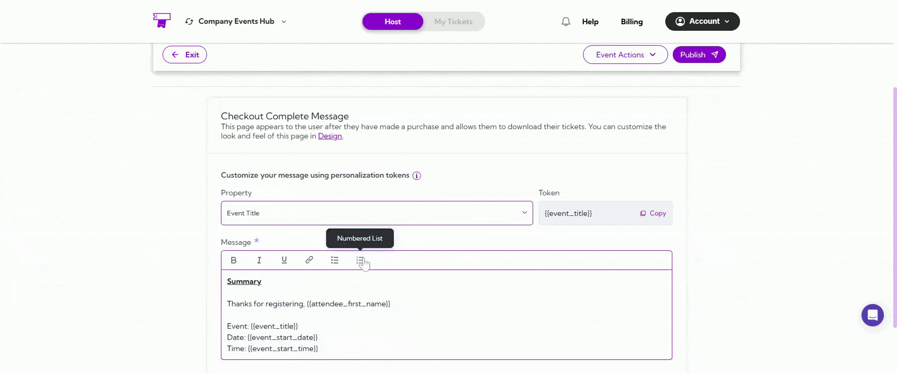
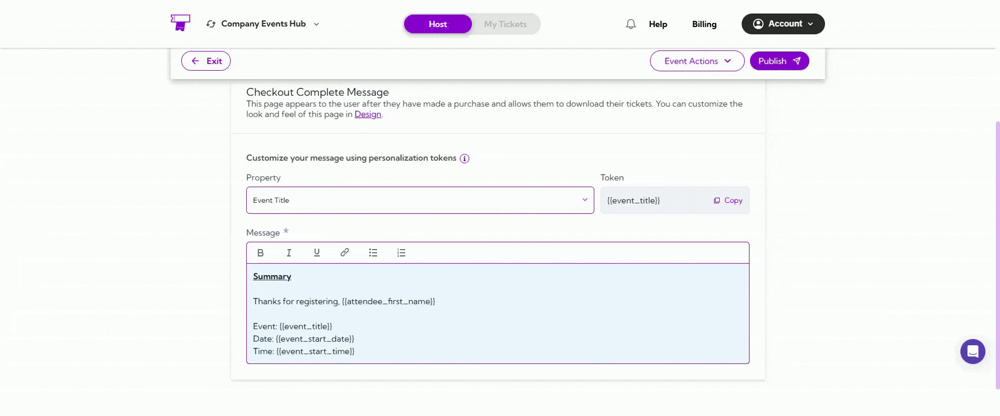
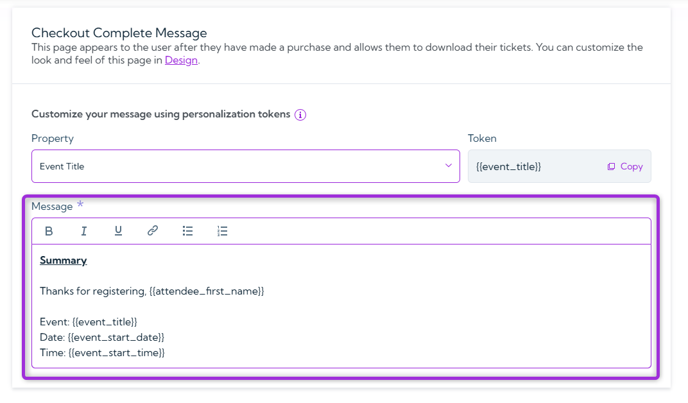
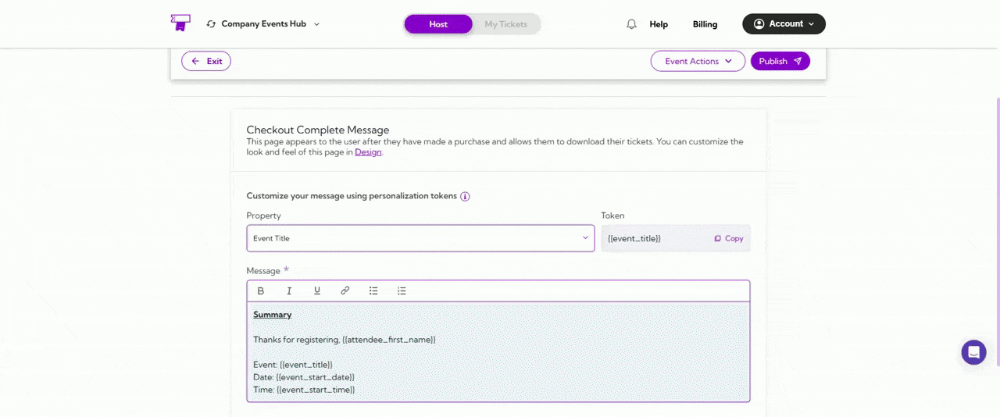

The Checkout Complete Message is the page shown to attendees immediately after they finish purchasing their tickets. It confirms their order and provides important details such as event information, instructions, and ticket download options.

You can customize this message and use personalization tokens to make it clearer, more helpful, and tailored to each attendee.

Let’s get started 🚀

# Customize Your Message

Personalization tokens help you include event-specific and attendee-specific information in your message without typing it manually.

## Choose a Property

Select a property from the dropdown (e.g., **Event Title**, **Attendee First Name**, **Event Date**, etc.). These properties represent pieces of information related to the event or the attendee.

When you choose a property, the system automatically creates a matching token (like `event_title`) that will be replaced with real data when the message is sent.

This ensures each attendee sees personalized and relevant information without you manually typing it every time.



## Token (Auto-Generated)

When you select a property, the system will automatically generate a token for it. These tokens pull live data into your message so each attendee receives personalized information.

Examples tokens: `event_title`, `attendee_first_name`, `event_start_date`


Click **Copy** to quickly insert the token into your message wherever you need it.



## Message Body

This is the main message attendees will see immediately after they complete their checkout.

You can fully customize the message using formatting options like bold, italic, or underline, as well as hyperlinks, lists, and personalization tokens to make the message more helpful and specific to each attendee.

Example message:
```
Summary

Thanks for registering, attendee_first_name!

Event: event_title
Date: event_start_date  
Time: event_start_time

```


## Design Customization
In the Design section, you can customize how the Checkout Complete page looks and feels. This includes adjusting colors, buttons, layout, and other visual elements to match your brand. You can pick from different templates, update button styles, and change layout elements so the page aligns with your event site’s overall design.

This helps create a smooth, consistent experience for attendees after they complete their purchase.



## Best Practices
- Use personalization tokens to make the message feel more professional and event-specific.
- Clearly mention what attendees should expect next—such as ticket download instructions.
- Keep the layout clean and simple so users can easily find key event information.
