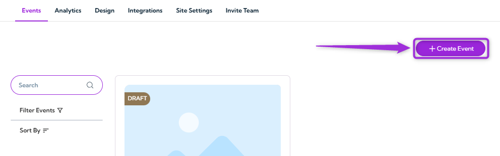
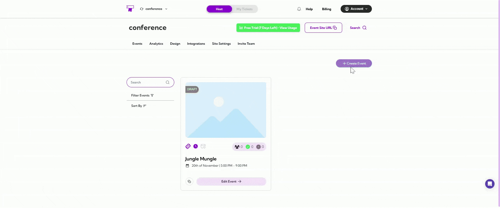
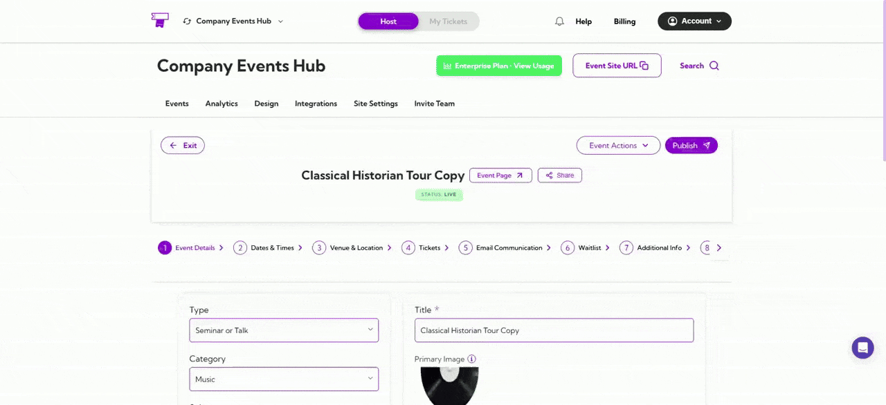

This guide walks you through the complete process of creating an event in **Ticket Spot**. You’ll set up core **event details**, **configure tickets**, **customize emails**, **manage waitlists**, **add custom fields**, **assign hosts**, and adjust **display settings**—everything required to build a seamless attendee experience.  

By completing these steps, you ensure your event is organized, easy for attendees to navigate, and ready to go live without any missing information.

Let’s get started 🚀

**Step 1**: Log in to your **Ticket Spot** account and click on the **Create Event** button.

**Step 2**: Enter your basic event details in the form shown below. The table explains what each field means and how it’s used.

| Ref. | Field Name          |   Description                                                                 | Reference |
|------|----------------------|-----------------------------------------------------------------------------|-----------|
|   1.   | **Event Details**    | Add event title, description, categories, visibility, and main branding info. | [See more](../essentials/eventdetails)  |
|   2.   | **Dates & Times**    | Set the event start/end date, timezone, recurring schedule (if needed), and check-in timing. | [See more](../essentials/datetime) |
|   3.   | **Venue & Location** | Choose the venue type (in-person, online, or hybrid) and add the address, maps, directions, or meeting links. | [See more](../essentials/venuelocation) |
|    4.  | **Tickets**          | Add free/paid tickets, set quantities, sale windows, fees, and ticket-level settings. | See more |
|  5.    | **Email Communication** | Edit confirmation emails, reminders, and cancellation notices, and add dynamic tokens. | See more |
|  6.    | **Waitlist**         | Enable waitlist, add rules, auto-approval options, and attendee notification settings. | [See more](../essentials/waitlist) |
|   7.   | **Additional Info**  | Use Quick Add or Custom Questions to collect additional attendee information. | [See more](../essentials/additional-information) |
|   8.   | **Checkout Complete** | Edit the success message shown after purchase and apply personalization tokens. | [See more](../essentials/checkout-complete-message) |
|    9.  | **Tags & Custom Fields** | Add tags for search visibility and create custom fields for internal data tracking. | [See more](../essentials/tags-and-custom-fields) |
|   10.   | **Hosts** | Add hosts, special guests, or event-level managers to a specific event. | [See more](../essentials/hosts) |
|   11.   | **Display Settings** | Toggle host visibility, attendee list display, and override widget or page text. | [See more](../essentials/display-settings) |

## Publishing Your Event

After completing all event setup steps, review your event details and click **Publish Event**. Publishing makes your event visible to attendees across your site, widgets, and any shared links.

You can also preview exactly how the event will look on your site—just click **Event Page** or copy the event site link to see the live view before sharing it with attendees.

Once published, you can always return to the event to **update settings**, **edit tickets**, or **unpublish** the event if needed.
