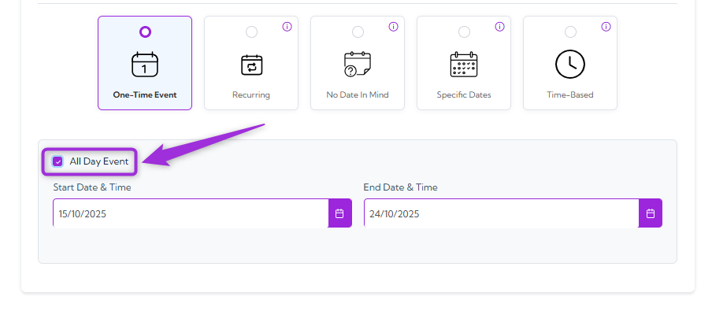
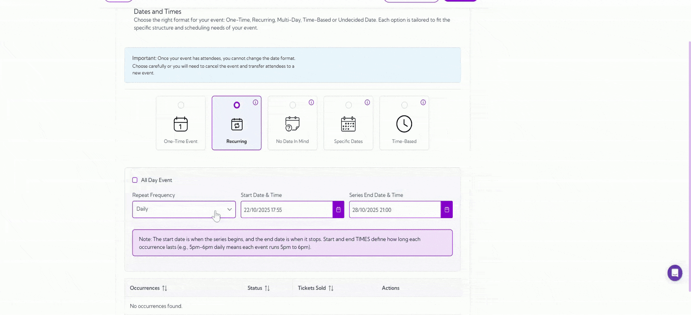
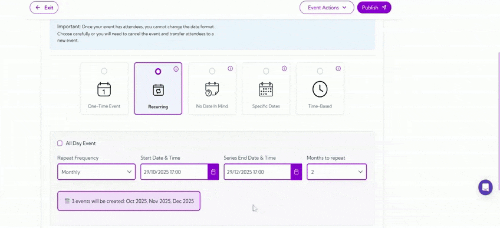
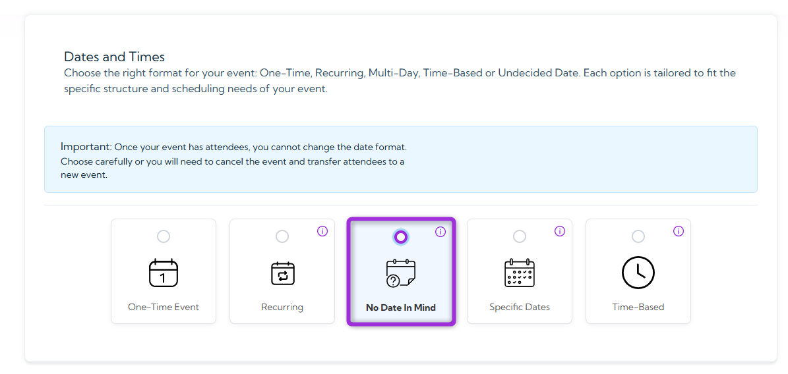
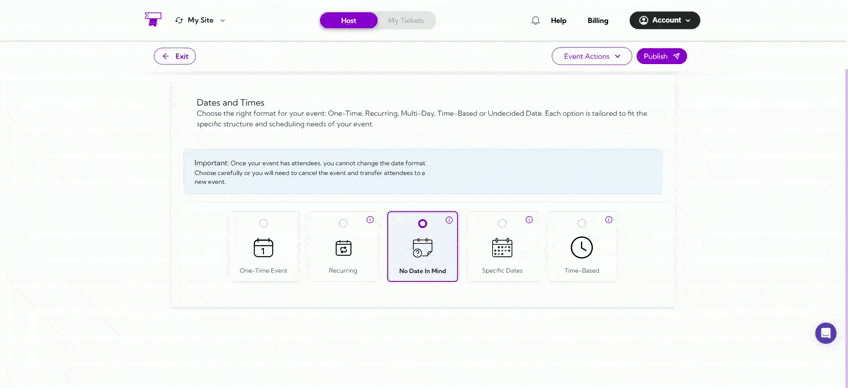
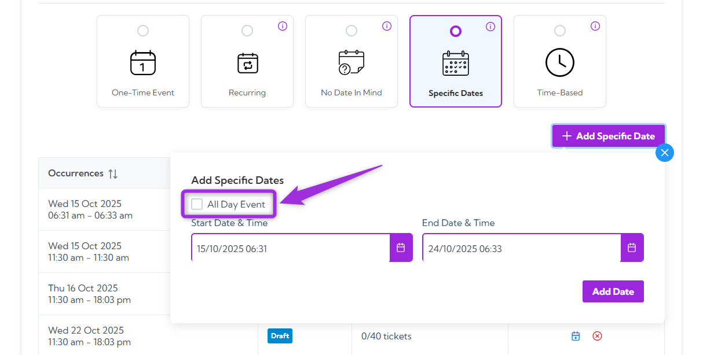
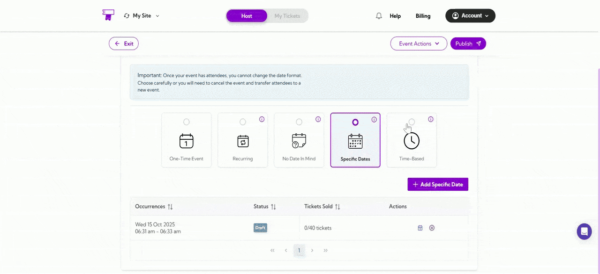

Once you are done with defining the Event Details, the next step is to configure the **Date & Times** section, which helps you define when your event takes place. You can set up single-day, recurring, or time-based schedules depending on your event format. Adding the correct date and time ensures your event appears correctly for attendees.

- [One-Time Event](#one-time-event)
- [Recurring](#recurring)
- [No Date in Mind](#no-date-in-mind)
- [Specific Dates](#specific-dates)
- [Time Based](#time-based)

Let’s get started 🚀

> **Warning:** Once your event has attendees, you can’t change its existing date and time format. Choose carefully—if you need to update it later, you’ll have to cancel the existing event and create a new one, then add attendees to the new event.

## One-Time Event

Select this option if your event is scheduled to happen only once on a specific date and time. It’s ideal for events like concerts, product launches, or seminars that don’t repeat.

**Instruction:**  
Select the **Start Date**, **Start Time**, **End Date**, and **End Time** for your event. This determines when your event will begin and end, ensuring the correct schedule is displayed to attendees.

> **Tip:** Check the **All Day Event** box if your event runs for the entire day or doesn’t have a specific start and end time. This helps display your event properly on the schedule without fixed hours.

## Recurring

Recurring Events let you schedule events that repeat automatically on a regular pattern — daily, weekly, monthly, or yearly — without creating each one manually. This is ideal for ongoing activities like classes, workshops, or meetings.

When you select **Recurring**, you’ll be able to:

### 1. Set Start Date & Time and End Date & Time
Choose the date and time of when your event begins and ends. The system will generate all recurring occurrences between these dates and time pairs.

### 2. Choose a Repeat Frequency

From the dropdown, select how often your event repeats between the selected Start Date & Time and End Date & Time:

- **Daily:**  
The event will occur every day within your selected dates and time range.

- **Weekly:**  
The event will repeat every week on your chosen days (e.g., Monday, Wednesday, Friday).

> **For example**, if you have selected the start date as 22/10/2025 and the end date as 24/10/2025, you will only be able to select the days of the week that fall within the specified start and end dates, i.e., Wednesday, Thursday, and Friday.

- **Monthly:**  
The event will repeat on the same dates and time each month (e.g., 15th of every month).

  ✅ **Using dropdown:**  
Use the dropdown to select how many months (1–12) you want the event to repeat from its start date. This helps when you need a set duration, like a 6-month course or a 12-month membership.

  ✅**Using the end date:**  
If you want your event to repeat for more than 12 months (for example, 13 months or longer), set a custom end date from the calendar. This lets you extend the recurrence beyond the dropdown limit while keeping your event schedule accurate.

- **Yearly:**  
The event will occur once every year on the same dates and time.

   ✅**Using dropdown:**  
Use the dropdown to select how many years (1–10) you want the event to repeat from its start date. This is useful when scheduling long-term events — for example, a 3-year contract renewal or a 5-year maintenance plan.

   ✅**Using End Date:**  
If you want your event to repeat for more than 10 years (the default dropdown limit), you can manually set a custom end date from the calendar. This allows you to extend the recurrence beyond the dropdown limit while keeping your event timeline accurate.

## No Date in Mind

Select this when your event date is not yet confirmed, but you still want to start setting up other details like venue and tickets.

**Example:** Ideal for tentative events awaiting final date confirmation.

## Specific Dates

Use this option for events that take place over multiple days — such as a festival, conference, or tournament. It lets you set a **Start Date & Time** and an **End Date & Time** for each event day instead of applying one fixed schedule to all days.

Click **➕ Add Specific Date** to open the date selector. Choose the **Start Date & Time** (when your event begins) and the **End Date & Time** (when it ends for that day), then click **Add Date** to save it.

If your event continues on other days, click **➕ Add Specific Date** again to add more dates. Each entry appears under **Occurrences**, where you can review, reschedule, or cancel it anytime before publishing.

**Example:**  
Suppose you’re hosting a 3-day cultural festival. You can set:  
- **Day 1:** 16 Oct 2025, 10:00 AM – 6:00 PM  
- **Day 2:** 24 Oct 2025, 9:00 AM – 8:00 PM  
- **Day 3:** 30 Oct 2025, 11:00 AM – 7:00 PM  

Each date can be different and can have its own start and end time, giving you full control over your event schedule.

> **Tip:** Check the **All Day Event** box if your event runs for the entire day or doesn’t have a specific start and end time. This helps display your event properly on the schedule without fixed hours.

## Time Based

Use this option to organize **time slot-based events** that run over a specific period — for example, from 16 Oct to 16 Dec — with multiple sessions each day. Instead of creating separate events for each day, you can set them up once using **Time-Based** to automatically repeat your chosen time slots throughout the duration.

Click **➕ Add Times** to start. Select your **Start Date (16 Oct)** and **End Date (16 Dec)**. Then, choose your **Start Time** and **End Time** for each session — for example:
- 2:00 PM – 3:00 PM  
- 4:00 PM – 5:00 PM  
- 7:00 PM – 8:00 PM

If you want to add more sessions, click **➕ Add Time Slot** and repeat the process. Once done, click **Create** to save your schedule.

**Example:**  
Suppose you’re hosting an **MMA training session** from **16 Oct to 16 Dec**. You can set three time slots each day — **2:00 PM** to **3:00 PM**, **4:00 PM** to **5:00 PM**, and **7:00 PM** to **8:00 PM**.  

The system will automatically repeat these time slots for every day within the selected duration, so you don’t have to create each day’s schedule manually.

