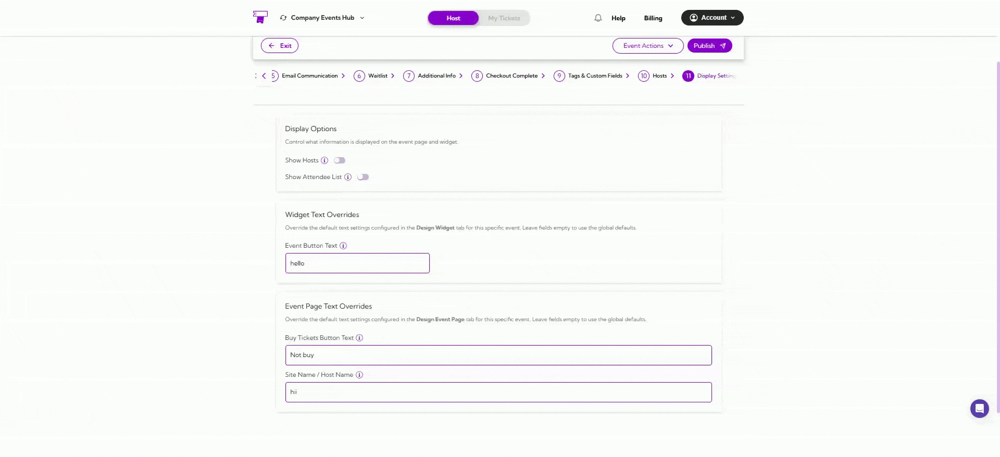
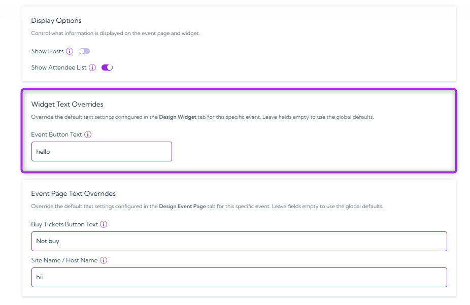
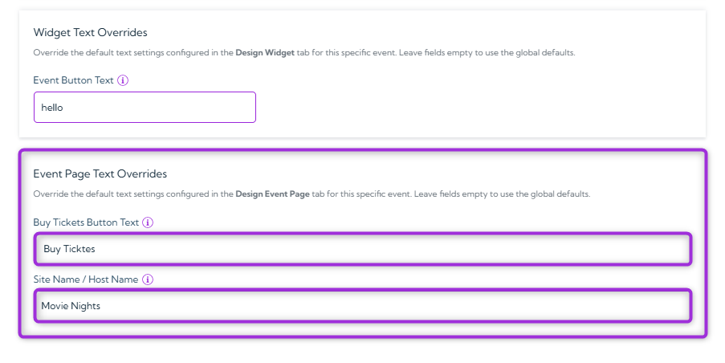
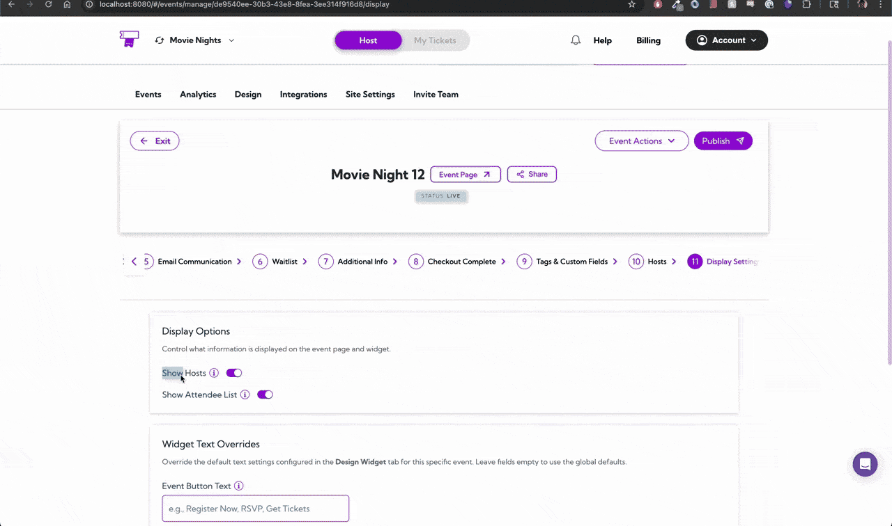

The **Display Settings** section controls what information is shown on your event page and widget, such as hosts and attendee lists. It also lets you override the default text used for buttons and labels on a per-event basis.  
From here, you can decide whether to show hosts or the attendee list, customize the event button text in your widget, and change key labels on the event page—without affecting the global design settings for other events.

Let’s get started 🚀

## Display Options

The **Display Options** control what information appears on the event page and widget. Use these toggles to show or hide key event details based on what you want attendees to see.

- **Show Hosts:** Turns on the list of event hosts so attendees can see who is managing or presenting the event.

- **Show Attendee List:** Shows everyone who has registered for the event on both the event page and widget.

These options help you control exactly what attendees can view, keeping your event page clean, relevant, and aligned with your preferences.

## Widget Text Overrides

**Widget Text Overrides** helps you replace the default button text in the calendar widget for this specific event. This is useful when you want custom wording that applies only to this event, without changing the global settings.

> **Tip:** If you leave a field blank, the widget will automatically use the **global default** text from the **Design Widget** tab.

## Event Page Text Overrides

**Event Page Text Overrides** allow customization of the text shown on the event page for this specific event. These changes apply only to this event and do not affect the global text set in the Design Event Page tab.

- **Buy Tickets Button Text:** Enter custom text to change the label on the Buy Tickets button. This is useful if the event requires different wording, such as “Register Now,” “Reserve Seat,” or “Join Event.”

- **Site Name / Host Name:** Update the site or host name shown on the event page and kiosk check-in. This is helpful when the event needs a different display name than the main site or when a specific host should appear for this event only.

> **Tip:** If you leave a field blank, the widget will automatically use the **global default** text from the **Event Page** tab.

## Event Page Preview

Before you **publish** your event, this preview shows exactly what attendees will see. As you update your display settings, text, and host visibility, the preview refreshes automatically. 

This helps you check that everything looks correct before the event goes live.