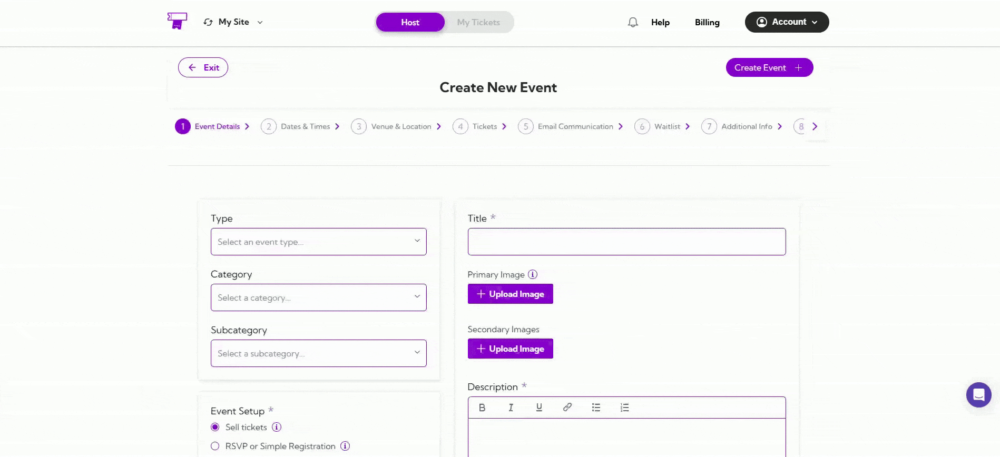
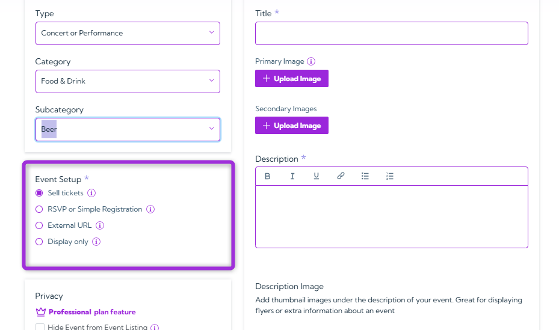
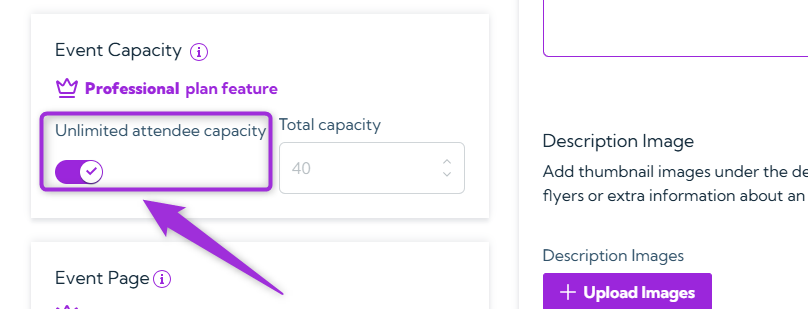
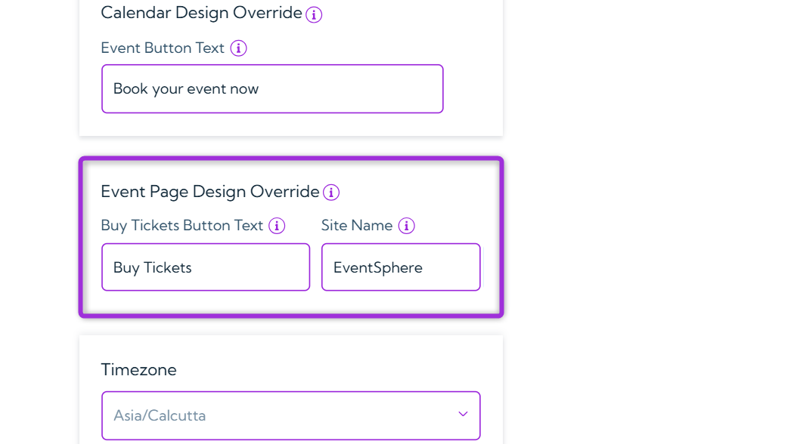

Creating your event starts with configuring event details. Ticket Spot lets you add all the essential information that define your event and how it appears to attendees.  
This section forms the business backbone of your event — determining how it’s categorized, discovered, and sold on the platform.

By setting up details like type, category, registration method, capacity, and visuals, you control your event’s visibility, audience targeting, and revenue potential, ensuring it’s optimized for both engagement and sales performance.

Let's get started 🚀

## Type

Select the event type that best describes your event. It helps attendees easily understand what kind of event you’re hosting.

**Example:**

- For a music show, select **Concert** or **Performance**.  
- For a learning session, choose **Class**, **Training**, or **Workshop**.

## Category

Based on the event type you select, Ticket Spot will show you the list of associated categories in a dropdown.  
Choose the category that best matches your event — this improves visibility and ensures it appears in relevant searches.

**Example:**

- Food festival → **Food & Drink**  
- Art exhibition → **Performing & Visual Arts**

## Subcategory

Depending on your category selection, Ticket Spot will show you related subcategories. Choose the one that best fits your event.

**Example:**  
If your category is **Food & Drink**, you can select **Beer**, **Wine**, or **Food** depending on your event type.

## Event Setup

Select how attendees should register or view your event. Each option defines how they interact with your listing.

### **Sell Tickets**
Offer free or paid tickets directly through Ticket Spot using a simple checkout process.

### **RSVP or Simple Registration**
Allow guests to RSVP through a form and collect basic attendee details.

### **External URL**
Redirect attendees to an external website or hosted event page.

**Options:**
- **Redirect users** to a dedicated event page when they click *Register*.
- **Link to hosted event page**:  
  - When **ON**, the event is hosted on the default page (e.g., `https://ticketspotapp.com/e/ccg99`).  
  - When **OFF**, you can enter your own domain (e.g., `https://mybrand.com/event/ccg99`).

  

### **Display Only**
Show event info without registration or checkout options.

**Examples:**

- Paid concert → **Sell Tickets**  
- Free meetup → **RSVP or Simple Registration**

## Privacy

Control the visibility of your event.  
Tick **Hide Event from Event Listing** if you want to keep the event private or hidden from the public.

## Event Capacity

Set the total number of tickets for your event. This defines the maximum capacity — once sold out, new registrations stop automatically.

**Example:**  
For a mall event with space for 40 people, set **Event Capacity** to 40.  
If the event is open to all, toggle **Unlimited Capacity** ON to allow unrestricted registrations.

> 💡 **Tip:** Use Unlimited Capacity for public festivals or open community events.

## Event Page

Customize how your event page looks to attendees. You can create a short, shareable link and adjust design elements like button text or site name to match your brand.

### **Custom Handle**
Set a unique URL handle for your event page to make it easy to share and remember.
Your event link will appear as: https://ticketspotapp.com/e/[`https://ticketspotapp.com/e/[your-handle]`]
**Example:** Entering `ccg99` creates  
`https://ticketspotapp.com/e/ccg99`

> Handle must be **at least 5 characters**.

### **Calendar Design Override**

Override how your event appears in **Calendar View** by editing the button text.

**Example:**  
Change “Book your event now” → “Reserve Your Spot” or “Join This Session”.

> Leave empty to use the default text from the Design Widget tab.

### **Event Page Design Override**

Adjust individual event page visuals.

- **Buy Tickets Button Text** → e.g. “Get Your Pass” or “Book Entry”  
- **Site Name** → e.g. “EventSphere” or “MyBrand Live”

> Leave empty to use default global settings.

## Timezone

Select the timezone where your event will occur.  
This ensures accurate display for all attendees.

**Example:**  
Event in Los Angeles → Select **Pacific Time (US/Canada)**

> 💡 Always select the **event’s local timezone**, not your own.

## Title

Enter a clear, descriptive event name.  
This helps attendees understand what it’s about.

**Examples:**  
- *Summer Food Festival 2025*  
- *Digital Marketing Workshop for Beginners*

## Primary Image

Upload your main event image.  
Displayed on listings and the event page — attracts attendees visually.

> Recommended aspect ratio: **3:2**

**Example:**  
Use an event banner, logo, or relevant promotional image.

## Secondary Image

Add extra visuals to highlight your event’s features — venue, guests, or past highlights.

**Example:**  
Upload venue photos or speaker posters to make your listing more engaging.

## Description

Write a clear, compelling event summary.  
Include purpose, activities, date, and what attendees can expect.

**Example:**  
Join us for the **Annual Food Fest 2025** — featuring local breweries, live music, and gourmet food stalls!

## Description Images

Add thumbnail visuals that appear below your description.  
Use these to reinforce key event details (flyers, sponsor logos, etc.).

**Example:**  
Include a flyer showing the event schedule or sponsor banner to add context.

Once you’ve configured all your event details, proceed to the next guide:  
👉 **[Date & Time](../events/date-and-time)** to complete your setup.
