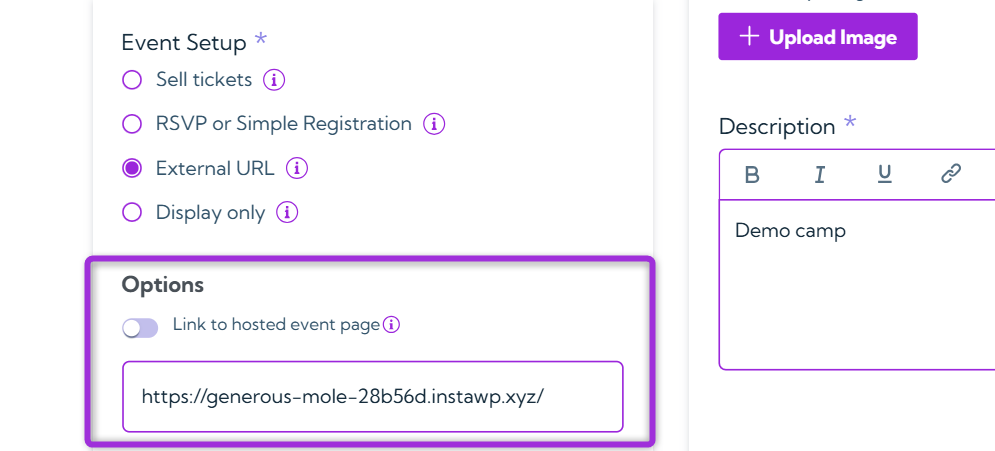
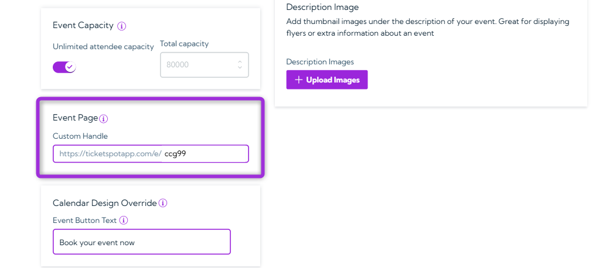
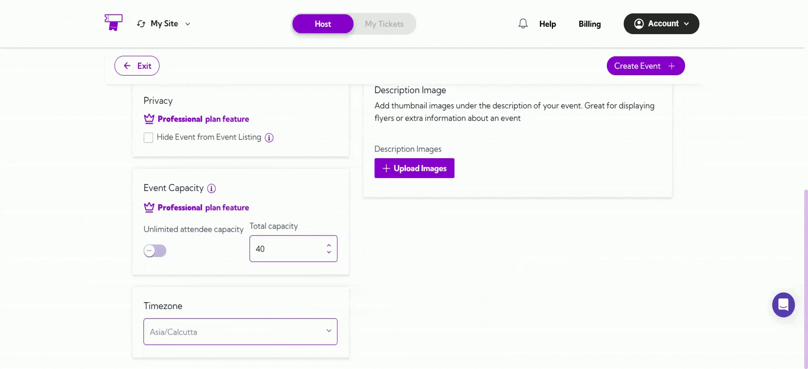
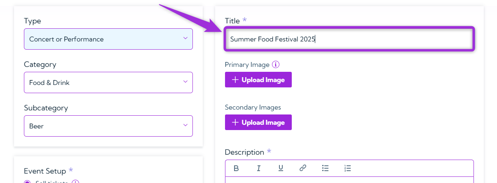
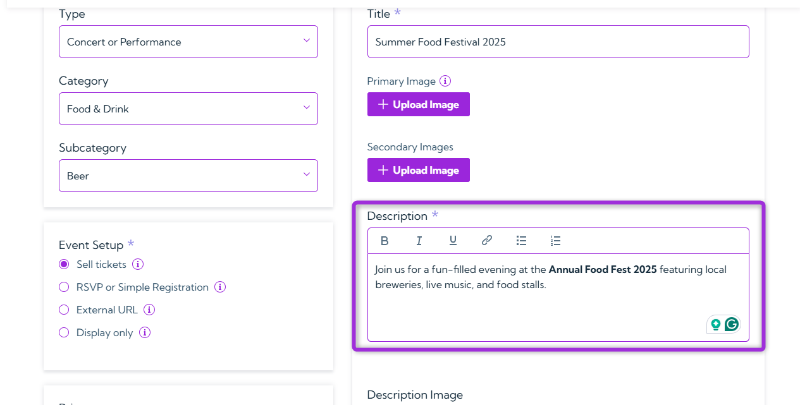

Creating your event starts with configuring event details. **Ticket Spot** lets you add all the essential information that define your event and how it appears to attendees.  
This section forms the business backbone of your event — determining how it’s categorized, discovered, and sold on the platform.

By setting up details like type, category, registration method, capacity, and visuals, you control your event’s visibility, audience targeting, and revenue potential, ensuring it’s optimized for both engagement and sales performance.

Let's get started 🚀

## Type

Select the event type that best describes your event. It helps attendees easily understand what kind of event you’re hosting.

**Example:**

- For a music show, select **Concert** or **Performance**.  
- For a learning session, choose **Class**, **Training**, or **Workshop**.

## Category

Based on the event type you select, Ticket Spot will show you the list of associated categories in a dropdown. Choose the category that best matches your event — this improves visibility and ensures it appears in relevant searches.

**Example:**

- Food festival → **Food & Drink**  
- Art exhibition → **Performing & Visual Arts**

## Subcategory

Based on the **category** you select, Ticket Spot will show you a list of **associated subcategories** in the dropdown list. Choose the subcategory that best describes your event. This helps further define your event and makes it easier for people to find in searches.

**Example:**  
If your category is **Food & Drink**, you can select **Beer**, **Wine**, or **Food** depending on your event type.

## Event Setup

Select from the options listed below on how you want people to register or view your event. Each option defines how attendees can interact with your event listing.

### **Sell Tickets**
Offer free or paid tickets directly through Ticket Spot using a simple checkout process.

### **RSVP or Simple Registration**
Allow guests to RSVP through a form and collect basic attendee details.

### **External URL**
Redirect attendees to an external website or hosted event page.

**Options:**
- **Redirect users** to a dedicated event page when they click *Register*.
- **Link to hosted event page**:  
  - When **ON**, the event is hosted on the default page (e.g., `https://ticketspotapp.com/e/ccg99`).  
  - When **OFF**, you can enter your own domain (e.g., `https://mybrand.com/event/ccg99`).

  

### **Display Only**
Show event info without registration or checkout options.

**Examples:**

- If you’re hosting a paid concert, select **Sell Tickets**. 
- For a free community meetup, choose **RSVP** or **Simple Registration**.

## Privacy
Use this option to control the visibility of your event. When enabled, it will not appear in public listings, keeping it hidden from general attendees. 

**Instruction:**

Tick the checkbox “Hide Event from Event Listing” if you want to keep the event private or temporarily hide it from the public.

## Event Capacity

Set the **total number of tickets** you want to sell for your event. This defines the **maximum event capacity** — once all tickets are sold, registrations will automatically close, preventing any extra bookings. This helps you manage crowd limits and ensures the event doesn’t exceed the planned capacity.

**Example:** If you’re hosting an event in a **mall** and have space for **40 people**, set the event capacity to **40 tickets**. Once those 40 tickets are booked, no more registrations will be allowed.
If your event is **open to everyone**, like a **public concert** or **festival**, simply toggle on **Unlimited Capacity**. This allows **unlimited tickets**, so anyone can join freely without any restrictions.

> **Tip:** Enable **Unlimited attendee capacity** if there’s no limit on the number of attendees.

## Event Page

Customize how your event page looks to attendees. You can create a short, shareable link and adjust design elements like button text or site name to match your brand.

**Custom Handle**

Set a unique URL handle for your event page to make it easy to share and remember.

Your event link will appear as:[`https://ticketspotapp.com/e/[your-handle]`

**Example:** Entering `ccg99` creates  
`https://ticketspotapp.com/e/ccg99`

> **Note:** The handle must be at least **5 characters** long.

## Calendar Design Override

Customize how your event appears in the Calendar View by updating the Event Button Text. This lets you create a more personalized call-to-action for individual events.

Leave this field empty to use the default button text from the Design Widget tab.

**Example:**
Change Book your event now to **Reserve Your Spot** or **Join This Session** for a better fit with your event’s tone.

## Event Page Design Override

Customize your event page appearance by updating the Buy Tickets Button Text or Site Name.
You can override default settings for individual events to better match campaign-specific designs or messaging.

- **Buy Tickets Button Text** - Change the text shown on the ticket purchase button. 

**Example**: Replace **Buy Tickets** with **Get Your Pass** or **Book Entry**.

- **Site Name** – Display your brand or website name on the event page for consistency.

**Example**: Enter EventSphere or MyBrand Live.

> **Info:** Leave these fields empty to use the default settings from the Design Widget tab and your site name.

## Timezone

Select the timezone where your event will take place. This ensures the event time displays correctly for all attendees.

**Example:**  
If your event is happening in **Los Angeles**, select **Pacific Time (US/Canada)** so the timing reflects the local schedule of that city.

> **Tip:** Always select the timezone of the event location, not your own — this ensures that all attendees see the correct event time.

## Title

Enter a clear and descriptive name for your event. The title helps attendees quickly understand what your event is about. 

**Examples:**  
- **Summer Food Festival 2025**  
- **Digital Marketing Workshop for Beginners**

## Primary Image

Upload the main image for your event. This image appears on your event listing and helps attract attendees by giving a visual preview.

>**Note:** It is recommended that the image follow a **3:2** width-to-length ratio for best display quality.

**Example:**  
Use your event’s banner, logo, or a relevant promotional image

## Secondary Image

Upload additional images to showcase more details about your event. These images can include venue photos, guest speakers, schedules, or highlights from past events.

**Example:**  
Add images of the event location or promotional posters to make your listing more appealing.

## Description

Write a clear and engaging summary of your event. Include important details such as purpose, activities, date, and what attendees can expect.

**Example:**  
Join us for a fun-filled evening at the **Annual Food Fest 2025** featuring local breweries, live music, and food stalls.

## Description Images

Add **Thumbnail Images** that appear directly below your event description. These images should visually support your event details — for example, flyers, sponsor logos, or additional visuals that highlight specific information mentioned in the description.

**Example:**  
Include a flyer showing the event schedule or a sponsor banner to give attendees more context and make your listing more engaging.

Once you’ve configured all your event details, proceed to the next guide:  
👉 **[Date & Time](../events/date-and-time)** to complete your setup.
