The **Event Hosts** section helps you add hosts, special guests, or event-level managers to a specific event. These individuals can help manage the event, support check-ins, or appear publicly on the event page (if enabled in Display Settings).

Adding hosts at the event level ensures you control exactly who can access and manage each event—without giving them permissions for your entire site. You can assign the access level that best matches each person’s role.

Let’s get started 🚀

**Step 1**: Click the **Add Host** button to add a host, guest, or event-level manager to this event.

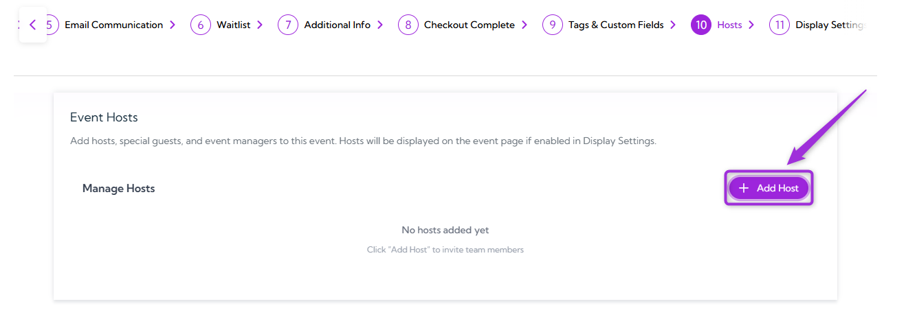

A modal window will appear where you can enter the host’s details, including their name, email, and the role you want to assign.

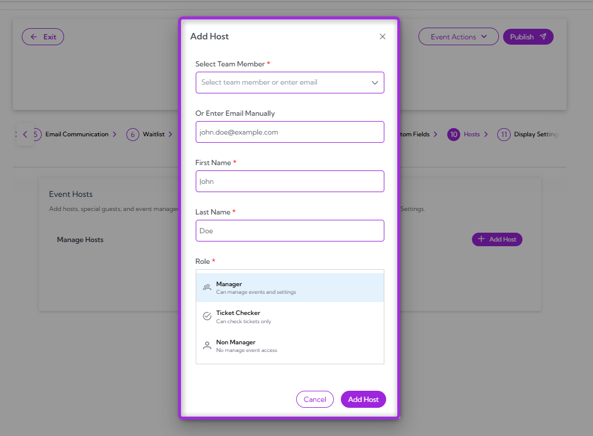

**Step 2**: You’ll see required fields that need to be filled out before adding the host. The table below explains what each field means and how it’s used.

| **Ref.** | **Field**              | **Description**                                                | **Example**                  |
|---------|-------------------------|----------------------------------------------------------------|------------------------------|
| 1.       | **Select Team Member**      | Choose an existing team member from your site.                 | `alex@example.com`             |
| 2.       | **Email (Manual Entry)**    | Enter an email if the person is not already a team member.     | `john.doe@example.com`         |
| 3.       | **First Name**              | The host’s first name as it will appear on the event.          | John                         |
| 4.       | **Last Name**               | The host’s last name as it will appear on the event.           | Doe                          |
| 5.      | **Role**                    | Assign the host’s access level for this specific event.        | Manager, Ticket Checker, Non-Manager |

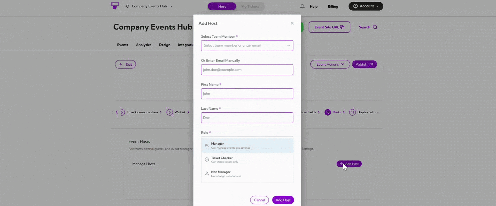

**Step 3**: Click **Add Host** to save the host details and assign them to the event.

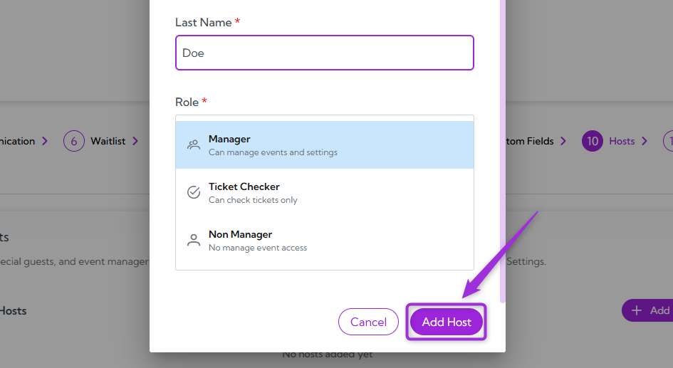

The host will now appear in the Manage Hosts list for this event.

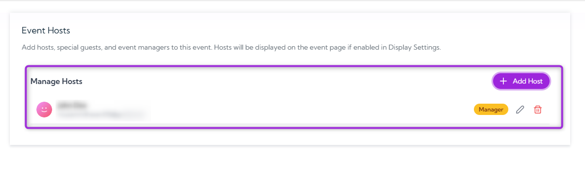

> **Note:** You can add as many hosts as needed for the event and assign each one a specific role.
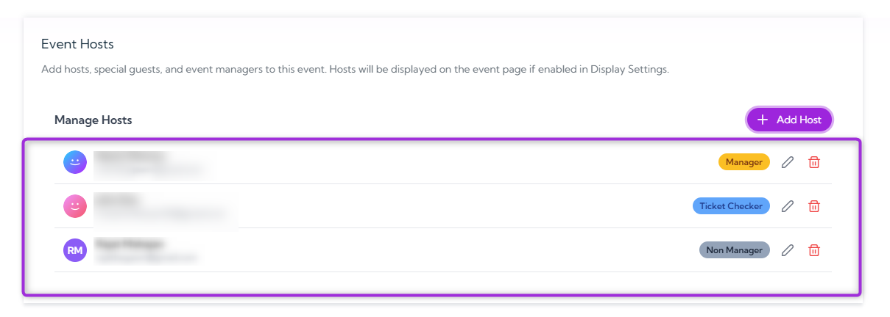

## Manage Hosts

Manage Hosts is where you can update or remove hosts already added to the event. You can edit a host to change their name or role, or remove them entirely if they no longer need access.

### Edit Host

1. Click the **Edit** icon next to the host you want to update.

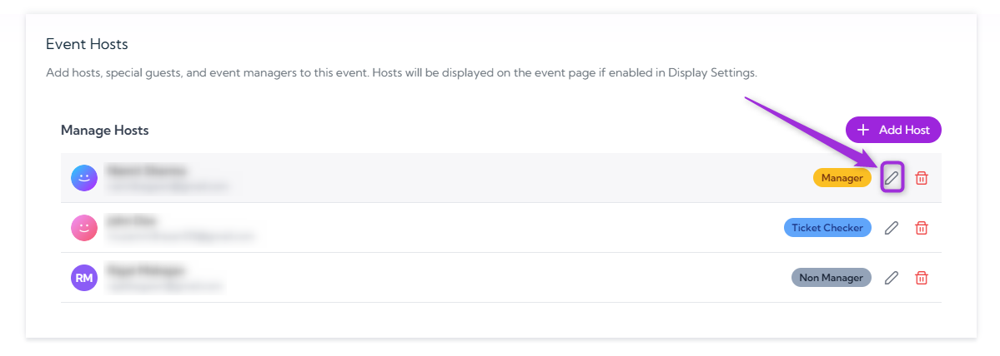

2. Update the **First Name**, **Last Name**, or **Role**, then click **Save Changes** to apply the update.

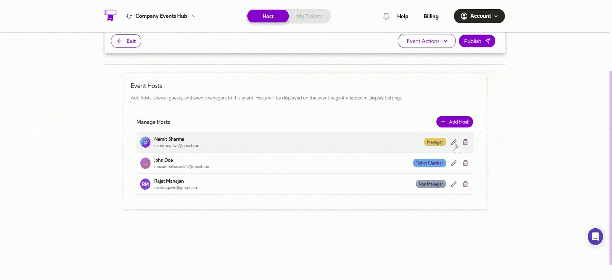

> **Note:** The host’s email address cannot be edited after the host is created. You can only update their first name, last name, and role.
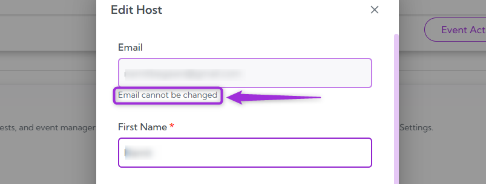

### Delete Host

1. Click the **Delete** icon next to the host you want to remove.

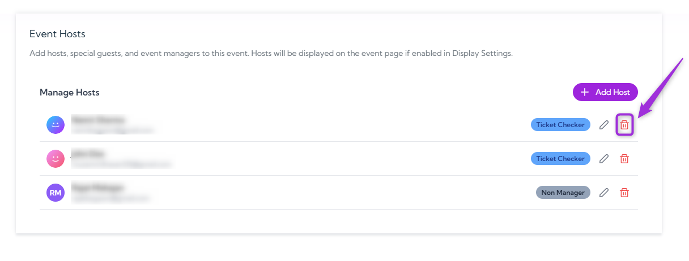

2. A confirmation pop-up will appear asking if you want to remove the selected host from the event—click **Remove** to confirm.

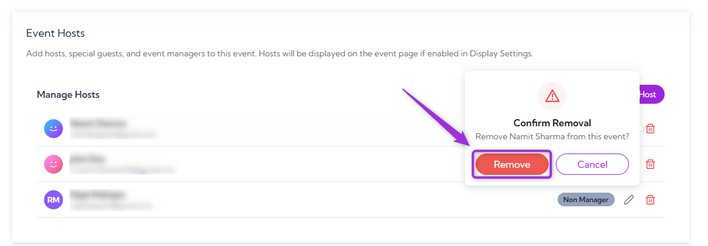

Once you confirm the deletion, the host is removed from the event immediately and will no longer have any access or visibility for this event.
