**Manage Events** allows organizers to update, share, or cancel events directly from their event dashboard. You can edit event details, copy and share event links, save changes, cancel upcoming events, or delete events that are no longer needed — all from one place.

Let’s get started 🚀

## Edit Event

To make changes to an existing event, select the event you want to edit from your event dashboard and click **Edit Event**. You can update details such as the event title, description, date, time, venue, waitlist, and other key information. 

After reviewing your updates, click **Save** to apply the changes. The dashboard will refresh automatically, displaying the updated event details.

## Cancel Event

If you want to remove an event from your dashboard without deleting it permanently, you can use the **Remove Event** option. This hides the event from your active listings while keeping its data stored for future access or reactivation.

1. Select the event you want to remove from your event dashboard and click on the **Edit Event**.

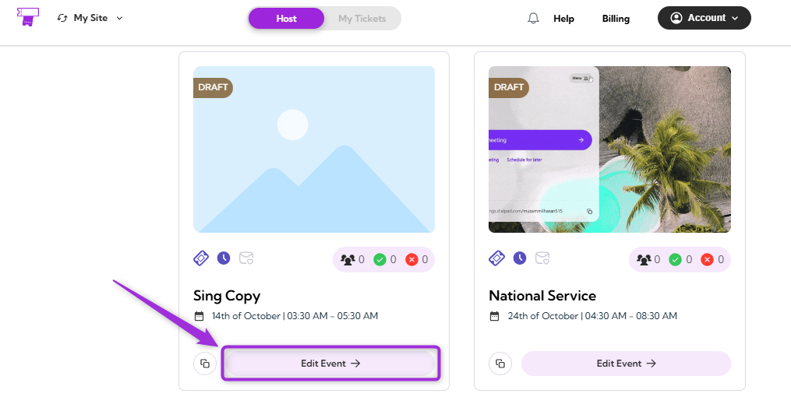

2. Click on the **Event Actions** at the top-right corner of the event page and select **Cancel Event**.

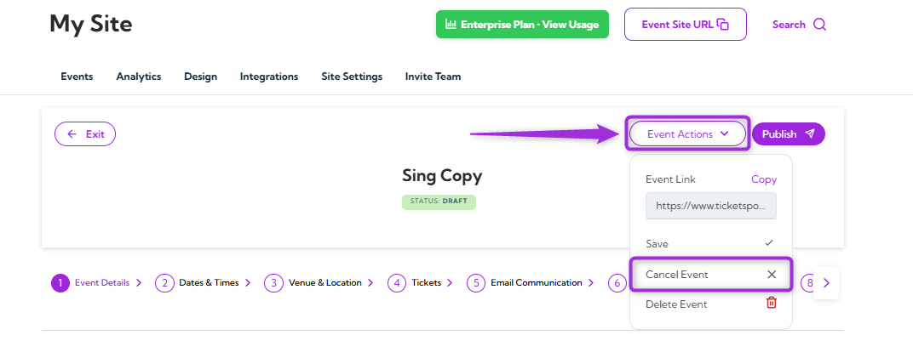

3. If you want to notify attendees about the event cancellation, keep the toggle **on**, enter an **email subject** and **message**, and click on **Cancel Event** to confirm.

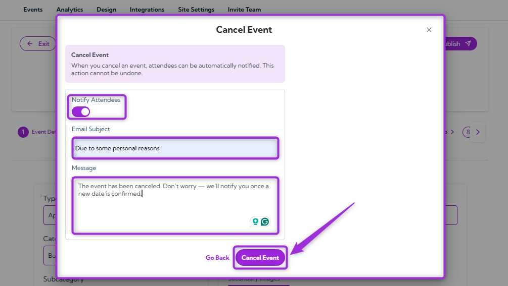

4. If you don’t want to notify attendees, turn the toggle **off** and click **Cancel Event** to confirm the cancellation.

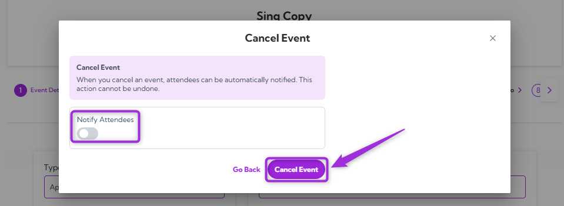

> **Note:** Cancelling an event only removes it from your active dashboard and marks it as Cancelled. It’s not deleted and can be restored later if needed.

## Restore Event (as Draft)

If you want to bring back a previously canceled or removed event, you can restore it as a draft. This allows you to make updates before publishing it again.

1. Select the event you want to restore from your event dashboard and click on **Edit Event**.

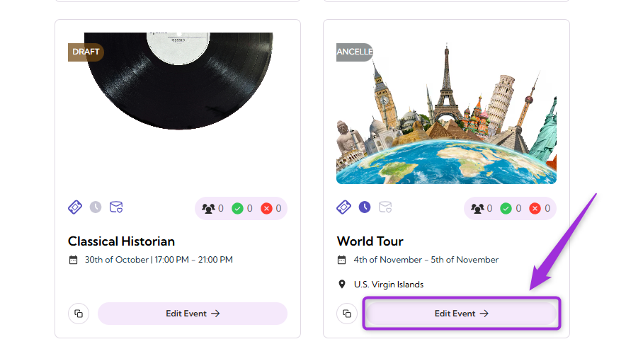

2. Click on the **Event Actions** at the top-right corner of the event page and select **Restore as Draft**.

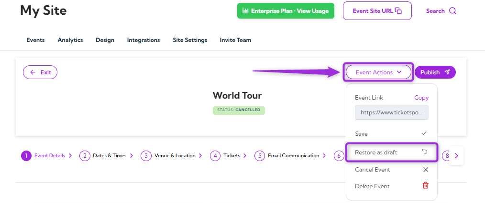

The event will be marked as **Draft** instead of **Cancelled** in the event status indicator after restoration.

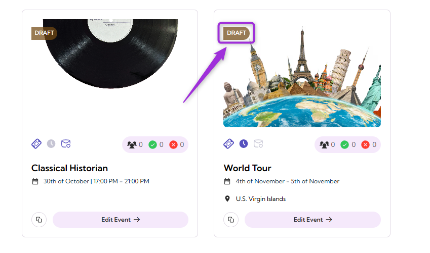

> **Note:** Restored events remain in draft mode until you manually publish them. Review all event details carefully before making it live again.

## Delete Event

If an event is no longer required, you can permanently remove it from your dashboard to keep your event list organized and up to date. Deleting an event ensures that all related data is removed from your account.

1. Select the event you want to delete from your event dashboard and click on **Edit Event**.

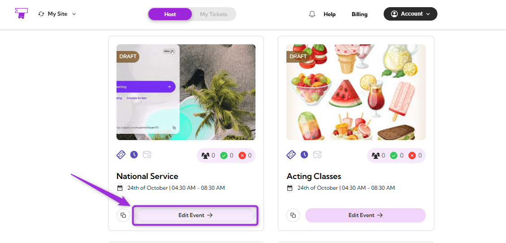

2. Click on the **Event Actions** at the top-right corner of the event page and select **Delete Event**.

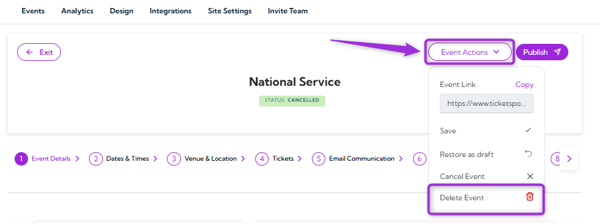

3. A confirmation window will appear — review the message carefully, then click **Delete Permanently** to remove the event.

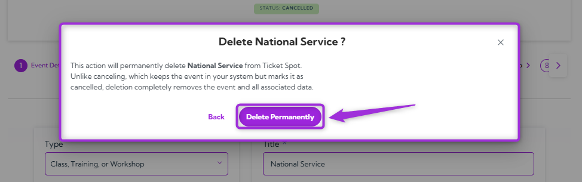

Your event will be permanently deleted and will no longer appear in your dashboard.

> **Note:** Unlike canceling, which keeps the event in your system but marks it as canceled, deleting completely removes it and all associated information. Once confirmed, the event cannot be restored.

## Copy Event Link

The **Copy Event Link** feature allows you to easily share your event with others. Whether you want to send the link via email, post it on social media, or share it directly with others, this option makes it quick and easy to distribute your event details.

Click on the **Event Actions** at the top-right corner of the event page and choose **Copy Link**.

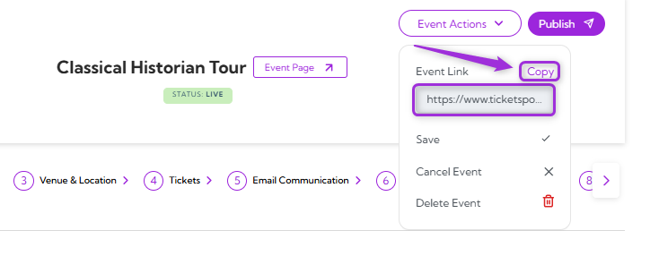

The event link will be copied to your clipboard, ready to be shared via email, social media, or other platforms.

## Save Event

The **Save Event** option lets you save any changes made to the event without publishing it right away. This keeps your event in draft mode, allowing you to make further updates later. Simply click **Save Event** to store the changes until you’re ready to publish the event.

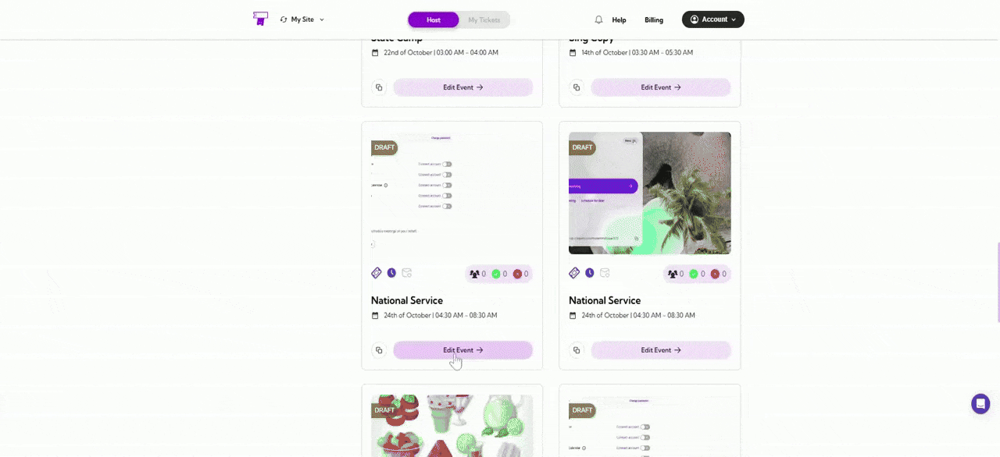

## Publish Event

Once your event is finalized and ready to be visible to attendees, click **Publish Event** at the top-right corner of the event page. 

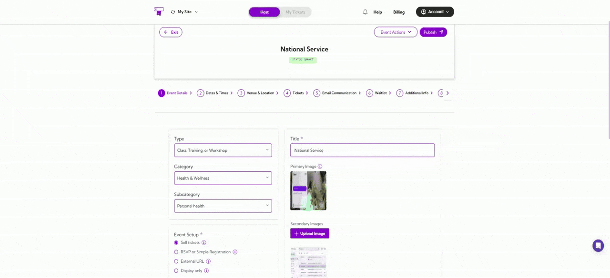

This will make the event live, allowing attendees to view and register for the event.