The **Tags & Custom Fields** section helps you organize your events more effectively and collect any extra information needed for your workflows. This makes your events easier to discover and ensures you can store all relevant details in one place.

By using both Tags and Custom Fields together, you can create a more structured, searchable, and personalized event experience for your attendees.

Let’s get started 🚀

## Tags
Tags help improve your event’s visibility in search engines and make it easier for attendees to filter events inside your widget (configured in the Widget Design tool). Adding relevant tags ensures your events are easier to find and categorize.

**How to Add a Tag**

1. Enter the tag name you want to add. This can be any keyword that describes your event—for example: **Music**, **Workshop**, **Tech**, **Festival**, **Networking**, etc.

2. Click the **Add Tag** button to save and apply the tag to your event.

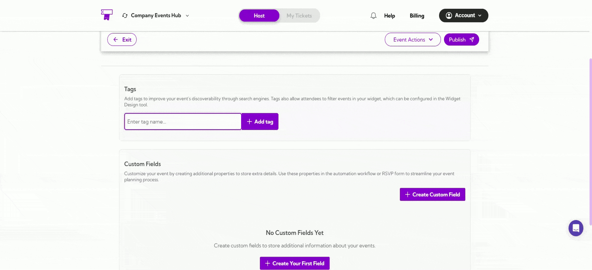

You can add multiple tags to better describe your event and improve discoverability.

## Custom Fields
Custom Fields are used to add extra information to your event that isn’t included in the default fields. These fields can store any additional details you need and can also be used in automation workflows or RSVP forms to help you manage event data more effectively.

**How to Add Custom Fields**

**Step 1:** Click the **Create Custom Field** button to start adding a new field for your event.

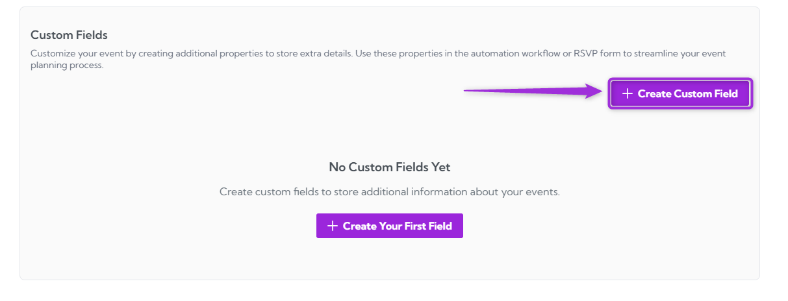

A pop-up window will appear where you can create your custom field.

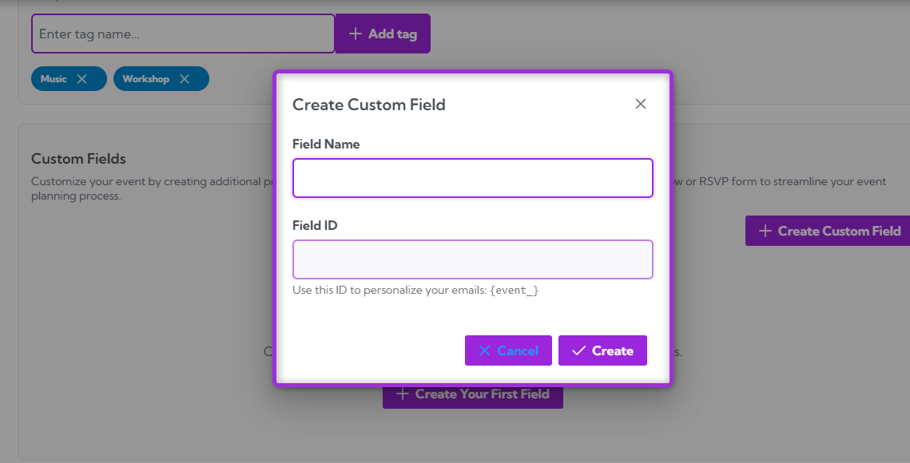

**Step 2:** Enter the **Field Name** (the label attendees will see) and the **Field ID** (automatically generated based on the name). 

The Field ID is used for personalization tokens in emails and automation.

**Example:**  
**Field Name**: Enter Your Nickname  
**Field ID**: enter_your_nickname  
Use this ID to personalize your emails: `event_enter_your_nickname`

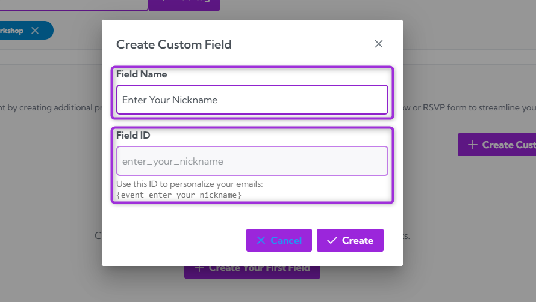

**Step 3:** Click the **Create** button to save your custom field and add it to your event.

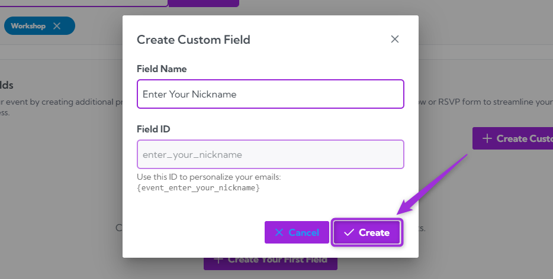

**Step 4:** A new custom field will appear in the list, showing the field name, an input box for attendee responses, and the field’s unique ID you can use in emails or automation.

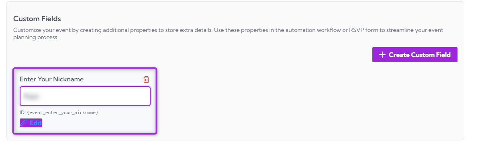

You can create as many custom fields as you need to collect additional event information.

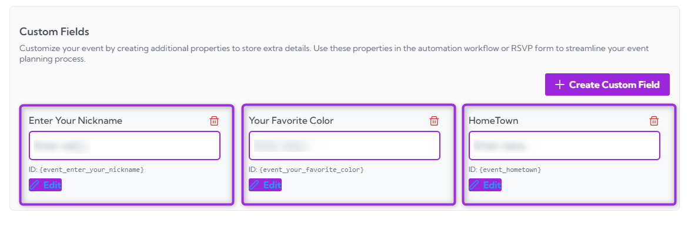

## Manage Custom Fields

The **Manage Custom Fields** section allows you to update or remove any custom fields you’ve created. This helps you keep your event data organized and ensures only relevant fields remain active.

### Edit a Custom Field

1. Click the **Edit** button located below the custom field title you want to modify.

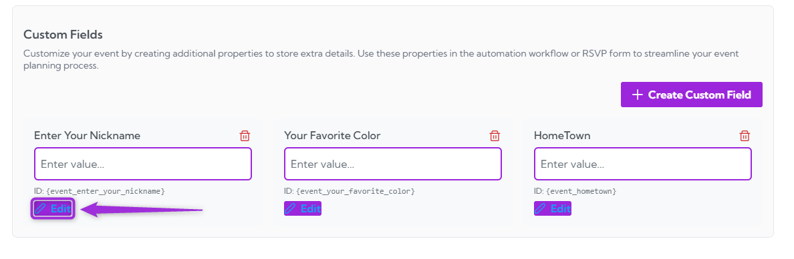

2. Update the Field Name with the new label you want attendees to see, then click the **Update** button to apply your changes.

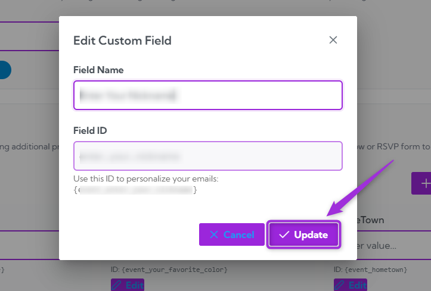

### Delete a Custom Field

1. Click the **Delete** button next to the field you want to remove.

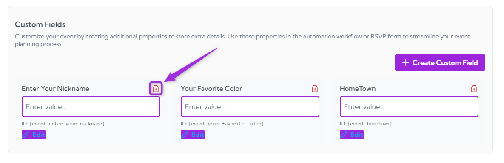

2. A confirmation message will appear: “Are you sure you want to delete this custom field?” Click **Yes** to proceed.

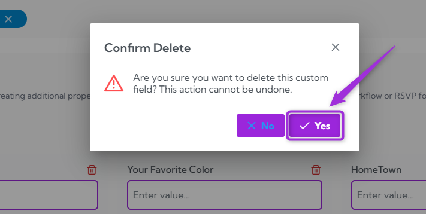

>**Note:** This action cannot be undone, so make sure you no longer need the field before deleting it.

Your tags and custom fields are now fully set up. You can edit, update, or remove them anytime to keep your event information organized and easy to manage.
