Once you’ve set up the Venue & Location details, the next step is to create and manage your event tickets. The Tickets section lets you define how attendees can join your event — whether through free, paid, or donation-based tickets. You can customize pricing, set quantities, apply sales tax, and even offer promo codes for discounts.

Let’s get started. 🚀

## Sales Tax

Add a sales tax to your tickets, and it will be automatically applied at checkout. This helps ensure that all ticket prices include the required tax for your region.  
For example, if your ticket price is 50 dollar and you set a 10% sales tax, the total amount charged at checkout will be 55 dollar.

> **INFO:** Leave this as it is if you don’t need to apply any tax to your ticket sales.
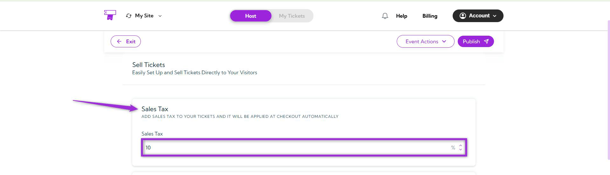

## Tickets

Create tickets for your event to define how attendees can register or gain access. You can set up free, paid, or donation-based tickets depending on your event type. Each ticket can have its own name, price, quantity, and sales start and end date — giving you full control over availability and pricing.

## Currency

Select the currency in which you want to sell your tickets. You can choose from multiple options such as USD (dollar), EUR (€), JPY (¥), GBP (£), AUD (AU$), or CAD (CA$) based on your event’s location and payment preferences.

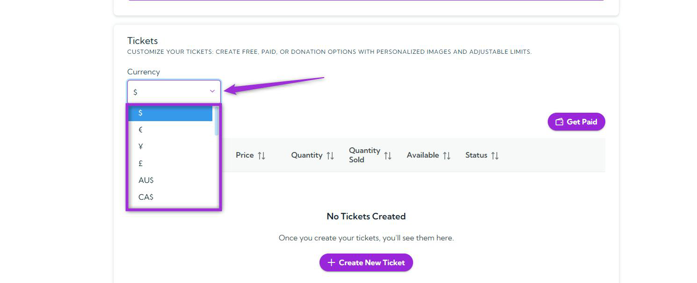

## Get Paid

Click the **Get Paid** button to set up how you’ll receive payouts from your ticket sales.

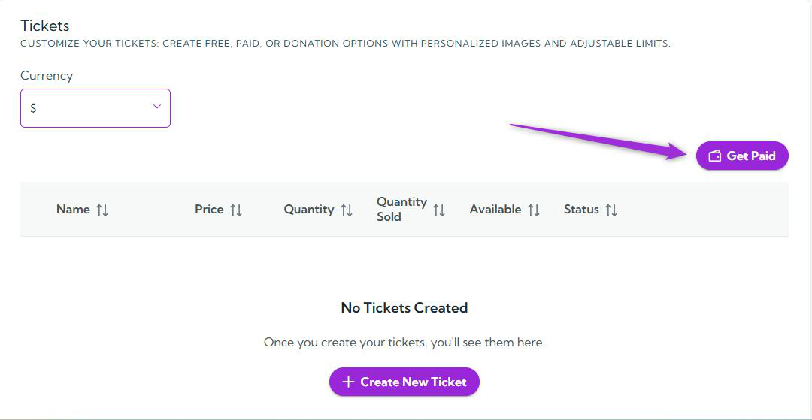

Once clicked, a **Payment Settings** window will appear with three available options to connect your preferred payment provider:

- Connect Stripe
- Connect Square
- Connect PayPal

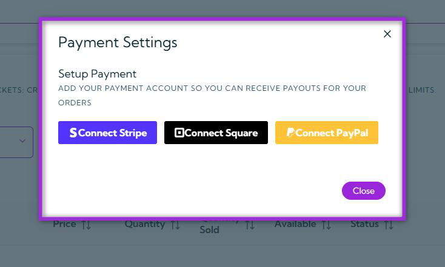

Choose the provider you want to use and follow the on-screen steps to link your account. After a successful connection, all ticket payments will be automatically deposited into your selected payment account.

## Create Ticket

Click the **Create New Ticket** button to start creating a new ticket for your event.

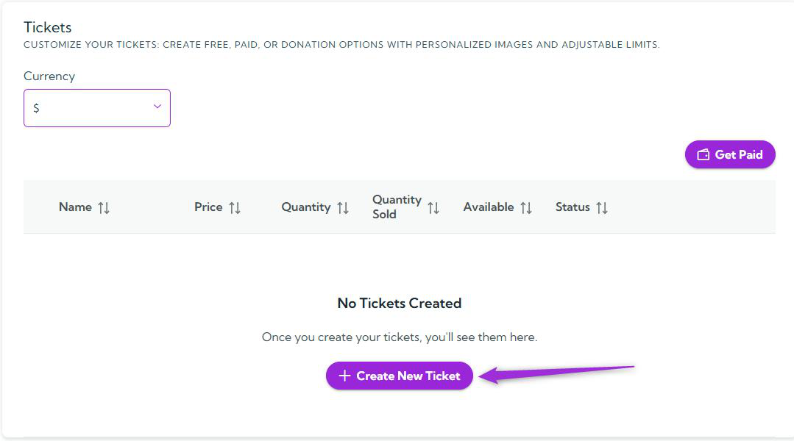

## Basic Ticket Information

This section allows you to define the essential details for your ticket — from its visibility and visuals to access rules and validity duration.

### Fields

| S.no | Field | Description |
|------|--------|-------------|
| 1 | **Hide Ticket** | Use this toggle to temporarily hide a ticket from public view. When enabled, the ticket will not appear for attendees, but remains valid and can be made visible again anytime. |
| 2 | **Images** | Add one or more images by clicking on the + button to visually represent your ticket. The images appear next to the ticket, and if multiple images are added, they will rotate automatically in a carousel display. |
| 3 | **Ticket Name** | Enter a clear, recognizable name for your ticket. |
| 4 | **Status** | Choose from the dropdown — On Sale, Cancelled, or Postponed — to define the current state of the ticket. |
| 5 | **Description** | Use this box to add a short description for your ticket, such as access details, inclusions, or benefits. |
| 6 | **Check-In Limit** | Set the maximum number of entries allowed per ticket — ideal for multi-entry scenarios like theme parks or exhibitions. Set to 0 for unlimited check-ins. Once the limit is reached, a notice will alert the host to decide on further access. |
| 7 | **Ticket Validity Period** | Choose how long the ticket remains valid after purchase. Options include Unlimited, One Day, One Week, One Month, and One Year. Select the duration that best matches your event type or access policy. |

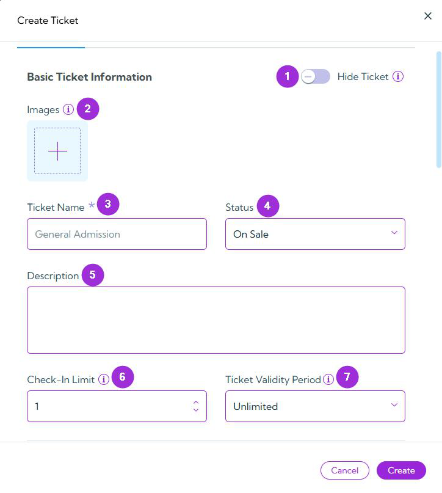

## Pricing and Fees

Choose how you want to charge for this ticket:

### Free  

Select this option if you would like your attendees to register for the event at no cost.

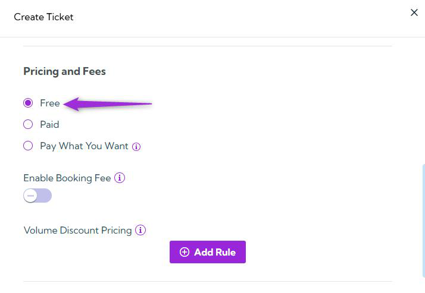

### Paid  

This option activates the **Price** field, which allows you to define the ticket cost that attendees will pay for registering for the event.

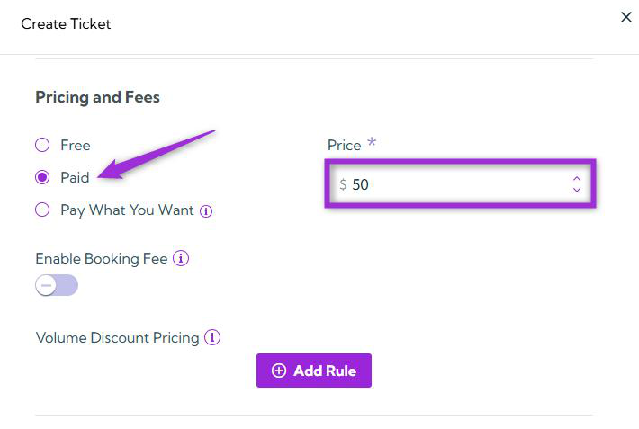

### Pay What You Want  

When you select this option, attendees have the flexibility to decide how much they wish to pay.  
Additionally, you can specify a minimum amount in the **Minimum Price** field.  
For example, if you set the minimum price to 30, attendees can choose to pay 30 or any higher amount.

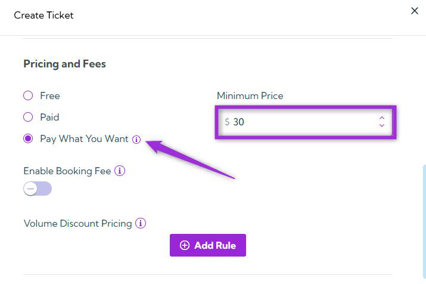

### Enable Booking Fee  

Toggle this option ON to apply a custom booking fee to each ticket. When enabled, the **Custom Booking Fee** field becomes active, allowing you to enter a fixed amount. The specified fee will then be added to the ticket price.

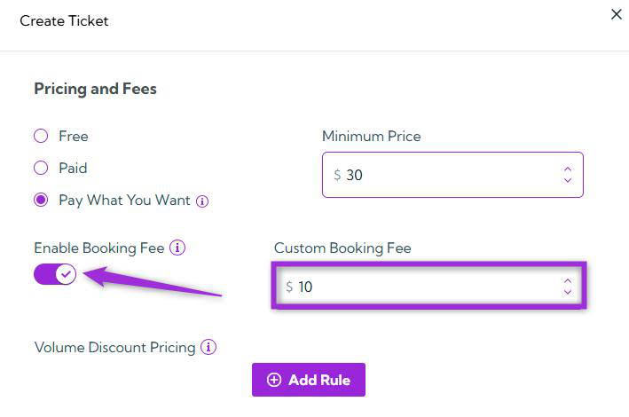

## Volume Discount Pricing

Use this section to define pricing rules for bulk ticket purchases. Click the **Add Rule** button to create custom quantity and price pairs. For instance, if 1–4 tickets are priced at 50 each, you can add a rule to set the price at 45 each when 5 or more tickets are purchased.

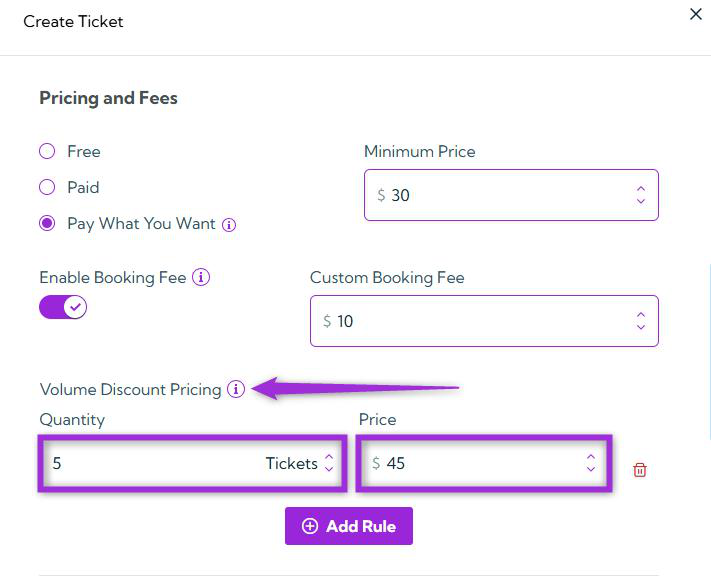

>**INFO:** Add more rules anytime using **Add Rule**, or remove them using the Trash icon.
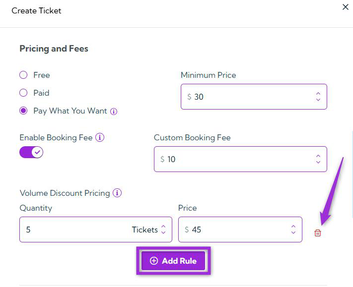

## Group Ticket Settings

This section lets you bundle multiple ticket types together under one group ticket — ideal for family packages, team passes, or combo offers that include different ticket types at a single price.

### Enable Group Ticket  

Enable this toggle to create a bundled ticket that includes multiple tickets of different types. Attendees will receive the individual tickets within the group rather than a single group ticket.

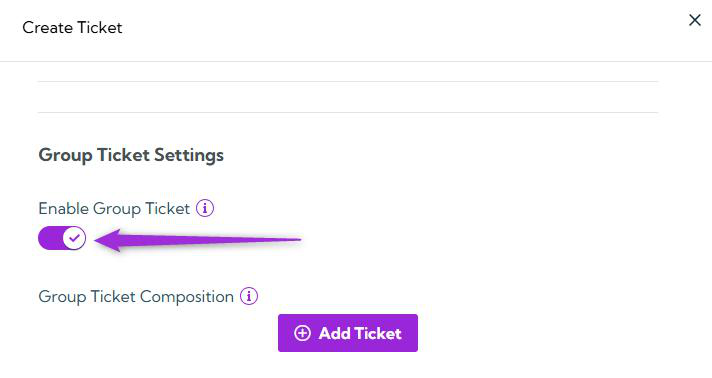

### Group Ticket Composition 

After enabling the “Enable Group Ticket” toggle, use this section to define what the group includes by clicking on the **Add Ticket** button.

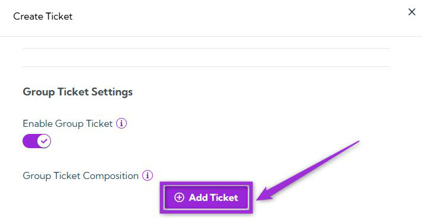

Specify the **Quantity** and select the **Ticket Type** from the dropdown (previously created tickets).

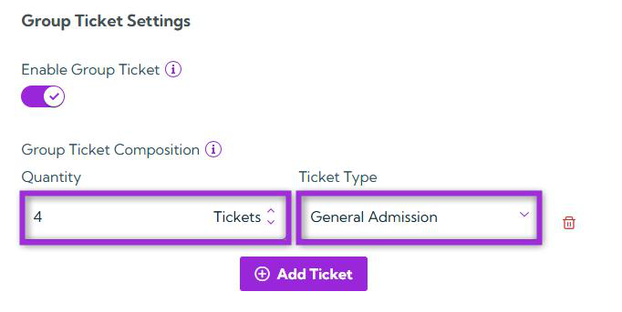

> **INFO:** You can similarly add additional tickets at any time by clicking the **Add Ticket** button, or remove existing ones whenever needed by clicking the **Trash** icon
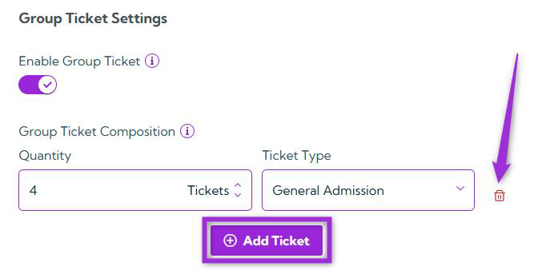

## Sales and Capacity Settings

This section helps you control when your tickets go on sale, when they stop selling, and how many can be sold — ensuring you stay within your event’s capacity limits and manage ticket availability effectively.

### Ticket Sales Start  

Set when ticket sales should begin relative to the event’s start time.

- Specify a value in **days, hours, or minutes** before the event.

- Alternatively, toggle the **Immediately** button **ON** to start sales instantly, which disables manual input.

### Ticket Sales End  

Set when ticket sales should stop, either before the event starts or before it ends.

- Specify a time offset using days, hours, or minutes according to your event’s requirements.

### Ticket Capacity 

Define how many tickets can be sold for this type. You can also set:

- **Min Per Order:** Minimum number of tickets a buyer must purchase.  
- **Max Per Order:** Maximum number of tickets per purchase.

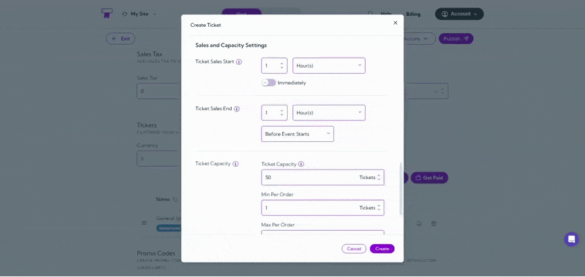

## Approval & Payment Settings

This section allows you to control how registrations are approved and when payments are collected — giving you more flexibility in managing attendees and payment timing.

### Require Approval  

Enable this option if you want to manually approve registrations before confirming attendance.
Attendees will appear as **Pending** until approved, which applies to both free and paid tickets.

### Allow Payment Later  

Toggle this **ON** to let approved guests complete their payments at a later time.
Ideal for corporate or sponsor-based registrations where payment is collected post-approval.

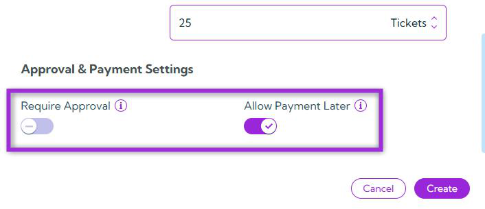

## Autopilot

The Autopilot tab allows you to create automated rules that modify ticket properties based on time triggers relative to your event’s start or end time. This feature helps you manage ticket visibility, pricing, or status automatically — without manual intervention.

### How It Works

Click the **Add Rule** button to create your first automation rule.

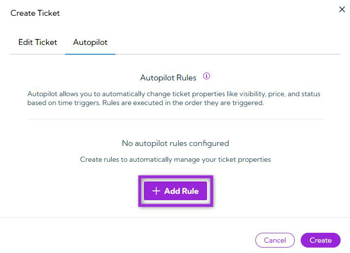

Each rule defines when and how a ticket property should change, using time-based conditions and actions.

| S.no | Field | Description |
|------|--------|-------------|
| 1 | **Enabled** | Toggle to activate or deactivate a rule. Disabled rules remain saved but inactive. |
| 2 | **Trigger Value** | Set the numerical trigger value (e.g., 1). |
| 3 | **Unit** | Choose Minutes, Hours, or Days. |
| 4 | **Timing** | Select Before Event Starts or Before Event Ends. |
| 5 | **Action Type** | Choose what property to modify — Hide/Show Ticket, Change Price, Change Capacity, etc. |
| 6 | **Action** | Define the specific action to perform based on the Action Type. |

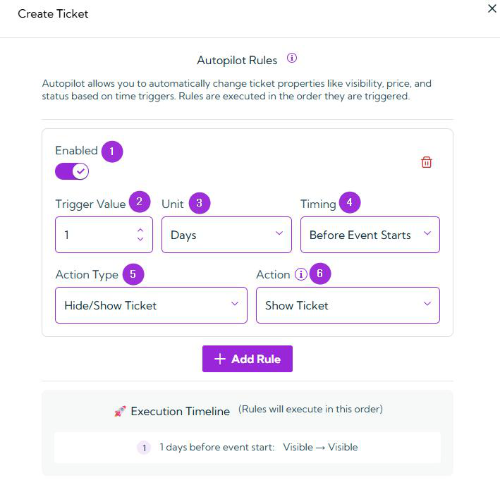

>**INFO:** You can similarly add additional rules at any time by clicking the **Add Rule** button, or remove existing ones whenever needed by clicking the **Trash** icon.
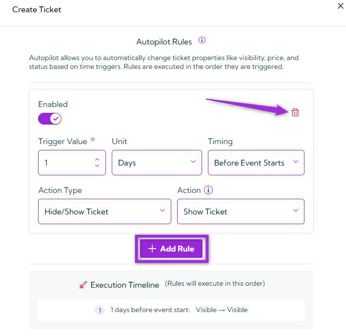

Click on the **Create** button to proceed. Your ticket will be created successfully.

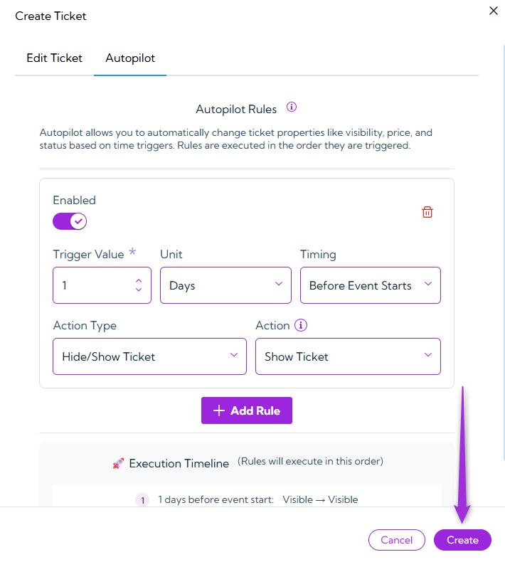

## Manage Tickets

Once your tickets are created, you can manage them directly from the **Tickets** list. You can **edit, duplicate**, or **delete** tickets as needed — giving you full flexibility to keep your event details accurate and organized.

| Action | Description |
|--------|-------------|
| **Edit Ticket** | Click the **Edit** icon next to a ticket to modify its details. You can update fields like name, price, quantity, validity, or status at any time before the event starts. Editing helps you make quick adjustments — for example, changing a ticket’s price, updating its availability, or correcting a typo. |
| **Duplicate Ticket** | Use the **Duplicate** option to instantly create a copy of an existing ticket. This is especially useful when you want to create similar tickets (like “Early Bird” and “Regular”) without re-entering all details manually. After duplicating, you can edit the new ticket to adjust pricing, capacity, or timing as needed. |
| **Delete Ticket** | Select **Delete** to permanently remove a ticket that’s no longer required. This helps maintain a clean and organized list. Once deleted, the ticket and its related data cannot be recovered, so make sure to confirm before deleting. |

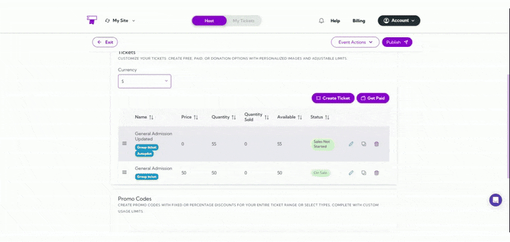

## Promo Codes

Promo Codes allow you to offer **discounts or special pricing** to your attendees. You can create limited-time offers, early-bird discounts, or group incentives to drive more ticket sales and reward specific audiences.

To create a new promo code, click **Create Promo Code**.

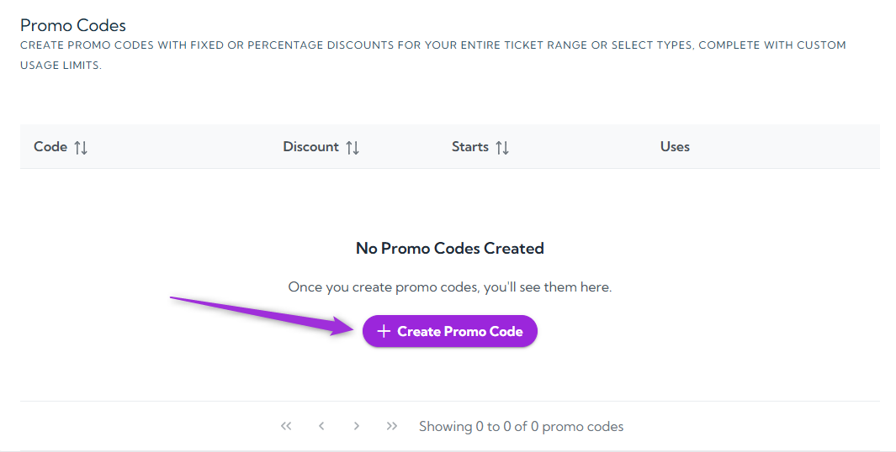

## Promo Code Setup Fields

| S.no | Field | Description |
|------|--------|-------------|
| 1 | **Code Name** | Enter a unique code attendees will use at checkout. |
| 2 | **Multi-Event Code** | Enable to make the code valid across all events. |
| 3 | **Ticket Limit** | Choose Unlimited or Limited, and specify the number if limited. |
| 4 | **Discount Amount** | Choose fixed amount or percentage (mutually exclusive). |
| 5 | **Promo Code Starts** | Set to Now or Scheduled Time. |
| 6 | **Promo Code Ends** | Set to When Ticket Sales End or a Scheduled Time. |

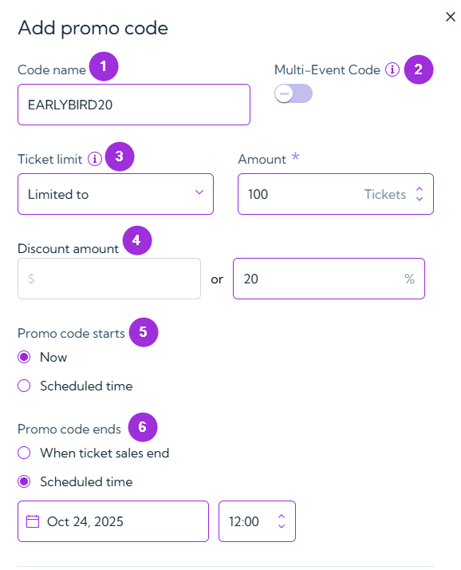

Once you’ve configured the general promo code details, you can further refine how and where the discount applies using the fields below:

| S.no | Field | Description |
|------|--------|-------------|
| 7 | **Enable Volume Discounts** | Activate bulk purchase discounts by specifying a Minimum Quantity. |
| 8 | **Apply to Tickets** | Choose whether the promo applies to all tickets or specific ticket types. |

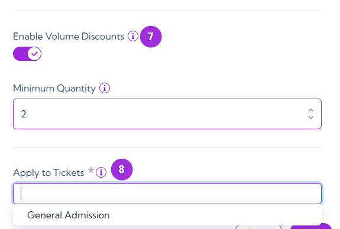

Click on the **Add** button to proceed. Your promo code will be created successfully.

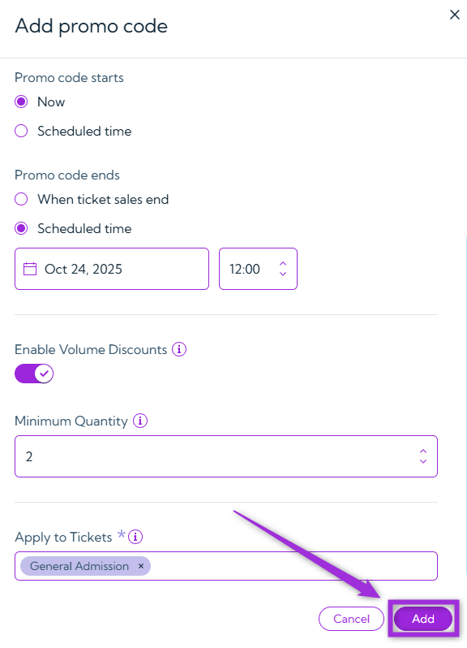

## Manage Promo Codes

After creating promo codes, you can manage them directly from the **Promo Codes** list.
You can **copy, view usage, edit**, or **delete** any existing promo code — helping you stay organized and monitor how your discounts are performing.

| Action | Description |
|--------|-------------|
| **Copy Promo Code** | Quickly copy the code to your clipboard for sharing. |
| **View Usages** | Check how often the promo has been used. |
| **Edit Promo Code** | Modify any promo code details. |
| **Delete Promo Code** | Permanently delete a promo code (cannot be recovered). |

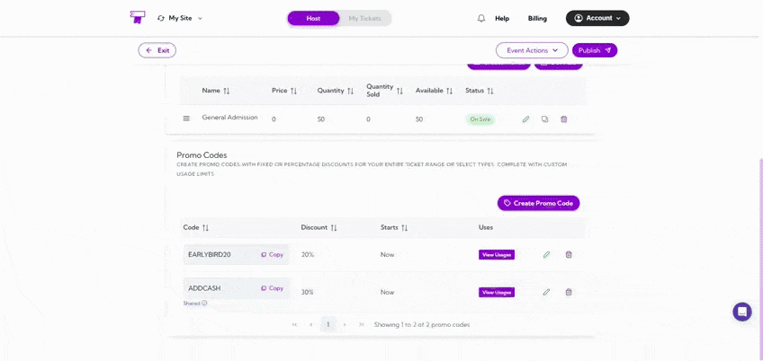
