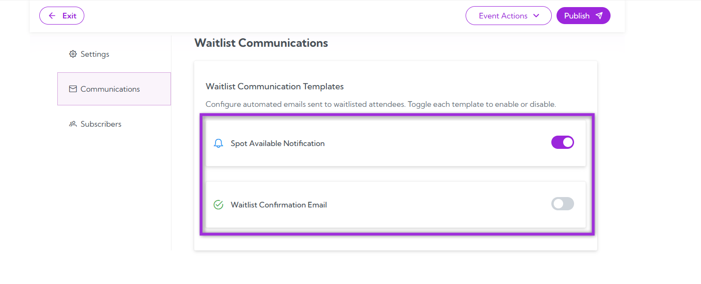
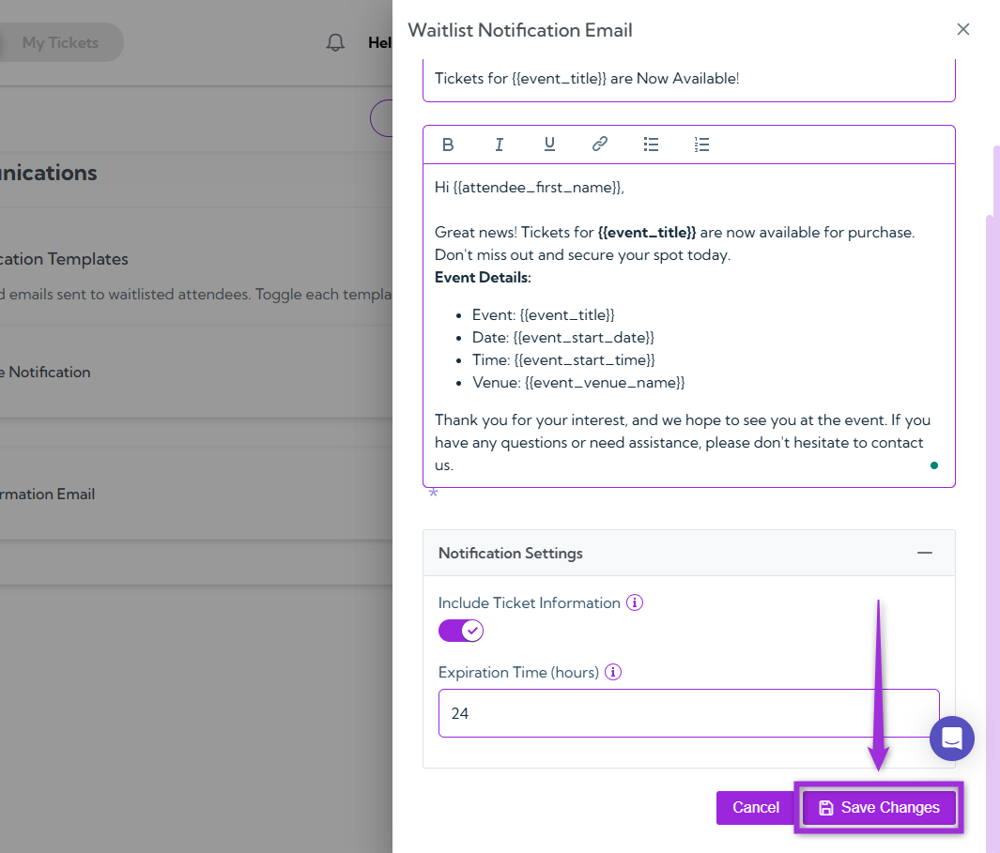
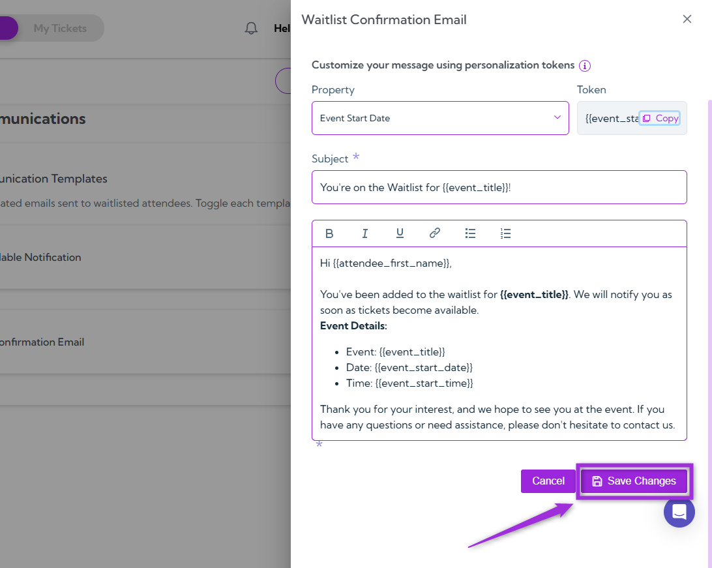
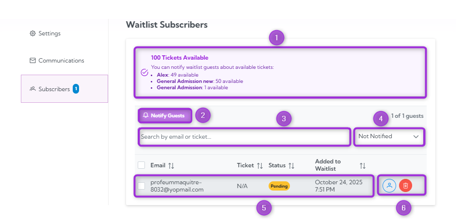
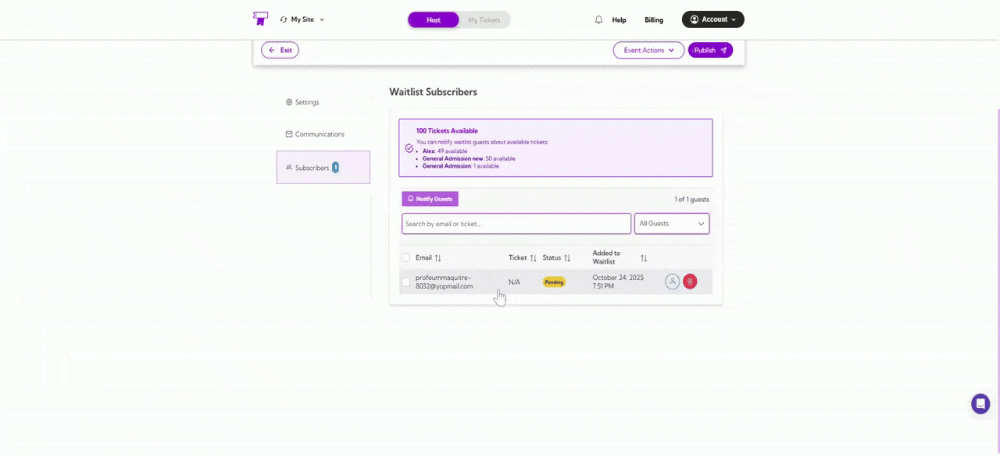
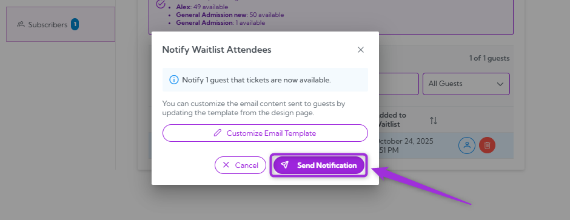

Once you’ve configured your **Email Communication** settings, the next step is to set up the **Waitlist**. This feature helps you manage attendee demand even after your event reaches full capacity. When enabled, interested attendees can join a waitlist to be notified if additional tickets become available — ensuring you never miss potential registrations.

Let’s get started 🚀

## Settings
The Settings section lets you control when and how the waitlist is displayed to attendees.

| S.no | Field | Description|
|------|-------|------------|
| 1.    | Enable Waitlist | Toggle this option to allow attendees to join a waitlist when tickets are sold out or the event has reached capacity. Once enabled, additional configuration options become available. |
| 2.   | Show When Tickets Sold Out   | Enable this toggle to display the waitlist option as soon as all tickets for the event are sold out.                                                                                            |
| 3.    | Show When Event at Capacity  | Enable this toggle to display the waitlist option when the total event capacity (across all tickets) is reached.                                                                                |
| 4.    | Call to Action               | Enter the text that will appear on the button attendees click to join the waitlist. Keep it short and clear — for example, **Join Waitlist** or **Notify Me*.                                      |
| 5.    | Description                  | Provide a brief message explaining how the waitlist works. You can personalize this message using available tokens (e.g., `attendee_first_name`).                                              |
| 6.    | Confirmation Message         | Add the message that will appear on-screen after an attendee successfully joins the waitlist. This confirmation is shown instantly, but is not sent via email.

## Communications
The Communications section lets you automate and personalize the messages (via email) sent to attendees who interact with your waitlist — whether they’ve just joined it or have been offered a spot when one becomes available.  

There are two email templates available:

- **Spot Available Notification**: Sent when a spot opens up, inviting the attendee to claim it.
- **Waitlist Confirmation Email**: Sent immediately after someone joins the waitlist to confirm their submission.

> **Info**: You can enable either (or both) templates as needed.

### Spot Available Notification

This template notifies attendees when a spot becomes available for your event, inviting them to claim it within a specified time frame. You can enable this template using the toggle switch and customize the message content to ensure it matches your event’s tone and urgency.  

Click the **Spot Available Notification** template, and a customization panel opens on the right-hand side of the interface, allowing you to configure all message details.

| **Field**       | **Description**                                                                                                                                                                                                                                                                               |
|-----------------|------------------------------------------------------------------------------------------------------------------------------------------------------------------------------------------------------------------------------------------------------------------------------------------------|
| **Property**    | Use this dropdown to select event-related details such as Event Title, Event Summary, Event Start Date, Event Start Time, or Event End Date.                                                                                                                                                         |
| **Token**       | Displays the corresponding token for the selected property (e.g., `event_title`). Click *Copy* to quickly insert it into your message. Tokens act as placeholders that automatically resolve to real data, such as attendee's name or event details.                                    |
| **Subject**     | Add the subject line for your message. Combine regular text with tokens for personalization — for example, “A Spot Just Opened for `event_title`!”.                                                                                                                                           |
| **Message Body**| Write your email content here. You can include personalization tokens like `attendee_first_name`, `attendee_email`, and `event_title` to make your message feel personal and relevant.                                                                                                    |

#### Notification Settings

At the bottom of the customization panel, you’ll find additional settings to fine-tune the email’s behavior.

| S.no | Field                     | Description                                                                                                                                                   |
|------|---------------------------|---------------------------------------------------------------------------------------------------------------------------------------------------------------|
| 1.    | Include Ticket Information | Enable this toggle to include details about available tickets in the email, helping attendees make quick decisions.                                           |
| 2.    | Expiration Time (hours)   | Define how long the recipient has to claim their spot before it’s offered to someone else. This helps maintain fairness and ensures seats are filled promptly. |

After finalizing your changes, click Save Changes to update and activate your customized notification.

### Waitlist Confirmation Email

This template sends an automatic confirmation to attendees right after they join the waitlist, assuring them that their request has been received successfully. You can enable this template using the toggle switch and customize the message content to align with your event’s tone and communication style.  

Click the **Waitlist Confirmation Email** template, and a customization panel opens on the right-hand side of the interface, allowing you to configure all message details.

| Field         | Description                                                                                                                                                                                                                           |
|---------------|---------------------------------------------------------------------------------------------------------------------------------------------------------------------------------------------------------------------------------------|
| Property      | Use this dropdown to select event-related details such as **Event Title, Event Summary, Event Start Date, Event Start Time, or Event End Date**.                                                                                          |
| Token         | Displays the token value corresponding to the selected property (e.g.,`event_title`). Click **Copy** to easily insert it into your message body or subject line.                                                                      |
| Subject       | Enter the subject line for your confirmation email. You can combine text and tokens — for example, “You’re on the Waitlist for `event_titl`!”.                                                                                    |
| Message Body  | Write your email message here. Use tokens like `attendee_first_name`, `attendee_email`, and `event_titl` to personalize your message. Tokens automatically resolve to the attendee’s actual details, ensuring a friendly and relevant confirmation. |

After finalizing your changes, click **Save Changes** to update and activate your customized notification.

## Subscribers
The Subscribers section allows you to manage the individuals who are on your event's waitlist. From here, you can view the status of each waitlisted attendee, notify them when a spot becomes available, and track their progress through the waitlist queue.

| S.no | Field               | Description                                                                                                                                                                                                 |
|------|---------------------|-------------------------------------------------------------------------------------------------------------------------------------------------------------------------------------------------------------|
| 1.    | Ticket Availability | Displays the number of tickets available for the event. For example, “100 Tickets Available” or the number of tickets remaining for specific types (e.g., General Admission).                               |
| 2.    | Notify Guests       | This button allows you to send notifications to waitlisted attendees when a spot becomes available. You can select which guests to notify if tickets are available.                                          |
| 3.    | Search              | Use the search bar to find specific waitlist subscribers by email, ticket type, or other details.                                                                                                           |
| 4.    | Filter              | Apply filters to view only those guests who are still on the waitlist or those who have been notified.                                                                                                       |
| 5.    | Subscriber Information | This section displays detailed information for each subscriber, including their email, ticket type, waitlist status (e.g., Pending), and the date they were added to the waitlist.                      |
| 6.    | Action Buttons      | For each subscriber, you can use action buttons to either notify the guest or delete them from the waitlist if necessary.                                                                                    |

### Notifying Waitlist Attendees

Once a ticket becomes available, you can notify attendees who are on the waitlist and allow them to claim the spot. Here’s how to notify your guests:

1. Choose the attendees from the list, or use the search and filter options to select those you want to notify about the available ticket, and click on the **Notify Guests**.

2. Click on the **Customize Email Template** button if you wish to send a personalized message to the attendee.

3. Click on the **Send Notification** button. A confirmation email will be sent to the attendee, allowing them to claim the available ticket.

You can check the status of the attendee, which will change from **Pending** to **Notified** once the notification has been sent.

By using this process, you ensure timely and efficient communication with your waitlisted guests, providing them with the opportunity to claim available spots before they are offered to others.

### Delete Attendee from Waitlist

To remove an attendee from the waitlist, simply find the attendee in the list and click **Delete** next to their name. This will permanently remove them from the waitlist, and they will no longer be notified if a spot becomes available.

### View Attendee Analytics

You can manage attendee details and track important metrics such as how many tickets have been sold. You can also view check-ins, add new attendees, and analyze the status of each attendee, ensuring smooth event management.

