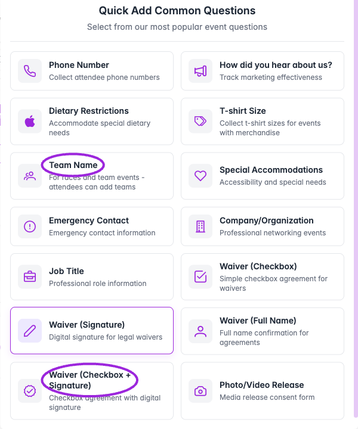
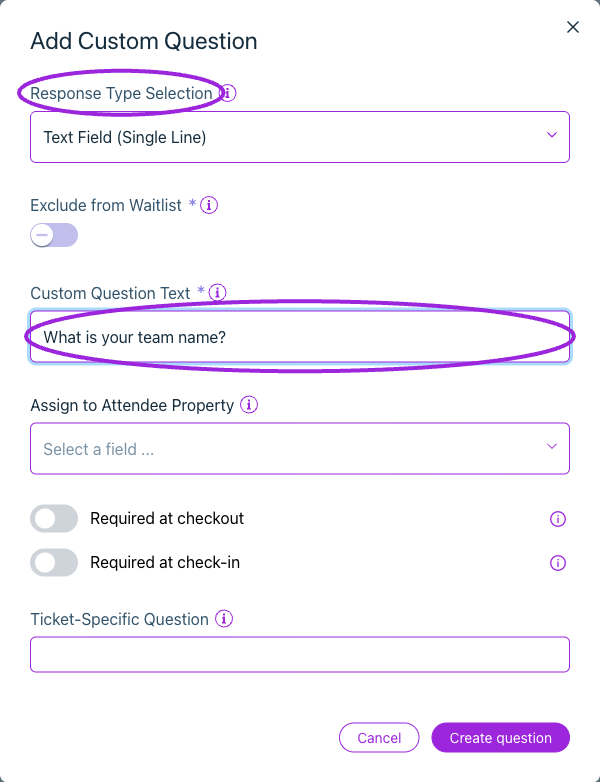
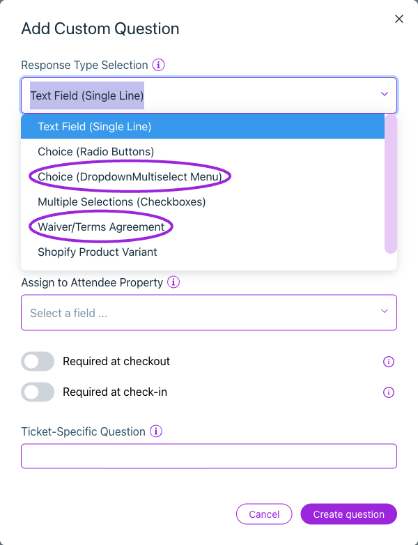
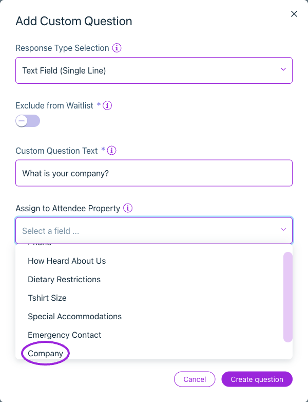
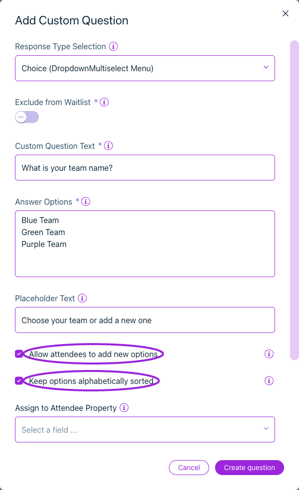
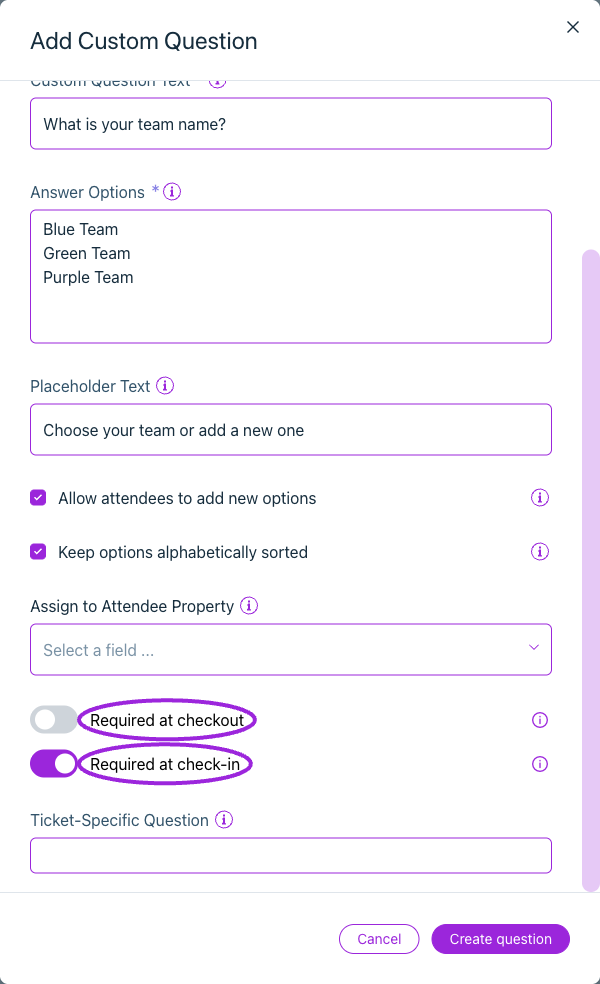
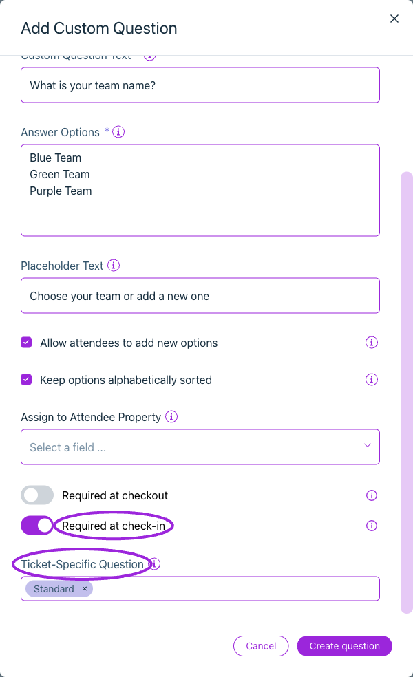

Customize your event registration form with questions for attendee follow-up or admission. Open **Events → Edit event → Additional Info** (also labeled **Additional Information**) to add fields and choose whether answers are required at checkout or check-in.

## Add a question

<Frame caption="Quick Add inserts a preset question into the event form. Open its pencil/edit action to review the wording and requirements before saving the event.">
  
</Frame>

<Frame caption="Add Custom Question lets you choose a response type, enter the question, and configure attendee-property mapping and separate checkout/check-in requirements.">
  
</Frame>

1. **Quick Add** inserts a preset directly into the event form. Use its pencil/edit action to review the wording and requirements. Use **Add Custom Question** to define a question from scratch.
2. Choose **Response Type Selection** and enter **Custom Question Text**.
3. Configure answer options, required settings, waitlist visibility, and ticket applicability.
4. Select **Create question** or **Update question**, then save the event where requested.
5. Test the applicable ticket's checkout and inspect the saved attendee answer.

Quick Add includes Phone Number, How did you hear about us?, Dietary Restrictions, T-shirt Size, Team Name, Special Accommodations, Emergency Contact, Company/Organization, Job Title, waiver presets, and Photo/Video Release. Review each preset's wording and requirements before using it.

## Event registration question examples

Choose questions that serve a clear purpose for your event. These examples use the response types described below:

| Question | Suggested response type | When it helps |
|---|---|---|
| How did you hear about this event? | Radio buttons or dropdown | Compare registration sources using your own list of channels. |
| Which workshop would you like to attend? | Radio buttons | Collect a preference. Use a ticket type or [add-on event](./event-add-ons) when the choice must reserve capacity. |
| What is your company or organization? | Single-line text | Prepare attendee lists or networking information. |
| What T-shirt size do you need? | Dropdown | Collect a choice only for the ticket types that include a shirt. |

Use **Ticket-Specific Question** where appropriate, and require only the answers needed to complete registration or admit the attendee.

## Response types

<Frame caption="Response Type Selection offers text, radio buttons, dropdown, checkboxes, waiver/terms, Shopify product variants and a date picker.">
  
</Frame>

| Type | Configuration |
|---|---|
| **Text Field (Single Line)** | A short written response. |
| **Choice (Radio Buttons)** | A single choice from **Answer Options**. |
| **Choice (DropdownMultiselect Menu)** | Dropdown choices, a placeholder, and optional attendee-created choices. |
| **Multiple Selections (Checkboxes)** | A set of choices where multiple answers are allowed. |
| **Date Picker** | A date response. |
| **Waiver/Terms Agreement** | Document link, uploaded PDF, or entered text, plus checkbox/name/signature acknowledgement. Requires the supported plan. See [waivers](./waivers). |
| **Shopify Product Variant** | An **Option Name** and choices for a Shopify product option when offered by the site's setup. Its controls differ from ordinary attendee questions. Verify the synchronized product. |

## Question options

<Frame caption="Assign to Attendee Property stores an answer in the selected attendee field. Scroll the picker to find supported fields such as Company or Job Title.">
  
</Frame>

<Frame caption="Dropdown questions accept one option per line. You can customize the placeholder, let attendees add choices, and keep those choices alphabetically sorted.">
  
</Frame>

| Option | Effect |
|---|---|
| **Custom Question Text** | The label the attendee sees. |
| **Answer Options** | Enter the available choices for radio, dropdown, or checkbox questions, one per line. |
| **Placeholder Text** | The prompt before a dropdown selection is made. |
| **Allow attendees to add new options** | Allows new dropdown values during registration; they become available to future attendees. Duplicate options are prevented. |
| **Keep options alphabetically sorted** | Sorts dropdown options when attendee-added choices are enabled. |
| **Assign to Attendee Property** | Stores the answer in a supported attendee property for reporting/personalization. Requires the supported plan and is not offered for every response type. |
| **Required at checkout** | Prevents completing checkout without an answer. |
| **Required at check-in** | Requires the answer before admission. Leave Required at checkout off when attendees may answer later. |
| **Exclude from Waitlist** | Omits the question from the waitlist form. |
| **Ticket-Specific Question** | Shows the question only for the selected ticket types. |

Requirements and ticket applicability are independent. For example, a VIP waiver can be required at check-in while an optional dietary question applies to all guests.

<Accordion title="View more current controls">

<Frame caption="Checkout and check-in requirements are independent. This example allows checkout without an answer but requires it before admission.">
  
</Frame>

<Frame caption="Ticket-Specific Question limits the question to selected ticket types. Leave it unrestricted to collect the answer for all tickets; set checkout and check-in requirements separately.">
  
</Frame>

</Accordion>

## Collect answers from every participant

In **Design → Widget → Checkout → Attendee information**, enable **Collect attendee details for each ticket** when every guest must answer individually. Test an order for two people and verify both attendee records. A required question alone does not establish whether the form collects each guest or only the buyer.

For later completion, attendees need access to editing on their [ticket page](/branding-and-design/attendee-ticket-page). Check both **Allow Attendee Edits** and the actual missing-answer/check-in experience before using a “complete later” workflow.

## Maintain and verify questions

Use the row's edit control to change a question. Use Delete and confirm to remove one. Recheck the form after changing choices or ticket scope.

Test an empty required answer, an optional answer, a ticket that should not see the question, waitlist signup, a newly added dropdown option, and any waiver. For check-in requirements, test an attendee with a missing answer and then with the answer completed.

See [waivers](./waivers), [attendee details](/attendee-management/viewing-attendee-details), and [attendee exports](/attendee-management/export-attendees-and-check-in-data).
