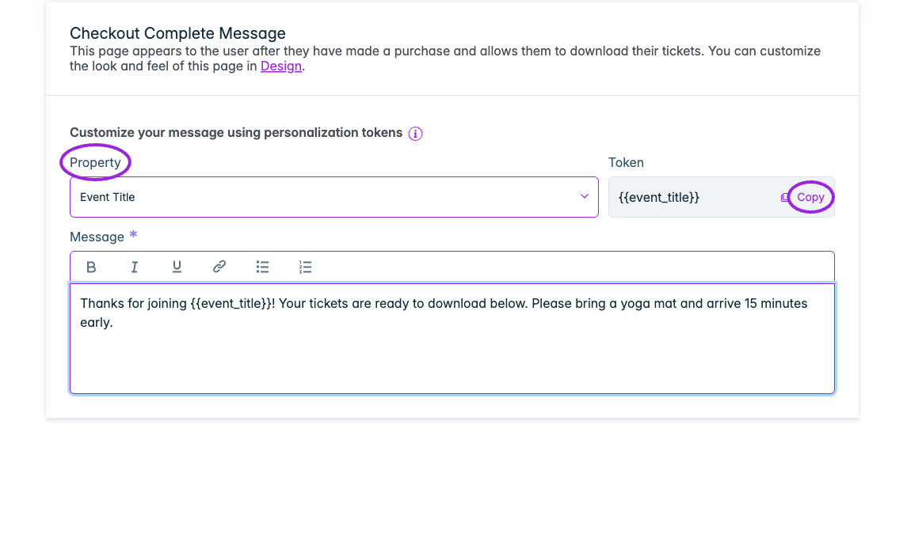

Open **Events → Edit event → Checkout Complete** to change the message shown after checkout. Use it for arrival instructions, what to bring, or a short thank-you. The page also provides ticket downloads.

## Customize your message

1. Select a **Property**, such as Event Title.
2. Use **Copy** beside **Token** to copy the complete placeholder, including its braces.
3. Paste the token into **Message** and write the rest of your instructions. Copying a token does not insert it into the editor automatically.
4. Format the message with bold, italic, underline, links, or lists.
5. **Save** the event, then complete a test registration to inspect the final message and ticket links.

<Frame caption="Choose a Property, copy its complete token (for example {{event_title}}), and paste it into Message. Save the event to use this text after checkout; shared styling is configured in Design.">
  
</Frame>

For example:

```text
Thanks for joining {{event_title}}!
Please bring a yoga mat and arrive 15 minutes early.
Your tickets are ready to download below.
```

Use the property picker for available token names instead of typing a label as plain text. Ticket Spot replaces valid tokens with the order's event or attendee data.

## Change the shared page design

Click **Design** in the introduction to open **Design → Communication → Checkout Complete**. This controls shared appearance and labels; the event editor controls this event's message. Check the pending-approval variant too if your tickets require approval.

See [communication design](../branding-and-design/attendee-communication-design), [multilingual communications](../branding-and-design/multilingual-communications), and [ticket approval](./ticket-setup#approval--payment-settings).
