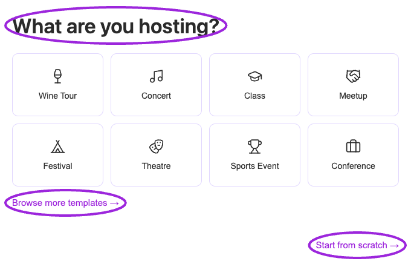

Create your event, then return to the editor to configure features that need a saved event. Start by setting your [brand colors and logo](../branding-and-design/brand-design), available on all plans.

For settings matched to your activity, use [Set up your event type](/event-types/overview). It covers every onboarding template, including tours, classes, concerts, festivals, conferences, retreats, and the advanced event formats. The guided **Create my event** action can publish when requirements are met; use **Continue later** if you want to complete setup in draft first. **Start from scratch** opens the full editor without creating an event yet.

<Frame caption="Open an event to find its setup steps, Save and Publish controls, and current status. Use the stepper arrows to reach later sections.">
  
</Frame>

## Navigation

1. Select the correct site and open **Events**.
2. Click **Create Event**. In **What are you hosting?**, choose an event template, **Browse more templates**, or **Start from scratch**.
3. For a new event from scratch, enter the required title and description, then select **Create Event** in the editor to save its initial draft. The remaining setup steps become available after creation.
4. To update a saved event, select **Manage event** on its event card. Complete the applicable steps below. The editor adapts to your event setup, plan, and whether you are editing a recurring-series parent or child.

<Frame caption="Choose a template, browse the full library, or start from scratch.">
  
</Frame>

## Event editor steps

| Step | What to configure |
|---|---|
| **Event Details** | [Title, description, categories, and event setup](./eventdetails). |
| **Dates & Times** | [Dates, timezone, recurring dates, and time slots](./datetime). |
| **Venue & Location** | [Physical venue or online attendance information](./venuelocation). |
| **Tickets** | [Ticket fields, pricing, access codes, Required Ticket, capacity, and check-in timing](./ticket-setup). |
| **Event Add-ons** | [Attach other events and set selection limits](./event-add-ons). Save the event first. |
| **Memberships** | [Assign active memberships to the event](../memberships/assign-to-events). Save the event first. |
| **Email Communication** | [Configure attendee emails and their timing](./email-communication). |
| **SMS Communication** | [Configure automated SMS and collect phone numbers](./sms-communication). |
| **Waitlist** | [Configure the event waitlist and messages](./waitlist). |
| **Additional Info** | [Collect registration questions and ticket-specific answers](./additional-information). |
| **Checkout Complete** | [Customize the completed-checkout message](./checkout-complete-message). |
| **Tags & Custom Fields** | [Organize events with tags and custom fields](./tags-and-custom-fields). |
| **Hosts** | [Assign hosts](./hosts). Save the event first. |
| **Display Settings** | [Configure event-specific button text, host logo, and host information](./display-settings). |
| **Tracking Links** | [Create campaign links and inspect views/sales](./tracking-links). Use a saved event. |

## Why a step may be missing

- **Unsaved event:** Event Add-ons, Memberships, and Hosts appear after the first save. Create tracking links after saving too.
- **No-ticket setup:** Tickets, Event Add-ons, Memberships, Email/SMS Communication, Waitlist, Additional Info, and Checkout Complete are excluded.
- **External registration URL:** Tickets, Event Add-ons, Memberships, Waitlist, Additional Info, and Checkout Complete are excluded because registration is external.
- **Individual event in a recurring series:** Dates & Times, Event Add-ons, Memberships, Email/SMS Communication, Hosts, Display Settings, and Tracking Links are managed on the parent rather than shown on the child.
- **Plan requirement:** An upgrade prompt may appear for a feature your plan does not include.

## Save, publish, and test

Save a draft while configuring the event. Publish when the event details and tickets are ready; return to edit it for later changes. Check your event's status after saving rather than assuming a draft is public.

Open the event page or installed widget and complete a test registration. Verify price, quantities, required tickets, questions, membership rules, confirmation, and delivered tickets. For Shopify, publish/update the linked product and [configure the Ticket Selector](../plugins/connect-shopify#configure-the-ticket-selector-for-advanced-ticketing) when using advanced ticketing controls.

## Review every option

Use the [event setup checklist](./event-options-reference) and [ticket options reference](./ticket-options-reference) to review an existing event. For different offers on different dates, use [custom day tickets](./day-specific-tickets).
