Open **Dates & Times** in the event editor. Choose the schedule format before taking registrations. Once confirmed attendees exist, the editor restricts format changes; review cancellation and attendee transfer before restructuring an event that is already on sale.

The event's **Timezone** is in **Event Details**. Widget language, date formatting, and visitor-timezone conversion are separate [language and locale settings](../branding-and-design/language-and-locale).

<Frame caption="An event with confirmed attendees has disabled schedule-format choices.">
  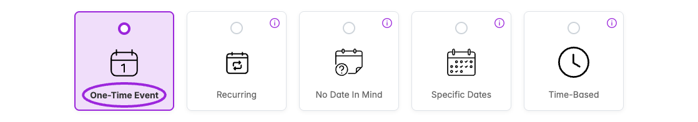
</Frame>

## One-Time Event

Choose **One-Time Event**, then set **Start Date & Time** and **End Date & Time**. Enable **All Day Event** when specific hours are not appropriate. Save the event and check its displayed date and timezone.

<Frame caption="Dates &amp; Times → One-Time Event provides start/end dates and times and an All Day Event option.">
  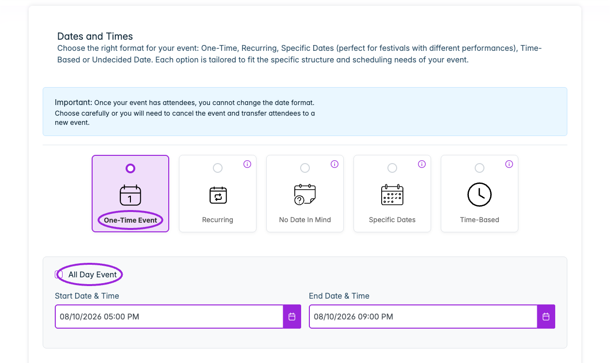
</Frame>

## Recurring

Choose **Recurring**, select **Repeat Frequency**, and set **Start Date & Time** and **Series End Date & Time**. The dates bound the series; the times define the duration of each occurrence.

| Frequency | Additional setup |
|---|---|
| **Daily** | Check the series dates and daily start/end times. Review the warning if an overnight range could overlap occurrences. |
| **Weekly** | Select **Repeat on these days of the week**. Only weekdays within the selected series range are available. |
| **Monthly** | Optionally use **Months to repeat** to move the series end date forward. Check the displayed occurrence count; a short range may create only one occurrence. |
| **Yearly** | Optionally use **Years to repeat** and review the listed dates and occurrence count. |

<Frame caption="Recurring schedules define a repeat frequency, series start and end, and the time range of each occurrence. This is an unsaved configuration example.">
  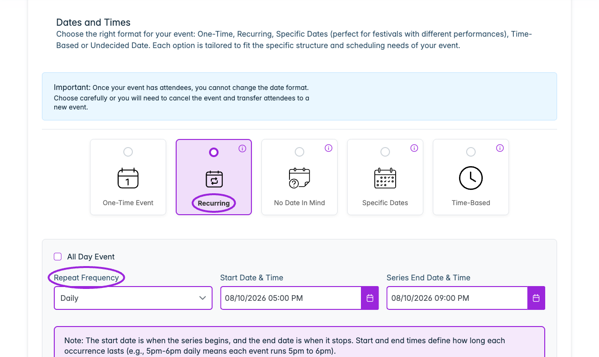
</Frame>

<Frame caption="Weekly recurring events let you choose the repeat weekdays. Monthly and yearly frequencies expose their own repeat rules.">
  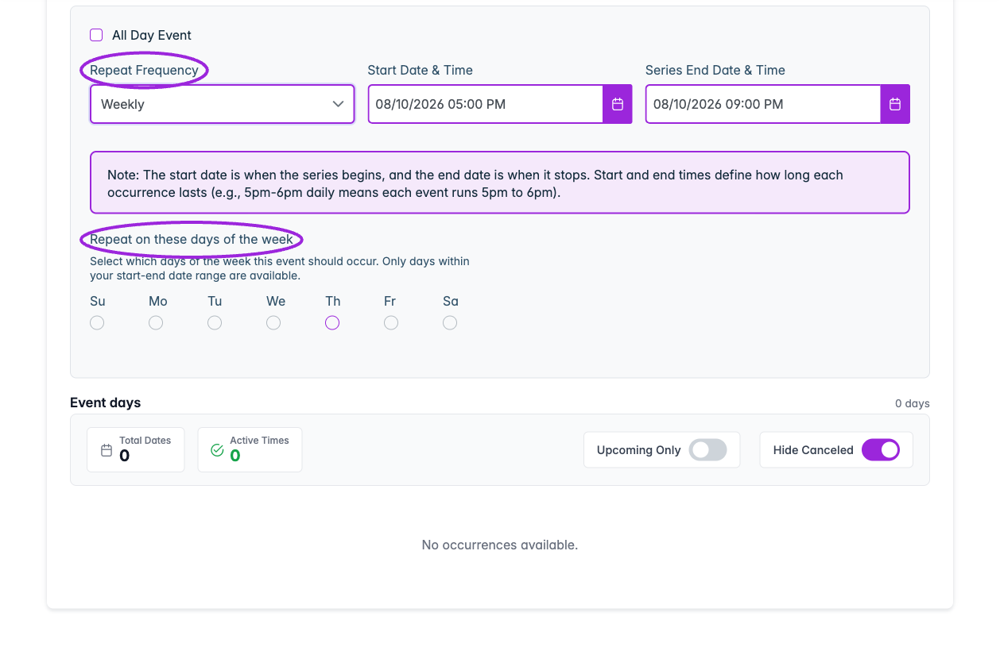
</Frame>

<Accordion title="See yearly recurrence and its occurrence summary">
<Frame caption="Yearly recurrence includes Years to repeat as an optional helper for setting the series end date. Check the occurrence summary before saving.">
  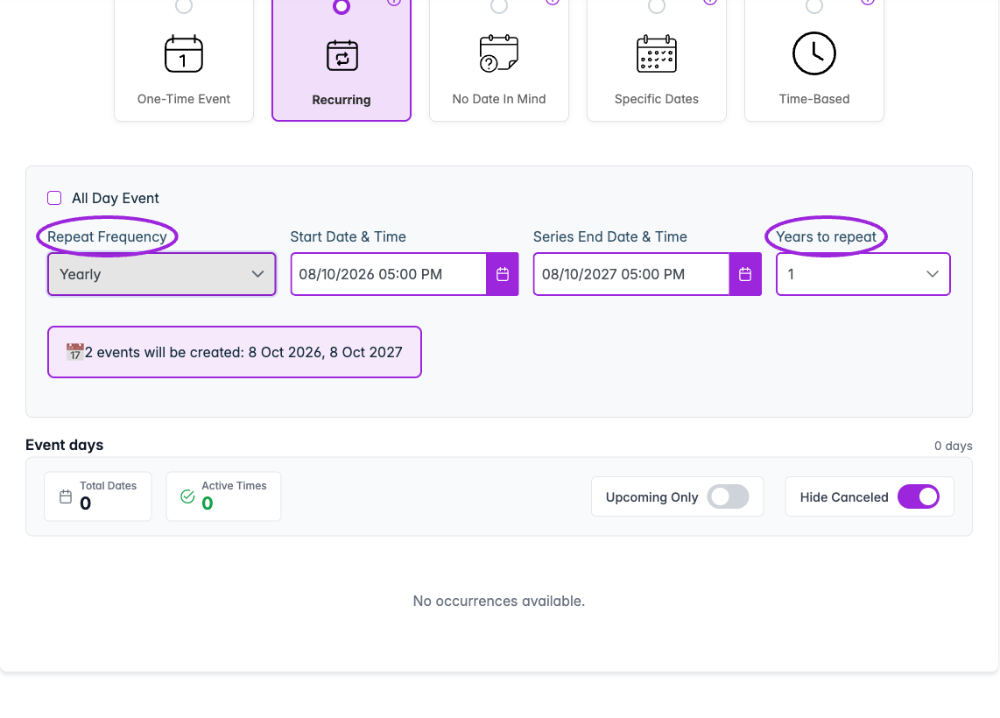
</Frame>

</Accordion>

After saving, inspect **Event days** and its counts. **Upcoming Only** and **Hide Canceled** change the list you see; check those filters when a date appears to be missing.

## No Date in Mind

Choose **No Date In Mind** if the date is not confirmed yet. Continue configuring the event details and tickets, then review the date and any existing registrations before changing the schedule format.

<Frame caption="No Date In Mind lets you configure an event before its date is confirmed.">
  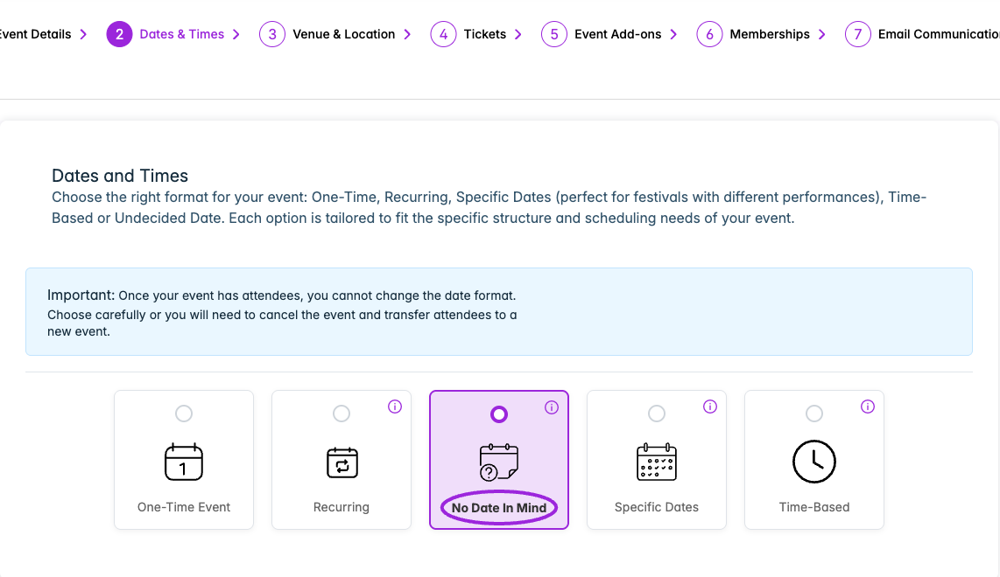
</Frame>

<Frame caption="Monthly recurrence includes Months to repeat as an optional helper for setting the series end date. Review the occurrence summary before saving.">
  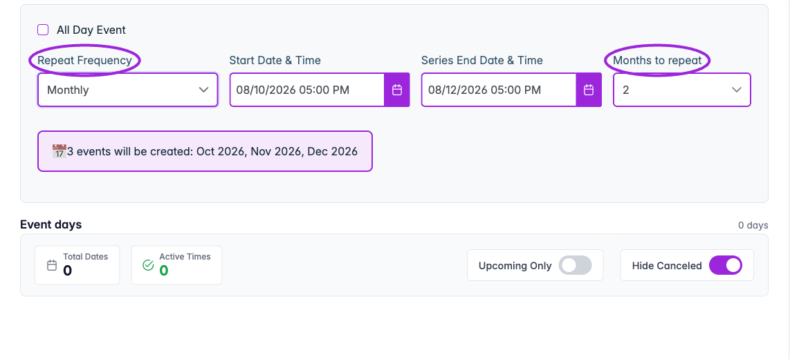
</Frame>

## Specific Dates

Use **Specific Dates** when you need individual event days, such as a festival with different performances.

1. Choose **Specific Dates**, then **Manage dates & times**.
2. Select **+ Add dates**.
3. Choose **Select dates** for individual calendar dates or **Select a range** for a date range.
4. Set the **Time** range. Use **+ Add another time** for additional sessions, or **All day** when appropriate.
5. Select **Add [number] dates** to add the selected dates to the manager.
6. Review the dates and times, adjust the ones that differ, and select **Save**. Review **Save this schedule?**, then select **Save [number] changes**. Verify the resulting date list.

<Frame caption="Manage dates &amp; times → Add dates lets you select individual dates or a range and add one or more time ranges. This example selects two dates without saving them.">
  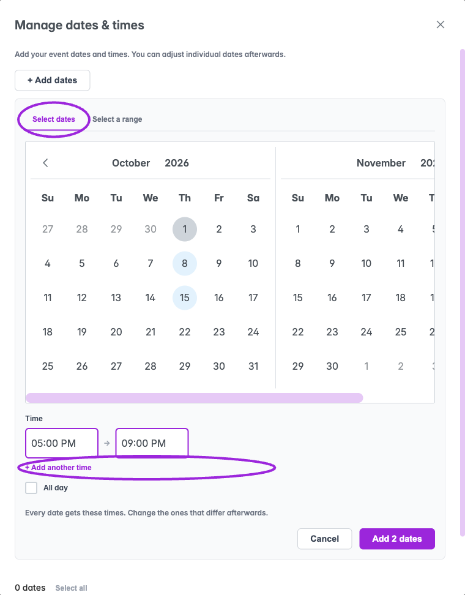
</Frame>

The shared times apply to each selected date. You can adjust individual dates afterwards. See [custom day tickets](./day-specific-tickets) for date-specific titles, ticket choices, capacity, and waitlist overrides.

## Time Based

Choose **Time-Based**, then **Add Times** to create available time slots.

- **Manual Entry:** choose **Day 1** and use **Add Another Day** for additional dates sharing the same slots.
- **Date Range:** select **Start Date**, **End Date**, and **Days of Week**. Review the calculated date/slot count, then use **Generate [number] Dates**.
- **Available Time Slots:** set each **Start Time** and **End Time**, use **Add Time Slot** to add another range, or remove an unneeded slot.

Review the complete schedule and select **Create** when ready. Check the saved date list and the buyer's date/time selection before opening sales.

<Frame caption="Time-Based → Add Times opens manual day entry and multiple available time slots. Create saves this schedule; this is the setup form before creation.">
  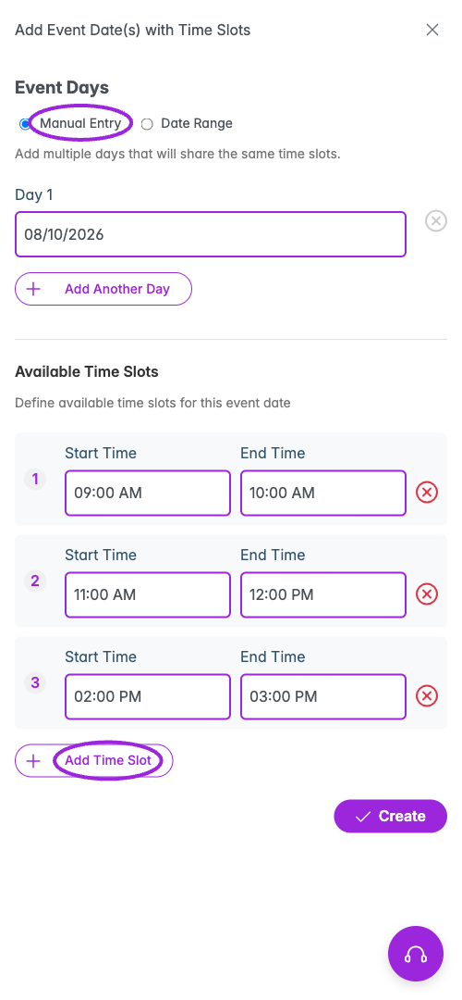
</Frame>

<Accordion title="See Date Range and weekday selection">
<Frame caption="Date Range applies the same set of available time slots across the chosen start and end dates.">
  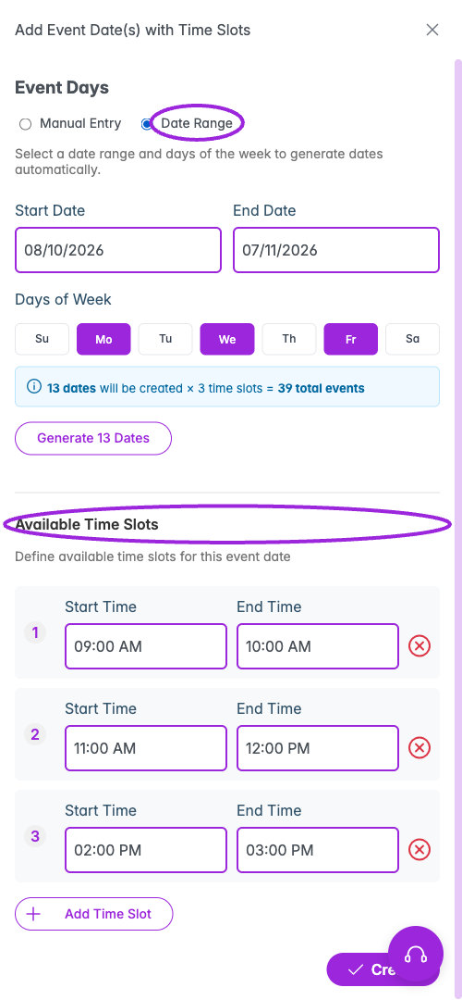
</Frame>

</Accordion>

For the complete booking workflow, see [timed entry, recurring classes, and passes](./timed-entry-and-passes). Recurring dates alone do not create membership access.

## Individual dates and whole-event passes

For **Specific Dates**, **Sell a pass for the whole event** adds an all-days offer alongside individual dates. Click a date’s row to open its drawer and choose shared or custom tickets and override its title, capacity, or waitlist threshold.

<Frame caption="Specific Dates can offer one pass covering the whole event alongside individual date tickets. Customize each date separately after creating its schedule.">
  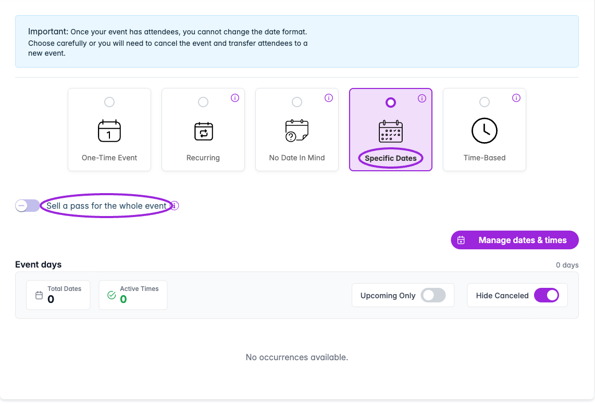
</Frame>

Follow [Customize individual dates and day tickets](./day-specific-tickets) before changing a date that is already on sale.
