Use a saved event with multiple dates when some dates need different ticket offers, titles, or capacity. Start in **Events → Edit event → Dates & Times**, then click the date’s row to open its drawer. For a time-based schedule, use **Day Settings & Tickets** for the day. The row’s **More → Advanced settings** opens the separate occurrence editor.

## Shared or custom tickets

<Frame caption="Use custom tickets reveals Copy the event’s tickets and Start empty. Choosing one changes this date’s ticket source immediately.">
  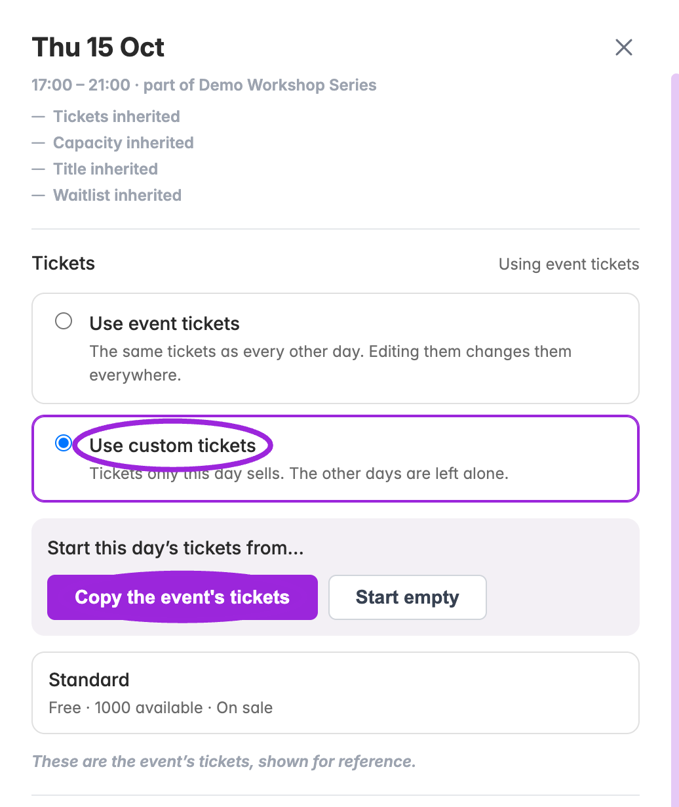
</Frame>

<Frame caption="Click a date row to open its drawer. The inheritance summary identifies the event defaults; shared tickets are shown for reference.">
  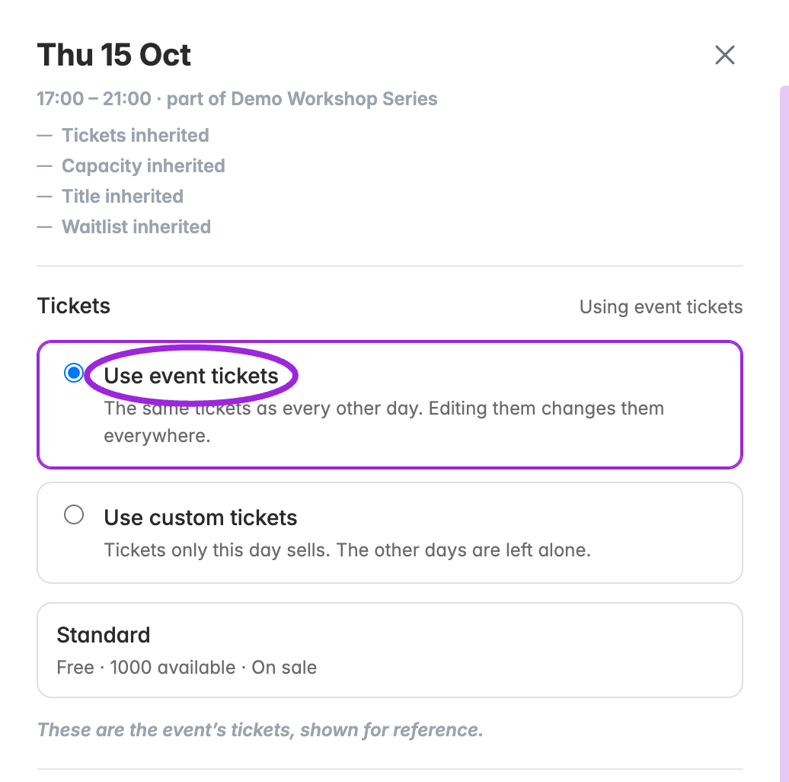
</Frame>

| Choice | Effect |
|---|---|
| **Use event tickets** | The date sells the shared event tickets. They are shown for reference in the date editor. Edit shared tickets in the main Tickets step; those changes affect dates that use them. |
| **Use custom tickets** | The date sells its own tickets. Choose **Copy the event's tickets** to start from the existing offer or **Start empty** to build a different offer. An empty custom list sells nothing. |
| Return to **Use event tickets** | Stops offering the date's custom tickets and restores the event tickets. Custom tickets are kept, so returning to custom mode can restore them. Review the confirmation before switching. |

1. Choose the ticket source for the date.
2. For custom tickets, add or edit ticket names, prices, quantities, limits, access rules, admission rules, and seating categories as needed.
3. Use **Save changes** for edited ticket fields and date overrides. Resolve validation errors and wait for the save to finish. **Discard** abandons unsaved field changes.
4. Open that date in the public selector, then compare a second date to confirm the intended scope.

<Note>
Selecting **Copy the event’s tickets**, **Start empty**, or confirming a return to shared tickets changes the ticket source immediately. **Discard** does not undo a ticket-source change. To return to the previous source, select it explicitly.
</Note>

## Return a date to shared tickets

Select **Use event tickets** and confirm. The date stops selling its custom tickets and uses the event offer again. Custom tickets remain stored; selecting custom tickets again can restore them. Verify the inheritance summary after reloading.

<Frame caption="Select Use event tickets to return to the shared offer. Confirm that the custom tickets will stop selling; they remain stored for reuse.">
  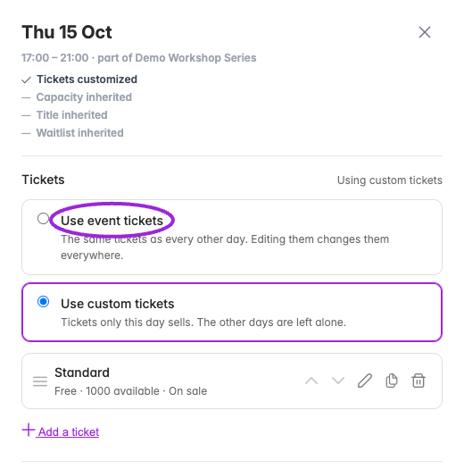
</Frame>

<Frame caption="After confirming, the date uses the event tickets again. Its own tickets are retained but no longer sold while shared tickets are selected.">
  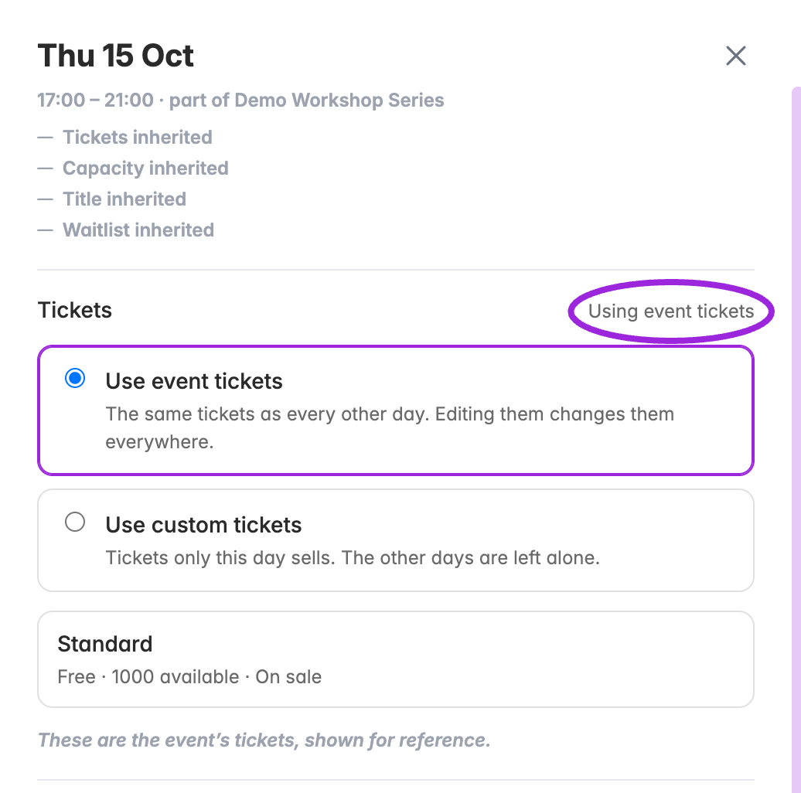
</Frame>

## Custom-date ticket options

<Frame caption="After copying, this date owns its ticket list. Edit, duplicate, remove, reorder, or add tickets here without changing other dates.">
  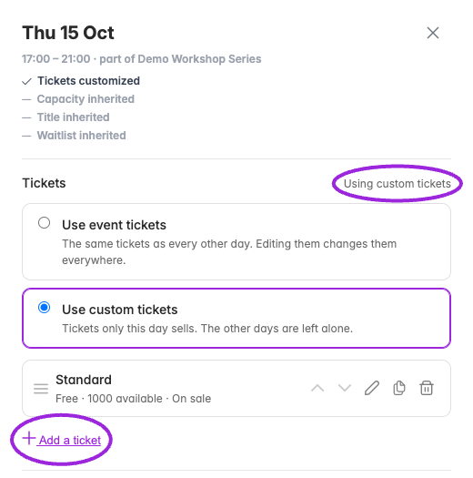
</Frame>

Use the pencil beside a custom ticket to open its editor. **Add a ticket** creates a draft row; the duplicate and remove icons manage the date's own list. Use the up/down arrows to change ticket order. The drawer's **Save changes** saves ticket edits together with date overrides; resolve any validation errors before leaving.

| Section | Controls |
|---|---|
| **Ticket and price** | Name, description, Free/Paid/Pay what you want, price or suggested/minimum price, and status. |
| **How many** | Available quantity, required companion ticket, and minimum/maximum per order. |
| **When it sells** | Sell immediately or schedule Sales open; set Sales close relative to the event start or end using minutes, hours, or days. |
| **Fees and tax** | Pass or absorb the service fee, add a fixed booking fee, let attendees opt out of that fee, and exempt the ticket from tax. |
| **Access & pricing** | Everyone or members only, member pricing, hidden access-code tickets, manual approval, and paying later. |
| **Check-in** | Scan limit, validity period, early check-in, and after-start timing controls. See the timing-label warning below. |
| **Group ticket** | Combine component tickets and quantities. Create the component tickets first. |
| **Autopilot** | Enabled rules with relative timing and visibility, price, or inventory actions. |
| **Seating** | Assign the ticket's categories when a seating chart is available for this date. Resolve loading/setup errors first. |
| **Advanced** | Quantity-based volume prices and installment payments when the account meets their requirements. |

<Warning>
The current day editor's **Stop check-in after a while / Until** saves a delayed opening after the event starts, despite its label. **Limit how long entry stays valid / For** saves the late cutoff relative to event start. Review the [ticket timing reference](./ticket-options-reference#check-in) and test admission before changing a live event.
</Warning>

The sections below show the current controls. Examples are unsaved form states. [Installments](./installment-payments) require Business access and a connected Stripe account with payments enabled.

<AccordionGroup>
<Accordion title="Ticket and price">

<Frame caption="Custom date ticket → Ticket and price. These controls apply to this date’s own tickets; use Save changes in the date drawer to save edits.">
  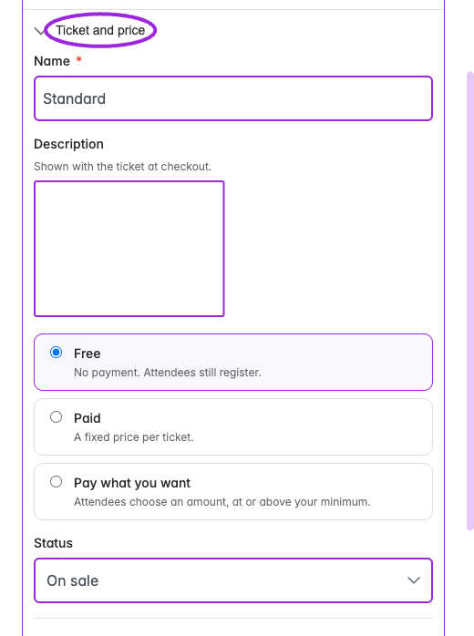
</Frame>

</Accordion>
<Accordion title="Quantity and sales windows">

<Frame caption="Custom date ticket → How many. These controls apply to this date’s own tickets; use Save changes in the date drawer to save edits.">
  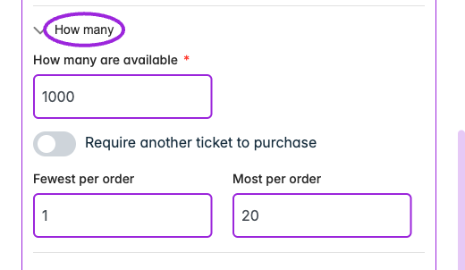
</Frame>

<Frame caption="Turn off Start selling immediately to configure Sales open. Choose an opening earlier than Sales close; this unsaved form shows the controls before a valid schedule is entered.">
  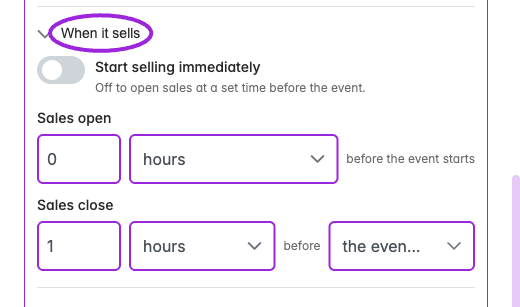
</Frame>

</Accordion>
<Accordion title="Fees and tax">

<Frame caption="Custom-day Fees and tax can pass or absorb service fees, add a fixed booking fee, allow opting out, and exempt the ticket from tax. This example is unsaved.">
  
</Frame>

</Accordion>
<Accordion title="Access and member pricing">

<Frame caption="Custom date ticket → Access &amp; pricing. These controls apply to this date’s own tickets; use Save changes in the date drawer to save edits.">
  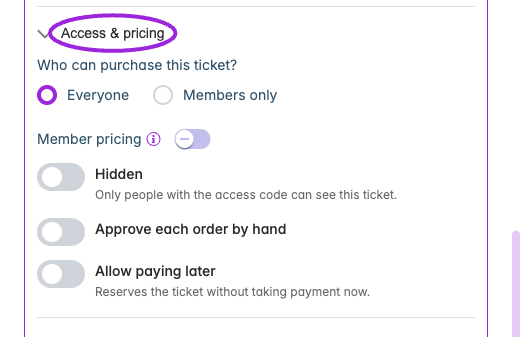
</Frame>

<Frame caption="Hidden tickets require an access code. Manual approval and paying later are separate controls; this unsaved example shows the code field.">
  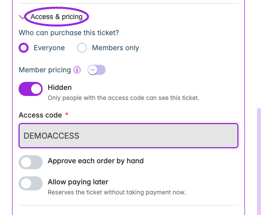
</Frame>

</Accordion>
<Accordion title="Check-in and validity">

<Frame caption="Enable a check-in timing control to show its amount and unit. The current day-editor labels should be checked against the saved admission behavior before changing a live event.">
  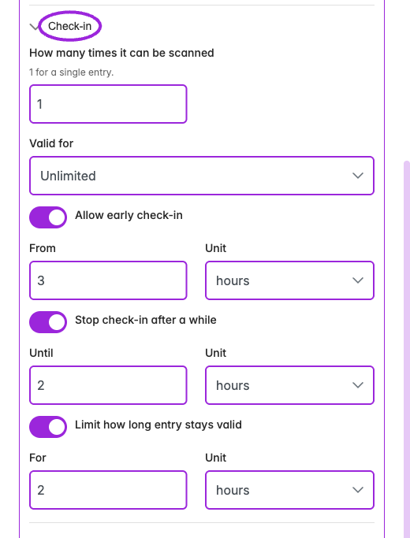
</Frame>

</Accordion>
<Accordion title="Groups and automation">

<Frame caption="A group ticket sells other tickets together. Add component tickets and quantities; this unsaved example shows the group setup.">
  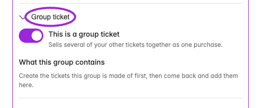
</Frame>

<Frame caption="Autopilot rules specify a time before the event starts or ends and an action. Review the rule and any conflicts before saving.">
  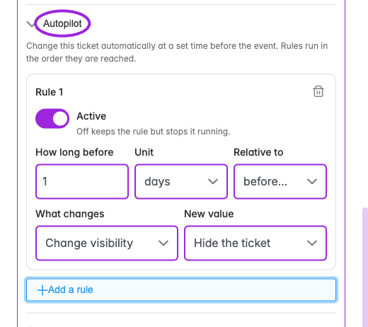
</Frame>

</Accordion>
<Accordion title="Seat categories">

<Frame caption="The date ticket's Seating section uses the chart assigned to that occurrence and shows whether it inherits the event chart. Select the categories this ticket can book before saving.">
  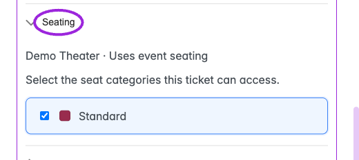
</Frame>

</Accordion>
<Accordion title="Volume pricing and installments">

<Frame caption="Volume pricing adds quantity thresholds and a price per ticket. Installments remain unavailable until the required Stripe payment connection is enabled.">
  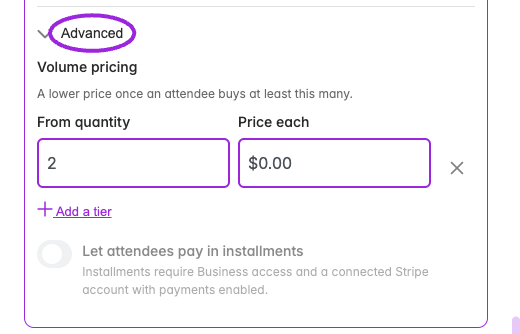
</Frame>

</Accordion>
</AccordionGroup>

## Date overrides

The date drawer shows **Capacity**, **Waitlist**, and **Title** with an option to use the event's value or customize the date. Turning off an override returns it to the event's current value. Use 0 for invitation-only access from the start; leave the custom threshold blank for the existing waitlist behavior. The threshold must fit the effective capacity for that date; see [capacity-limited waitlists](./waitlist#invitation-only-purchasing-within-event-capacity).

**Booking label (optional)** replaces the displayed date or time in the booking selector, for example with “Spring 2027.” It accepts up to 80 characters. Leave it blank to show the date or time; scheduling and availability still use the actual dates.

<Frame caption="Use Customize to set capacity and waitlist thresholds for one date. This example is an unsaved form state.">
  
</Frame>

<Frame caption="The custom title and booking label affect this date. Save changes commits the fields; Discard abandons unsaved edits.">
  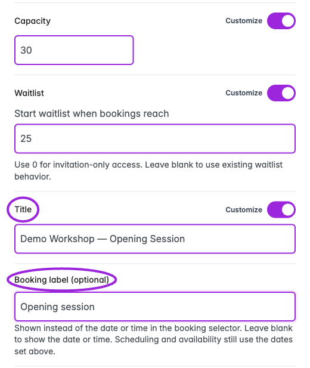
</Frame>

Check inheritance before changing a series: an overridden date can intentionally differ from its parent. For time-based schedules, check both the day and its individual time slots.

## Sell a pass for the whole event

In **Dates & Times → Specific Dates**, enable **Sell a pass for the whole event** to offer one ticket covering every day alongside individual-date tickets. This option is specific to **Specific Dates**; a recurring schedule does not automatically create an all-dates entitlement.

Configure the whole-event offer and date-specific tickets, then review **Design → Widget → Display → Event details** for **Offer an all-sessions pass** and **Offer single sessions**. Turning both display choices off selects all-sessions access automatically and skips date/time selection; test that this matches the offer.

Do not add parent and child capacities together to describe the number of places available. Verify the actual date and pass availability in checkout.

## Assigned seating and Shopify

Custom day tickets need category assignments for the chart used by that date. Resolve any seating setup error before saving; use **Retry seating setup** when shown. Check the map on the same occurrence customers will book.

After changes to a Shopify event's ticket offer, update its linked product and test that date in the [Shopify Ticket Selector](/plugins/shopify-ticket-selector). Confirm the purchased date, ticket, and seat in attendee records.
