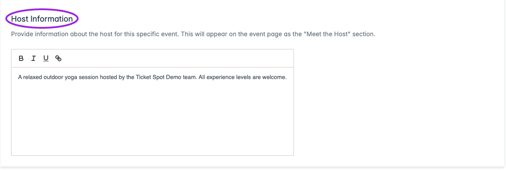

Open **Events → Edit event → Display Settings**. These overrides apply to this event; shared appearance is configured under Design.

| Area / control | Effect |
|---|---|
| **Widget Text Overrides → Event Button Text** | Replaces the calendar/widget attend-button text for this event. Leave blank to use Design → Widget text. |
| **Event Page Customization → Host Logo** | Upload an event-specific host logo, recommended 200×200px or larger. Use **Remove Logo** to remove the override. |
| **Text Overrides → Buy Tickets Button Text** | Replaces the hosted event page's purchase-button text. Leave blank to use Design → Event Page. |
| **Text Overrides → Site Name / Host Name** | Overrides the name on the event page and kiosk. Leave blank to use the site's name. |
| **Host Information** | Rich text for this event's Meet the Host section; supports bold, italic, underline, and links. |

Save/update the event, then inspect both the hosted event page and the widget. A change to the widget button does not also change the hosted-page button.

Older screenshots show event-level **Show Hosts** and **Show Attendee List** controls. The current event editor does not expose those switches. Use **Design → Event Page** for host/attendee visibility, and **Design → Widget → Display → Hosts & attendees** for the listing. The Meet the Host section must be visible for its content to appear.

For all shared styling controls, use the [design reference](/branding-and-design/design-options-reference) and [widget settings](/branding-and-design/widget-customization-overview).

## Widget button override

<Frame caption="Event Button Text overrides this event’s widget button. Leave it blank to inherit the widget’s shared text settings.">
  
</Frame>

## Event page overrides

<Frame caption="Host Information supplies this event’s Meet the Host content. Enable that section in the shared event-page design, then save the event.">
  
</Frame>

<Frame caption="Event Page Customization has separate logo, purchase-button, and site/host-name overrides. Empty text fields use the shared event-page design defaults.">
  
</Frame>
