Set up automated emails to keep your attendees informed at every stage of the event. You can
send confirmation emails after a ticket purchase, schedule reminders, gather post-event
feedback, or send a custom message anytime. All communication is handled directly inside
Ticket Spot, so you can stay connected with your guests effortlessly.

Let’s get started 🚀

**Step 1:** Select the **Event** you want to manage and click on the **Email Communication** to open
all communication options for that event.

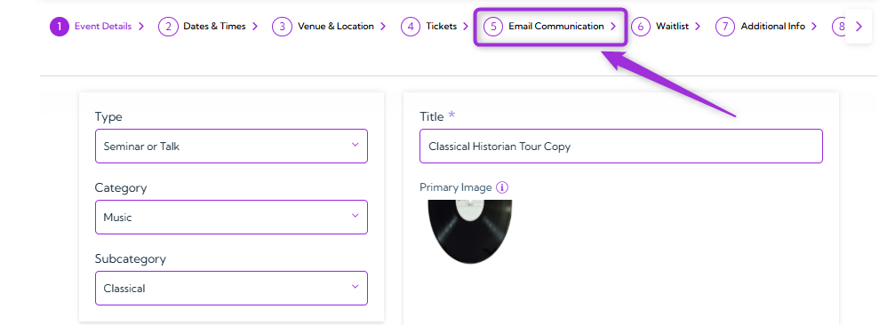

You will see four communication options, each supporting a different stage of your event’s
attendee communication.

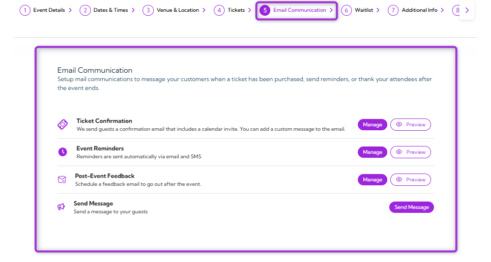

## Ticket Confirmation

This email is sent automatically when someone buys a ticket for your event. You can enable it,
customize the subject and message, attach ticket files, and use tokens to insert real event data
into the email.

1. Click on the **Manage** button to open a settings panel for the ticket confirmation email.

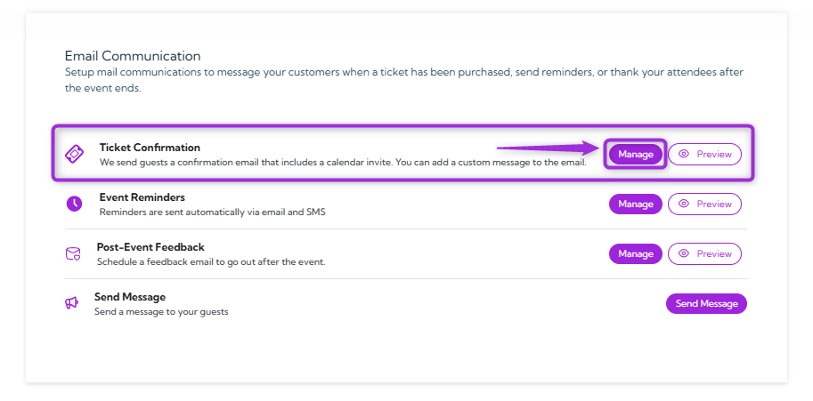

2. In the side panel, turn on the **toggle** button to activate the **Ticket Confirmation** email for
   this event.

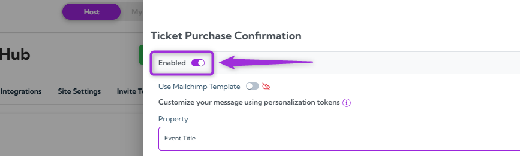

### Customize the Message

You can customize the email message using tokens that automatically insert real event and
attendee information. The table below explains each field.

| Field      | Description                                                                 | Example                                             |
| ---------- | --------------------------------------------------------------------------- | --------------------------------------------------- |
| **Property**   | Select the type of information you want to insert into the email (e.g., Event Title, summary). | Property selected: Event Title                      |
| **Token**      | Auto-generated placeholder that pulls real event data into the email       | `{{event_title}}`                                   |
| **Subject**    | The email subject line was sent to attendees. Supports tokens for personalization. | Your tickets for `{{event_title}}` are ready!       |
| **Email Body** | The main email content. You can personalize it with tokens and custom text. | “Hi `{{first_name}}`, your ticket for `{{event_title}}` is confirmed.” |

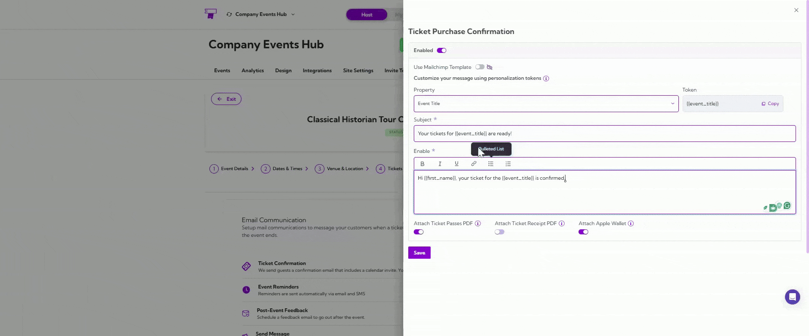

### Attachment Options

You can choose to include additional ticket files with the confirmation email. These options help
attendees access their tickets easily in different formats.

Turn on the toggle next to each attachment you want to include.

| Attachment          | Description                                                                                                                         |
| ------------------- | ----------------------------------------------------------------------------------------------------------------------------------- |
| **Ticket Passes PDF**   | Attaches a PDF containing the attendee’s Ticket Passes. Each pass includes a unique QR code for event entry and verification.      |
| **Ticket Receipt PDF**  | Adds a PDF receipt that shows a detailed breakdown of the purchase, including ticket items and the total amount billed.            |
| **Apple Wallet**        | Includes an Apple Wallet pass so attendees can add their ticket directly to their Wallet for quick access and scanning.            |

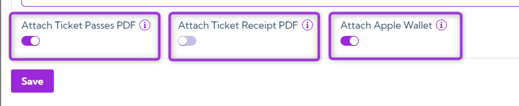

Once you’re done customizing the message, click on the Save button to apply your changes.

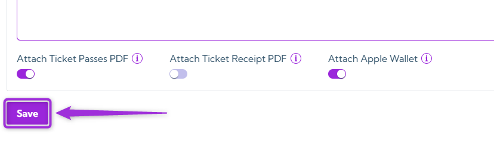

> **Note:** If you want to use your own email template, enable the [Mailchimp integration](../integrations/mailchimp) with Ticket Spot. After connecting Mailchimp, turn on the Use Mailchimp Template toggle to apply
your custom template to this email.
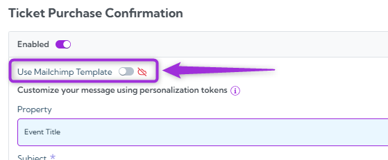

### Preview Ticket Confirmation Email

You can also preview the email template by sending a test email.

1. Click the Preview button to open the test email window.

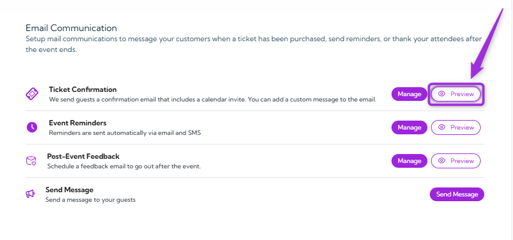

2. Enter your email, first name, and last name, then click the Send Test button to send the
   test email.

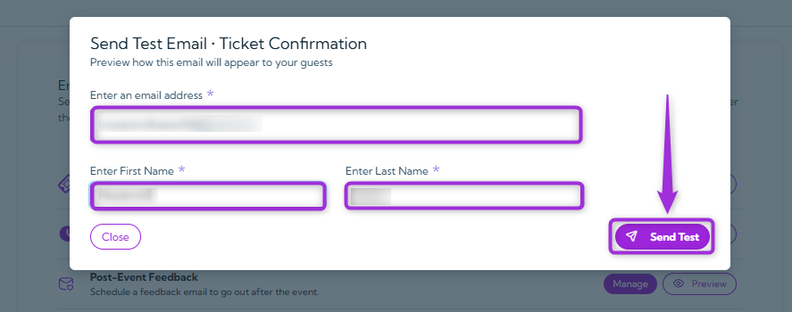

You will receive the test email in your inbox, where you can review the message and formatting.

## Event Reminders

Event reminders are sent automatically to your attendees by email and SMS before the event
starts. You can enable or disable each reminder and choose when it should be delivered.

1. Click on the Manage button to open a settings panel for the event start reminders.

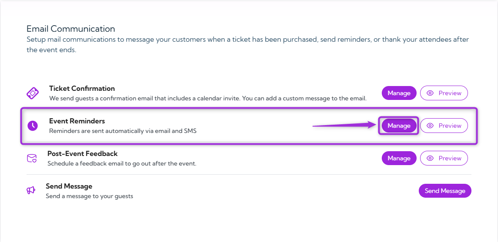

2. You can use the toggle next to each reminder to enable or disable it at any time.

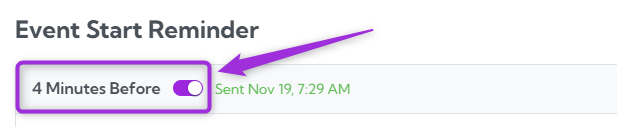

3. In the side panel, you’ll see two default reminders—click the + icon next to any reminder
   to customize its timing and message.

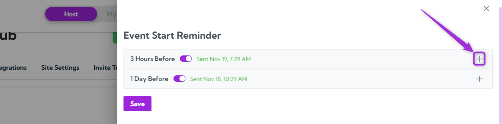

4. Enter how long before the event the reminder should be sent, and choose the unit
   (Minutes / Hours / Days).

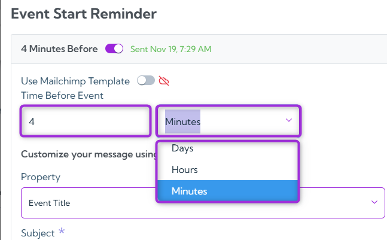

### Customize the Reminder Message

You can customize the reminder message using tokens that automatically insert real event and
attendee information. The table below explains each field.

| Field    | Description                                          | Example                                   |
| -------- | ---------------------------------------------------- | ----------------------------------------- |
| **Property** | Select event or attendee information to insert into the reminder. | Property selected: Event Title            |
| **Token**    | Placeholder that automatically pulls real event data. | Copy and use `{{event_title}}` placeholder |
| **Subject**  | The reminder subject line was sent to attendees.     | `{{event_title}}` is starting in 1 hour   |
| **Message Body** | The content of the reminder message.             | “Hi `{{first_name}}`, we’re excited to see you at `{{event_title}}`.” |

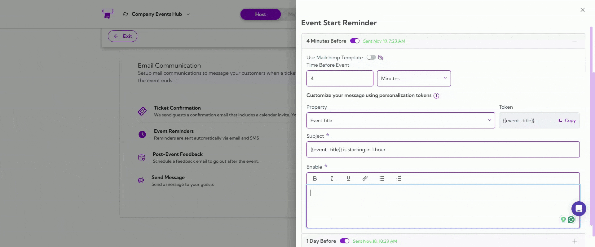

After updating your event reminder message, click Save to apply all changes.

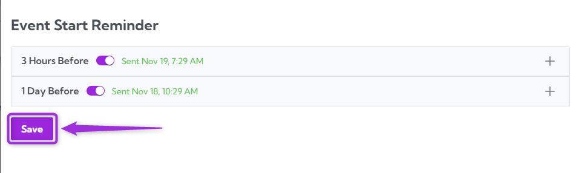

> **Note:** If you want to use your own email template, enable the [Mailchimp integration](../integrations/mailchimp) with Ticket Spot. After connecting Mailchimp, turn on the Use Mailchimp Template toggle to apply your custom template to this email.
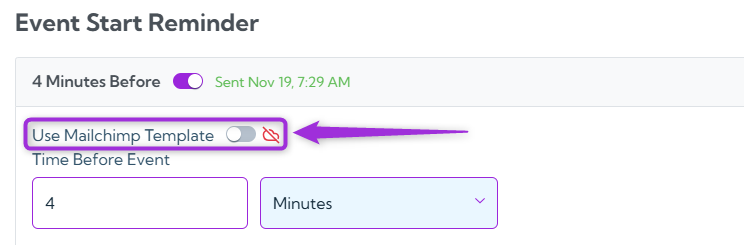

### Preview Event Reminder Email

You can also preview the reminder email by sending a test email.

1. Click on the Preview button to open the test email window.

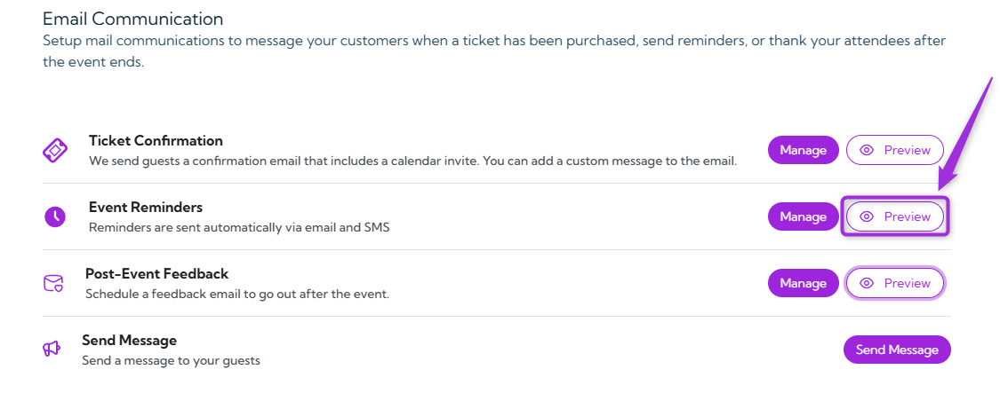

2. Enter your email, first name, and last name, then click Send Test to send the reminder
   preview.

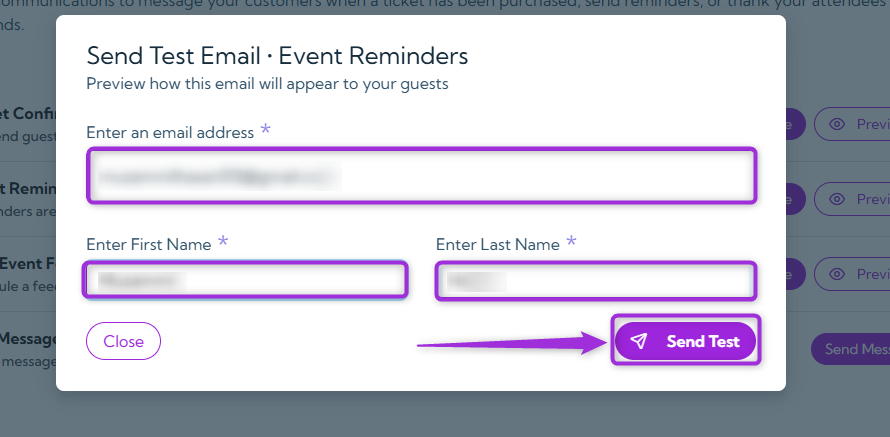

You will receive the test email in your inbox, where you can review the reminder content and
formatting.

## Post-Event Feedback

A feedback email can be scheduled to send automatically after your event ends. This helps you
collect insights from attendees and understand their experience.

1. Click on the Manage button to open a settings panel for Post-Event Feedback.

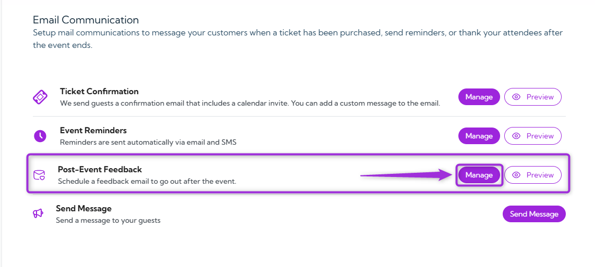

2. In the side panel, turn on the toggle button to activate the Post Event Feedback email
   for this event.

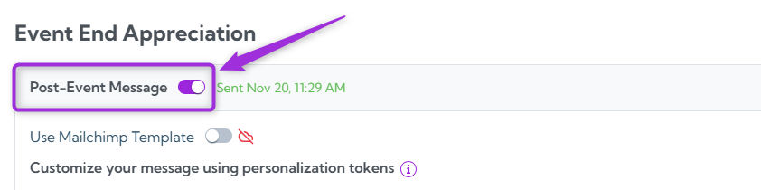

### Customize the Message

You can customize the post-event message using tokens that automatically insert event or
attendee information. The table below explains each available field.

| Field      | Description                                              | Example                                              |
| ---------- | -------------------------------------------------------- | ---------------------------------------------------- |
| **Property**   | Select the event or attendee information you want to include. | Property selected: Event Title                       |
| **Token**      | Placeholder that inserts real data into the email.       | Used in subject: Thank you for joining `{{event_title}}` |
| **Subject**    | The email subject was sent to attendees. Supports tokens. | Thank you for joining `{{event_title}}`              |
| **Email Body** | The content of the follow-up message. Supports formatting and tokens. | “We appreciate you joining us at `{{event_title}}`.” |

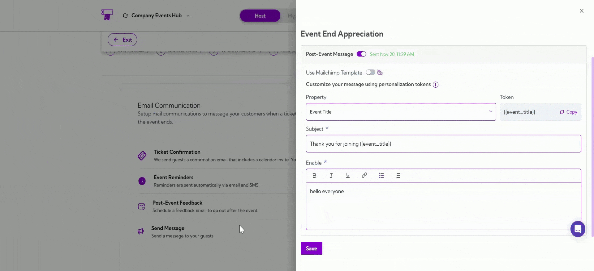

After customizing your post-event message, click on the Save button to apply your changes.

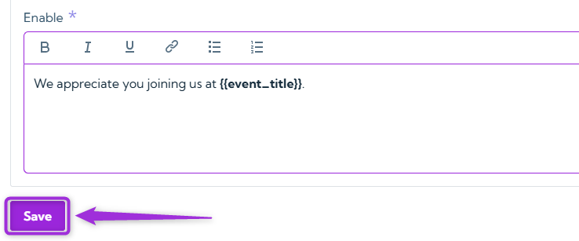

> **Note:** If you want to use your own email template, enable the [Mailchimp integration](../integrations/mailchimp) with Ticket Spot. After connecting Mailchimp, turn on the Use Mailchimp Template toggle to apply your custom template to this email.
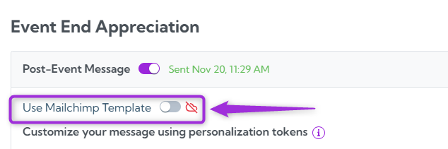

### Preview Post-Event Feedback Email

You can preview the post-event feedback message before it gets scheduled.

1. Click on the Preview button to open the test email window.

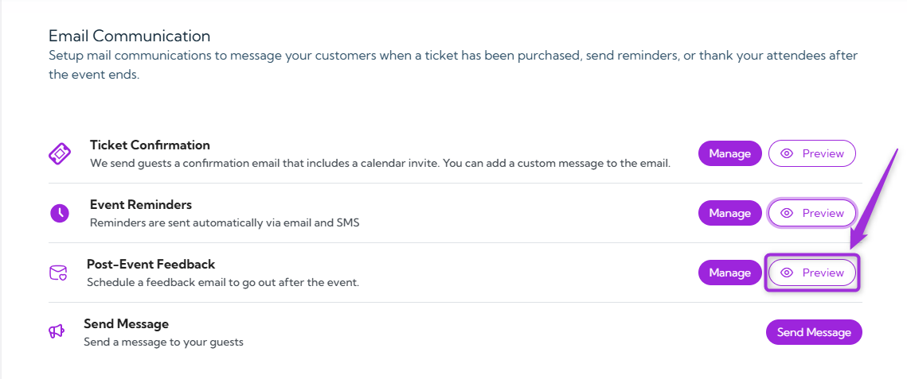

2. Enter your email, first name, and last name, then click Send Test to receive the preview.

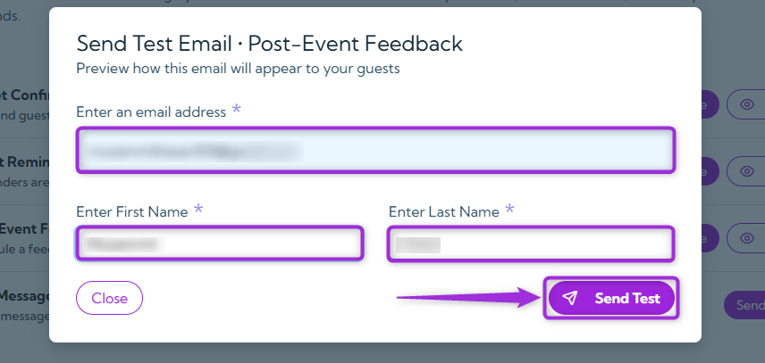

You will get the test email in your inbox, allowing you to review the message exactly as
attendees will see it.

## Send Message

Use Send Message to send targeted announcements or updates to your attendees based on
their registration status. This also allows you to send bulk messages to specific groups, keeping
your audience informed with important event details at any stage.

1. Click on the Send Message button.

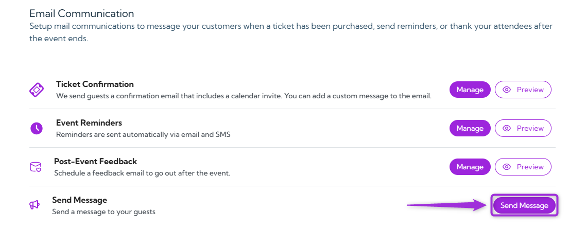

2. In the side panel, click on the Create Message button to create a new message.

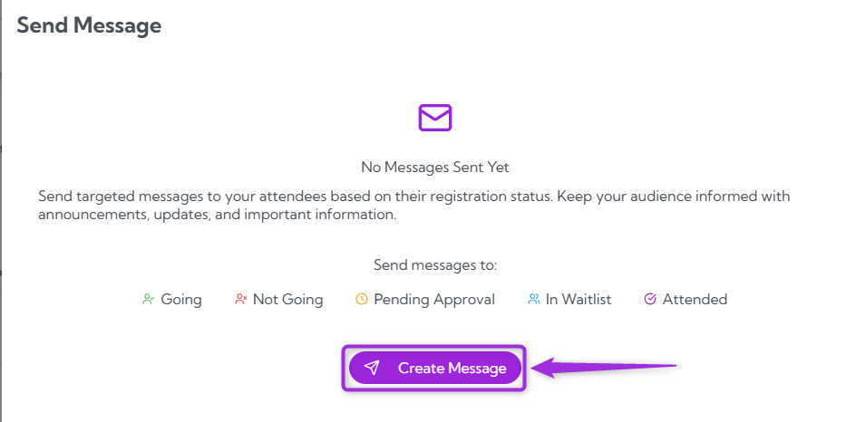

A modal window will appear, where you can create and send a message to your selected
attendees.

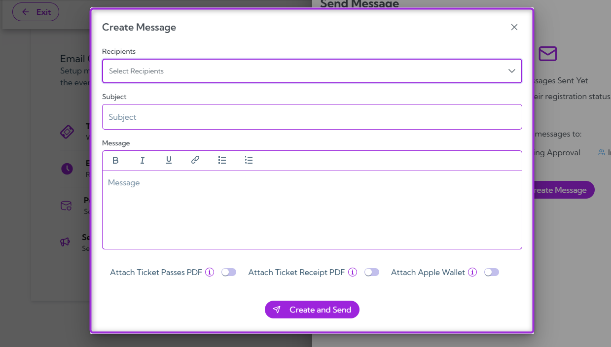

3. Enter the required details for your message—select a recipient group, add a subject, and
   write the message body. The table below explains each field.

### Message Fields

| Field        | Description                                                                                     | Example                                      |
| ------------ | ----------------------------------------------------------------------------------------------- | -------------------------------------------- |
| **Recipients**   | Choose the attendee group you want to message. (e.g., Going, Not Going, Pending Approval, In Waitlist, Attended). | Selected: Going                              |
| **Subject**      | Enter the subject line for your announcement or update.                                         | “Event Update for Going Attendees”          |
| **Message Body** | Write your message. You can format text, add bullet points, and include links.                  | “Hi everyone, here’s the latest update for tomorrow’s event…” |

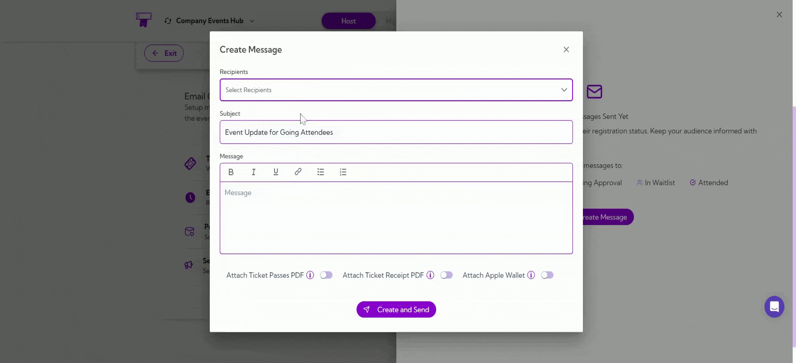

>**Tip:** You can also select multiple recipient groups at once if you want to send the same
message to more than one attendee segment.

### Attachment Options

You can attach additional ticket files when sending a message to attendees. These attachments
help attendees access their tickets or receipts directly from your message.

Turn on the toggle next to each attachment you want to include.

| Attachment         | Description                                                                                                                        |
| ------------------ | ---------------------------------------------------------------------------------------------------------------------------------- |
| **Ticket Passes PDF**  | Attaches a PDF of the attendee’s Ticket Passes. Each pass includes a unique QR code that can be used for event entry and verification. |
| **Ticket Receipt PDF** | Adds a PDF receipt with a full breakdown of the ticket purchase, including each item and the total billed amount.                 |
| **Apple Wallet**       | Includes the Apple Wallet pass so attendees can add their ticket directly to Apple Wallet for quick access and scanning.          |

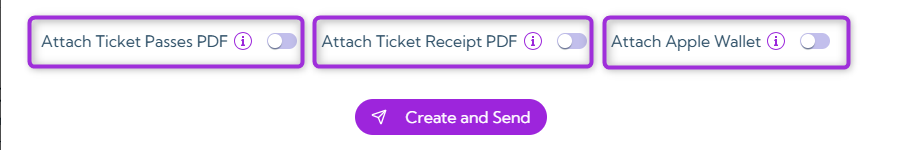

After entering your message details, click Create and Send to deliver the message to the
selected recipients.

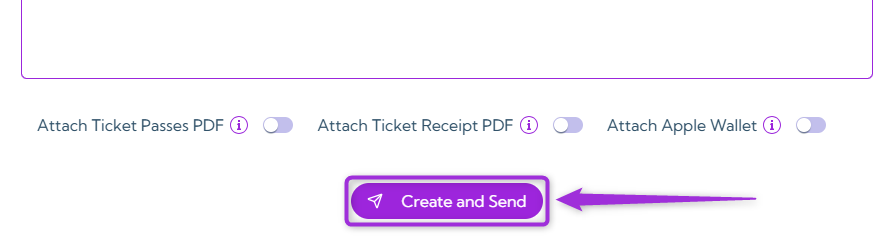

Together, these communication tools help you keep your attendees informed at every stage of
the event, ensuring a smooth and engaging experience from purchase to post-event follow-up.