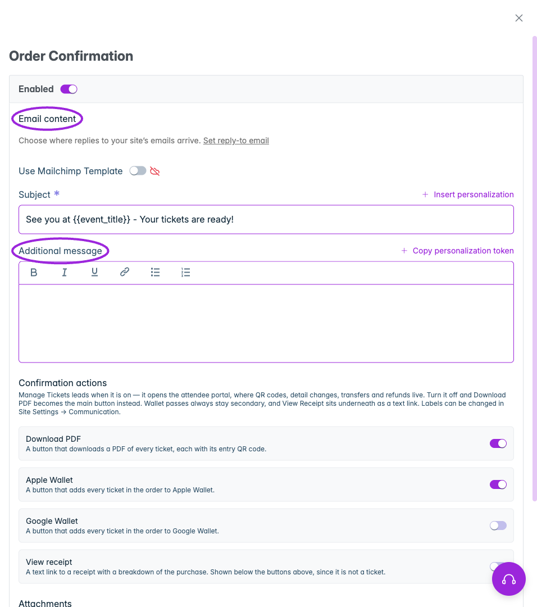
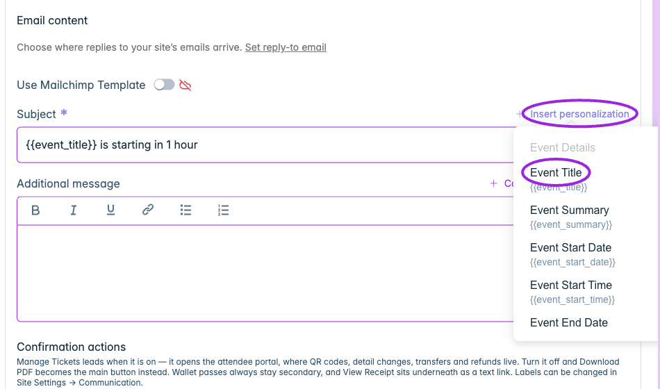
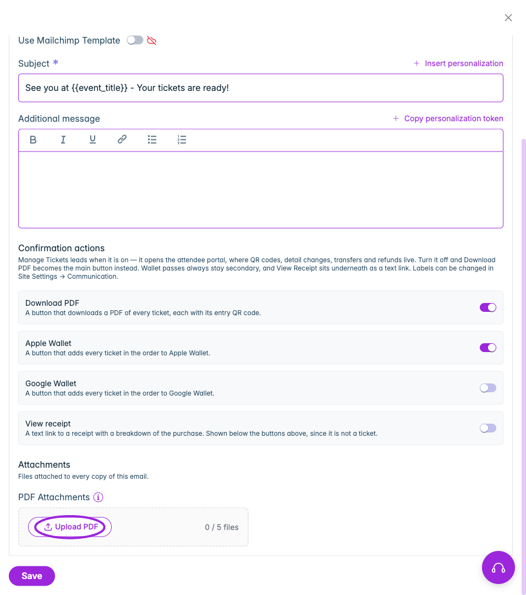
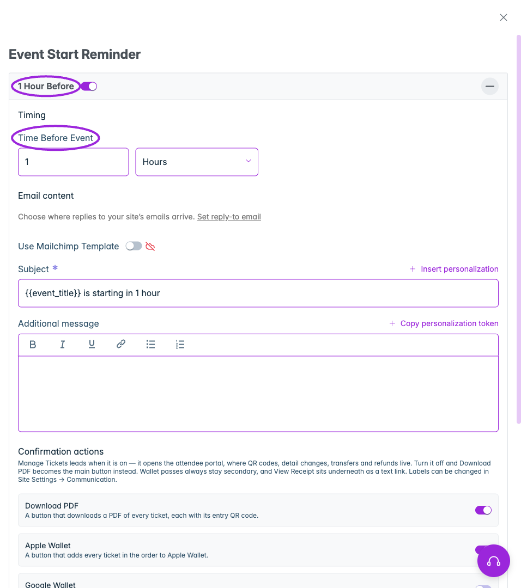
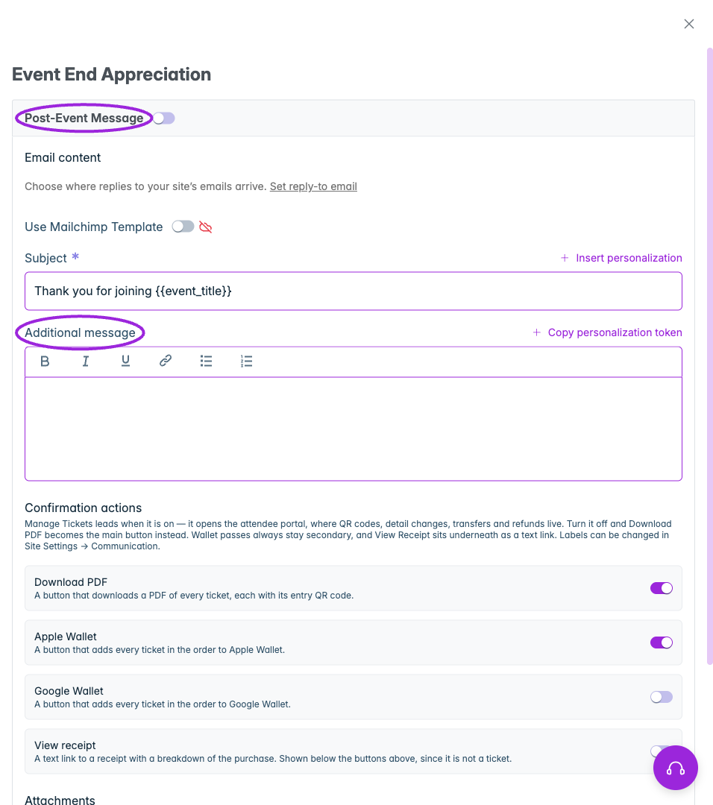
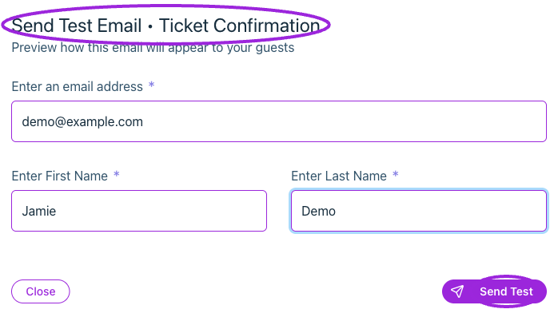
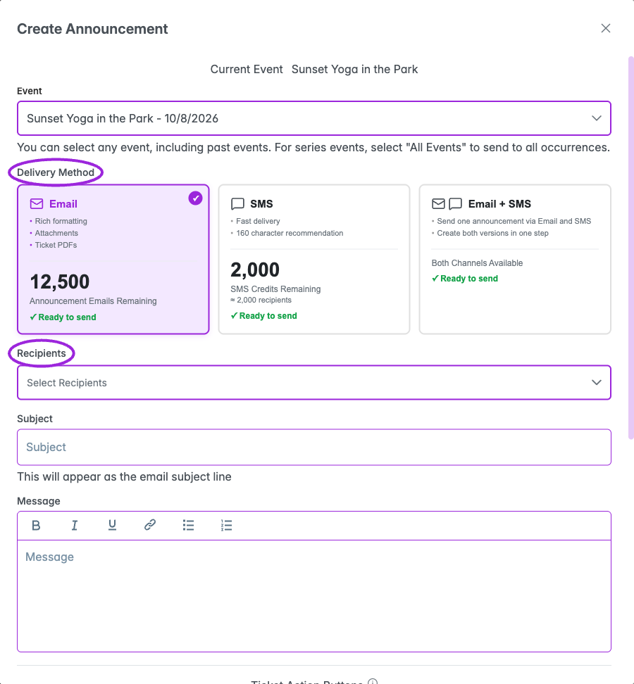
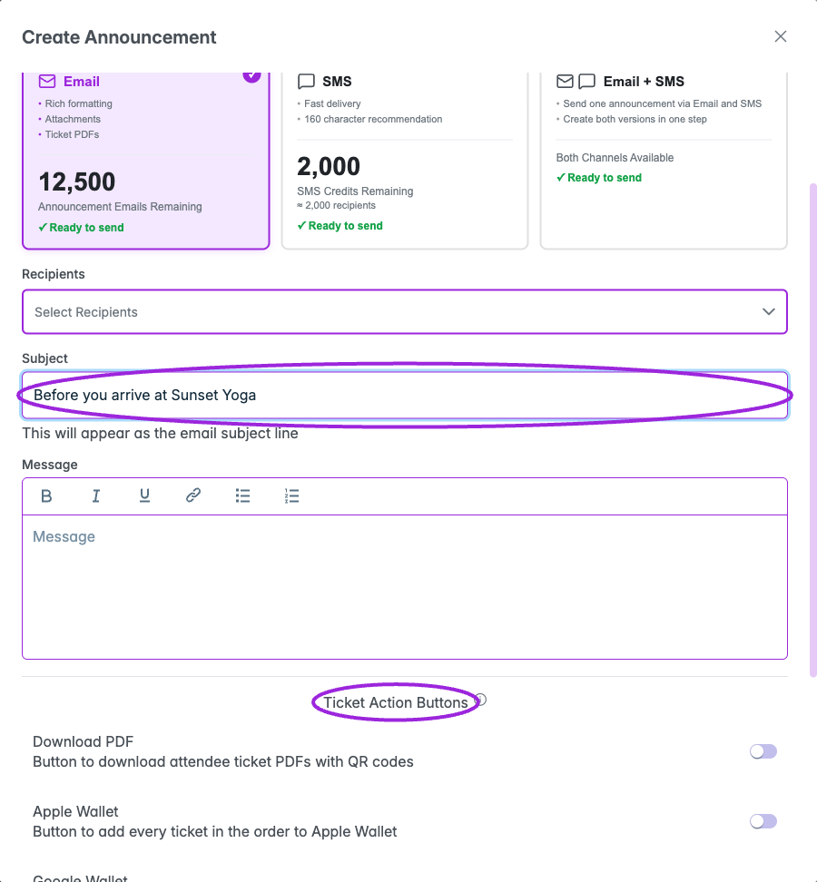
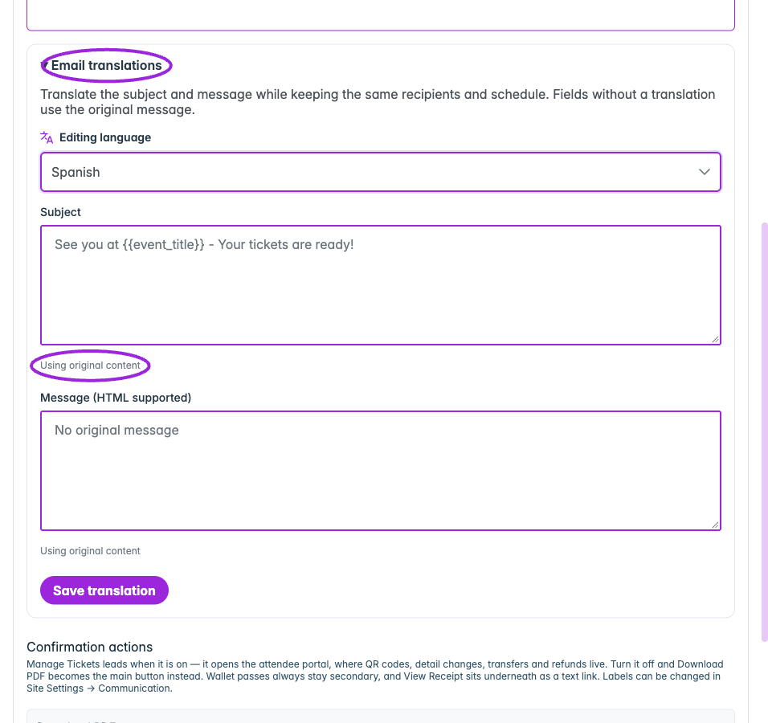

Open an event and select **Email Communication**. **Ticket Confirmation**, **Event Reminders**, and **Post-Event Feedback** each have **Manage** and **Send Test** actions. **Send Message** opens attendee announcements.

## Ticket Confirmation

<Frame caption="Manage Ticket Confirmation to edit the subject, custom message, confirmation actions, and attachments.">
  
</Frame>

Select **Manage** under Ticket Confirmation. In **Order Confirmation**, use **Enabled** to control the email, edit the **Subject** and **Additional message**, and select **Save**.

The confirmation follows a ticket purchase or registration. Its message content is separate from the shared colors, layout, and labels configured in [Attendee Communication design](/branding-and-design/attendee-communication-design).

## Personalize the subject and message

- **Insert personalization** inserts a selected token into the subject.
- **Copy personalization token** provides a token to paste into the additional message.
- Keep placeholders such as `{{event_title}}` intact. Use the names supplied by the picker, such as `{{attendee_first_name}}`, rather than inventing a placeholder.
- **Set reply-to email** opens the site setting for replies. This does not change the sending identity by itself.
- **Use Mailchimp Template** requires a connected [Mailchimp account](/integrations/mailchimp).

<Frame caption="Insert personalization opens the available subject tokens. Choose Event Title to insert the event title placeholder.">
  
</Frame>

## Ticket actions and PDF attachments

Ticket actions provide links in the email. They are separate from uploaded file attachments.

| Control | What the attendee receives |
|---|---|
| **Manage Tickets**, where available | Opens the attendee portal. When enabled, it is the leading action. |
| **Download PDF** | A button to download ticket PDFs containing entry QR codes. It becomes the main action when Manage Tickets is off. |
| **Apple Wallet** | A button to add the order's tickets to Apple Wallet. |
| **Google Wallet** | A button to add the order's tickets to Google Wallet. |
| **View receipt** | A receipt link below the ticket actions. |
| **PDF Attachments → Upload PDF** | Up to five organizer-supplied PDF files attached to each copy of the email. |

<Frame caption="Use confirmation action switches for ticket and wallet links. Upload PDF adds your own attachments, with up to five files per email.">
  
</Frame>

Review both the selected actions and uploaded files before saving. Ticket, wallet, and receipt labels can be changed in Attendee Communication design.

## Event Reminders

1. Select **Manage** under Event Reminders.
2. Use each reminder's switch to enable or disable it.
3. Select its **+** button to expand the settings.
4. Set **Time Before Event**, with minutes, hours, or days.
5. Edit the subject, additional message, ticket actions, and attachments.
6. Select **Save**.

<Frame caption="Expand a reminder with its plus button to edit Time Before Event, the subject, and the message. Use each reminder’s switch to enable or disable it.">
  
</Frame>

The Demo event shows separate one-hour and one-day reminders. Review every reminder you leave enabled. Email and [SMS communication](./sms-communication) have their own content and delivery settings.

## Post-Event Feedback

Select **Manage** under Post-Event Feedback. In **Event End Appreciation**, use the **Post-Event Message** switch, write the subject and additional message, configure its actions and attachments, then select **Save**. Use a feedback link in the message when you want responses through a form or survey.

<Frame caption="Post-Event Feedback opens the post-event message editor for its subject, additional message, actions, and attachments.">
  
</Frame>

## Preview with Send Test

<Frame caption="Send Test opens a separate form for your test recipient’s email and name. This example is filled without sending a message.">
  
</Frame>

Use **Send Test** on the communication card to open the test-email form. Enter your test recipient details and submit the form to receive a sample. Check the rendered subject, message, tokens, links, and any attachments before enabling a customer-facing message.

## Send Message

Use **Send Message → Create Announcement** for an update to selected attendee groups.

1. Select the **Event**. For a series, use the offered all-events choice when the announcement should cover its occurrences.
2. Choose **Email**, **SMS**, or **Email + SMS** under **Delivery Method**. Review the available credits shown for the selected channels.
3. Select **Recipients**: Going, Not Going, Pending Approval, In Waitlist, or Attended. Multiple groups can be selected.
4. Write the email subject and message. For SMS or Email + SMS, complete the SMS version too.
5. Choose ticket action buttons and any additional PDFs for the email.
6. Review the event, recipients, content, and channels, then select **Send Announcement**.

<Frame caption="Create Announcement lets you choose the event, Email, SMS or Email + SMS, and the attendee-status recipient groups.">
  
</Frame>

<Accordion title="See the announcement message and ticket actions">

<Frame caption="Compose the announcement and choose ticket actions and PDF attachments. Send Announcement submits it to the selected recipients.">
  
</Frame>

</Accordion>

## Language variants

<Frame caption="Enter a language-specific subject and message, preserving the original template variables. Customized marks the edited field; Save translation is required to persist it. This example is an unsaved draft.">
  
</Frame>

<Frame caption="Event Email translations uses the original subject and message until you supply a variant for the selected language.">
  
</Frame>

Turn on **Multilingual communications** in **Design → Attendee Communication**. For a saved event email, expand **Email translations**, select a language, and edit **Subject** and **Message (HTML supported)** or **Email HTML**.

Select **Save translation** and confirm it succeeds. **Customized** can appear before changes are saved. Fields without a translation use the original message, and translations retain the email's recipients and schedule. A translated field can use only variables already in its original field; keep translated subjects on one line.

Use **Use original** for a field and save the change. **Reset language** removes an existing saved language variant. See [multilingual emails and tickets](/branding-and-design/multilingual-communications), [language and locale settings](/branding-and-design/language-and-locale), and the [language FAQ](/getting-started/language-and-locale-faq).
