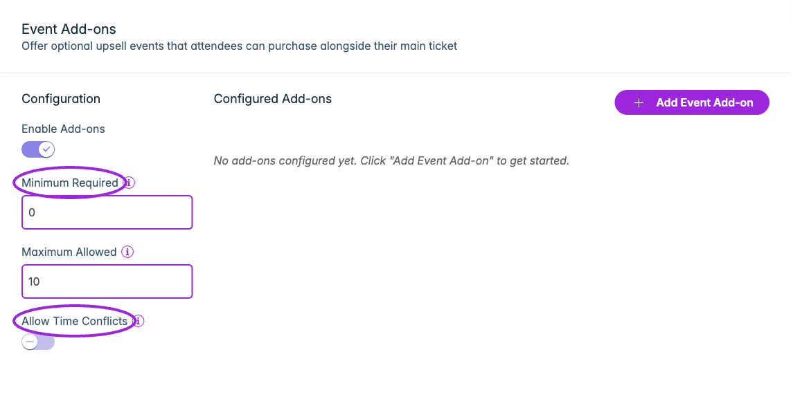
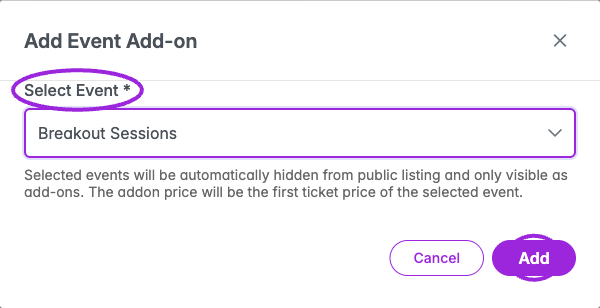

Use Event Add-ons to offer workshops, breakout sessions, or extra experiences alongside the main ticket. This feature is available on Business and higher.

## Before you start

Create and save the main event and the events you want to offer as add-ons. Configure tickets on each add-on event first. The add-on dialog uses the selected event's **first ticket price** as its add-on price.

## Configure add-ons

<Frame caption="Enable Add-ons, choose the minimum and maximum selections, and decide whether overlapping time slots are allowed. A minimum of 0 makes add-ons optional.">
  
</Frame>

<Frame caption="Select the saved add-on event and review the note: its first ticket supplies the price, and adding it hides it from public listings. Verify its tickets before adding.">
  
</Frame>

1. Edit the saved main event and select **Event Add-ons**.
2. Turn on **Enable Add-ons**.
3. Set **Minimum Required** (0 means optional) and **Maximum Allowed**.
4. Choose whether to enable **Allow Time Conflicts**. This permits overlapping add-on time slots, useful where different people attend different sessions or overlapping attendance is intentional.
5. Click **Add Event Add-on**, then choose the saved event under **Select Event**.
6. Review **Addon Price** and the first ticket’s name when shown. If the dialog only shows the event name and pricing note, open the add-on event’s Tickets step to verify the first ticket’s price before confirming **Add**.
7. Check **Configured Add-ons** and save/update the main event to persist its configuration.

The selected event is hidden from public listings and offered as an add-on. Do not attach an event you intend to keep as an independently listed event without reviewing that effect.

For a recurring series, configure add-ons on the parent event. The step is hidden for new unsaved events, individual child events, and no-ticket/external-link setups.

## Test selection rules

Open the main event's checkout. Check that the correct add-ons and prices appear. Test below the minimum, at the allowed maximum, and with overlapping sessions. Also test an add-on at capacity using its ticket settings.

Drag rows to set their display order. Use the row’s delete control and confirm removal to detach an add-on. This removes the relationship; do not describe it as deleting the underlying event or refunding a purchase.

See [ticket setup](./ticket-setup) and [event dates and times](./datetime).
