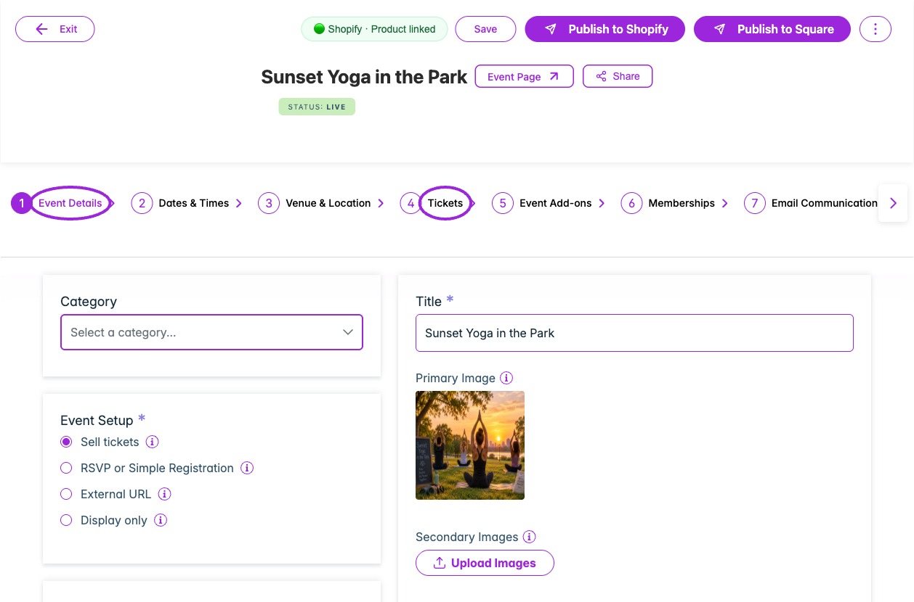

Use this checklist when creating an event or reviewing an existing one. Open **Events → Create Event** or **Edit Event**. Start with the correct site and, where available, organization.

<Frame caption="Open an event to find its setup steps, Save and Publish controls, and current status. Use the stepper arrows to reach later sections.">
  
</Frame>

| Area | Options to review | Detailed instructions |
|---|---|---|
| **Event Details** | Event type, category/subcategory, organization, title, ticket/RSVP/external URL/display-only setup, hosted-page link, privacy/access code, unlimited or finite attendee capacity, event-page handle, timezone, primary/secondary/description images, description, YouTube/Vimeo video, and self-serve check-in. | [Event details](./eventdetails) |
| **Dates & Times** | One-Time Event, Recurring, No Date In Mind, Specific Dates, or Time-Based; start/end, all-day, repeat frequency/range, weekday/month/year selections, and dates/slots. Event format may be locked once attendees exist. | [Date/time fields](./datetime) |
| **Individual dates** | Shared or custom title, capacity, waitlist threshold, ticket source, advance-purchase override, and seating inheritance. Specific Dates can also offer a whole-event pass. | [Date-specific tickets](./day-specific-tickets) |
| **Venue & Location** | In-person versus online; location/address, venue name, phone, email, website, and supported online meeting details. | [Venue setup](./venuelocation) |
| **Tickets** | Tax, currency, payment connection, seating, ticket details, prices/fees, sales and capacity, access/membership rules, required tickets, admission rules, Autopilot, legacy installment schedules, group/volume pricing, and promo codes. | [Every ticket option](./ticket-options-reference) |
| **Payment Plan** | Assign a reusable equal-split or percentage template, choose eligible tickets and require completion before the event. Buyers can pay in full or use installments. | [Payment plans](./installment-payments) |
| **Event Add-ons** | Enable, minimum required, maximum allowed, time conflicts, selected add-on events, and their prices/order. | [Add-on setup](./event-add-ons) |
| **Memberships** | Assigned active memberships, admission rules, member-only tickets, and member pricing. | [Membership assignment](/memberships/assign-to-events) |
| **Email Communication** | Enabled messages, recipients, triggers/timing, subject, body/editor, personalization, included ticket/receipt/pass content, test delivery, and saved language variants. | [Email setup](./email-communication) |
| **SMS Communication** | Enabled messages, triggers/timing, content, personalization, and collection of attendee phone numbers. | [SMS setup](./sms-communication) |
| **Waitlist** | Enable, sold-out/capacity triggers, fixed-capacity invitation threshold, on-screen wording, emails, subscribers, restricted ticket/quantity links, and Shopify invoice mode. | [All waitlist controls](./waitlist) |
| **Additional Info** | Question types/options, attendee-created dropdown choices, required at checkout/check-in, property mapping, waitlist exclusion, ticket applicability, and waivers. | [Question options](./additional-information) |
| **Checkout Complete** | The event-specific message shown after registration. Review separate shared design controls for completed, pending-approval, and installment orders. | [Completion message](./checkout-complete-message) |
| **Tags & Custom Fields** | Tags for organizing/filtering and custom event properties. Shopify customer-tag discounts are configured on promo codes. | [Tags and fields](./tags-and-custom-fields) |
| **Hosts** | Invite/manage hosts and event-specific hosting information. | [Host setup](./hosts) |
| **Display Settings** | Widget and event-page button wording, host logo, site/host name, and Meet the Host content. Shared colors and visibility are under Design. | [Event display overrides](./display-settings) |
| **Tracking Links** | Campaign links, source/medium/name details, and view/sales results. | [Tracking links](./tracking-links) |
| **Publish and platform setup** | Draft/live status; Shopify, Square, or other connected-channel publishing controls; correct public product/page and widget. | [Create/update workflow](./create-event-overview) |
| **Event Actions** | Share/copy, duplicate, cancel one occurrence or all upcoming dates, restore as draft, and delete. | [Manage events](./manage-events) |

## Why an option may be missing

The editor adapts to the event setup, saved state, parent/child date, site platform, role, and plan. Display-only and external-registration events omit the built-in registration steps that do not apply. Add-ons, memberships, hosts, and tracking links need a saved event. Series-wide communication and design belong on the parent; date-specific offers belong on the date.

Use [Create and update an event](./create-event-overview) for the step visibility rules. The [feature reference](/account/feature-reference) covers plan availability; the current account's upgrade or eligibility message is the final check for a particular site.

## Finish with an attendee test

After saving and publishing the intended configuration, open the public event or installed widget. Select the date, tickets and seats; exercise applicable access, membership, quantity, add-on, question, and waitlist rules; complete a test registration; inspect confirmation, delivery, attendee records, and check-in.

For presentation outside a single event, review [Quick Settings](/branding-and-design/quick-settings), [all widget categories](/branding-and-design/widget-customization-overview), and [other design surfaces](/branding-and-design/design-options-reference).
