Open an event and choose **Event Details** to configure its category, registration method, privacy, capacity, timezone, title, and media. Save the event after making changes.

## Category

Choose **Category** first, then choose its **Subcategory**. The current editor derives the event type from the selected category; there is no separate Type dropdown.

## Subcategory

The **Subcategory** field appears after you select a category. Choose the closest match from that category’s list.

**Example:**  
If your category is **Food & Drink**, you can select **Beer**, **Wine**, or **Food** depending on your event type.

<Frame caption="Choose a category, then a subcategory from its list.">
  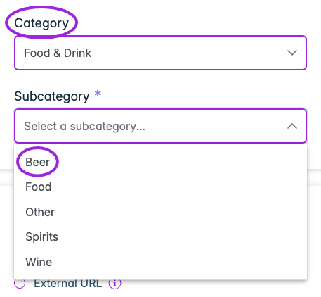
</Frame>

## Event Setup

<Frame caption="Event Details → Event Setup offers tickets, RSVP/simple registration, an external URL, and display-only events.">
  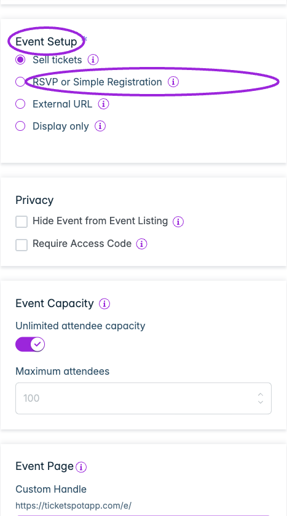
</Frame>

Select from the options listed below on how you want people to register or view your event. Each option defines how attendees can interact with your event listing.

### **Sell Tickets**
Offer free or paid tickets directly through Ticket Spot using a simple checkout process.

### **RSVP or Simple Registration**
Allow guests to RSVP through a form and collect basic attendee details.

### **External URL**
Redirect attendees to an external website or hosted event page.

Turn **Link to hosted event page** on to use the Ticket Spot event page. Turn it off to enter a separate registration or information URL in the field below. This field changes the destination for this event; custom-domain setup is handled separately in [Domain and tracking](/site-settings/domain-and-analytics).

<Frame caption="External URL events can use the hosted event page or a separate destination.">
  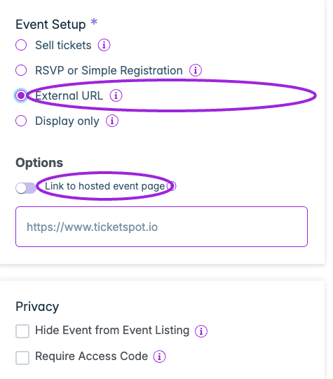
</Frame>

### **Display Only**
Show event info without registration or checkout options.

**Examples:**

- If you’re hosting a paid concert, select **Sell Tickets**. 
- For a free community meetup, choose **RSVP** or **Simple Registration**.

## Privacy

<Frame caption="Event Details → Privacy separates hiding the event from listings and requiring an access code.">
  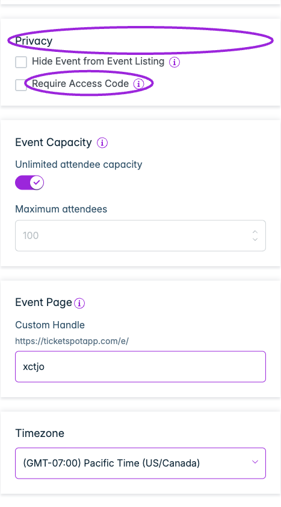
</Frame>

Use **Hide Event from Event Listing** to remove an event from listings. Someone with its direct URL may still be able to open it. 

**Instruction:**

Select **Hide Event from Event Listing** to hide the listing. For the hosted event page, enable **Require Access Code** and set **Access Code** when visitors must enter a code before accessing the event and ticket purchases. Test the public page with and without the code. Ticket-level hidden access codes are configured separately in [Tickets](/event-management/ticket-setup).

## Event Capacity

<Frame caption="Event Capacity controls whether registration is unlimited or has a maximum attendee count. Configure the waitlist in its separate step.">
  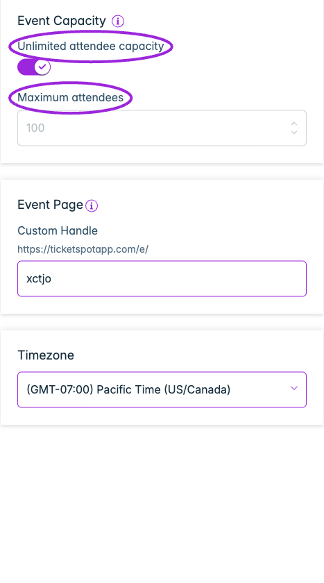
</Frame>

Set the overall attendee capacity for the event, alongside each ticket type’s quantity. Review capacity again before manually approving pending attendees because an organizer approval can exceed the configured limit. Subscription ticket allowances are separate from event capacity.

**Example:** If you’re hosting an event in a **mall** and have space for **40 people**, set the event capacity to **40 tickets**. Check that checkout reports the event as full when that capacity is reached.
If your event is **open to everyone**, like a **public concert** or **festival**, simply toggle on **Unlimited Capacity**. This removes the event-wide cap; ticket quantities, purchase rules, and subscription allowances still apply.

> **Tip:** Enable **Unlimited attendee capacity** if there’s no limit on the number of attendees.

## Event Page

<Frame caption="Event Details includes the event-page handle and timezone. Language settings do not change the event timezone.">
  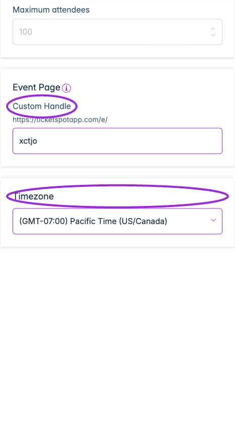
</Frame>

Customize how your event page looks to attendees. You can create a short, shareable link and adjust design elements like button text or site name to match your brand.

**Custom Handle**

Set a unique URL handle for your event page to make it easy to share and remember.

Your event link will appear as `https://ticketspotapp.com/e/your-handle`.

**Example:** Entering `ccg99` creates  
`https://ticketspotapp.com/e/ccg99`

> **Note:** The handle must be at least **5 characters** long.

## Calendar Design Override

Open the event’s **Display Settings → Widget Text Overrides** for this control; older screenshots place it in Event Details.

Customize how your event appears in the Calendar View by updating the Event Button Text. This lets you create a more personalized call-to-action for individual events.

Leave this field empty to use the default button text from the Design Widget tab.

**Example:**
Change Book your event now to **Reserve Your Spot** or **Join This Session** for a better fit with your event’s tone.

<Frame caption="Event Button Text overrides this event’s widget button. Leave it blank to inherit the widget’s shared text settings.">
  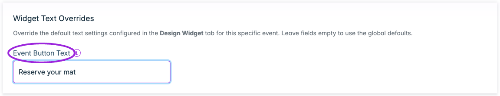
</Frame>

## Event Page Design Override

Open **Display Settings → Event Page Customization** for the current controls, including Host Logo and Host Information.

Customize your event page appearance by updating the Buy Tickets Button Text or Site Name.
You can override default settings for individual events to better match campaign-specific designs or messaging.

- **Buy Tickets Button Text** - Change the text shown on the ticket purchase button. 

**Example**: Replace **Buy Tickets** with **Get Your Pass** or **Book Entry**.

- **Site Name** – Display your brand or website name on the event page for consistency.

**Example**: Enter EventSphere or MyBrand Live.

> **Info:** Leave these fields empty to use the default settings from Design → Event Page and your site name.

<Frame caption="Event Page Customization has separate logo, purchase-button, and site/host-name overrides. Empty text fields use the shared event-page design defaults.">
  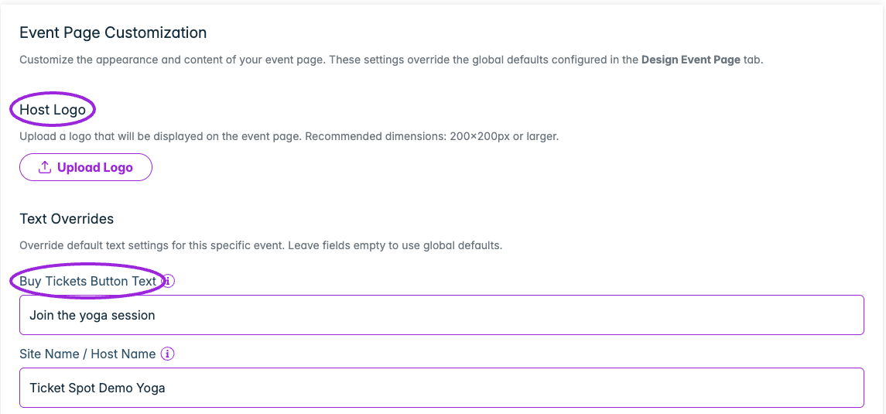
</Frame>

## Timezone

Select the timezone where your event will take place. This ensures the event time displays correctly for all attendees.

**Example:**  
If your event is happening in **Los Angeles**, select **Pacific Time (US/Canada)** so the timing reflects the local schedule of that city.

> **Tip:** Always select the timezone of the event location, not your own — this ensures that all attendees see the correct event time.
## Title

<Frame caption="Set the event title and primary image. Secondary images and the description follow in the same Event Details column.">
  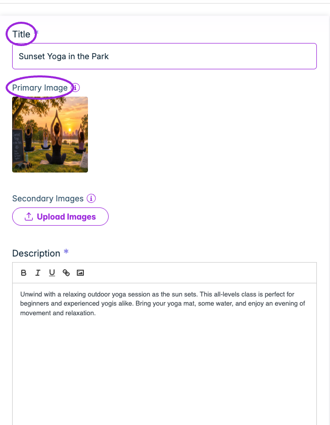
</Frame>

Enter a clear and descriptive name for your event. The title helps attendees quickly understand what your event is about. 

**Examples:**  
- **Summer Food Festival 2025**  
- **Digital Marketing Workshop for Beginners**

## Primary Image

Upload the main image for your event. This image appears on your event listing and helps attract attendees by giving a visual preview.

>**Note:** It is recommended that the image follow a **3:2** width-to-length ratio for best display quality.

**Example:**  
Use your event’s banner, logo, or a relevant promotional image
## Secondary Image

Upload additional images to showcase more details about your event. These images can include venue photos, guest speakers, schedules, or highlights from past events.

**Example:**  
Add images of the event location or promotional posters to make your listing more appealing.
## Description

<Frame caption="Event Details includes a rich-text description and optional description images.">
  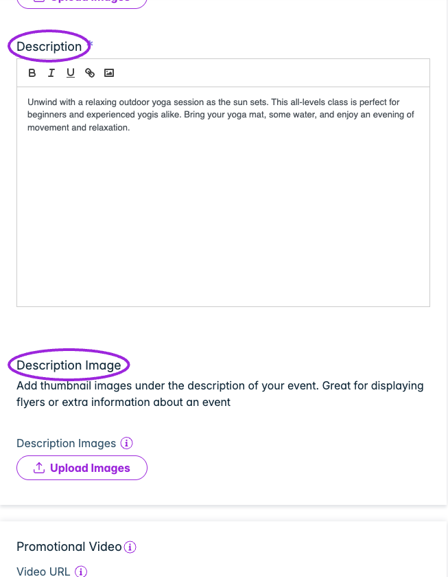
</Frame>

Write a clear and engaging summary of your event. Include important details such as purpose, activities, date, and what attendees can expect.

**Example:**  
Join us for a fun-filled evening at the **Annual Food Fest 2025** featuring local breweries, live music, and food stalls.

## Description Images

Add **Thumbnail Images** that appear directly below your event description. These images should visually support your event details — for example, flyers, sponsor logos, or additional visuals that highlight specific information mentioned in the description.

**Example:**  
Include a flyer showing the event schedule or a sponsor banner to give attendees more context and make your listing more engaging.
## Promotional Video

<Frame caption="Event Details → Promotional Video accepts a supported video URL.">
  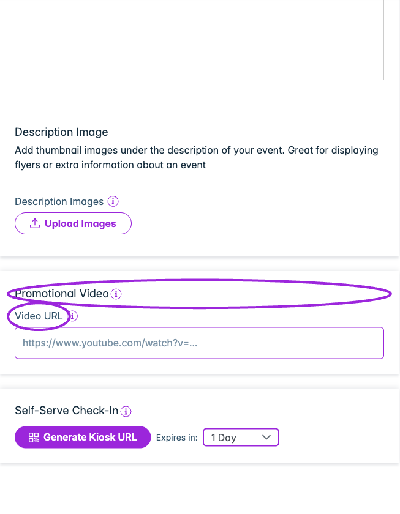
</Frame>

Add a **Promotional Video** to your event page to highlight speakers, showcase past events, or provide important information to attendees. You can embed videos from **YouTube** or **Vimeo** by pasting the video link in the field provided.

**Video URL**: Enter a valid HTTPS link from YouTube or Vimeo (e.g., `https://www.youtube.com/watch?v=...`). 

The video will automatically appear on your public event page once saved.

## Self-Serve Check-In

<Frame caption="Self-Serve Check-In lets you prepare an expiring kiosk link. This screenshot shows the setup controls before generating a link.">
  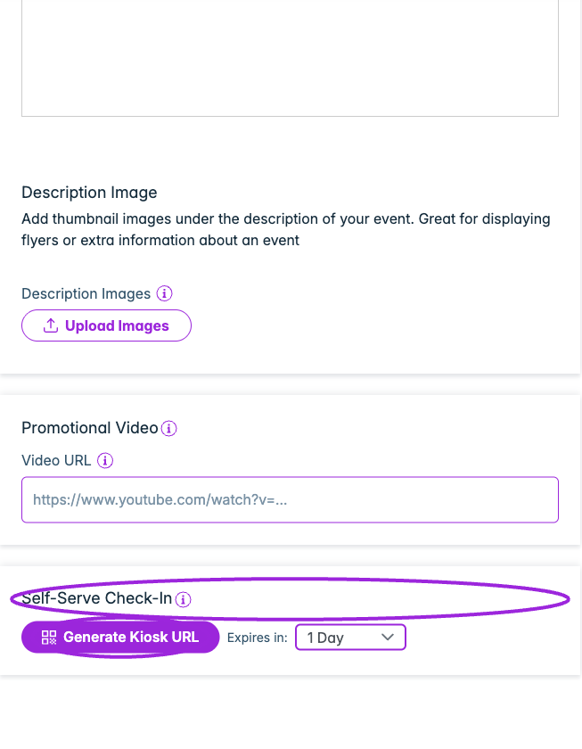
</Frame>

Generate a dedicated kiosk URL that allows guests to check in on their own. When enabled, attendees can scan their tickets and complete check-in without staff assistance.

**Steps to generate a kiosk URL**:

1. Select the kiosk link expiry duration (1–5 days) from the dropdown, then click **Generate Kiosk URL** to create the link.

2. Copy the generated kiosk URL and share it with attendees so they can access the self-check-in screen and scan their tickets.

> **Note:** You can regenerate the kiosk URL anytime. Just choose a new expiry duration and click **Generate Kiosk URL** to create a fresh link.
See [self check-in kiosk setup](/on-site/self-check-in-kiosk) for link generation and expiry, and [custom domains](/site-settings/domain-and-analytics) for branded hostnames. A Custom Handle changes the path for one event; it is not a DNS domain setting.

## Organization and invitation-only capacity

If **Organization** is offered, choose the organization responsible for the event. Confirm the selected site and organization before saving.

A finite **Event Capacity** is required for **Waitlist → Limit waitlist purchases to event capacity**. The waitlist threshold can be 0 for invitation-only purchasing from the start. See [waitlist capacity and invitations](./waitlist).
