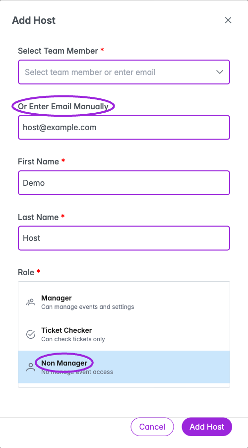

Open **Events → Edit event → Hosts**. Event hosts can help manage this event, check tickets, or appear publicly when host display is enabled. Event roles are separate from site-wide team access.

## Invite a host

1. Under **Manage Hosts**, click **Add Host**.
2. Choose **Select Team Member**, or use **Or Enter Email Manually**.
3. Complete **First Name** and **Last Name**.
4. Select the appropriate **Role**.
5. Click **Add Host** to send the event invitation. It appears under **Pending Invitations** until accepted; it does not immediately become an active host.

<Frame caption="Choose a site team member or enter a name and email, then select this event’s role. Manager, Ticket Checker, and Non Manager provide different levels of event access.">
  
</Frame>

| Role | Event access |
|---|---|
| **Manager** | Can manage the event and its settings. |
| **Ticket Checker** | Can check tickets. |
| **Non Manager** | Has no event-management access. |

## Active members

Select **Active Members** to see accepted, active hosts and their role badges. Use the pencil icon to edit a host's **First Name**, **Last Name**, or **Role**, then choose **Save Changes**. The email address is read-only.

Use the remove icon and confirm to remove an eligible host from the event. The event owner's row does not offer removal. Removing an event host does not revoke separate site-team permissions they may hold.

## Pending invitations

Select **Pending Invitations** to inspect invitations awaiting acceptance. Open a row's actions menu to **Resend Invitation** or **Delete** it. Resending sends another invitation email; deleting asks for confirmation.

## Show hosts to attendees

Configure host visibility in [Event Page design](../branding-and-design/event-page-design) and [Widget Display settings](../branding-and-design/widget-display-reference). Use this event's [Display Settings](./display-settings) to override its host name, logo, and Meet the Host content.

For site-wide collaborators, use [Invite Team](../team/invite-team-roles).
