Installments let an attendee pay a deposit at checkout and the remaining balance in later payments. The first amount can also be **$0**: the attendee saves a Stripe card and accepts the schedule before any later payments are collected. Installment plans with manual collection require **Business or higher**, a connected Stripe account, and Stripe card checkout. **Business Plus and Platform** also include automatic collection and configurable retry days.

## Create a reusable installment plan

<Steps>
<Step title="Connect Stripe">
Open [payment settings](/account/get-paid) and connect Stripe. Manual installments require Business or higher. Automatic collection and configurable retries require Business Plus or Platform.
</Step>
<Step title="Create a template">
Open **Installment Plans → Create installment plan**. Name the plan, choose **Split equally** or **Percentages** under **Payment amounts**, then choose two to four installments. The first is at checkout; later payments use increasing days after checkout, such as 30 and 60 days. Equal splits show percentage shares, with an asterisk on the final payment for rounding. Later payment dates must increase: zero, negative, repeated or earlier days show an inline error and disable Save.

<Frame caption="Equal split uses a payment count and increasing days after checkout. The final payment absorbs any rounding difference.">
  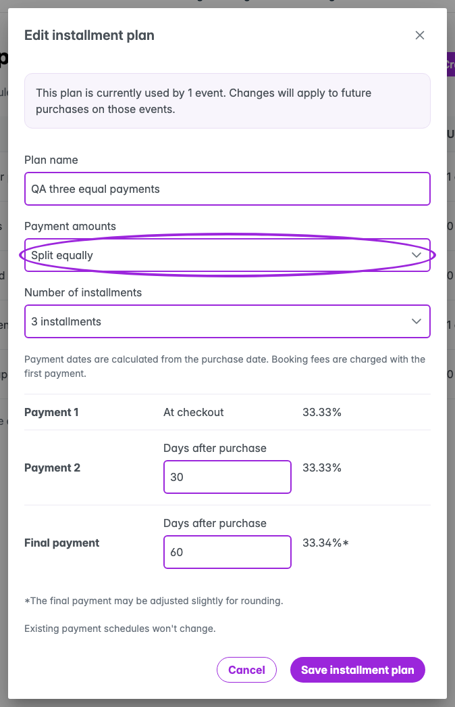
</Frame>

Percentages must total 100%. Use **0% / 50% / 50%** to save a card at checkout without collecting a deposit. Booking fees or other tickets can still make today's total positive. Equal splits preserve the exact total, with any rounding difference in the final payment.

<Frame caption="A reusable percentage template with 0% at checkout and two later 50% payments. Days are measured from purchase.">
  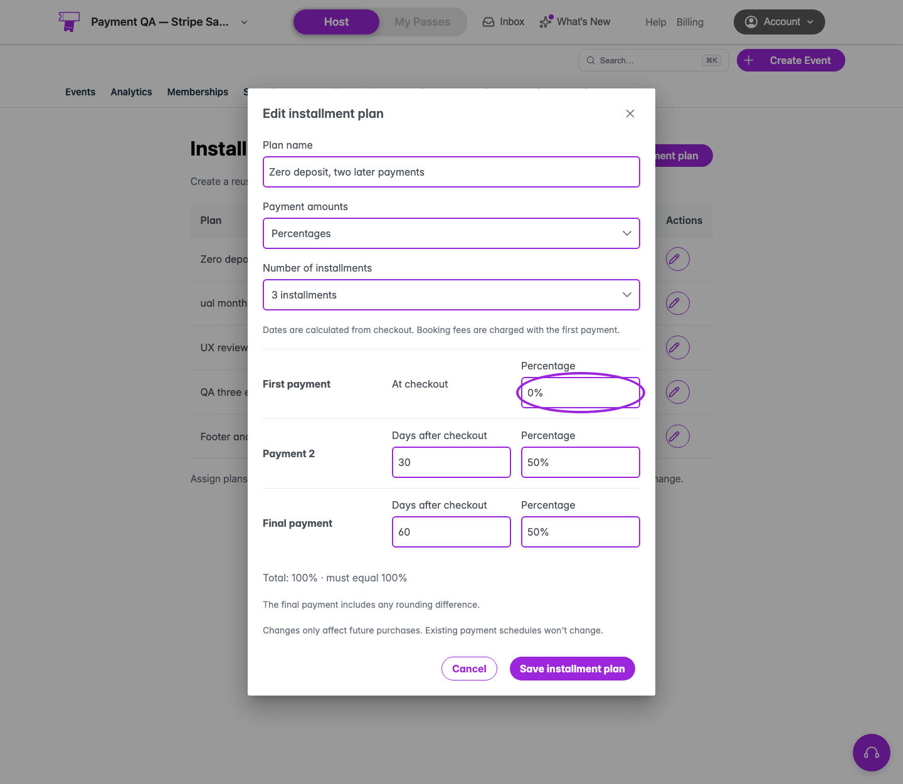
</Frame>

Click **Save installment plan** in the dialog footer. A success toast confirms creation or edits. The **Name** column contains your chosen label. **Used by** shows how many events currently have that plan enabled, including dates that inherit a series plan. To edit a template, select its centered pencil icon.

<Frame caption="Reusable plans show their schedule and how many events use them.">
  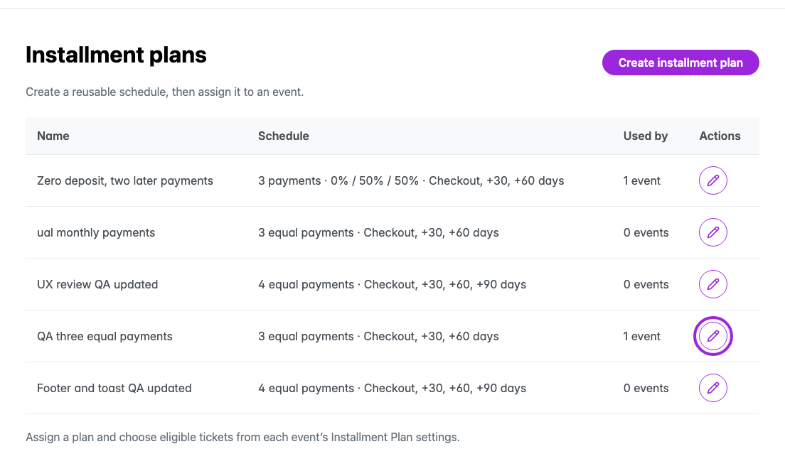
</Frame>

When editing a plan used by events, a notice explains that changes apply to **future purchases on those events**. Existing customer schedules keep their accepted dates and amounts.

<Frame caption="A later payment must be after the previous payment. The inline error disables Save until corrected.">
  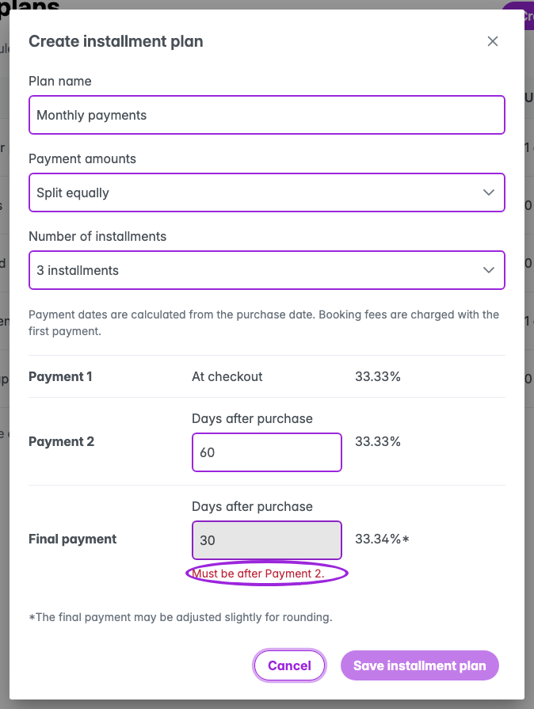
</Frame>
</Step>
<Step title="Assign the plan to an event">
Edit the event and open **Installment Plan**. Turn **Allow installment payments** on, select an **Installment plan**, then set **Eligible tickets** to **All eligible paid tickets** or **Selected tickets**. Tickets you exclude are paid in full at checkout. Customers can always choose full payment.

Set the **Final payment deadline** in days before the event. The default is one day. **Installments available until** shows the last checkout date and time in the event's timezone when the whole schedule fits. A schedule ending 90 days after checkout with a four-day deadline stops being offered 94 days before the event. With a zero-day deadline, the last payment must still be strictly before the event starts, so the cutoff says **before**.

After this cutoff, customers can still pay in full. Dates in a recurring series calculate their own cutoff. Automatic retries and manual collections also stop at the accepted event start.

<Frame caption="Allow installment payments, choose eligible tickets and a final payment deadline, and review the calculated availability cutoff.">
  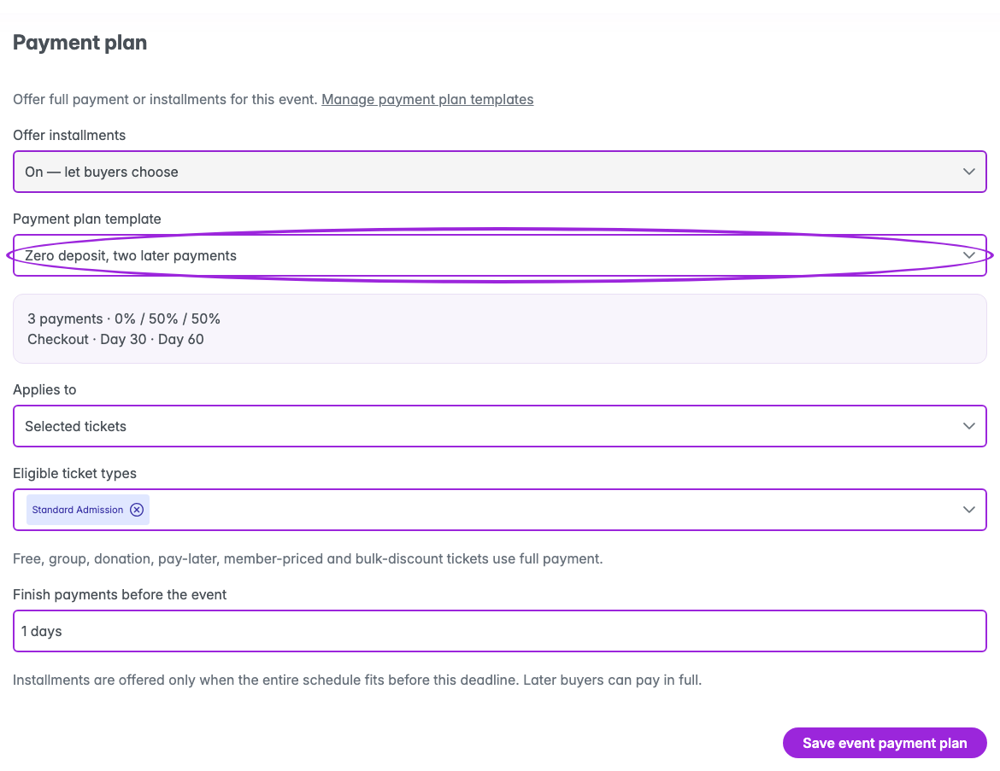
</Frame>

Click **Save installment plan**. A success toast confirms the save. Existing bookings keep their accepted amounts, dates and collection policy when you edit a template or change the event assignment.
</Step>
</Steps>

The ticket picker shows excluded types as disabled options with a reason, such as **Standard — Free ticket**. If an event has no eligible paid tickets, the assignment screen explains why. Add or update a fixed-price individual paid ticket in the event’s **Tickets** settings to offer installments.

<Frame caption="Eligible paid tickets can be selected; free tickets remain visible with an exclusion reason.">
  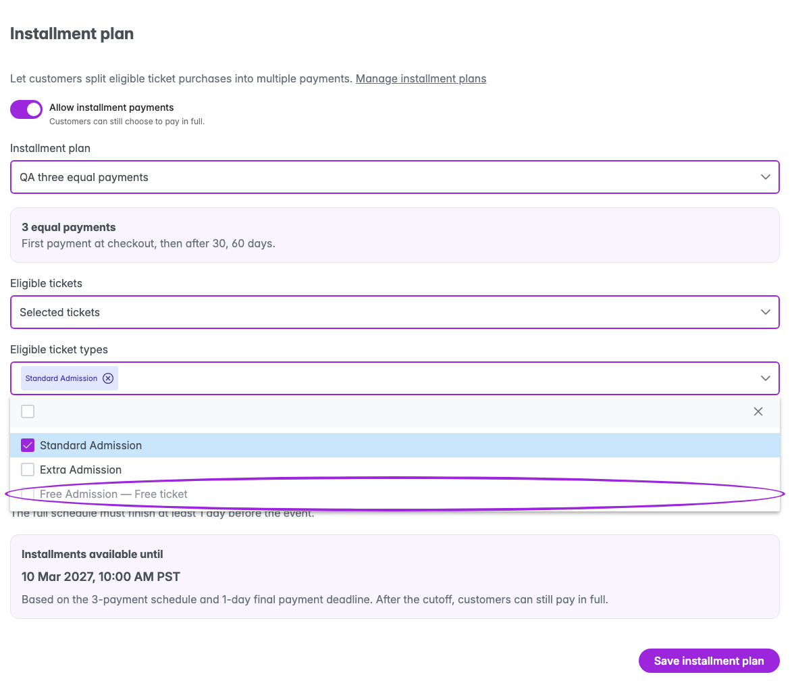
</Frame>

Free, group, donation, pay-later, member-priced and bulk-discount ticket types use full payment. A date in an event series inherits its ticket source's installment plan unless you save an override for that date. An event with an unknown date cannot offer a new template plan.

<Note>Existing ticket-level installment schedules remain supported for compatibility. They appear under legacy controls when editing a ticket that already has installments. New plans belong in Installment Plans and the event's Installment Plan step.</Note>

## Let buyers choose how to pay

At checkout, **Pay in full** is selected initially. The buyer can instead choose **Pay in 3 installments** (or the configured payment count) when the selected tickets are eligible and the schedule fits before the event. One event can include eligible and excluded ticket types: excluded types are paid in full today. Multi-event carts currently use full payment; a buyer can book an eligible event separately to use installments.

If installments are unavailable, checkout shows the normal full-payment form without an installment notice. If a buyer chooses installments and the offer becomes unavailable, checkout explains the change and asks them to choose **Pay in full** before continuing.

<Frame caption="When the schedule cannot finish before the event, buyers see normal full-payment checkout without an unavailable installment option.">
  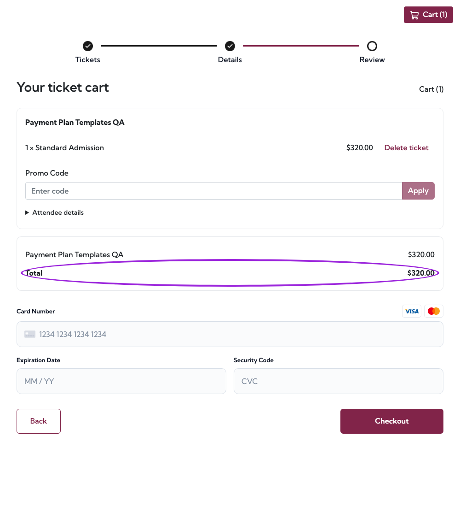
</Frame>

<Frame caption="Pay in full collects the entire price once and creates no later payment obligations.">
  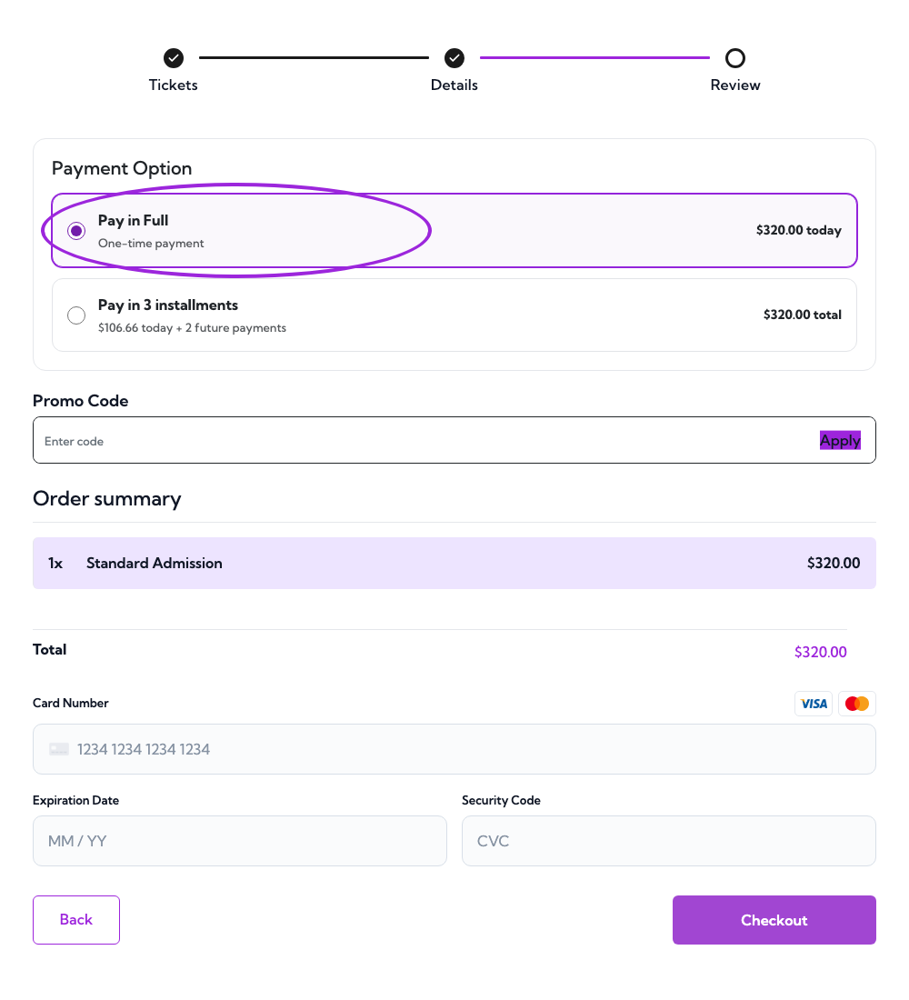
</Frame>

Selecting installments refreshes **Due today** while the order summary keeps the full **Order total**. The schedule lists each future date and exact amount, with ticket names and quantities identifying the purchase. Additional balance and policy details are collapsed under **Installment plan details**.

The buyer authorizes the organizer to charge their card for the remaining payments on the dates shown. The payment processor securely stores the payment method; this explanation and collection terms stay inside the collapsed **Installment plan details**. Scheduled payments are charged on the dates shown. Organizers may manually collect a scheduled payment once it is due. Automatic retry timing appears below the checkbox when retries are enabled. Tickets remain pending until all installments are paid and any required approval is complete. The payment button confirms today’s charge, such as **Pay $106.66 today**.

Installment choices and the authorization box follow the widget’s checkout colors, including your brand accent and any checkout design overrides. The details row opens across its full width and the widget adjusts its height when the section opens or closes.

<Frame caption="Installment plan details keep purchase totals, fees, secure processor storage and scheduled collection terms together.">
  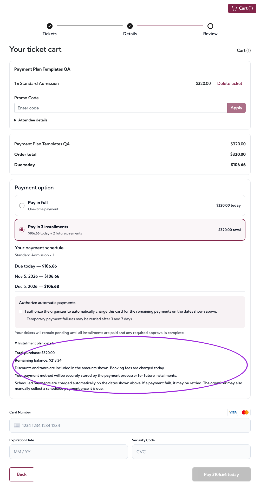
</Frame>

<Frame caption="A $320 ticket split into $106.66 today, $106.66 on November 5 and $106.68 on December 5. The button names today’s charge, and rounding preserves the $320 total.">
  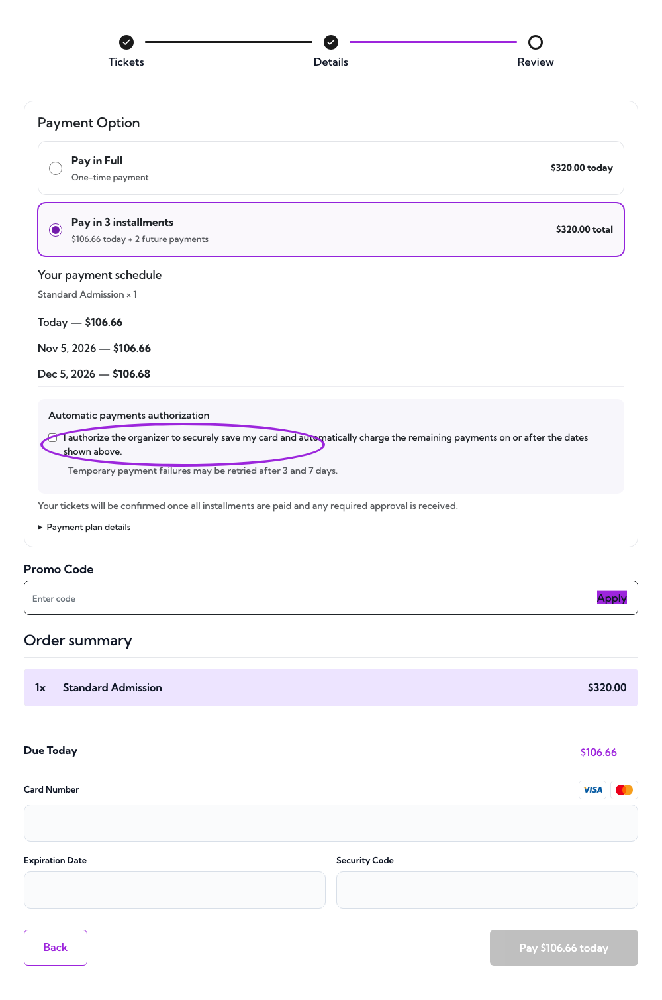
</Frame>

For a \$0 checkout amount, the button reads **Save card and confirm booking**. Stripe saves the card without taking a payment. The booking remains pending until its balance is paid and any admission approval is complete. Discounts are applied before splitting the ticket price; booking fees are due at checkout, and future amounts include their allocated ticket tax.

<Frame caption="A zero-deposit plan saves the attendee's Stripe card today, with two later $160 payments for this $320 test ticket.">
  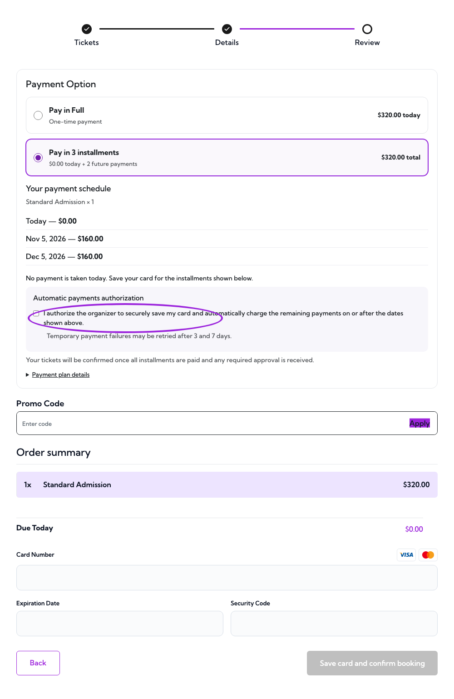
</Frame>

## Customize and translate checkout text

Open **Design → Widget → Text → Checkout → Payment information → Installment Payment Text**. Edit the counted installment option, today and total amount text, authorization heading and agreement, scheduled-payment text, retry copy and payment buttons. The order-total label, payment-processor storage notice, remaining-balance and zero-checkout messages are also editable. The settings use the attendee's checkout language when automatic event translation is enabled. Custom organizer wording is preserved.

Keep variables such as `{amount}`, `{date}`, `{days}` and `{count}` in the applicable fields. They are filled from the accepted schedule. The required authorization checkbox remains visible even when optional review text is hidden.

<Frame caption="Design → Widget → Text controls the order total and processor-storage explanation. Authorization and payment-button text are editable in the same section.">
  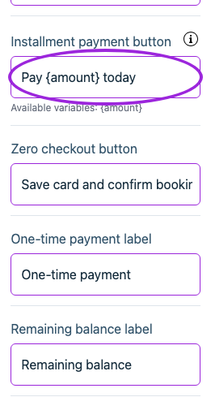
</Frame>

## Track payment progress

The **Attendees** list shows **Paid 1/3**, **Paid 2/3**, or **Fully paid · 3/3**, plus the remaining balance. **Overdue** and **Needs attention** identify payments that need review. Click the progress badge to open **Payment Installments**.

<Frame caption="An automatic payment advances the booking to Paid 2/3 and leaves one $10 payment outstanding.">
  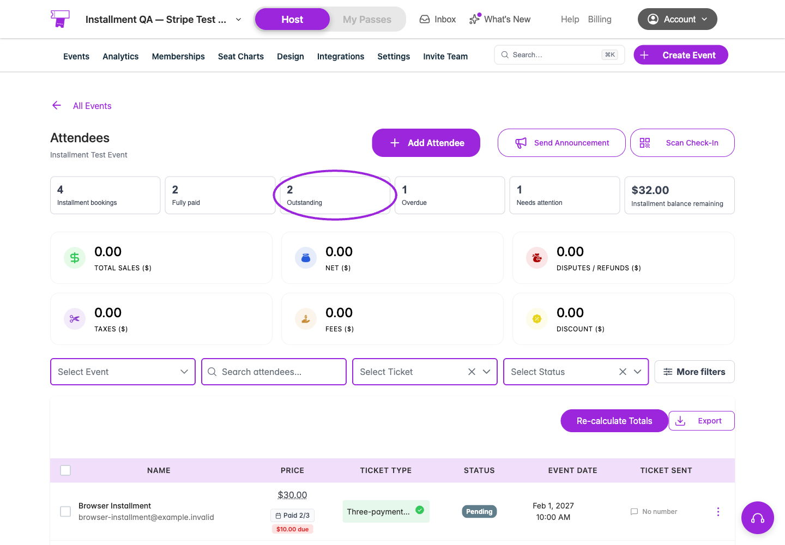
</Frame>

Use **More filters → Payment** to select fully paid, outstanding, overdue, or attention needed. The progress dropdown filters exact fractions such as **1/3** or **2/3**. These filters combine with event, ticket, attendee status, and search. **Clear all filters** resets them.

<Frame caption="Filter by payment status and the number of completed installments.">
  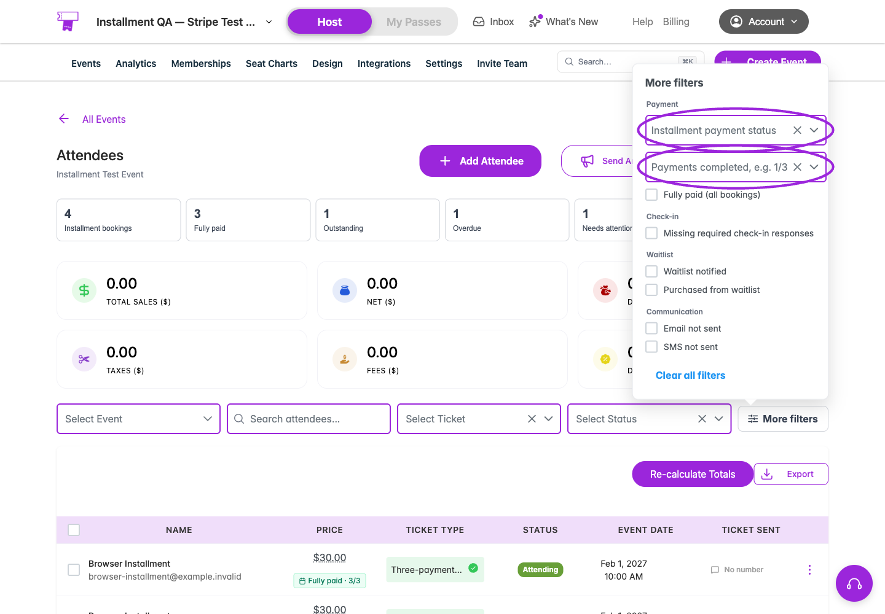
</Frame>

The payment summary cards show the matching bookings and remaining balance. Click a card to apply its payment filter. Counts cover every matching attendee, including additional pages of results.

<Frame caption="Fully paid · 3/3 confirms the balance is settled. The summary cards help find bookings that still need attention.">
  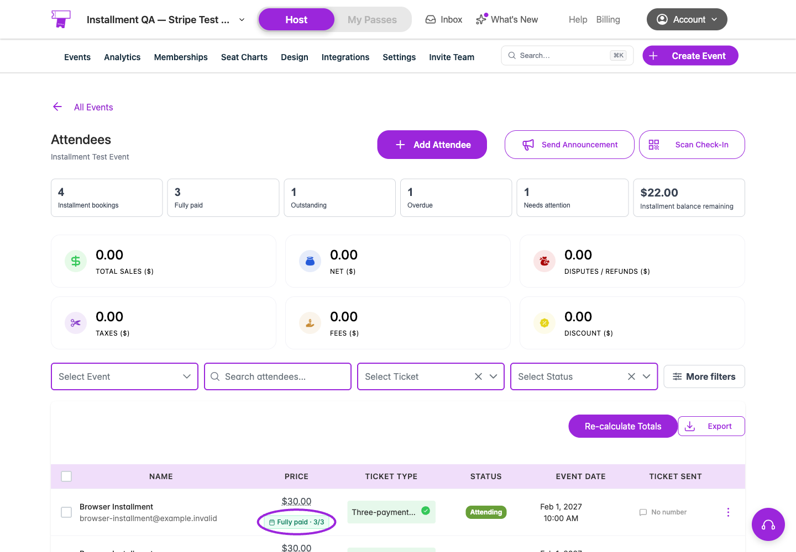
</Frame>

## Collect a due installment manually

1. Open the event's **Attendees** list.
2. In the ticket value column, click **Paid X/Y** to open **Payment Installments**.
3. Review the card, paid amount, remaining balance, due date, and payment status.
4. Click **Charge Now** on the due installment and review **Confirm Charge** before confirming.
5. Reopen the record after processing and verify the payment is marked paid and the remaining balance has decreased.

The charge control is unavailable before the due date, without installment plan access, or when the attendee's status does not permit collection. A processing payment may display **Check payment**. Resolve its existing result before attempting another collection.

<Frame caption="4. Charge Now is available for the due second installment. The future third installment is unavailable.">
  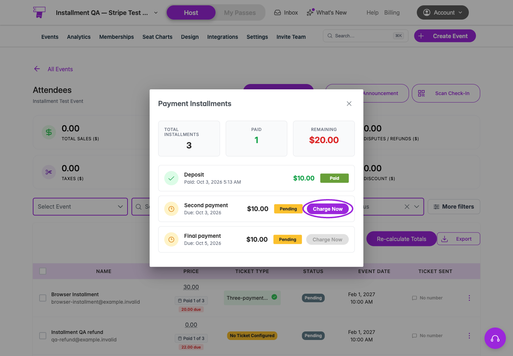
</Frame>

<Frame caption="5. Confirm Charge identifies the installment and amount. Review both before selecting Yes.">
  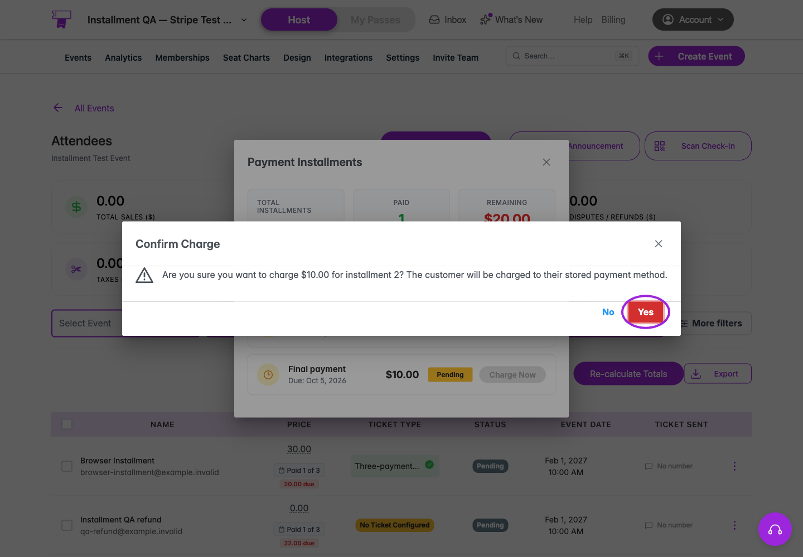
</Frame>

<Frame caption="6. After the second payment, Paid 2 of 3 and a $10 remaining balance show that one installment is still outstanding.">
  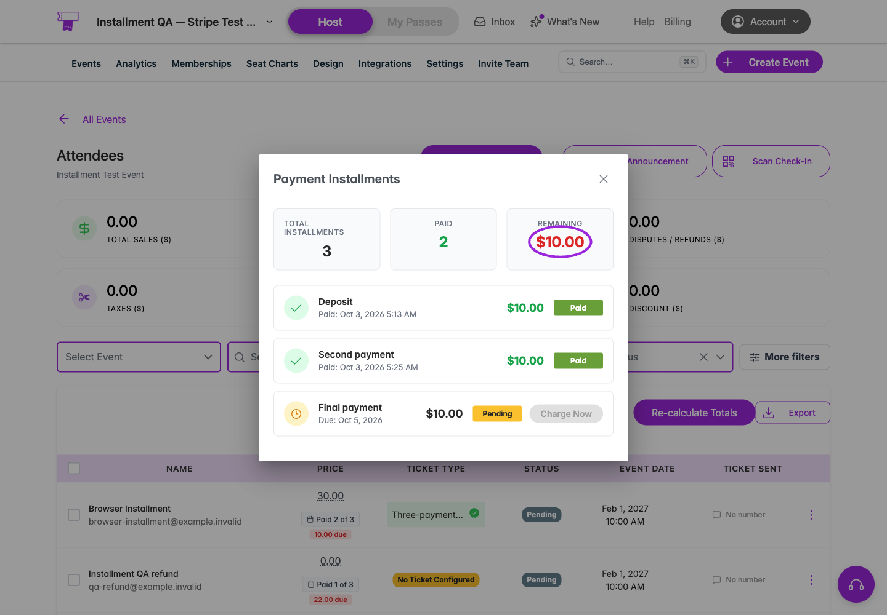
</Frame>

### Check the result before retrying

After a slow response or error, reopen **Payment Installments** and check the existing payment's status and balance. Use **Check payment** when offered. A declined payment does not reduce the balance. If the result remains uncertain, review the matching Stripe payment before attempting another action.

## Attendee card updates and early payment

The attendee can open **My Passes → View Tickets → Payments** to update the saved card without a charge, pay the next installment early, or recover a failed payment. The portal shows the paid fraction and remaining balance. An early payment is skipped by the automatic collector; later due dates stay the same. The checkout uses their saved card when they select **Pay**. After a decline, they can enter a replacement and optionally save it for the remaining installments. They can also choose a different card before paying. See [manage payments](/attendee-portal/manage-payments) for the checkout steps and screenshots.

## Help an attendee complete payment

If authentication or a replacement card is needed, the dialog can show **Update card or authenticate**. Share that attendee-specific link privately with the attendee. The link gives them a way to finish the outstanding payment.

<Frame caption="7. A separate test booking shows Paid 1/3, Needs attention, and a $20 outstanding balance after its saved-card payment failed.">
  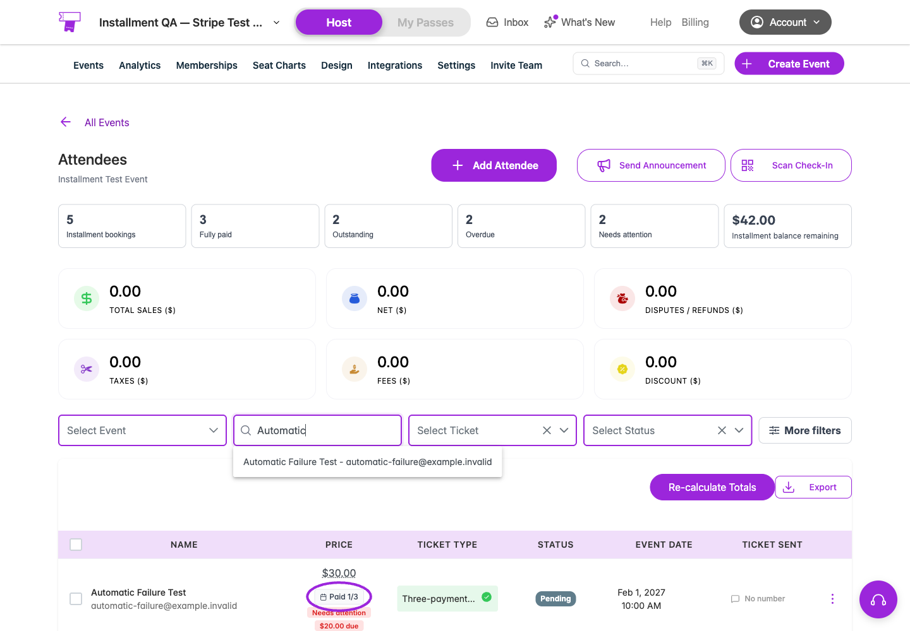
</Frame>

For a replacement card, the attendee opens the link, checks the amount, enters their card details, and accepts the agreement to save that card for any remaining installments. They then select **Update card and pay** and follow any instructions from their bank. The saved replacement card is used for later collections under the accepted agreement.

<Frame caption="8. Update your payment shows the $10 due installment and future schedule. Update card and pay stays disabled until the agreement is accepted.">
  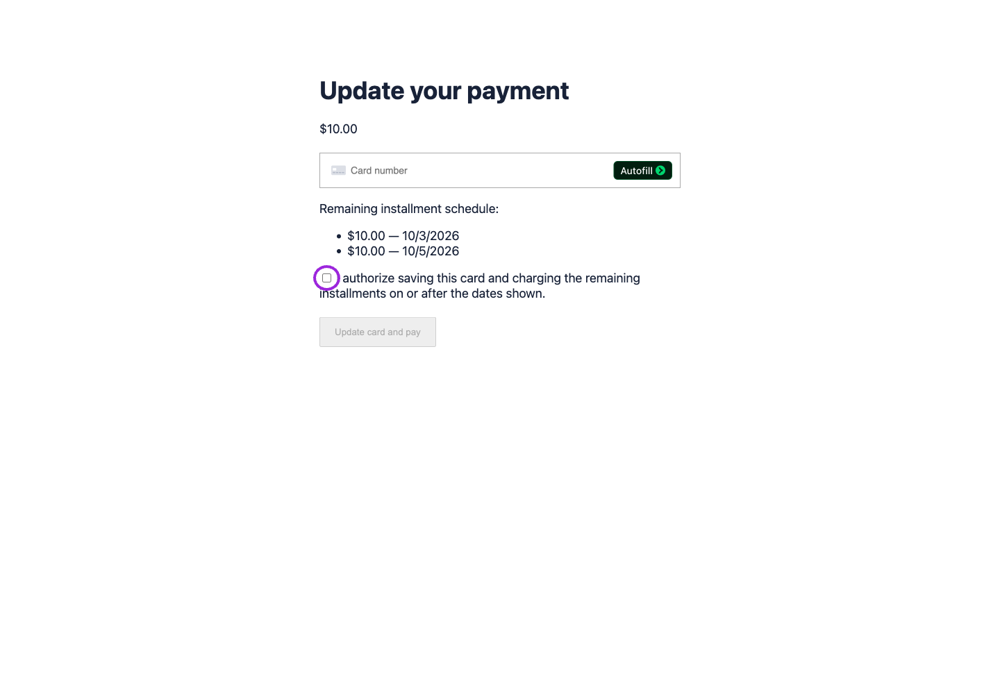
</Frame>

<Frame caption="9. Enter the replacement card, accept the agreement, and select Update card and pay.">
  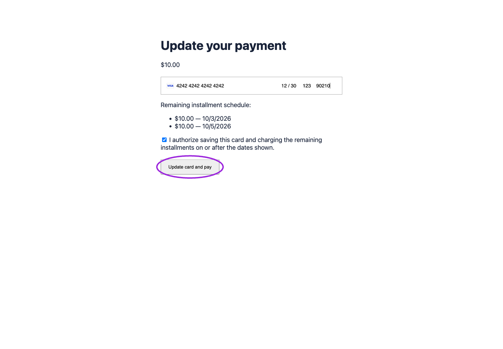
</Frame>

<Frame caption="10. Payment complete confirms that the attendee finished the recovery payment.">
  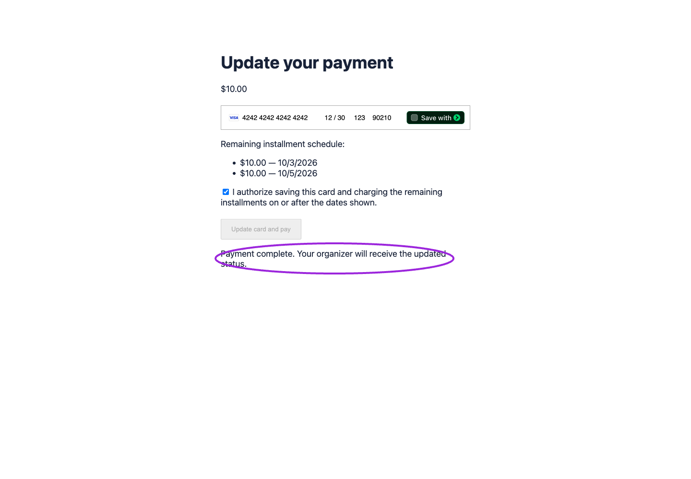
</Frame>

After the attendee finishes, reopen the installment record and verify the payment is **Paid** and the remaining balance has decreased. Do not treat a failed or pending charge as collected money. When the final installment is paid, the record shows a zero balance and **All installments paid in full**.

<Frame caption="11. All three installments are paid in this example. The remaining balance is $0 and the attendee is Attending.">
  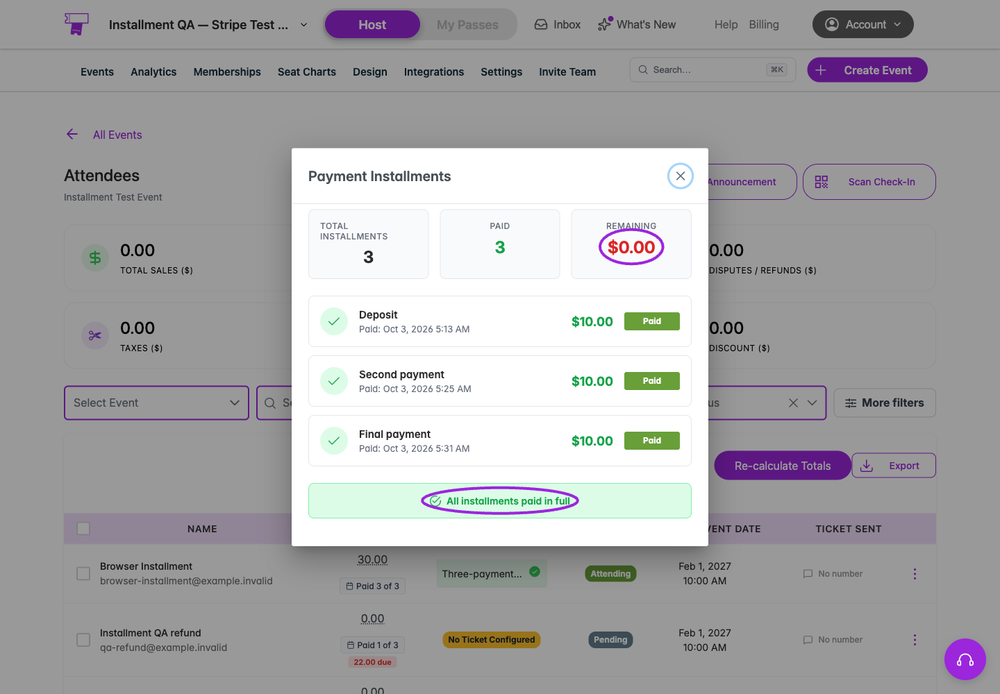
</Frame>

An attendee who opens the same link after the installment is paid sees **This installment is already paid**. They do not need to enter their card again.

<Frame caption="12. Reopening the completion link after payment shows that the installment is already paid.">
  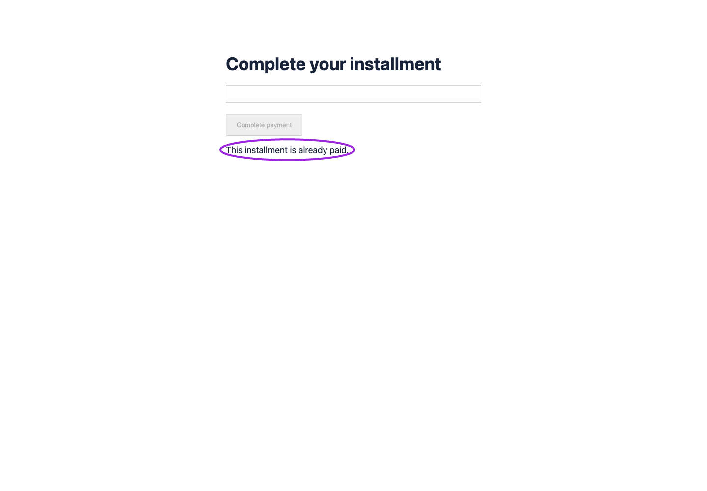
</Frame>

## Payment emails

In **Settings → Attendee Communication → Pending Installment**, configure the messages for the first payment and later installments. The initial receipt confirms the deposit. Later automatic payments use **Subsequent Installment**; an organizer's manual charge uses **Host Charge Installment**. These receipts do not issue admission tickets while a balance remains.

Every initial or later installment receipt includes **Manage tickets**, and a failed charge sends a **Payment needs attention** email with the same button. The private link signs the attendee in and opens that order in their dashboard. Under **Payments**, they can update the saved card or complete the failed payment manually, including any bank authentication. Automatic collection pauses for that payment. Share these private links only with their attendee.

<Frame caption="A failed automatic charge sends Payment needs attention. Manage tickets opens the attendee's order and its payment options.">
  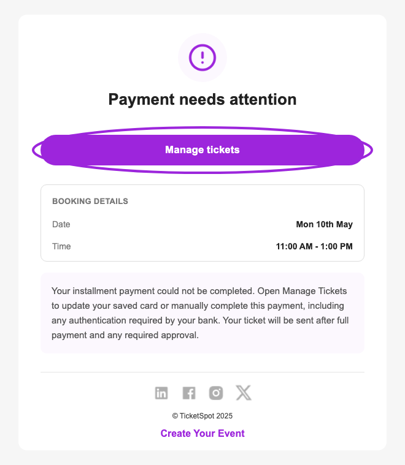
</Frame>

<Frame caption="The order shows the unpaid installment, remaining balance and button to pay it manually in the embedded checkout.">
  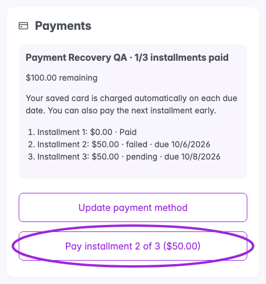
</Frame>

<Frame caption="After a successful payment, the receipt also includes Manage tickets. Admission tickets remain pending while a balance is due.">
  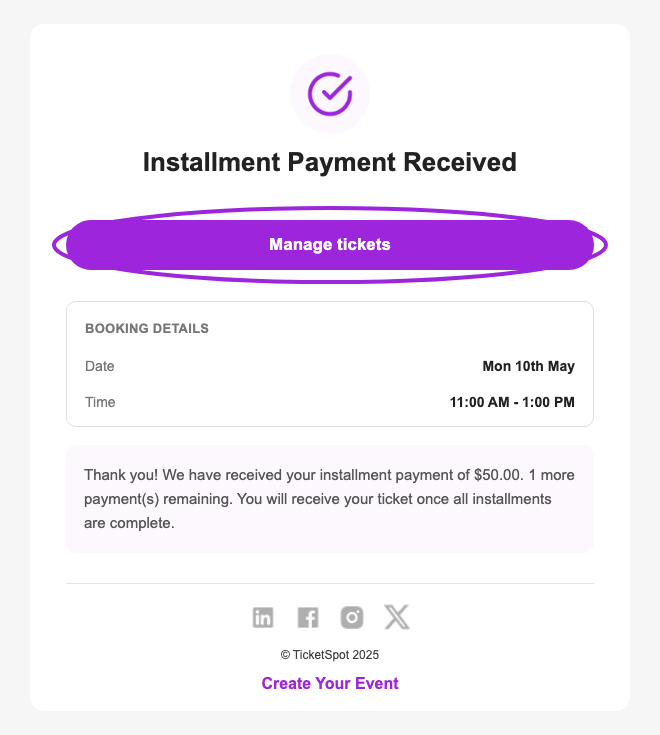
</Frame>

When the whole order is fully paid and eligible for admission, the attendee receives the existing **New Order** ticket confirmation email, using its configured content and branding, with the usual ticket PDF/QR and receipt. A separate installment completion template is not required. Approval and other admission holds still apply.

<Frame caption="The final eligible payment sends the usual New Order ticket confirmation, with ticket and receipt PDFs attached.">
  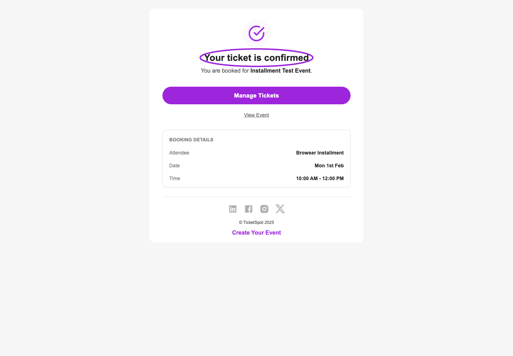
</Frame>

After the payments in a collection period finish, the organizer receives one **Installment Summary** for that event and currency. It reports payments collected, the amount collected, fully paid plans, failed payments, and known attendee email errors. These notifications use the same recipients and preferences as **New Registration**. A failed payment is not included in collected funds.

Summaries are sent by the **next ten-minute scheduler run** after every payment in that collection period has finished and its attendee email has been delivered. For example, payments collected after 10:00 and completed by 10:05 are summarized at the 10:10 run. Processing payments or pending attendee emails defer the summary; unresolved work older than one hour is reported for review.

The summary shows successful charges and their total, failed payments, fully paid plans, and the number and value of installments still unpaid across bookings in that collection period. **Open attendee dashboard** links directly to the event and site. Retry results appear in their own collection period. A previously reported failure is not counted as another collected payment when a retry succeeds.

<Frame caption="The organizer summary shows one $10 charge collected, one declined payment, and two installments still unpaid.">
  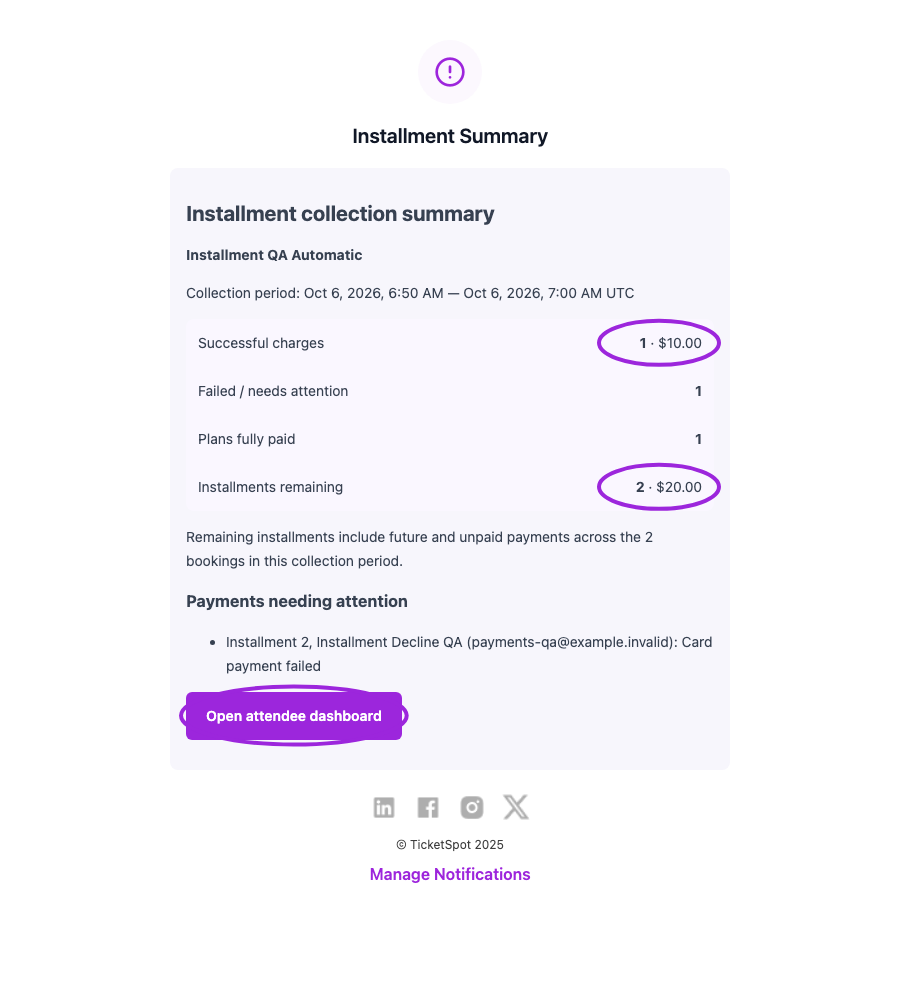
</Frame>

## Changes, refunds, and admission

The schedule accepted at checkout is saved with the purchase. Editing the ticket's schedule changes future purchases; it does not rewrite an existing agreement. Checkout discounts and booking fees apply to the deposit, while future payments use the saved tax calculation where applicable.

Refunds and disputes can block further collections and require review. Canceling a membership or attendee record is not a substitute for refunding a payment. Completing all installments resolves the payment balance, but separate approval, cancellation, or account-capacity holds can still prevent admission.

Installment tickets used as event add-ons must be selected through the main event checkout so the attendee accepts their schedule.

## Related guides

- [Ticket fields and purchase controls](/event-management/ticket-setup)
- [Attendee management](/attendee-management/managing-attendees)
- [Order details and payment summaries](/attendee-management/managing-orders#payment-installments)
- [Refunds and cancellations](/attendee-management/refunds-and-cancellations)
- [Billing and plans](/account/billing-and-plans)
