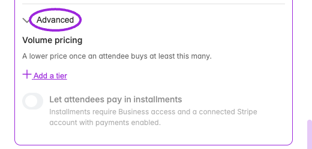

Installments let an attendee pay a deposit at checkout and the remaining balance in later payments. They require **Business or higher**, a connected Stripe account, and Stripe card checkout.

## Create a payment schedule

<Frame caption="Custom date ticket → Advanced. These controls apply to this date’s own tickets; use Save changes in the date drawer to save edits.">
  
</Frame>

<Steps>
<Step title="Connect Stripe">
Open [payment settings](/account/get-paid) and connect the account that will collect ticket payments. Use the Ticket Spot Stripe checkout for installment tickets.
</Step>
<Step title="Enable installments on a paid ticket">
Edit the event, open **Tickets**, and edit a fixed-price paid ticket. Turn on **Enable Installment Payments**. Group, free, pay-what-you-want, and bulk-discount tickets cannot use this schedule.
</Step>
<Step title="Enter the payments">
Add up to four payments. For each, enter the amount, **Due After (days)**, and an optional description. The first payment is due at checkout: its day offset is zero. Later offsets are measured from purchase, not from the event date. The amounts must add up to the ticket price.

For a $300 ticket, an example is $100 at checkout, $100 after 30 days, and $100 after 60 days. Check that these dates fit your event and admission policy.
</Step>
<Step title="Save and check checkout">
Save the ticket and event. Preview the public checkout, select the ticket, and verify the deposit and future schedule. The attendee must accept the payment agreement. Check your [installment email templates](/branding-and-design/attendee-communication-design) before taking bookings.
</Step>
</Steps>

<Note>Due dates do not automatically charge the attendee's card. An organizer initiates collection of later installments.</Note>

## Collect a due installment

1. Open the event's **Attendees** list.
2. In the ticket value column, click **Paid X of Y** to open **Payment Installments**.
3. Review the card, paid amount, remaining balance, due date, and payment status.
4. Click **Charge Now** on the due installment and review **Confirm Charge** before confirming.
5. Reopen the record after processing and verify the payment is marked paid and the remaining balance has decreased.

The charge control is unavailable before the due date, without installment plan access, or when the attendee's status does not permit collection. A processing payment may display **Check payment**. Resolve its existing result before attempting another collection.

## Help an attendee complete payment

If authentication or a replacement card is needed, the dialog can show **Complete installment payment**. Share that attendee-specific link privately with the attendee. After they complete the flow, check the installment record again. Do not treat a failed or pending charge as collected money.

## Changes, refunds, and admission

The schedule accepted at checkout is saved with the purchase. Editing the ticket's schedule changes future purchases; it does not rewrite an existing agreement. Checkout discounts and booking fees apply to the deposit, while future payments use the saved tax calculation where applicable.

Refunds and disputes can block further collections and require review. Canceling a membership or attendee record is not a substitute for refunding a payment. Completing all installments resolves the payment balance, but separate approval, cancellation, or account-capacity holds can still prevent admission.

Installment tickets used as event add-ons must be selected through the main event checkout so the attendee accepts their schedule.

## Related guides

- [Ticket fields and purchase controls](/event-management/ticket-setup)
- [Attendee management](/attendee-management/managing-attendees)
- [Billing and plans](/account/billing-and-plans)
