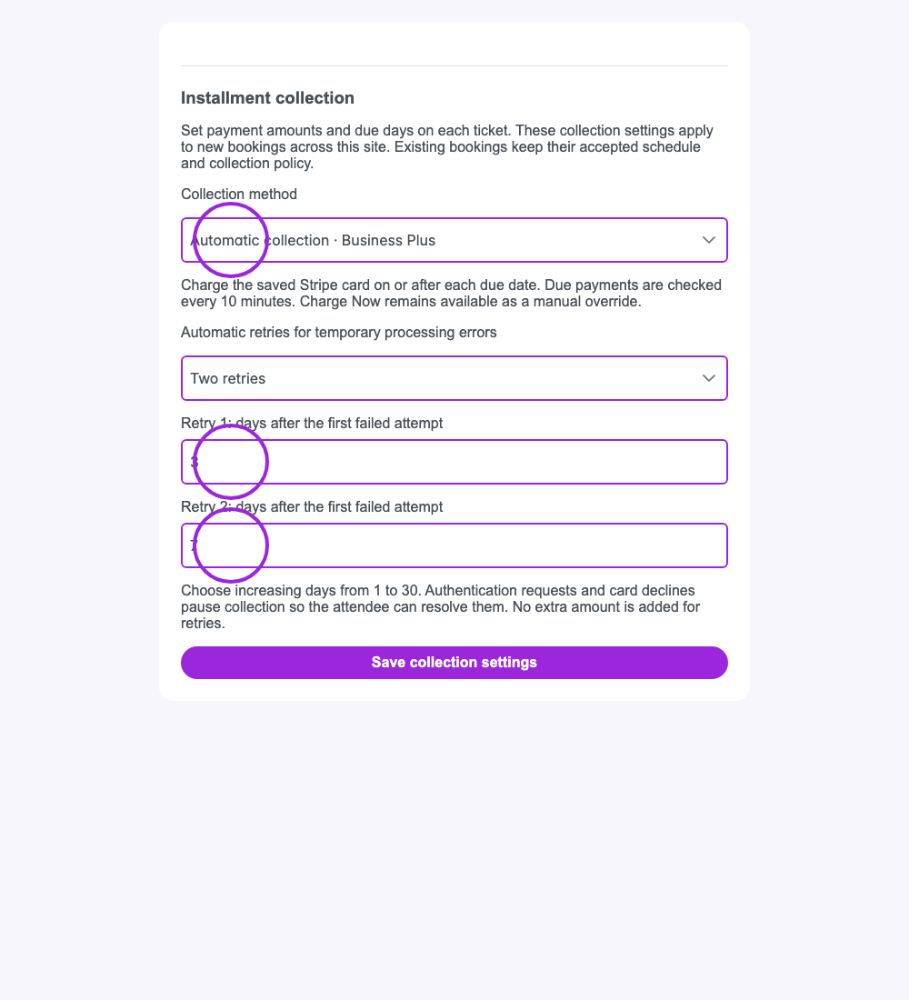
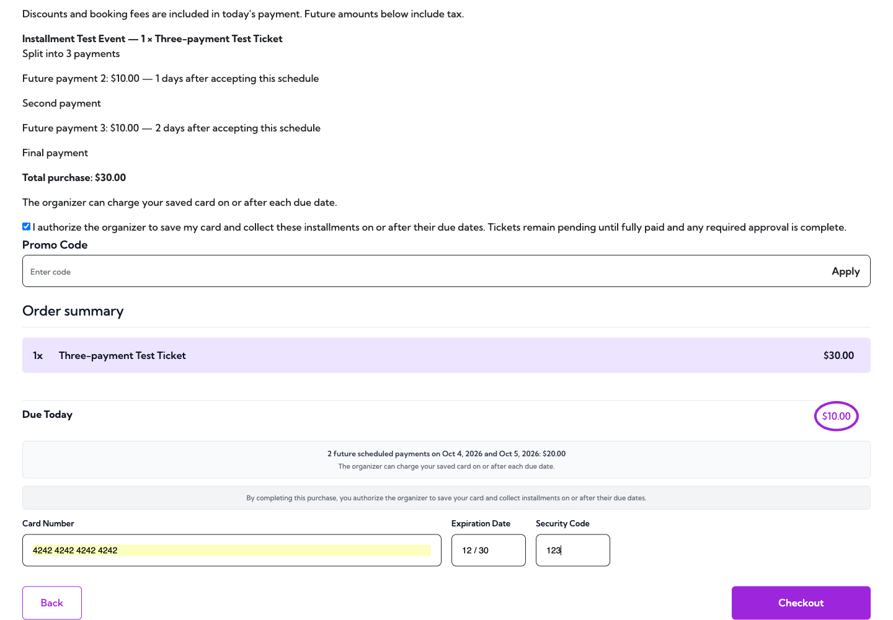
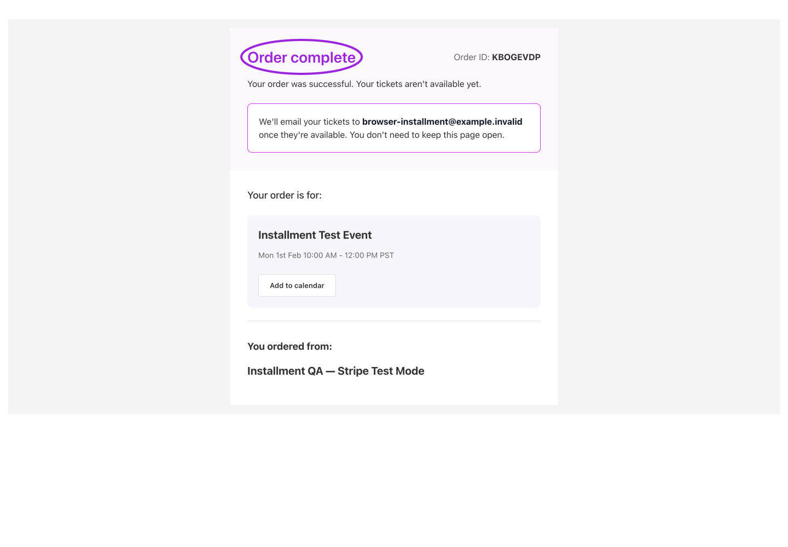

Installments let an attendee pay a deposit at checkout and the remaining balance in later payments. Installment plans with manual collection require **Business or higher**, a connected Stripe account, and Stripe card checkout. **Business Plus and Platform** also include automatic collection and configurable retry days.

## Create a payment schedule

<Steps>
<Step title="Connect Stripe">
Open [payment settings](/account/get-paid) and connect the account that will collect ticket payments. Use the Ticket Spot Stripe checkout for installment tickets.
</Step>
<Step title="Enable installments on a paid ticket">
Edit the event, open **Tickets**, and edit a fixed-price paid ticket. Turn on **Enable Installment Payments**. Group, free, pay-what-you-want, and bulk-discount tickets cannot use this schedule.
</Step>
<Step title="Enter the payments">
Add up to four payments. For each, enter the amount, **Due After (days)**, and an optional description. The first payment is due at checkout: its day offset is zero. Later offsets are measured from purchase, not from the event date. The amounts must add up to the ticket price.

For a \$300 ticket, an example is \$100 at checkout, \$100 after 30 days, and \$100 after 60 days. Check that these dates fit your event and admission policy.
</Step>
<Step title="Save and check checkout">
Save the ticket and event. Preview the public checkout, select the ticket, and verify the deposit and future schedule. The attendee must accept the payment agreement. Check your [installment email templates](/branding-and-design/attendee-communication-design) before taking bookings.
</Step>
</Steps>

## Choose manual or automatic collection

Open **Payment Settings → Installment collection**. On Business, later payments use **Manual collection**. On Business Plus or Platform, **Automatic collection** is the default for new bookings; you can choose manual collection instead. Select **Save collection settings**.

<Frame caption="Payment Settings: choose automatic collection and optional retries after 3 and 7 days on Business Plus or Platform.">
  
</Frame>

Automatic collection checks due payments every ten minutes and charges the saved Stripe card on or after the accepted due date. **Charge Now** remains available as a manual override. Choose the due days on each ticket—for example, 14 and 30 days after purchase. The ten-minute check interval is fixed.

Optional retry settings allow **No automatic retries**, **One retry**, or **Two retries**. Set increasing whole days between 1 and 30, measured from the first failed attempt; for example, days 3 and 7. Retries apply only to temporary processing errors. Authentication requests, expired cards, insufficient funds and other card declines pause for attendee attention. Each retry uses the same installment amount and payment record.

<Note>Settings apply to new bookings. Existing bookings keep the collection mode, due dates, amounts and retry policy accepted at checkout. Switching plans or editing these settings does not create a new authorization for existing attendees.</Note>

For [date-specific tickets](/event-management/day-specific-tickets), the custom date ticket's **Advanced** controls apply to that date's own tickets. Use **Save changes** in the date drawer to save edits.

<Frame caption="Custom date ticket → Advanced. Save changes in the date drawer after editing that date's tickets.">
  
</Frame>

## What the attendee sees at checkout

The attendee reviews the total price, deposit due today, future amounts and due dates, then accepts the agreement to save their card and collect later installments under the displayed manual or automatic policy. When automatic retries are enabled, the agreement also shows their days and maximum number. They pay the deposit using Stripe card checkout. The order confirmation can show that tickets are pending while a balance remains.

<Note>The following screenshots show a Stripe test event with a \$30 ticket paid in three \$10 installments. The names and booking details are synthetic.</Note>

<Frame caption="1. Review the three-payment schedule and accept the saved-card agreement before paying the deposit.">
  
</Frame>

<Frame caption="2. Due Today is $10 in this example. The remaining $20 is listed in the payment schedule.">
  
</Frame>

<Frame caption="3. Order complete confirms the deposit checkout. Tickets are still pending in this example because later installments remain unpaid.">
  
</Frame>

## Track payment progress

The **Attendees** list shows **Paid 1/3**, **Paid 2/3**, or **Fully paid · 3/3**, plus the remaining balance. **Overdue** and **Needs attention** identify payments that need review. Click the progress badge to open **Payment Installments**.

<Frame caption="An automatic payment advances the booking to Paid 2/3 and leaves one $10 payment outstanding.">
  
</Frame>

Use **More filters → Payment** to select fully paid, outstanding, overdue, or attention needed. The progress dropdown filters exact fractions such as **1/3** or **2/3**. These filters combine with event, ticket, attendee status, and search. **Clear all filters** resets them.

<Frame caption="Filter by payment status and the number of completed installments.">
  
</Frame>

The payment summary cards show the matching bookings and remaining balance. Click a card to apply its payment filter. Counts cover every matching attendee, including additional pages of results.

<Frame caption="Fully paid · 3/3 confirms the balance is settled. The summary cards help find bookings that still need attention.">
  
</Frame>

## Collect a due installment manually

1. Open the event's **Attendees** list.
2. In the ticket value column, click **Paid X/Y** to open **Payment Installments**.
3. Review the card, paid amount, remaining balance, due date, and payment status.
4. Click **Charge Now** on the due installment and review **Confirm Charge** before confirming.
5. Reopen the record after processing and verify the payment is marked paid and the remaining balance has decreased.

The charge control is unavailable before the due date, without installment plan access, or when the attendee's status does not permit collection. A processing payment may display **Check payment**. Resolve its existing result before attempting another collection.

<Frame caption="4. Charge Now is available for the due second installment. The future third installment is unavailable.">
  
</Frame>

<Frame caption="5. Confirm Charge identifies the installment and amount. Review both before selecting Yes.">
  
</Frame>

<Frame caption="6. After the second payment, Paid 2 of 3 and a $10 remaining balance show that one installment is still outstanding.">
  
</Frame>

### Check the result before retrying

After a slow response or error, reopen **Payment Installments** and check the existing payment's status and balance. Use **Check payment** when offered. A declined payment does not reduce the balance. If the result remains uncertain, review the matching Stripe payment before attempting another action.

## Attendee card updates and early payment

The attendee can open **My Passes → View Tickets → Payments** to update the saved card without a charge, pay the next installment early, or recover a failed payment. The portal shows the paid fraction and remaining balance. An early payment is skipped by the automatic collector; later due dates stay the same. See [manage payments](/attendee-portal/manage-payments) for the checkout steps and screenshots.

## Help an attendee complete payment

If authentication or a replacement card is needed, the dialog can show **Update card or authenticate**. Share that attendee-specific link privately with the attendee. The link gives them a way to finish the outstanding payment.

<Frame caption="7. A separate test booking shows Paid 1/3, Needs attention, and a $20 outstanding balance after its saved-card payment failed.">
  
</Frame>

For a replacement card, the attendee opens the link, checks the amount, enters their card details, and accepts the agreement to save that card for any remaining installments. They then select **Update card and pay** and follow any instructions from their bank. The saved replacement card is used for later collections under the accepted agreement.

<Frame caption="8. Update your payment shows the $10 due installment and future schedule. Update card and pay stays disabled until the agreement is accepted.">
  
</Frame>

<Frame caption="9. Enter the replacement card, accept the agreement, and select Update card and pay.">
  
</Frame>

<Frame caption="10. Payment complete confirms that the attendee finished the recovery payment.">
  
</Frame>

After the attendee finishes, reopen the installment record and verify the payment is **Paid** and the remaining balance has decreased. Do not treat a failed or pending charge as collected money. When the final installment is paid, the record shows a zero balance and **All installments paid in full**.

<Frame caption="11. All three installments are paid in this example. The remaining balance is $0 and the attendee is Attending.">
  
</Frame>

An attendee who opens the same link after the installment is paid sees **This installment is already paid**. They do not need to enter their card again.

<Frame caption="12. Reopening the completion link after payment shows that the installment is already paid.">
  
</Frame>

## Payment emails

In **Settings → Attendee Communication → Pending Installment**, configure the messages for the first payment and later installments. The initial receipt confirms the deposit. Later automatic payments use **Subsequent Installment**; an organizer's manual charge uses **Host Charge Installment**. These receipts do not issue admission tickets while a balance remains.

If a charge fails or the bank requires authentication, the attendee receives an attention email with a private link to update their card or authenticate the payment. Automatic collection pauses for that payment. Share recovery links only with the attendee they belong to.

When the whole order is fully paid and eligible for admission, the attendee receives the existing **New Order** ticket confirmation email, using its configured content and branding, with the usual ticket PDF/QR and receipt. A separate installment completion template is not required. Approval and other admission holds still apply.

<Frame caption="The final eligible payment sends the usual New Order ticket confirmation, with ticket and receipt PDFs attached.">
  
</Frame>

After the payments in a collection period finish, the organizer receives one **Installment Summary** for that event and currency. It reports payments collected, the amount collected, fully paid plans, failed payments, and known attendee email errors. These notifications use the same recipients and preferences as **New Registration**. A failed payment is not included in collected funds.

The summary shows successful charges and their total, failed payments, fully paid plans, and the number and value of installments still unpaid across bookings in that collection period. **Open attendee dashboard** links directly to the event and site. Retry results appear in their own collection period. A previously reported failure is not counted as another collected payment when a retry succeeds.

<Frame caption="The organizer summary shows one $10 charge collected, one declined payment, and two installments still unpaid.">
  
</Frame>

## Changes, refunds, and admission

The schedule accepted at checkout is saved with the purchase. Editing the ticket's schedule changes future purchases; it does not rewrite an existing agreement. Checkout discounts and booking fees apply to the deposit, while future payments use the saved tax calculation where applicable.

Refunds and disputes can block further collections and require review. Canceling a membership or attendee record is not a substitute for refunding a payment. Completing all installments resolves the payment balance, but separate approval, cancellation, or account-capacity holds can still prevent admission.

Installment tickets used as event add-ons must be selected through the main event checkout so the attendee accepts their schedule.

## Related guides

- [Ticket fields and purchase controls](/event-management/ticket-setup)
- [Attendee management](/attendee-management/managing-attendees)
- [Order details and payment summaries](/attendee-management/managing-orders#payment-installments)
- [Refunds and cancellations](/attendee-management/refunds-and-cancellations)
- [Billing and plans](/account/billing-and-plans)
