Open **Events**, find the event, and choose **Manage event**. The card's three-dot **More actions** menu provides shortcuts to tickets, exports, the event page, attendees, duplication, sharing, messages, and Analytics. Availability depends on your role and the event.

<Frame caption="More actions on the event card provides shortcuts to the main workflows.">
  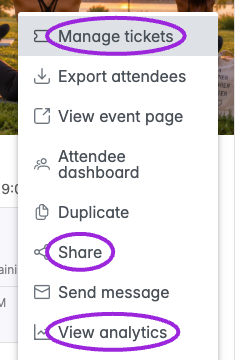
</Frame>

## Edit Event

Choose **Manage event**, open the relevant setup step, and edit its fields. Some sub-editors—such as saved tickets—have their own save button. Save those changes before leaving the sub-editor, then use the event's **Save** control as needed. See the [event editor steps](./create-event-overview) and [complete option checklist](./event-options-reference).

## Save Event

**Save** preserves the event's current status. Saving a draft keeps it a draft; saving an already live event does not turn it into a draft. A new event uses **Create Event** for its initial save.

<Frame caption="Save and the connected-platform publish controls perform different actions.">
  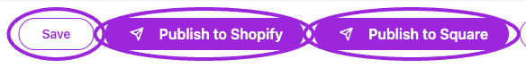
</Frame>

## Publish Event

The controls adapt to the site and event:

| Control | What to review |
| --- | --- |
| **Publish / Approve and Publish** | Publishes an eligible draft or reviewed event. Complete the required fields and inspect the resulting status. |
| **Publish to Shopify / Publish to Square / Publish to Ecwid** | Opens the relevant integration's publishing flow. Review the product/catalog settings and final confirmation. Multiple connected integrations can have separate buttons. |
| **Change to Live** | Where offered in the editor's three-dot menu, changes Ticket Spot's event status. It does not by itself publish the event to Shopify or sync it to Square Catalog. |
| **Submit Event** | Sends a marketplace host's draft for review where that workflow is enabled. Submission and approval are separate steps. |

An individual occurrence has its own Save control; platform publishing is handled from the appropriate parent event. After publishing, check event privacy, dates, sales windows, ticket availability, and the actual event page or installed widget. For Shopify, also verify the [Ticket Selector](../plugins/shopify-ticket-selector).

<Accordion title="Editor menu and Change to Live confirmation">
<Frame caption="The editor menu changes with status. A draft offers Change to Live; cancellation and deletion are separate actions.">
  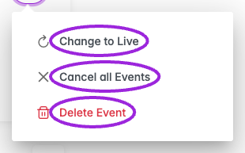
</Frame>
<Frame caption="The confirmation explains that changing Ticket Spot status does not publish to Shopify.">
  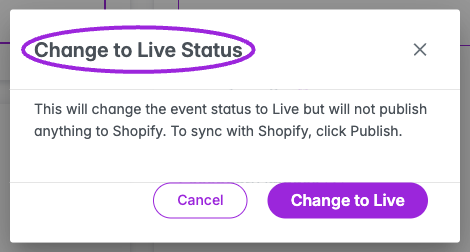
</Frame>
</Accordion>

## Duplicate an event

Choose **More actions → Duplicate** on the event card. **Event properties** are always included. Choose whether to copy **Tickets**, **Communication**, **Hosts**, and **Promo codes**. Events with assigned seating also offer **Seating chart**. Promo codes start unchecked; the other offered copy options start checked.

<Frame caption="Choose the parts to copy, including the chart when the source event uses assigned seating.">
  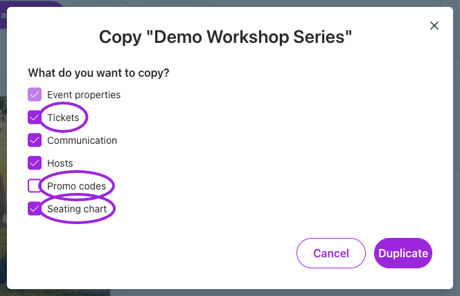
</Frame>

Select **Duplicate** to create the copy, then review its name, dates, ticket rules, communications, hosts, and seating before publishing. A copy of the layout is not a transfer of existing attendees or reservations. **Cancel** closes the dialog without creating a copy.

## Copy Event Link

Choose **More actions → Share** on the event card. **Copy** copies the displayed event link. **Facebook**, **Tweet**, **LinkedIn**, **Email**, and **Text** open the corresponding sharing flow. Opening this dialog alone does not send a message.

<Frame caption="Share provides the event link and destination shortcuts.">
  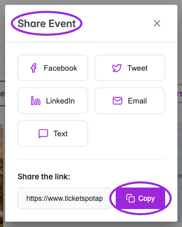
</Frame>

**View event page** on the card or **Event Page** in the editor opens the public page. Check the target event and date before distributing a link. Use [tracking links](./tracking-links) when you need campaign attribution.

## Export attendees and reports

Choose **More actions → Export attendees**. Read the **Exporting** scope before downloading **Attendees**, **Check-in activity**, or **Financial report**. For a series, the card starts with the next upcoming occurrence. Use the occurrence's attendee page to choose another date or a specific time slot. See [export scope and fields](../attendee-management/export-attendees-and-check-in-data).

## Cancel Event

Open the editor's three-dot menu and choose **Cancel Event**. A series can label this entry **Cancel all Events**; the dialog still lets you choose the scope.

1. Choose **Specific date or time** or **All upcoming dates and times**. Select the intended date/time when cancelling one occurrence.
2. Review the affected-attendee count and, when shown, the number of unique email recipients.
3. Set **Notify Attendees**. It starts on. With notifications on, review **Email Subject** and **Message**; with it off, the confirmation says no notification emails will be sent.
4. Select the cancellation button to open **Confirm cancellation**.
5. Review the scope again, then confirm only when ready. **Back to details** returns to the form; **Keep Event** closes it without cancelling.

<Accordion title="Review cancellation scope and confirmation">
<Frame caption="A series cancellation can target one date/time or all upcoming dates.">
  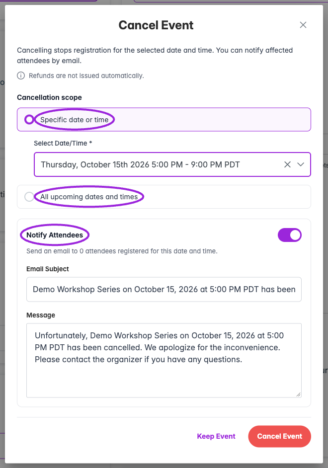
</Frame>
<Frame caption="Changing the scope also changes the audience and suggested email wording.">
  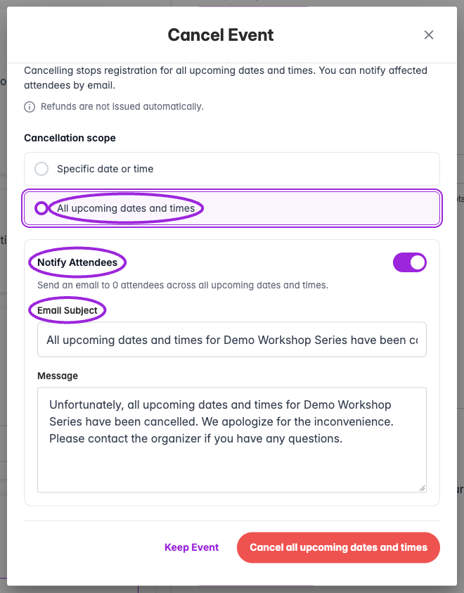
</Frame>
<Frame caption="The final confirmation states the scope, attendance effect, notification choice, and refund behavior.">
  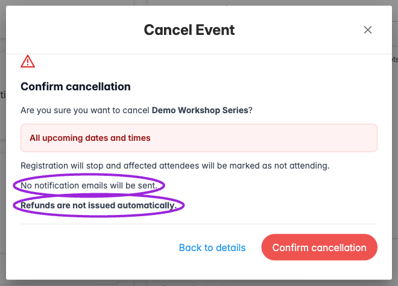
</Frame>
</Accordion>

Cancellation stops registration and marks affected attendees as not attending. **Refunds are not issued automatically.** A queued notification is not proof of delivery. If the dialog reports an uncertain or partial failure, use **Retry Cancellation** and inspect the result before starting a separate cancellation.

## Restore Event as Draft

Open a cancelled event and choose **Restore as Draft** from the editor's three-dot menu. Review attendee statuses, dates, tickets, availability, and platform synchronization before publishing again. Restoring as draft does not make the event live.

<Frame caption="A cancelled event offers Restore as Draft in the editor menu.">
  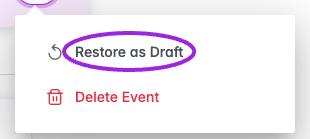
</Frame>

## Delete Event

Choose **Delete Event** from the editor menu and read the confirmation before **Delete Permanently**. **Back** closes the confirmation without deleting.

<Frame caption="Review the deletion confirmation. Back leaves the event unchanged.">
  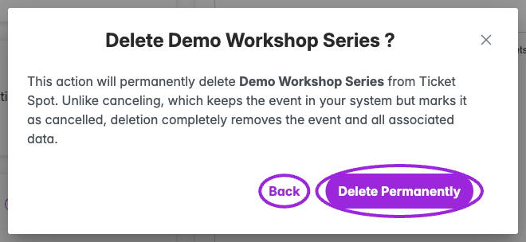
</Frame>

Deletion removes the event from normal dashboard listings and has no normal Restore as Draft action. Deleting a series affects its associated dates. A linked Shopify product is archived as part of deletion; handle refunds separately. Deleting the event is distinct from erasing attendee, order, or payment records, so do not interpret the confirmation as a guarantee that every associated record is erased.
