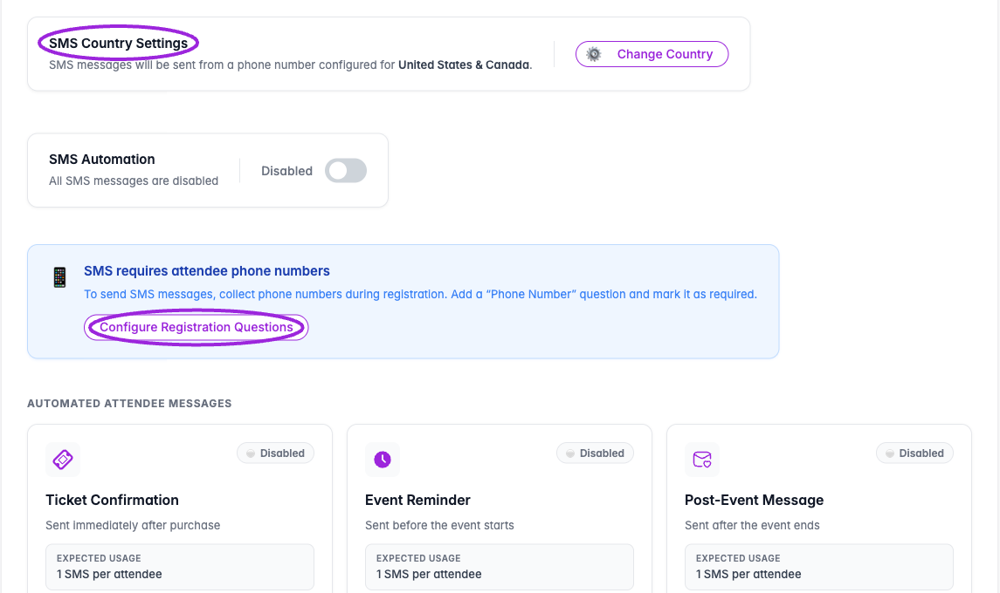
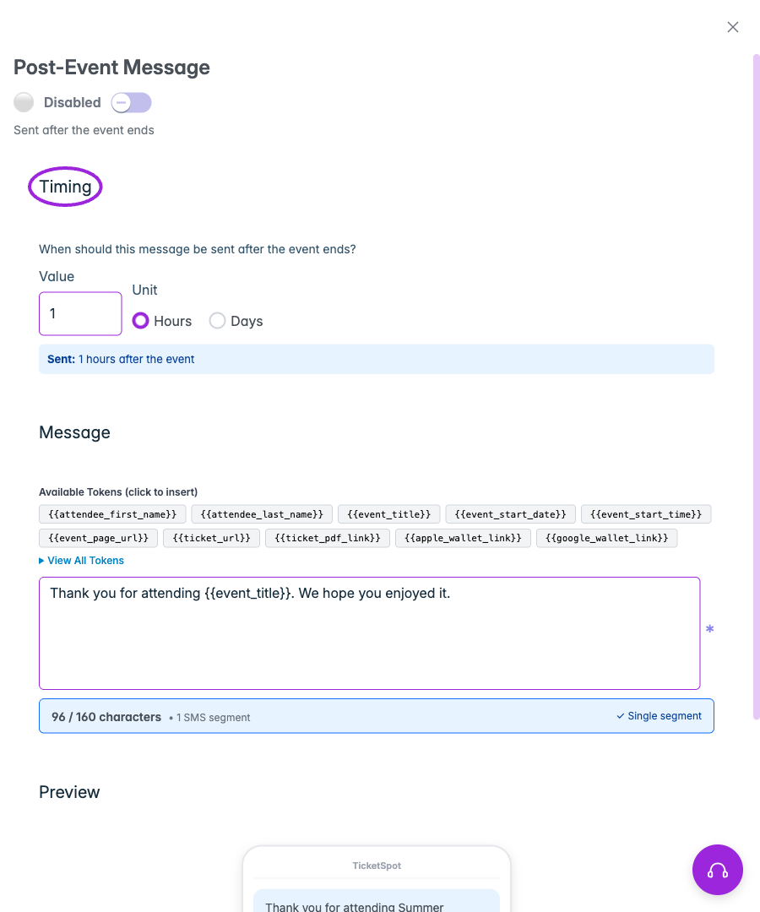
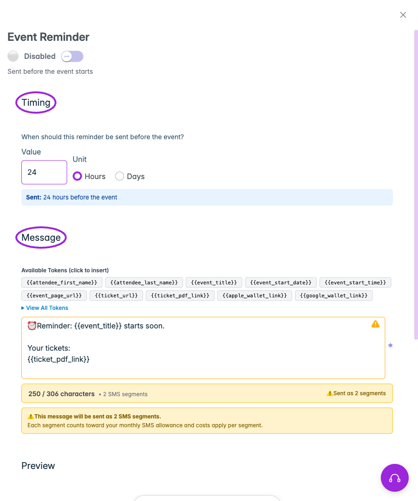
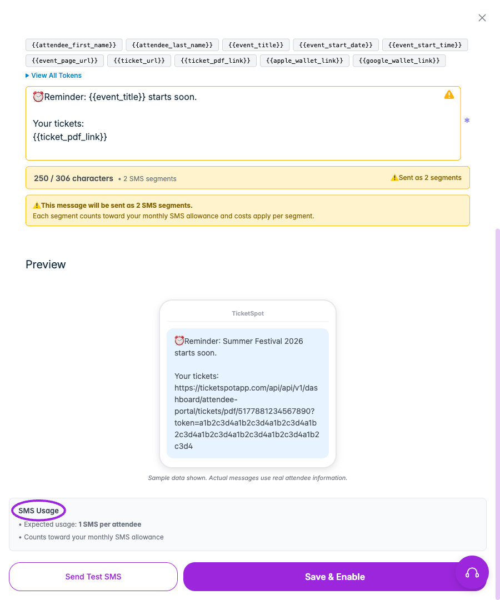
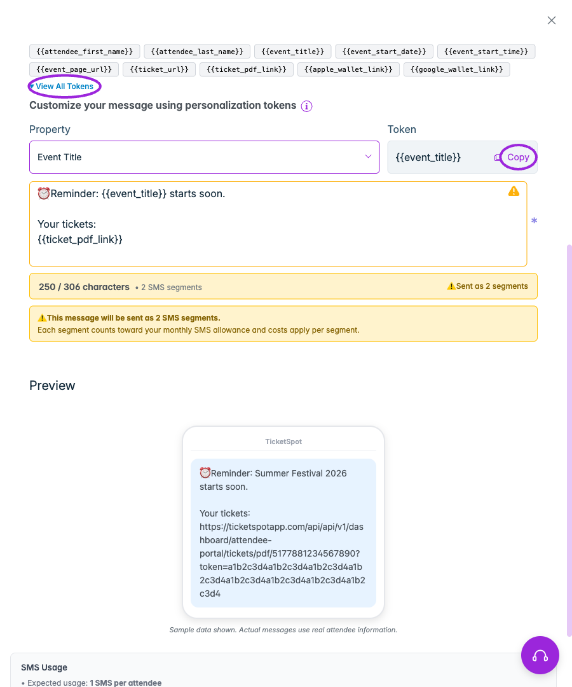
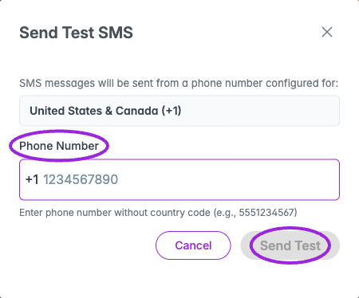

Use **SMS Communication** in the event editor to configure automated text messages. Check your plan's SMS credits before enabling messages and collect attendee phone numbers in registration.

## Navigation and prerequisites

<Frame caption="Review SMS Country Settings and collect a required Phone Number registration question before enabling automated SMS messages.">
  
</Frame>

1. Open **Events** and edit a saved event.
2. In **Additional Info**, collect a Phone Number question mapped to the attendee's phone property.
3. Open **SMS Communication**. If the phone question is missing, use **Configure Registration Questions** from the warning.
4. Review **SMS Country Settings** and use **Change Country** if needed.

For a recurring series, configure messages on the parent event. This step is hidden on individual child events and no-ticket setups.

## Choose a message

| Group | Available messages |
|---|---|
| **Automated Attendee Messages** | Ticket Confirmation, Event Reminder, Post-Event Message. |
| **Waitlist** | Waitlist Confirmation, Ticket Available. |
| **Approval Workflow** | Pending Approval, Approval Confirmed, Approval Declined. |
| **Payments** | Pending Installment, for an applicable existing payment workflow. |

## Configure and enable

<Frame caption="Post-Event Message schedules Hours or Days after the event ends. Review the message and preview before using Save &amp; Enable.">
  
</Frame>

<Frame caption="Event Reminder lets you choose Hours or Days before the event and insert supported personalization tokens into the message.">
  
</Frame>

1. Click **Setup Message** or **Edit Message** on the relevant card.
2. Enter the **Message** and use personalization tokens where needed.
3. For reminders and post-event messages, set **Timing → Value** and **Unit** (Hours or Days). Reminders are before the event; post-event messages are after it ends.
4. Review **Preview** and the SMS segment count before enabling it. Inserted links and longer messages can use multiple segments; each segment counts toward your SMS allowance.
5. Click **Save & Enable**, or **Save SMS Message** when already enabled.
6. Check the card's Enabled/Disabled state.

Use the enable/disable controls to stop messages you do not need. Review each message before using the bulk control; enabling all includes waitlist, approval, and payment-related messages.

Use **Send Test SMS** to open the test dialog. Confirm the displayed country code, enter a phone number you control without that country code, and choose **Send Test**. Opening the dialog or viewing the preview does not send an SMS. See [email communication](./email-communication) for email delivery and [communication design](../branding-and-design/attendee-communication-design) for visual templates.

<Accordion title="Preview, tokens and test-message controls">

<Frame caption="Review the rendered Preview and SMS segment count. Long messages and inserted links can consume more than one segment; each segment counts toward SMS usage.">
  
</Frame>

<Frame caption="Click a quick token to insert it, or open View All Tokens to choose a property and copy its template token.">
  
</Frame>

<Frame caption="Send Test SMS asks for a phone number without the displayed country code. Sending the test is a separate action; this example has not sent a message.">
  
</Frame>

</Accordion>
