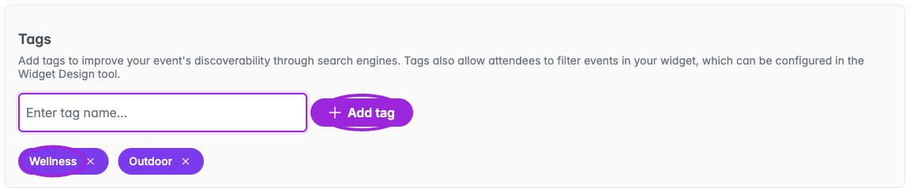
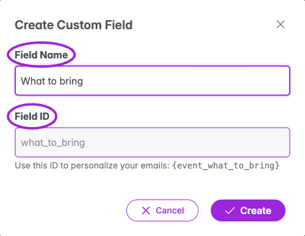
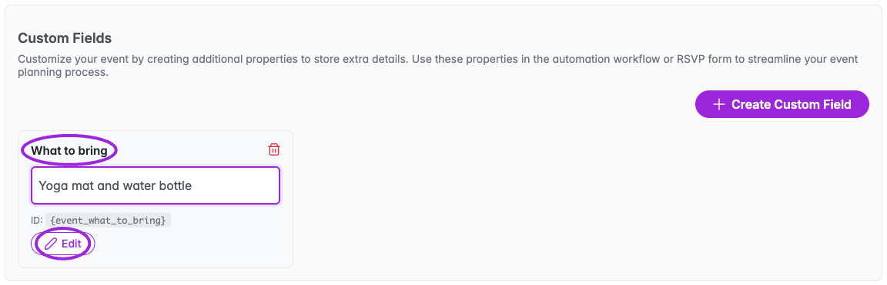

Open **Events → Edit event → Tags & Custom Fields**. Tags categorize events; custom fields store extra values for this event. For questions that attendees answer during registration or check-in, use [Additional Info](./additional-information).

## Tags

<Frame caption="Add a tag by typing its name and choosing Add tag or pressing Enter. Remove a tag with its × control, then save the event.">
  
</Frame>

1. Type a tag into **Enter tag name…**.
2. Click **Add tag** or press Enter. Add more tags as needed.
3. Use a tag's **×** to remove it.
4. **Save** the event to persist your changes.

Blank tags and duplicate names are rejected. Duplicate matching ignores capitalization. To let visitors filter by tags, configure the widget's [visitor filters](../branding-and-design/user-search-filter).

## Custom fields

<Frame caption="A custom Field Name generates its Field ID. The dialog shows the token for personalization; use Additional Info for questions attendees answer.">
  
</Frame>

1. Choose **Create Your First Field** when the list is empty, or **Create Custom Field** above existing fields.
2. Enter a **Field Name**, such as **What to bring**. Ticket Spot generates the read-only **Field ID** from the name.
3. Choose **Create**. The field appears as a card.
4. Enter its event-specific value, such as **Yoga mat and water bottle**, in **Enter value…**.
5. **Save** the event.

The field card and dialog show its personalization identifier. Use the complete token offered by the message's property picker when adding event data to an email or checkout message. The value on this screen is entered by the organizer; it is not an attendee-response input.

## Edit or remove a field

<Frame caption="Enter the event-specific value on the field card. Edit changes the field definition, and the delete icon removes it. Save the event to persist these edits.">
  
</Frame>

Use **Edit** on a field card, update its name, and choose **Update**. Check any message templates that use the field if its identifier changes.

Use the delete icon to remove a field. In the confirmation, choose **Yes** to delete or **No** to keep it. Save the event after changing its fields.

Field names must be unique among active fields and cannot use a reserved built-in name.
