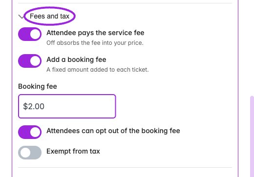

Open **Events → Edit event → Tickets**, then create or edit a ticket. The main editor uses **Details**, **Pricing & Access**, **Sales & Capacity**, **Check-in**, **Autopilot**, and **Seat Categories**. The [custom day editor](./day-specific-tickets) groups the same subjects into expandable sections with some additional fee controls.

## Event-level ticket settings

<Frame caption="Tickets contains seating setup, currency, event capacity, the ticket list, and promo codes. Create Ticket opens the full ticket editor.">
  
</Frame>

| Option | Purpose |
|---|---|
| **Sales Tax** | On non-Shopify sites, set the event's ticket tax percentage. Shopify product taxes are managed through Shopify. Verify the actual checkout total and platform handling. |
| **Currency** | Choose the currency before configuring prices. |
| **Get Paid** | Connect the payment provider supported by your site. Paid ticket controls require a working payment connection. |
| **Assigned Seating / Seating Chart** | Enable seat selection and choose a published chart. Assign its categories to ticket types. |
| **Seating for all dates** | A series chart applies automatically to dates using event defaults. Review occurrence availability; use **Retry seating setup** if any dates need attention. |
| **This day's tickets** | Where shown on a child event, choose its ticket source. See the date editor for shared/custom ticket behavior. |
| **Pass Stripe Payment Processing Fee to Customer** | On an eligible marketplace site, pass the Stripe processing fee to the buyer for this event. Review the checkout total. |
| **Calculate Pricing Impact** | On an eligible marketplace site, preview how ticket pricing and processing-fee handling affect totals. |
| **Promo Codes** | Create a discount code, its value, scope, ticket-use limit, dates, minimum quantity, and eligible tickets. See [promo setup](./ticket-setup#promo-codes). |

## Details

<Frame caption="Create Ticket → Details contains the ticket name, status, description, and images. This example is an unsaved demo ticket.">
  
</Frame>

| Option | Purpose |
|---|---|
| **Ticket Name** | The name shown to customers. Use distinct names for offers with different rules. |
| **Status** | On Sale, Cancelled, or Postponed. Status is separate from stock and sales dates. |
| **Description** | Explain admission, inclusions, and restrictions. |
| **Images** | Add images for the ticket. Multiple images can appear as a carousel. |

## Pricing & Access

<Accordion title="View current controls">

<Frame caption="Hidden tickets can use an access code. Shopify events also offer Include in Shopify Variant.">
  
</Frame>

<Frame caption="Add a bulk pricing rule: this example changes the unit ticket price to $20 when the quantity reaches five tickets.">
  
</Frame>

<Frame caption="A group ticket bundles quantities of saved ticket types. This example includes two Standard tickets.">
  
</Frame>

<Frame caption="Require approval controls pending registration; Allow payment later provides the later-payment option.">
  
</Frame>

</Accordion>

<Frame caption="Pricing &amp; Access offers Free, Paid, and Pay What You Want. A paid ticket has a fixed price, with service fees configured separately.">
  
</Frame>

| Option | Purpose and dependencies |
|---|---|
| **Free** | Registration without a ticket price. |
| **Paid / Price** | Fixed ticket price in the event currency. |
| **Pay What You Want / Minimum Price** | Let buyers choose their payment subject to a minimum. The day editor also exposes **Suggested price**. |
| **Service fee / Custom Service Fee** | Add a fixed organizer-set fee per ticket. Older screens call it a booking fee. |
| **Installment payments** | New schedules use reusable **Payment Plans** templates assigned in **Event → Payment Plan**, with all or selected paid tickets eligible. Existing ticket schedules remain under legacy controls. Requires Business and Stripe; automatic collection requires Business Plus. Cannot be combined with bulk/volume pricing. See [installment setup](./installment-payments). |
| **Bulk ticket discounts** | Add quantity/price rules for volume purchases. This is separate from promo-code minimum quantities. |
| **Group ticket / Group Ticket Composition** | Add quantities of saved component tickets. Buyers receive the component tickets. Check their inventory and attendee counts. |
| **Hidden ticket / Access Code** | Hide the ticket from public selection; set a code for customers who should unlock it. Older screenshots call this **Hide / Access Code**. |
| **Include in Shopify Variant** | Explicitly include a hidden ticket in Shopify product variants. Hidden tickets are excluded by default. Check exposure on the actual product template. |
| **Who can purchase this ticket?** | Everyone or Members only. Select eligible membership programs for restricted access. |
| **Member pricing** | Set eligible memberships and the member price, including 0 for free. Access and pricing rules are separate; see [membership ticket rules](/memberships/ticket-access-and-pricing). |
| **Require approval** | Hold registration for manual approval. |
| **Allow payment later** | With approval enabled, allow approved guests to complete payment later. This does not create an installment schedule. |

## Sales & Capacity

<Accordion title="View current controls">

<Frame caption="Require a minimum quantity of another ticket in the same order. This example requires one Standard ticket.">
  
</Frame>

<Frame caption="Require advance booking sets the minimum number of days before the event when this ticket can be bought.">
  
</Frame>

</Accordion>

| Option | Purpose and dependencies |
|---|---|
| **Ticket Sales Start / Immediately / Start sales** | Begin immediately or set an offset before event start in minutes, hours, or days. |
| **Ticket Sales End** | Set the offset before event start or event end. Verify the event timezone and resulting window. |
| **Ticket Capacity** | Total inventory for this ticket type, separate from the event's overall capacity. Do not reduce it below already sold inventory. |
| **Min Per Order / Max Per Order** | Minimum and maximum quantity of this ticket in a purchase. |
| **Required Ticket** | Enable **Require another ticket to purchase**, choose another saved ticket, and set **Minimum quantity**. Requires that quantity in the same order; it is not a per-child ratio and does not automatically add it. |
| **Advance Purchase Window / Days in advance** | Require a minimum booking lead time. A value of 10 excludes dates closer than 10 days; it is not a maximum future booking horizon. |

Review event capacity, ticket capacity, seat availability, waitlist access, sales dates, and order limits together. A ticket can have remaining stock and still be unavailable because another rule applies.

## Check-in

<Accordion title="View current controls">

<Frame caption="Control how many times a ticket can be scanned and its validity after purchase.">
  
</Frame>

<Frame caption="Set the opening time before the event and the cutoff after it starts. A cutoff alone does not prevent early scans.">
  
</Frame>

<Frame caption="Delayed entry opens check-in after the event starts. If both opening rules are enabled, delayed entry takes priority.">
  
</Frame>

</Accordion>

| Option | Purpose |
|---|---|
| **Entries allowed** | The maximum scans/entries. Set 0 for unlimited. Older screens call this **Check-In Limit**. |
| **Ticket Validity Period** | Unlimited, One Day, One Week, One Month, or One Year after purchase. |
| **Early Check-In Window** | Set **Check-in opens (before start)** and a unit. |
| **Late Check-In Cutoff** | Set **Check-in closes (after start)** and a unit. |
| **Delayed Check-In Window** | Set **Check-in opens (after start)** and a unit. Takes priority over an early window. |

These controls affect admission, not sales. Keep the effective opening earlier than closing and test before, within, and after the permitted window. **Current day-editor label mismatch:** the control labeled **Stop check-in after a while**, with **Until**, currently saves the delayed-opening rule. It opens check-in after the event starts; it does not close check-in. **Limit how long entry stays valid** currently saves the late cutoff relative to event start. Use the main editor’s explicit opening/closing fields to review these rules and test the actual scan window.

## Autopilot and seating

<Accordion title="View current controls">

<Frame caption="Autopilot can hide or show a ticket, change its price, or change its inventory.">
  
</Frame>

</Accordion>

**Autopilot** rules have an enabled switch after saving, a number, minutes/hours/days, a timing of **before event starts** or **before event ends**, and one action: **Hide ticket**, **Show ticket**, **Change price**, or **Change inventory**. Price and inventory actions require the new value. Review conflict messages before saving; remove obsolete rules.

In **Seat Categories**, select every category this ticket can book. Multiple ticket types can share a category, such as Adult and Child pricing for the same seats. A category color or label alone does not assign a price. See [seating selection](/seating-charts/seat-selection).

## Additional controls in the day editor

<Frame caption="Custom-day Fees and tax can pass or absorb service fees, add a fixed booking fee, allow opting out, and exempt the ticket from tax. This example is unsaved.">
  
</Frame>

| Control | Meaning |
|---|---|
| **Attendee pays the service fee** | Choose whether the attendee bears the applicable service fee. Separate from adding your own booking fee. |
| **Add a booking fee / Booking fee** | Add a fixed fee for the custom ticket. |
| **Attendees can opt out of the booking fee** | Allow buyers to remove that optional fee where supported. |
| **Exempt from tax** | Exclude the custom ticket from the event's tax calculation where supported. Verify the checkout/platform result. |
| **How many are available / Fewest per order / Most per order** | The day editor's inventory and order-limit labels. |
| **Approve each order by hand / Allow paying later** | The day editor's approval and deferred-payment controls. |

## Promo codes

Create a code under the ticket list. Configure its percentage or fixed discount, ticket applicability, discounted-ticket limit, start/end schedule, and optional minimum quantity. Multi-Event Code and Shopify synchronization are separate controls. See the [complete promo-code guide](./ticket-setup#promo-code-setup-fields), including customer-tag mapping.

## Save and test

Save the ticket and event, or the date when editing a custom day. Update the linked Shopify product when its offer changes. Test a valid order and the limit cases that apply to your setup. Inspect ticket names, quantities, prices, fees, the occurrence, any seat assignment, and delivered tickets.

For step-by-step setup and screenshots, continue with [Ticket Setup](./ticket-setup).
